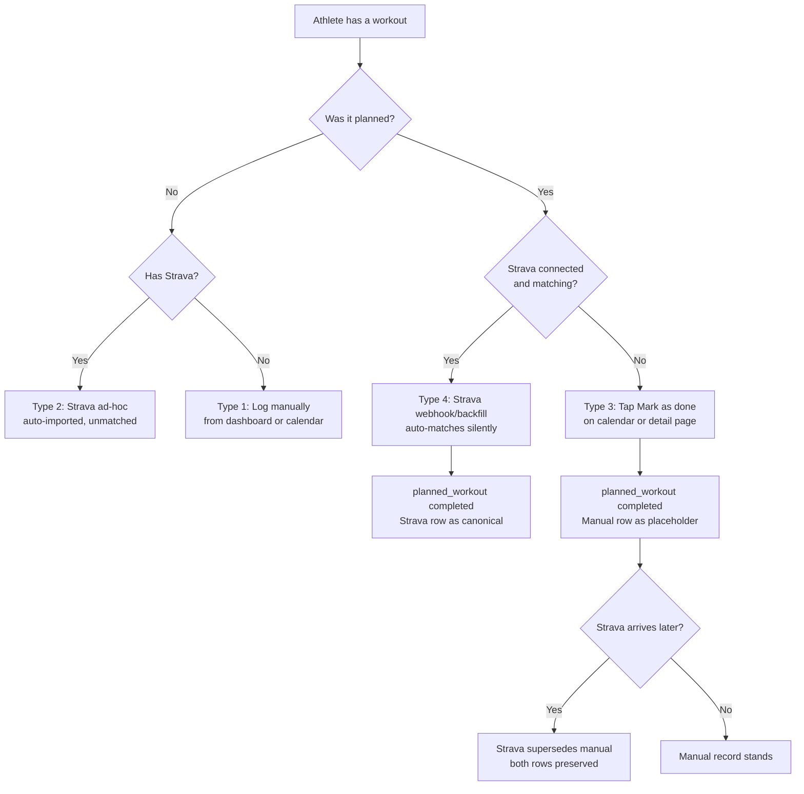

# Workout Logging, Completion, and Strava Matching

## Problem Frame

Athletes have four distinct workout types with no consistent web UI to record or close them out:

1. **Manual ad-hoc** — done outside any plan, no Strava (e.g., gym session with no phone)
2. **Strava ad-hoc** — unplanned effort Strava already captured (lands via backfill/webhook, unmatched)
3. **Planned + manually completed** — AI-coach planned workout done without Strava
4. **Planned + Strava completed** — AI-coach planned workout that Strava also captured; should auto-link

Types 2 and 4 already have data flowing in via the Strava pipeline. The API routes for completing planned workouts (`POST /api/workouts/[id]/status`) and logging manual ad-hoc workouts (`POST /api/activities/manual`) already exist. What's missing: **web UI** for types 1 and 3, and the **Strava auto-matching + webhook handler** for type 4.

## User Flow

## Requirements

**Manual Ad-Hoc Logging (Type 1)**
- R1. A "Log workout" action is accessible from the dashboard and from the calendar (tapping any day).
- R2. The log form requires: sport (run / swim / bike / strength / mobility / other), date, and duration. Distance is not required.
- R3. Submitting the form calls the existing `POST /api/activities/manual` route, creating a `completed_workouts` row with `source='manual'` and no plan link.
- R4. The new workout appears on the activities list and calendar immediately after submission via `router.refresh()` from the client component.

**Planned Workout Completion (Type 3)**
- R5. Each planned workout card on the calendar shows a "Mark as done" action when status is `planned`.
- R6. The planned workout detail page shows a prominent "Mark as done" button when status is `planned`; the button is hidden once status is `completed`.
- R7. Tapping either action calls the existing `POST /api/workouts/[id]/status` route with `{ status: "completed" }`, which atomically creates a `completed_workouts` row (`source='manual'`), inserts a `workout_matches` row (`method='manual_user_link'`, `confidence=1.0`), and sets `planned_workouts.status='completed'` via the `complete_planned_workout` RPC.
- R8. The calendar card and detail page update to show a completed state immediately after the tap via `router.refresh()`.

**Strava Auto-Matching (Type 4 — backfill + webhook)**
- R9. A Strava webhook handler (`POST /api/integrations/strava/webhook`) is built to receive real-time activity creation and deletion events. Auto-matching runs on both the webhook handler and the existing backfill flow.
- R10. Match criteria: same athlete, same sport, same calendar date. If the planned workout has a deterministic duration target (derivable from its `structure` JSONB), the Strava workout's duration must also be within 50% of that target. If no duration target is available, sport + date is sufficient.
- R11. On a confirmed match: the Strava `completed_workouts` row is linked to the planned workout via `workout_matches` (`method='auto_same_day_sport'`), and `planned_workouts.status` is set to `completed`.
- R12. Matching is silent — no notification or confirmation shown to the athlete.
- R13. If multiple planned workouts on the same day match the same Strava workout, the closest duration wins; ties go to the earliest `scheduled_date` order.

**Type 3 + Strava Arrives Later**
- R14. If a planned workout was already manually completed (type 3) and a matching Strava workout later arrives, the Strava row becomes the canonical record. The existing manual `workout_matches` row is soft-deleted (set `deleted_at`); a new `workout_matches` row is inserted referencing the Strava `completed_workout_id` with `method='merged_from_manual'`. (The partial unique index on `planned_workout_id WHERE deleted_at IS NULL` requires soft-delete + insert, not an UPDATE.)
- R15. The manual `completed_workouts` row has its `superseded_by_id` set to the Strava row's id and is preserved for audit. The `WHERE superseded_by_id IS NULL` filter must be applied in all canonical read helpers (`getWorkoutById`, `getRecentWorkouts`, `getWorkoutsInRange`) to prevent it re-appearing on the activities page or calendar.
- R16. The planned workout stays `completed`; no status change occurs.

## Success Criteria
- An athlete can log a gym session from the dashboard in under 30 seconds.
- Tapping "Mark as done" on a calendar workout updates the card immediately without a full page reload.
- After a Strava backfill or webhook, planned workouts that had matching Strava efforts show as completed with Strava stats.
- No duplicate entries are visible on the activities page when a type 3 manual entry is superseded by type 4.

## Scope Boundaries
- No editing a logged workout after submission (v1 is append-only).
- No un-completing a planned workout (no reverting `completed` → `planned`).
- No stat entry when completing a planned workout — just a "done" tap. Stats come from Strava if connected.
- No fuzzy or AI-assisted matching — criteria are sport + date (+ optional duration guard) only.
- Type 2 (Strava ad-hoc, unmatched) requires no new work — already handled by the existing Strava pipeline.

## Key Decisions
- **Strava wins for stats**: When Strava arrives after manual completion, Strava becomes canonical. Rationale: actual recorded data is always more accurate than a placeholder tap.
- **Auto-match is silent**: No confirmation prompt. Rationale: sport + date + optional duration guard keeps false-positive rate low; confirmation fatigue outweighs the risk.
- **Minimal manual form**: Sport + date + duration only. Rationale: athletes with Strava get detailed stats from there; manual logging is for coverage, not precision.
- **Webhook handler in scope**: Real-time auto-matching requires the webhook handler. Building it in this feature rather than deferring keeps auto-match actually real-time.
- **Soft-delete + insert for match supersession**: The partial unique index on `planned_workout_id WHERE deleted_at IS NULL` means re-linking requires soft-delete of the old match + insert of the new one, not an UPDATE.

## Dependencies / Assumptions
- `complete_planned_workout` RPC (migration 0011) is deployed and handles the atomic type 3 operation.
- `POST /api/workouts/[id]/status` (already exists) is the type 3 completion route.
- `POST /api/activities/manual` (already exists) is the type 1 logging route.
- `workout_matches.method` CHECK constraint includes `'auto_same_day_sport'` and `'merged_from_manual'` (confirmed, migration 0008).
- Calendar and activities pages are server-rendered RSC; "immediate update" requires `router.refresh()` called from a client component after the POST succeeds — not optimistic UI.
- `getRecentWorkouts` and `getWorkoutsInRange` currently do **not** filter `superseded_by_id IS NULL`. This filter must be added as part of R15 to prevent duplicates.

## Outstanding Questions

### Resolve Before Planning
_(none — all product decisions resolved)_

### Deferred to Planning
- [Affects R10][Technical] Inspect the `planned_workouts.structure` JSONB shape to determine if a duration target is reliably present, and what key to read. If not present in current data, the 50% guard is a no-op for existing workouts and the matcher degrades to sport + date.
- [Affects R9][Technical] Confirm Strava webhook event payload shape and authentication (Strava uses a hub verification challenge and an `X-Hub-Signature` header for delivery validation).
- [Affects R14][Technical] Confirm `getAthleteWorkouts` in `apps/web/src/db/roster.ts` also needs the `superseded_by_id IS NULL` filter (it currently selects without it).

## Next Steps
→ `/ce:plan` for structured implementation planning  
