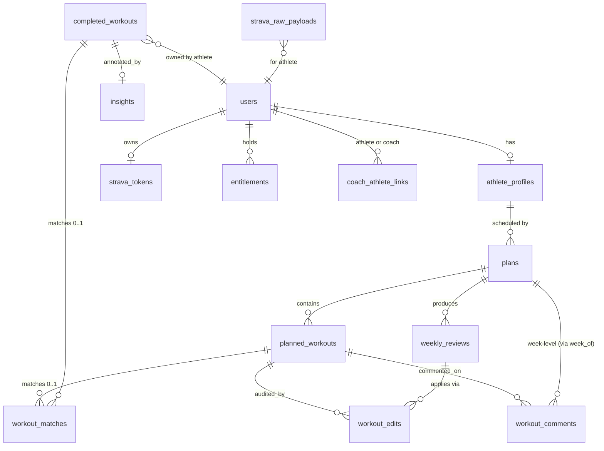

# Database Schema — Implementation Plan

## Overview

Convert the 36 schema requirements from the brainstorm into a sequenced set of Postgres migrations, RLS policies, and TS types/Zod schemas in `packages/shared` against Supabase Postgres 17. Schema is the foundation for the broader product plan ([docs/plans/2026-05-02-001-feat-ai-endurance-training-app-plan.md](2026-05-02-001-feat-ai-endurance-training-app-plan.md)) — all API units in that plan depend on tables defined here.

This plan focuses on:
- Migration tooling and conventions.
- Tables, constraints, indexes, RLS policies.
- The TS type + Zod schema layer (in `packages/shared`) that mirrors each table.
- Account-deletion / soft-delete machinery.
- The minimum tests needed to prove schema invariants (uniqueness, RLS, soft-delete behavior, audit completeness).

Implementation tactics (exact column types, query plans, prompt-driven JSONB shapes) are deferred to the units themselves; this plan is the migration roadmap and the contract each migration must satisfy.

## Problem Frame

See origin: `docs/brainstorms/2026-05-02-database-schema-requirements.md`. We need a Postgres schema that:

- Cleanly separates "planned" from "completed" workouts.
- Makes Strava webhook ingest idempotent and replay-safe.
- Supports a coach editing an athlete's plan with RLS-enforced revocation.
- Logs every workout edit for attribution and forensic debugging.
- Remains within Strava ToS (no raw stream samples in DB; bounded retention on raw payloads).
- Supports account deletion (App Store + GDPR) with a clean cascade.

## Requirements Trace

This plan covers all R1–R36 from the schema brainstorm. Mapping below.

| Brainstorm IDs | Implementation Unit |
|---|---|
| R1 | Unit 2 (users) |
| R2 | Unit 3 (strava_tokens) |
| R3 | Unit 2 (entitlements) |
| R4–R6 | Unit 4 (athlete_profiles) |
| R7–R10 | Unit 5 (plans + planned_workouts) |
| R11–R13 | Unit 7 (workout_edits) |
| R14–R18 | Unit 6 (completed_workouts + strava_raw_payloads) |
| R19–R22 | Unit 6 (workout_matches) |
| R23–R27 | Unit 8 (coach_athlete_links + RLS) |
| R28–R29 | Unit 7 (weekly_reviews) |
| R30–R31 | Unit 9 (insights) |
| R32–R33 | Unit 9 (workout_comments) |
| R34 | Unit 1 (conventions: UTC) |
| R35–R36 | Unit 10 (deletion machinery) |

Success criteria from the brainstorm (calendar P95 <50ms, weekly-review P95 <100ms, coach roster P95 <150ms, idempotent webhook replay, audit completeness, deletion within 30 days) are restated under Success Metrics below and tested per unit.

## Scope Boundaries

Carry forward from the brainstorm — same v1 schema non-goals (no raw 1Hz streams, no multi-coach, no multi-active-plan, no full plan versioning, no team/club, no public sharing, no first-class race/event entity, no nutrition, no equipment, no OLAP split).

This plan additionally excludes:
- No Hasura / PostgREST auto-generated API layer; Next.js Route Handlers (in `apps/web/app/api/*`) own the write surface and call Supabase via `@supabase/ssr` (RLS-enforced) for reads.
- No Postgres extensions beyond `pgcrypto` (encrypt-at-rest for Strava tokens) and `uuid-ossp` (or `gen_random_uuid()` from pgcrypto). No TimescaleDB, no pgvector in v1.
- No materialized views in v1. Trend reports compute live; revisit if P95 latency targets fail.

## Context & Research

### Relevant Code and Patterns

Greenfield repo — no existing patterns. The product plan ([2026-05-02-001](2026-05-02-001-feat-ai-endurance-training-app-plan.md)) sets these conventions which this plan follows:
- Migrations live under `supabase/migrations/`, applied via the Supabase CLI (resolved during planning — see Key Technical Decisions).

- TS types and Zod schemas in `packages/shared/src/` (one file per logical table family).
- DB tests under `apps/web/src/db/__tests__/` (via Vitest + a local Postgres or `supabase start`).


### Institutional Learnings

None yet. After this plan ships, write `docs/solutions/strava-webhook-dedup.md` and `docs/solutions/rls-coach-athlete.md` so future work can reference these patterns without re-deriving them.

### External References

- Supabase RLS: https://supabase.com/docs/guides/database/postgres/row-level-security
- Supabase migrations CLI: https://supabase.com/docs/guides/cli/local-development#database-migrations
- Postgres partial unique indexes: https://www.postgresql.org/docs/17/indexes-partial.html
- supabase-js + @supabase/ssr: https://supabase.com/docs/reference/javascript
- Strava data deletion API: https://developers.strava.com/docs/reference/#api-Activities (per-activity DELETE) and https://www.strava.com/legal/api

## Key Technical Decisions

- **Plain SQL migrations under `supabase/migrations/` managed via the Supabase CLI**. RLS policies, triggers, and Realtime publication tweaks all live in raw SQL; the Supabase CLI knows about the `auth` schema and the `supabase_realtime` publication. The application layer (Next.js Route Handlers using supabase-js) does not own migrations.
- **supabase-js as the database client**, with Zod schemas in `packages/shared` providing typed request/response contracts at API boundaries. No ORM. Where complex queries are needed, raw SQL via `supabase.rpc()` or a small typed-query helper.
- **UUIDv7 (or v4) primary keys everywhere**, generated server-side via `gen_random_uuid()`. Stable identifiers across Strava, RevenueCat, and our DB.
- **`users.id` is the Supabase `auth.users.id`** (UUID). Mirror table in `public.users` for app-level columns; foreign keys point to `public.users.id`. Avoids the "two parallel user identifiers" problem.
- **JSONB for variable-shape columns** (workout structure, summary stats, weekly review proposals); first-class columns for everything filtered, sorted, or grouped on (athlete_id, scheduled_date, sport, status, planned_load).
- **Soft-delete via `deleted_at TIMESTAMPTZ` on the five mutation-prone tables** (`completed_workouts`, `planned_workouts`, `plans`, `coach_athlete_links`, `workout_comments`). All read paths add `deleted_at IS NULL` by default; admin paths can pass through.
- **RLS-by-default on every user-data table — RLS is the primary defense.** Route handlers in `apps/web/app/api/*` use the user JWT via `@supabase/ssr` so RLS enforces row scoping. The service-role key is reserved for webhook handlers and admin paths, where queries must explicitly filter by user.
- **One active plan per athlete enforced by partial unique index** `UNIQUE (athlete_id) WHERE status = 'active' AND deleted_at IS NULL`. Same pattern for one active coach link.
- **Strava token encryption uses `pgcrypto` symmetric encryption with the key stored as a Vercel env secret**, not in the DB. Refresh and access tokens encrypted before insert; decrypted only inside Next.js Route Handlers when the StravaClient needs them.
- **`completed_workouts` UNIQUE on `(athlete_id, strava_activity_id) WHERE strava_activity_id IS NOT NULL`.** Manual rows have NULL strava_activity_id and are not constrained by uniqueness (a busy day could have multiple manual workouts).
- **`workout_matches` is a 1:1 link table with at most one active match per planned and per completed.** Enforced by partial unique indexes on each side `WHERE deleted_at IS NULL`. Manual relinks soft-delete the prior match.
- **`workout_edits` is append-only, no soft-delete, no updates.** Audit log integrity.
- **`strava_raw_payloads` retention bounded by a daily cleanup job**, not a TTL feature; default 30 days. Driven by an `arrived_at` index.
- **Account deletion is a single Postgres function** invoked by a Next.js Route Handler: cascades through the users tables, revokes Strava tokens, and enqueues a queue function (Inngest) to call Strava's per-activity deletion endpoint for stored activity IDs. Asynchronous Strava-side cleanup is acceptable given Strava ToS allows up to 48h.
- **Realtime publication explicit, not "all tables".** Only `plans`, `planned_workouts`, `completed_workouts`, `workout_comments`, `workout_edits` (for attribution updates), and `weekly_reviews` get added to the Realtime publication. Sensitive tables (`strava_tokens`, `entitlements`) are excluded.

## Open Questions

### Resolved During Planning

- *Migration tool*: Supabase CLI / plain SQL (see Key Decisions).
- *ORM*: none — supabase-js with Zod-typed boundaries.
- *PK type*: UUID via `gen_random_uuid()`.
- *Soft-delete vs hard-delete*: soft-delete by default; hard-delete on account deletion only.
- *Token storage*: pgcrypto symmetric, key in the host-PaaS secret store (provider TBD per Unit 1.5).
- *JSONB vs normalized intervals*: JSONB for structure; columns for query fields.

### Deferred to Implementation

- Final JSONB shape for `planned_workouts.structure` — converges with prompt iteration in product plan Unit 3.2.
- Final JSONB shape for `completed_workouts.summary_stats` — converges with Strava normalization in product plan Unit 2.2.
- Whether to add a covering index on `(athlete_id, scheduled_date) INCLUDE (sport, status, planned_load)` or a plain composite — measure on seeded data.
- Exact match-confidence formula and tolerance defaults — validated with real Strava data in product plan Unit 2.4.
- Whether `workout_comments` is one table with a discriminator or two tables — pick during product plan Unit 4.2; this plan reserves shape but does not lock it.
- Retention default for `strava_raw_payloads` (7 / 14 / 30 days) — start at 30 and lower if storage becomes a concern.
- `local_date` cached column on `planned_workouts` and `completed_workouts` (athlete-tz-projected) for fast "today" / "this week" queries — add when calendar query latency requires it.

## High-Level Technical Design

> *This illustrates the intended approach and is directional guidance for review, not implementation specification. The implementing agent should treat it as context, not code to reproduce.*

### Entity-Relationship sketch



### Key shape sketches (directional, not DDL)

```
users
  id (PK, = auth.users.id)
  email, display_name, role_flags, timezone, created_at, deleted_at

athlete_profiles
  user_id (PK, FK users)
  baselines JSONB (per-sport pace/HR/power/zones, confidence)
  manual_fields JSONB (age, weight, hours_avail, target_event)
  manual_field_edited_at JSONB (per-field timestamps)
  derived_at, weekly_volume_ewma JSONB

plans
  id, athlete_id, status (active|archived), event_type, event_date,
  source (ai_generated|coach_assigned|imported), created_from_review_id (nullable),
  created_at, archived_at, deleted_at
  PARTIAL UNIQUE (athlete_id) WHERE status='active' AND deleted_at IS NULL

planned_workouts
  id, athlete_id, plan_id (NULLABLE → ad-hoc), scheduled_date, sport,
  structure JSONB, planned_load, status (planned|completed|skipped|moved),
  rationale TEXT, edited_by_kind, edited_by_user_id, edited_at,
  created_at, deleted_at
  INDEX (athlete_id, scheduled_date) WHERE deleted_at IS NULL

completed_workouts
  id, athlete_id, source (strava|manual), strava_activity_id (NULLABLE),
  started_at, sport, distance_m, duration_s, summary_stats JSONB,
  superseded_by_id (NULLABLE), created_at, deleted_at
  PARTIAL UNIQUE (athlete_id, strava_activity_id) WHERE strava_activity_id IS NOT NULL

workout_matches
  id, planned_workout_id, completed_workout_id, confidence, method,
  matched_at, deleted_at
  PARTIAL UNIQUE (planned_workout_id) WHERE deleted_at IS NULL
  PARTIAL UNIQUE (completed_workout_id) WHERE deleted_at IS NULL

workout_edits   (append-only)
  id, planned_workout_id, actor_user_id, actor_role (athlete|coach|ai_review),
  source (manual|coach_edit|weekly_review_accept), weekly_review_id (nullable),
  field_diff JSONB, edited_at

weekly_reviews
  id, athlete_id, plan_id, week_of, proposed_changes JSONB, narrative TEXT,
  status (proposed|accepted|rejected|partially_accepted|expired),
  generated_at, decided_at, deleted_at

insights   (append-only)
  id, athlete_id, completed_workout_id, body TEXT, model, tokens, generated_at
  INDEX (athlete_id, generated_at)

coach_athlete_links
  id, coach_user_id, athlete_user_id, status (pending|active|revoked),
  invited_at, accepted_at, revoked_at, deleted_at
  PARTIAL UNIQUE (athlete_user_id) WHERE status='active' AND deleted_at IS NULL

workout_comments
  id, commentable_kind (workout|week), planned_workout_id (nullable),
  plan_id (nullable), week_of (nullable), author_user_id, parent_comment_id,
  body TEXT, created_at, deleted_at

strava_tokens
  user_id (PK), access_token_enc BYTEA, refresh_token_enc BYTEA,
  expires_at, scope, athlete_strava_id, created_at, last_used_at

strava_raw_payloads
  id, user_id, kind (webhook|hydration), payload JSONB, arrived_at
  INDEX (arrived_at) for retention sweeper

entitlements
  user_id, entitlement_key, active, source (revenuecat), updated_at
  PRIMARY KEY (user_id, entitlement_key)
```

### RLS posture sketch

```
PUBLIC TABLE                          POLICY (athlete-side)                                   POLICY (coach-side)
----------------------                -------------------------------------------             ---------------------------------------------
users                                 self only                                              linked-via-active-link athletes only
athlete_profiles                      own row only                                            linked athletes only
plans, planned_workouts,
completed_workouts, workout_matches,
weekly_reviews, workout_comments,
workout_edits, insights               own data only                                           linked athletes' data only
strava_tokens, strava_raw_payloads,
entitlements                          self only                                              NO COACH ACCESS
coach_athlete_links                   athlete sees their own; coach sees their own            (coach side same row)
```

Route handlers use the user JWT via `@supabase/ssr` (so RLS enforces row scoping); service-role usage is restricted to webhook handlers and admin paths, where queries must explicitly filter by user.

## Implementation Units

Units split into three phases. A unit lands as one (or two) atomic migrations + the matching TS types and Zod schemas in `packages/shared` + tests. Migration filenames are sequence-prefixed (`0001_*.sql`, `0002_*.sql`, …) so order is unambiguous.

---

### Phase A: Foundations (Weeks 1–2)

- [ ] **Unit 1: Migration tooling + conventions**

**Goal:** Stand up the Supabase migrations directory, naming/numbering conventions, the `packages/shared` TS-types skeleton, and a CI step that applies migrations against an ephemeral Postgres for tests.

**Requirements:** R34 (UTC); cross-cutting conventions for all subsequent units.

**Dependencies:** Product plan Unit 1.5 (Supabase project provisioned).

**Files:**
- Create: `supabase/migrations/.keep`, `supabase/config.toml`
- Create: `apps/web/src/db/server.ts` (server-side supabase-js client factory)

- Create: `packages/shared/src/index.ts` (re-export point for all table-family modules)
- Create: `apps/web/src/db/__tests__/setup.ts` (test DB bootstrap; one transaction per test, rolled back)

- Modify: `.github/workflows/ci.yml` to spin up Postgres 17, apply `supabase/migrations/*.sql`, run vitest
- Create: `docs/solutions/migration-conventions.md`

**Approach:**
- Migration file naming: `NNNN_<imperative_description>.sql`, four-digit zero-padded.
- Each migration is one logical change; no monolithic migrations after Unit 1.
- All timestamp columns are `TIMESTAMPTZ`; all rows store UTC. `created_at` defaults to `now()`.
- Every table includes `created_at` (and where appropriate, `updated_at` via trigger or explicit set in app).
- Naming: snake_case tables/columns; PK is always `id UUID DEFAULT gen_random_uuid()` except where explicitly noted.
- Test fixture wraps each test in a transaction and rolls back — fast, avoids cross-test bleed.

**Patterns to follow:** Standard Supabase + supabase-js server-client setup.

**Test scenarios:**
- Happy path: a no-op migration applies cleanly; test fixture creates a session and rolls back.
- Integration: the deferred TS drift check (see `docs/solutions/migration-conventions.md`) lands as a follow-up unit; for now CI only verifies that all migrations apply cleanly against an ephemeral Postgres.

**Verification:** CI runs migrations + drift check on every PR; both green.

---

- [ ] **Unit 2: Identity (`users`) + entitlements**

**Goal:** Mirror Supabase auth users in `public.users` and add the `entitlements` table that RevenueCat webhook will write to.

**Requirements:** R1, R3.

**Dependencies:** Unit 1.

**Files:**
- Create: `supabase/migrations/0001_users_and_entitlements.sql`
- Create: `packages/shared/src/users.ts`, `packages/shared/src/entitlement.ts`

- Create: `apps/web/src/db/__tests__/users-entitlements.test.ts`

**Approach:**
- `public.users.id` is `UUID PRIMARY KEY REFERENCES auth.users(id) ON DELETE CASCADE`.
- Columns: `email`, `display_name`, `role_flags TEXT[]` (subset of `{athlete, coach}`; both is allowed), `timezone TEXT NOT NULL DEFAULT 'UTC'`, `created_at`, `deleted_at`.
- Trigger on `auth.users` insert mirrors the row into `public.users` (Supabase pattern).
- `entitlements` PK is `(user_id, entitlement_key)`; `active BOOLEAN`, `source TEXT NOT NULL CHECK (source = 'revenuecat')`, `updated_at`.
- RLS: users select/update self only; entitlements select self only (write is service-role-only).

**Patterns to follow:** Supabase "mirror auth.users into public" pattern.

**Test scenarios:**
- Happy path: inserting a row into `auth.users` (via Supabase test helper) mirrors into `public.users`.
- Edge case: user signs up with Apple Hide-My-Email → email stored is the relay address; mirror works.
- Integration: anon-key SELECT on `users` returns only the caller's row.
- Integration: anon-key UPDATE on another user's row is rejected by RLS.
- Edge case: entitlement with `(user, key)` upsert correctly toggles `active`.
- Edge case: `role_flags` accepts both `{athlete}` and `{athlete, coach}`.

**Verification:** New user signup creates a `public.users` row with timezone defaulted; entitlement webhook test (mocked) writes a row visible only to that user via RLS.

---

- [ ] **Unit 3: Strava infrastructure (`strava_tokens`, `strava_raw_payloads`)**

**Goal:** Encrypted Strava token storage + raw-payload archive with bounded retention.

**Requirements:** R2, R16.

**Dependencies:** Unit 2.

**Files:**
- Create: `supabase/migrations/0002_strava_infra.sql`
- Create: `packages/shared/src/strava-token.ts`, `packages/shared/src/strava-raw-payload.ts`

- Create: `apps/web/src/security/token-crypto.ts` (Node-side AES-256-GCM via `node:crypto`; key from env, never traverses SQL)
- Create: `apps/web/src/jobs/strava-payload-retention.ts` (Inngest scheduled function — cleanup)
- Create: `apps/web/src/db/__tests__/strava-tokens.test.ts`, `apps/web/src/db/__tests__/strava-raw-payloads.test.ts`

**Approach:**
- `strava_tokens`: `user_id PK`, `access_token_enc BYTEA`, `refresh_token_enc BYTEA`, `expires_at`, `scope TEXT`, `athlete_strava_id BIGINT UNIQUE` (athlete's Strava ID), `created_at`, `last_used_at`. Tokens encrypted via `pgp_sym_encrypt(...)` at write, decrypted only in app code by `apps/web/src/security/token-crypto.ts`.
- `strava_raw_payloads`: `id`, `user_id`, `kind TEXT CHECK (kind IN ('webhook','hydration'))`, `payload JSONB`, `arrived_at TIMESTAMPTZ DEFAULT now()`. Index on `arrived_at`.
- Retention sweeper: Inngest daily scheduled function deletes rows with `arrived_at < now() - INTERVAL '30 days'`. Configurable via env (`STRAVA_RAW_RETENTION_DAYS`, default 30).
- RLS: self-only on both tables (write is service-role-only — only Next.js webhook handlers insert).
- Encryption key (`STRAVA_TOKEN_KEY`) lives in the host-PaaS secret store (provider TBD per Unit 1.5); never in DB or migration.

**Patterns to follow:** pgcrypto symmetric-encryption pattern; Inngest scheduled-function pattern (will be established in product plan Unit 1.5).

**Test scenarios:**
- Happy path: insert encrypted token, decrypt round-trips to original plaintext.
- Edge case: missing encryption key → encrypt helper raises a clear error, never inserts plaintext.
- Edge case: `athlete_strava_id` collision (a user re-connects, but that Strava account is on another row) → upsert resolves to the latest user.
- Integration: scheduled retention function deletes rows older than 30 days, leaves newer ones alone.
- Integration: anon-key SELECT on `strava_tokens` returns nothing (service-role-only writes; RLS blocks reads from anon).

**Verification:** A test plaintext token is encrypted via the helper, stored, retrieved, and decrypted in tests. Retention job log shows N rows deleted on a seeded dataset.

---

### Phase B: Workout Core (Weeks 2–4)

- [ ] **Unit 4: Athlete profile (`athlete_profiles`)**

**Goal:** Per-athlete derived baselines + manual fields with per-field edit timestamps so derivation never overwrites manual edits.

**Requirements:** R4, R5, R6.

**Dependencies:** Unit 2.

**Files:**
- Create: `supabase/migrations/0003_athlete_profiles.sql`
- Create: `packages/shared/src/athlete-profile.ts`

- Create: `apps/web/src/db/__tests__/athlete-profile.test.ts`

**Approach:**
- PK is `user_id` (1:1 with `users`). FK on delete cascade.
- Columns: `baselines JSONB` (per-sport pace/HR/power/zones, confidence flag), `manual_fields JSONB` (age, weight, hours_avail, target_event), `manual_field_edited_at JSONB` (per-field timestamps; same keys as `manual_fields`), `weekly_volume_ewma JSONB`, `derived_at TIMESTAMPTZ`, `created_at`, `updated_at`.
- The "manual edits aren't overwritten by derivation" invariant is enforced at the application layer (Unit 2.3 of the product plan), not in SQL — this plan only ensures the timestamp surface exists.
- RLS: athlete sees own profile; linked coach sees the athlete's profile (read-only — RLS for coach side completed in Unit 8).

**Patterns to follow:** 1:1 with users via shared PK.

**Test scenarios:**
- Happy path: insert profile with baselines + manual fields → SELECT round-trips JSONB.
- Edge case: profile insert with empty baselines (sparse-data case from R5) → confidence flag stored.
- Edge case: derivation update path (app-layer) updates `baselines` + `derived_at` without touching `manual_fields`.
- Integration: anon-key SELECT returns own row only.

**Verification:** Profile lifecycle (create → derive → manual edit → re-derive) preserves manual edits in tests.

---

- [ ] **Unit 5: Plans + planned workouts (`plans`, `planned_workouts`)**

**Goal:** First-class plan with at-most-one-active-per-athlete, plus the workout rows that hang off it (or float as ad-hoc with `plan_id IS NULL`).

**Requirements:** R7, R8, R9, R10.

**Dependencies:** Unit 4.

**Files:**
- Create: `supabase/migrations/0007_plans_and_planned_workouts.sql`
- Create: `packages/shared/src/plan.ts`, `packages/shared/src/planned-workout.ts`

- Create: `apps/web/src/db/__tests__/plans.test.ts`, `apps/web/src/db/__tests__/planned-workouts.test.ts`

**Approach:**
- `plans`: `id`, `athlete_id FK users`, `status TEXT CHECK (status IN ('active','archived'))`, `event_type TEXT`, `event_date DATE`, `source TEXT CHECK (source IN ('ai_generated','coach_assigned','imported'))`, `created_from_review_id UUID NULL` (FK to `weekly_reviews` — added once that table exists in Unit 7; for now, declare as plain UUID and add FK in 0011), `created_at`, `archived_at`, `deleted_at`.
- Partial unique index: `CREATE UNIQUE INDEX plans_one_active_per_athlete ON plans(athlete_id) WHERE status = 'active' AND deleted_at IS NULL;`.
- `planned_workouts`: `id`, `athlete_id FK users`, `plan_id UUID NULL FK plans`, `scheduled_date DATE NOT NULL`, `sport TEXT CHECK (sport IN ('swim','bike','run','strength','mobility','other'))`, `structure JSONB`, `planned_load NUMERIC NULL`, `status TEXT CHECK (status IN ('planned','completed','skipped','moved'))`, `rationale TEXT`, `edited_by_kind TEXT NULL`, `edited_by_user_id UUID NULL FK users`, `edited_at TIMESTAMPTZ NULL`, `created_at`, `deleted_at`.
- Index: `(athlete_id, scheduled_date) WHERE deleted_at IS NULL`. Defer `INCLUDE` clause decision to measurement (see Open Questions).
- Realtime publication: add both tables to `supabase_realtime`.
- RLS: athlete sees own; coach sees linked athletes' (full coach RLS lands in Unit 8).

**Patterns to follow:** Partial unique index for "one active per X" enforcement.

**Test scenarios:**
- Happy path: insert active plan, then archive + insert second active → both succeed.
- Edge case (R7): two active plans for same athlete → second insert raises unique violation.
- Edge case: planned_workout with `plan_id = NULL` (ad-hoc) inserts cleanly.
- Edge case: invalid `sport` or `status` value → CHECK constraint rejects.
- Edge case: athlete_id mismatch between plan and planned_workout — caught by app layer (no FK enforces this, by design — plan_id and athlete_id are both stored to keep ad-hoc workouts viable).
- Integration: row insert publishes a Realtime event observable by a test subscriber on the `plans` channel.
- Integration: RLS — anon-key SELECT on planned_workouts returns only own.

**Verification:** Calendar query (`SELECT ... WHERE athlete_id = $1 AND scheduled_date BETWEEN $2 AND $3 AND deleted_at IS NULL`) returns expected rows on seeded data and uses the partial index (verified via `EXPLAIN`).

---

- [ ] **Unit 6: Completed workouts + workout matches (`completed_workouts`, `workout_matches`)**

**Goal:** Canonical completion record with idempotent Strava upsert; match table linking 0..1 completed to 0..1 planned.

**Requirements:** R14, R15, R17, R18, R19, R20, R21, R22.

**Dependencies:** Unit 5.

**Files:**
- Create: `supabase/migrations/0008_completed_workouts_and_matches.sql`
- Create: `packages/shared/src/completed-workout.ts`, `packages/shared/src/workout-match.ts`

- Create: `apps/web/src/db/__tests__/completed-workouts.test.ts`, `apps/web/src/db/__tests__/workout-matches.test.ts`

**Approach:**
- `completed_workouts`: `id`, `athlete_id FK users`, `source TEXT CHECK (source IN ('strava','manual'))`, `strava_activity_id BIGINT NULL`, `started_at TIMESTAMPTZ NOT NULL`, `sport TEXT`, `distance_m NUMERIC NULL`, `duration_s INTEGER NULL`, `summary_stats JSONB` (avg/max HR, power, zones, normalized power, TSS-equivalent), `superseded_by_id UUID NULL FK completed_workouts(id)`, `created_at`, `deleted_at`.
- Partial unique index: `(athlete_id, strava_activity_id) WHERE strava_activity_id IS NOT NULL` — Strava idempotency.
- Index `(athlete_id, started_at DESC) WHERE deleted_at IS NULL` for trend queries.
- `workout_matches`: `id`, `planned_workout_id FK planned_workouts`, `completed_workout_id FK completed_workouts`, `confidence NUMERIC CHECK (confidence BETWEEN 0 AND 1)`, `method TEXT CHECK (method IN ('auto_same_day_sport','manual_user_link','merged_from_manual'))`, `matched_at`, `deleted_at`.
- Partial unique indexes on each side `WHERE deleted_at IS NULL` enforce 1:1.
- Realtime publication: add `completed_workouts` and `workout_matches`.
- RLS: athlete sees own; coach sees linked.

**Patterns to follow:** Partial unique constraint for nullable-uniqueness (`strava_activity_id`).

**Test scenarios:**
- Happy path: insert Strava completion → row visible.
- Edge case (R15): inserting the same `(athlete_id, strava_activity_id)` twice with `ON CONFLICT DO UPDATE` is idempotent (no duplicate row, last write of summary_stats wins).
- Edge case: manual completion with `strava_activity_id = NULL` inserts; second manual completion with NULL also inserts (no false uniqueness collision).
- Edge case (R17): Strava `delete` event sets `deleted_at`; SELECT default filter hides; the matched `planned_workout` returns to `status='planned'` (handled in app layer).
- Edge case (R19, R20): matcher links a completion to a planned workout → both partial uniques hold; second attempt to link the same planned to a different completion violates.
- Edge case (R21): manual record exists; Strava-sourced record arrives later → matcher writes a new `workout_matches` row pointing to the Strava row; manual record gets `superseded_by_id` set (no destructive update).
- Edge case: confidence outside [0,1] → CHECK rejects.
- Integration: athlete's calendar query (planned + completed, last 4 weeks) returns expected rows in <50ms on seeded data of 200 activities/athlete and 1000 athletes.

**Verification:** Replay test inserts the same Strava webhook payload 100 times → exactly one `completed_workouts` row.

---

### Phase C: AI artifacts, coach, comments, deletion (Weeks 4–6)

- [ ] **Unit 7: Weekly reviews + workout edits audit log**

**Goal:** AI weekly review proposals + the audit log that records every edit to a planned workout (including weekly-review acceptances).

**Requirements:** R11, R12, R13, R28, R29.

**Dependencies:** Unit 5, Unit 6.

**Files:**
- Create: `supabase/migrations/0009_weekly_reviews.sql`, `supabase/migrations/0010_workout_edits.sql`, `supabase/migrations/0011_plans_review_fk.sql` (adds the FK from Unit 5's deferred `created_from_review_id`)
- Create: `packages/shared/src/weekly-review.ts`, `packages/shared/src/workout-edit.ts`

- Create: `apps/web/src/db/__tests__/weekly-reviews.test.ts`, `apps/web/src/db/__tests__/workout-edits.test.ts`

**Approach:**
- `weekly_reviews`: `id`, `athlete_id FK users`, `plan_id FK plans`, `week_of DATE`, `proposed_changes JSONB` (list of patch objects keyed by `planned_workout_id`), `narrative TEXT`, `status TEXT CHECK (status IN ('proposed','accepted','rejected','partially_accepted','expired'))`, `generated_at`, `decided_at`, `deleted_at`.
- `workout_edits` (append-only, no `deleted_at`, no `updated_at`): `id`, `planned_workout_id FK planned_workouts`, `actor_user_id UUID NULL FK users` (NULL when actor_role = 'ai_review'), `actor_role TEXT CHECK (actor_role IN ('athlete','coach','ai_review'))`, `source TEXT CHECK (source IN ('manual','coach_edit','weekly_review_accept'))`, `weekly_review_id UUID NULL FK weekly_reviews`, `field_diff JSONB` (`{field_name: {old, new}}`), `edited_at TIMESTAMPTZ DEFAULT now()`.
- Index on `(planned_workout_id, edited_at DESC)` for the "most recent edit attribution" query (R13).
- Migration 0011 retroactively adds the FK from `plans.created_from_review_id` to `weekly_reviews.id` (deferred from Unit 5 because of forward-reference).
- Realtime publication: add `weekly_reviews` and `workout_edits` (the latter so coach attribution updates show live).
- RLS: athlete sees own; coach sees linked.
- Application-layer constraint: `workout_edits` rows are written by Next.js Route Handlers ONLY; no UPDATE or DELETE statements anywhere in the codebase. Lint rule + unit-test asserts no `UPDATE workout_edits` or `DELETE FROM workout_edits` appears in `apps/web/`.

**Patterns to follow:** Append-only audit table; FK back-reference for `weekly_review_id` so accepted-review edits can be traced.

**Test scenarios:**
- Happy path: weekly review insert with status `proposed` → app accepts → status flips to `accepted`, decided_at set.
- Happy path: each edit to `planned_workouts` produces one matching `workout_edits` row with full diff.
- Edge case (R12): reading a workout never reads from `workout_edits` — verified by absence of any query joining workout_edits in `planned_workouts` read paths.
- Edge case (R13): "most recent edit" query for a workout returns the latest row by `edited_at`.
- Edge case: accepted review writes N edit rows (one per applied change) all with `weekly_review_id` set.
- Error path: attempting `UPDATE` or `DELETE` on `workout_edits` from the app raises (codified as a static-analysis rule).
- Integration: rejecting a review → no edit rows written, `planned_workouts` unchanged.

**Verification:** Audit completeness test: programmatically apply 50 random edits via the app layer; assert `SELECT count(*) FROM workout_edits WHERE planned_workout_id = X` matches the number of edits applied to X.

---

- [ ] **Unit 8: Coach-athlete linkage + RLS policies**

**Goal:** The relationship table that ties coaches to athletes, and the RLS policies that gate coach access on `status = 'active'`.

**Requirements:** R23, R24, R25, R26, R27.

**Dependencies:** Unit 2 (users), Unit 5 (plans), Unit 6 (workouts), Unit 7 (reviews/edits).

**Files:**
- Create: `supabase/migrations/0012_coach_athlete_links.sql`, `supabase/migrations/0013_coach_rls_policies.sql`
- Create: `packages/shared/src/coach-athlete-link.ts`

- Create: `apps/web/src/db/__tests__/coach-links.test.ts`, `apps/web/src/db/__tests__/coach-rls.test.ts`

**Approach:**
- `coach_athlete_links`: `id`, `coach_user_id FK users`, `athlete_user_id FK users`, `status TEXT CHECK (status IN ('pending','active','revoked'))`, `invite_token TEXT UNIQUE NULL`, `invite_expires_at TIMESTAMPTZ NULL`, `invited_at`, `accepted_at`, `revoked_at`, `deleted_at`.
- Partial unique index: `(athlete_user_id) WHERE status = 'active' AND deleted_at IS NULL` enforces one active coach per athlete (R24).
- RLS on `coach_athlete_links`: athlete and coach can each see their own row(s).
- RLS on athlete-data tables (planned_workouts, completed_workouts, plans, weekly_reviews, athlete_profiles, workout_matches, workout_edits, workout_comments, insights): policy `coach_can_read = EXISTS (SELECT 1 FROM coach_athlete_links cal WHERE cal.coach_user_id = auth.uid() AND cal.athlete_user_id = <table>.athlete_id AND cal.status = 'active' AND cal.deleted_at IS NULL)`.
- RLS on `coach_athlete_links` write-side: only the athlete can `INSERT` an invite for themselves (creates `pending`); only the invited coach can `UPDATE` to `active`; either party can `UPDATE` to `revoked`.
- Coach edit on `planned_workouts`: SELECT/UPDATE policy permits when the link is active. INSERTs by coach are not allowed in v1 (coaches edit existing workouts; they don't insert ad-hoc workouts on the athlete's behalf in v1).
- This unit also revisits and tightens RLS on tables added in earlier units, since their initial RLS only covered the athlete-self path.

**Patterns to follow:** Supabase RLS using `auth.uid()`; partial unique index for "one active per X."

**Test scenarios:**
- Happy path: athlete invites coach → row inserted with `status = 'pending'`.
- Happy path: coach accepts → status becomes `active`; coach SELECT on athlete's `planned_workouts` returns rows.
- Edge case (R24): athlete has an active coach, tries to add a second active link → unique-index violation.
- Edge case (R26): athlete revokes link → status becomes `revoked`; coach SELECT on athlete's data returns zero rows immediately on next query (RLS recheck).
- Edge case: invite token expired → coach acceptance attempt rejected (app-layer check on `invite_expires_at`).
- Edge case: third-party (random user) tries to SELECT athlete's data → RLS returns nothing.
- Edge case (R27): coach UPDATE on `planned_workouts` succeeds; corresponding `workout_edits` row written with `actor_role = 'coach'`.
- Error path: coach attempts INSERT on `planned_workouts` → RLS rejects.
- Integration: coach editing a workout fires a Realtime event observable on the athlete's mobile subscription.

**Verification:** Two-user RLS matrix test runs every athlete-data table through (coach with active link / coach with revoked link / random user / self) and asserts expected visibility for each.

---

- [ ] **Unit 9: Insights + comments**

**Goal:** Append-only AI insights table and the workout/week comment threading model.

**Requirements:** R30, R31, R32, R33.

**Dependencies:** Unit 6 (completed_workouts), Unit 5 (planned_workouts and plans for week-level comments).

**Files:**
- Create: `supabase/migrations/0014_insights.sql`, `supabase/migrations/0015_workout_comments.sql`
- Create: `packages/shared/src/insight.ts`, `packages/shared/src/workout-comment.ts`

- Create: `apps/web/src/db/__tests__/insights.test.ts`, `apps/web/src/db/__tests__/workout-comments.test.ts`

**Approach:**
- `insights` (append-only): `id`, `athlete_id FK users`, `completed_workout_id FK completed_workouts`, `body TEXT`, `model TEXT`, `tokens_in INT`, `tokens_out INT`, `generated_at TIMESTAMPTZ DEFAULT now()`. No `deleted_at`.
- Index: `(athlete_id, generated_at DESC)` — supports both per-athlete daily-cap counting (R31) and chronological feed.
- App-layer rate cap (R31) uses `SELECT count(*) FROM insights WHERE athlete_id = $1 AND generated_at >= now() - INTERVAL '24 hours'`.
- `workout_comments`: single table with discriminator. `id`, `commentable_kind TEXT CHECK (commentable_kind IN ('workout','week'))`, `planned_workout_id UUID NULL FK planned_workouts`, `plan_id UUID NULL FK plans`, `week_of DATE NULL`, `author_user_id FK users`, `parent_comment_id UUID NULL FK workout_comments(id)`, `body TEXT`, `created_at`, `deleted_at`.
- Constraint: `commentable_kind = 'workout' ⇒ planned_workout_id IS NOT NULL AND plan_id IS NULL AND week_of IS NULL`; `commentable_kind = 'week' ⇒ plan_id IS NOT NULL AND week_of IS NOT NULL AND planned_workout_id IS NULL`. Enforced via CHECK constraint.
- Realtime publication: add `workout_comments` (insights are loaded on demand via REST, not Realtime — too noisy).
- RLS: athletes and linked coaches can read/write comments on visible workouts; insights read-only for athlete + linked coach.

**Patterns to follow:** Discriminator-column table with CHECK-enforced field validity (alternative to two tables).

**Test scenarios:**
- Happy path: insight inserted with all fields → SELECT returns it.
- Edge case (R31): cap query correctly returns count for trailing 24h.
- Happy path: workout-comment with `commentable_kind = 'workout'` and `planned_workout_id` set inserts cleanly.
- Edge case (R32): comment with kind='workout' but plan_id set → CHECK rejects.
- Edge case: parent_comment_id chain → flat reply (depth 1) supported; depth-N is allowed but app UI flattens (no enforcement).
- Edge case (R33): planned_workout soft-deleted → comments remain (FK is `ON DELETE SET NULL` for `planned_workout_id` — though we soft-delete, so the FK never fires in normal flow).
- Edge case: anon-key SELECT on insights for another user returns nothing.
- Integration: coach posts a comment → athlete's mobile receives Realtime event.

**Verification:** Insert 6 insights for one athlete in 24h, run cap query → returns 6; insert one for a different athlete → cap query for the first athlete still returns 6.

---

- [ ] **Unit 10: Account deletion + Strava data-deletion hook**

**Goal:** A single Postgres function callable from a Next.js Route Handler that soft-then-hard deletes all user-owned rows; a queue function (Inngest) enqueued to call Strava's per-activity deletion endpoint for stored activity IDs.

**Requirements:** R35, R36.

**Dependencies:** All prior units (function references all athlete-owned tables).

**Files:**
- Create: `supabase/migrations/0016_account_deletion_function.sql`
- Create: `apps/web/src/services/account-deletion.ts`
- Create: `apps/web/src/jobs/strava-data-deletion.ts` (Inngest function)
- Create: `apps/web/app/api/me/route.ts` (DELETE /api/me endpoint)
- Create: `apps/web/src/services/__tests__/account-deletion.test.ts`
- Create: `docs/launch/account-deletion-runbook.md`

**Approach:**
- Postgres function `delete_user_cascade(user_id UUID)` runs as `SECURITY DEFINER`: deletes from `insights`, `workout_comments`, `workout_edits`, `workout_matches`, `weekly_reviews`, `completed_workouts`, `planned_workouts`, `plans`, `athlete_profiles`, `coach_athlete_links` (both sides), `entitlements`, `strava_raw_payloads`, `strava_tokens`, `users`, then `auth.users`. All in a single transaction.
- The Route Handler `DELETE /api/me` calls the function, then enqueues `strava-data-deletion({athlete_strava_id, activity_ids})` to Inngest.
- The Inngest function calls Strava's `DELETE /activities/{id}` for each known activity. Function is best-effort — Strava ToS allows up to 48h. Failure to delete a specific activity is logged but does not retry indefinitely (cap at 5 attempts per activity).
- Hard-delete (R35): this is the only path that hard-deletes rows. Strava `delete` events still soft-delete via `deleted_at`.
- Privacy policy (linked in product plan Unit 5.5) cites this 30-day SLA; the runbook covers manual recovery if the deletion function fails partway.

**Patterns to follow:** `SECURITY DEFINER` function for cross-table cascading; Inngest retry-with-cap pattern.

**Test scenarios:**
- Happy path: user with full data (profile + plan + 50 completed + 5 reviews + 100 insights + 10 comments + active coach link + Strava token) calls DELETE /me → all rows gone; coach's view of that athlete is empty; coach link gone.
- Edge case: user is also a coach with linked athletes → only their athlete-side data deletes; their coach-side links to OTHER athletes are revoked but not destroyed (those athletes keep their data; their coach side is just marked revoked).
- Edge case: deletion function called twice → second call is a no-op (rows already gone).
- Error path: Strava data-deletion job hits a 5xx for one activity → retries 5 times with backoff, then logs and gives up. Other activities still get deleted.
- Edge case: deletion happens mid-webhook (Strava activity arriving for a now-deleted user) → webhook handler tolerates "user not found" gracefully.
- Integration: after DELETE /me, attempting any API call with the old JWT returns 401 (since auth.users is gone).

**Verification:** End-to-end test creates a fully populated user, deletes, asserts zero rows remain across all tables. Strava-side deletion job log shows attempted DELETEs.

---

## System-Wide Impact

- **Interaction graph:** RLS policies attached in Unit 8 affect every read path on every athlete-data table; Route Handlers using the service-role key bypass RLS but must implement their own authorization checks. Realtime publication membership directly affects which row changes propagate to mobile + web; sensitive tables (`strava_tokens`, `entitlements`, `strava_raw_payloads`) must NOT be in the publication.
- **Error propagation:** Migration failure in any unit blocks deploy of all later units — migrations are linearly ordered. Schema constraint violations (CHECK / unique / FK) surface as supabase-js errors with Postgres error codes (e.g. `23505` for unique violation) and must be translated to user-facing errors at the API boundary.
- **State lifecycle risks:** Soft-delete + RLS interaction — every read path must filter `deleted_at IS NULL` AND obey RLS. Forgetting one allows leakage. Account-deletion function is the sole hard-delete path; bugs there have privacy + legal blast radius.
- **API surface parity:** Every entitlement-gated mutation in the Route Handler layer (covered in product plan) corresponds to RLS-permitted reads here. The two layers must agree; the test matrix in Unit 8 is the safety net.
- **Integration coverage:** RLS visibility, Strava webhook idempotency, the manual-then-Strava merge path, and the account-deletion cascade all need integration tests, not just unit tests on individual tables.
- **Unchanged invariants:** Supabase Auth schema (`auth.users`) is owned by Supabase — we mirror, never modify. Realtime publication is additive only — removing a table from it would silently break mobile/web subscriptions.

## Risks & Dependencies

| Risk | Likelihood | Impact | Mitigation |
|---|---|---|---|
| RLS policy gap leaks athlete data to a coach after revocation | Med | High | Two-user RLS matrix test in Unit 8 covers every athlete-data table; coach revocation test asserts immediate cut-off. |
| Strava webhook idempotency relies on a unique index that's NULL-friendly — easy to mis-author | Med | High | Explicit replay test (insert same payload 100 times → exactly 1 row) in Unit 6. |
| Workout-comment CHECK constraint shape diverges from app code | Low | Med | CHECK + tests in Unit 9 enforce; if maintenance burden hits, split into two tables in v2. |
| Account-deletion function omits a table added in a later migration | Med | High | CI step verifies every table referencing `user_id` (or `athlete_id`) is named in `delete_user_cascade`; alert on drift. |
| Encryption key for Strava tokens lost / rotated incorrectly | Low | High | Document key in the secrets runbook; add key-rotation procedure to launch runbook. Reading without the key returns a clear error, never plaintext. |
| Realtime publication includes a sensitive table by accident | Low | High | Migration explicitly lists the publication membership in code review checklist; don't use `FOR ALL TABLES`. |
| `created_from_review_id` forward-reference between Unit 5 and Unit 7 introduces sequencing bug | Med | Low | Migration 0011 cleans up the FK after weekly_reviews exists; deliberate split. |
| JSONB structure drift between Zod schema and prompts | Med | Med | Schemas live in `packages/shared/src/`; eval harness (product plan Unit 3.1) validates against them. |
| Migrations applied out of order in dev → broken local state | Low | Med | Supabase CLI enforces order; CI applies clean each PR; document `supabase db reset` in README. |
| Soft-delete forgotten in a query → ghost rows in coach views | Med | Med | A query helper `withLiveRows()` defaults to `.is("deleted_at", null)` plus an ESLint rule banning bare `.from("<table>")` for soft-deleted tables; tests assert `deleted_at IS NULL` filter on every read path. |

## Success Metrics

Carry forward from origin doc:
- Calendar query (4-week window) P95 < 50ms.
- Weekly-review query (1–2 prior weeks) P95 < 100ms.
- Coach roster query (≤50 athletes) P95 < 150ms.
- 100x webhook replay → exactly one row.
- Audit completeness: every `planned_workouts` change traceable to a `workout_edits` row.
- Account deletion: zero athlete-owned rows within 30 days.

Add operational:
- Migration apply time on a 100k-row test DB < 60s end-to-end.
- RLS test matrix covers ≥95% of (table × actor-role) combinations.

## Phased Delivery

- **Phase A (Weeks 1–2): Foundations.** Units 1–3. After this, Route Handlers can authenticate users, store entitlements, and persist Strava tokens.
- **Phase B (Weeks 2–4): Workout core.** Units 4–6. After this, athlete profile + AI plans + Strava completion + dedup + matching all have storage. Product plan Phase 2 + 3 can start ingesting and rendering.
- **Phase C (Weeks 4–6): AI artifacts, coach, comments, deletion.** Units 7–10. After this, weekly review proposals, full coach RLS, comments, and account-deletion are live.

Phases overlap with product plan phases; this plan's Phase A maps to product plan Phase 1, Phase B to product plan Phase 2 (and unblocks Phase 3), Phase C to product plan Phases 3–5.

## Documentation Plan

- `docs/solutions/migration-conventions.md` (Unit 1) — naming, ordering, drift check.
- `docs/solutions/strava-webhook-dedup.md` (Unit 6) — the partial-unique pattern + replay test.
- `docs/solutions/rls-coach-athlete.md` (Unit 8) — the active-link RLS pattern.
- `docs/solutions/account-deletion.md` (Unit 10) — cascade ordering, Strava-side cleanup, runbook.
- `docs/launch/account-deletion-runbook.md` (Unit 10) — operator playbook for partial-failure recovery.
- README addition: `Database` section with local-dev migration commands and reset workflow.

## Operational / Rollout Notes

- Migrations apply in CI before vitest; local dev uses `supabase db reset` after pulling new migrations.
- No production data exists during this work — the plan assumes greenfield. Re-evaluate if this plan is ever applied against an existing dataset.
- After Unit 10 ships, manually exercise account-deletion against a populated staging account before linking the privacy policy claim.
- After Unit 8 ships, run the RLS matrix against staging with two distinct test users (coach + athlete) to validate the policies under real Supabase auth, not just unit tests.

## Sources & References

- **Origin document:** [docs/brainstorms/2026-05-02-database-schema-requirements.md](../brainstorms/2026-05-02-database-schema-requirements.md)
- **Product plan (parent):** [docs/plans/2026-05-02-001-feat-ai-endurance-training-app-plan.md](2026-05-02-001-feat-ai-endurance-training-app-plan.md)
- External: Supabase RLS, Postgres partial unique indexes, supabase-js (links above).
- No related PRs/issues — greenfield repo.
