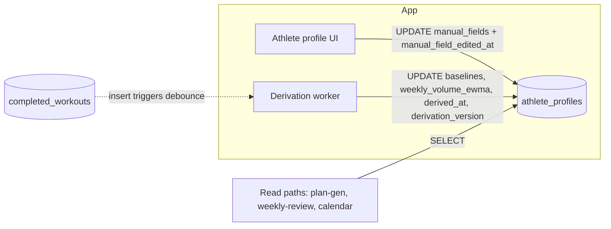

# Athlete Profile Schema — Implementation Plan

## Overview

Land the `athlete_profiles` table that holds per-athlete derived baselines (per-sport pace/HR/power, dominant sport, weekly-volume EWMA, confidence flags) and manual fields (age, weight, weekly hours available, target event), with per-field manual-edit timestamps so derivation never overwrites the athlete's own input. This is Unit 4 of the parent schema plan ([docs/plans/2026-05-02-002-feat-database-schema-plan.md](2026-05-02-002-feat-database-schema-plan.md)) and is a prerequisite for Phase B work on plans, planned/completed workouts, and weekly reviews — every athlete-data unit downstream reads baselines or manual fields.

Scope is one migration (`supabase/migrations/0004_athlete_profiles.sql`), one Zod/TS module (`packages/shared/src/athlete-profile.ts`), and the test coverage that proves the invariants. RLS in this unit is athlete-self only; coach-side read access lands in Unit 8 of the parent plan as a consolidated RLS pass.

## Problem Frame

See origin: [docs/brainstorms/2026-05-02-database-schema-requirements.md](../brainstorms/2026-05-02-database-schema-requirements.md), requirements R4–R6.

The athlete profile is two intermixed surfaces with different sources of truth:

- **Baselines** are derived by the app from completed workouts. They re-compute whenever new completion data lands. They are authoritative for things the athlete has not manually entered.
- **Manual fields** are the athlete's own input (age, weight, weekly hours, target event). They must persist across recomputes — derivation never overwrites an athlete-entered value. Each field carries its own timestamp so a future derivation pass can decide whether a stale manual value should be re-asked rather than blindly overridden.

R6 adds an idempotency requirement: recompute is triggered by completed-workout inserts, debounced per athlete. This plan only owns the storage surface (the timestamp columns and JSONB shapes the derivation logic relies on); the debounce mechanism itself is application-layer work scheduled under product plan Unit 2.3.

## Requirements Trace

- **R4** — `athlete_profiles` is 1:1 with `users` and holds both derived baselines (per-sport pace/HR/power, weekly volume EWMA, dominant sport, confidence flag) and manual fields (age, weight, hours available, target event metadata). Satisfied by the table schema in Unit A.
- **R5** — Manual fields persist across recomputes; each manually-edited field is independently timestamped. Satisfied at the storage layer by the `manual_field_edited_at JSONB` parallel column in Unit A and the Zod contract in Unit B. The "derivation never overwrites manual" invariant itself is enforced in app code (product plan Unit 2.3); this plan does not — and cannot from the schema alone — verify the invariant holds at runtime.
- **R6** — Recompute is idempotent. Satisfied here by `derived_at TIMESTAMPTZ`; the app's debounce key is `(user_id, latest_completed_at)`. The trigger/debounce logic itself is out of scope (product plan Unit 2.3).

## Scope Boundaries

- The derivation function itself is **not** in this plan. We only land the storage surface it will read and write. Derivation logic lands in product plan Unit 2.3.
- The trigger (or queue subscription) that fires recompute on `completed_workouts` insert is **not** in this plan — `completed_workouts` does not exist yet (parent plan Unit 6). Wiring the trigger lands when that table does.
- Coach-side RLS on `athlete_profiles` is **not** in this plan. The parent plan consolidates all coach-side RLS into Unit 8 to avoid touching every athlete-data table twice. This unit ships only the athlete-self policies; Unit 8 will `ALTER POLICY` / add a coach policy without altering schema.
- No new extensions, materialized views, generated columns, or computed indexes.
- No realtime publication membership — profile rows change rarely enough that on-demand fetch is sufficient, and the data is mildly sensitive (age/weight) so opting out by default is the right posture.

### Deferred to Separate Tasks

- **Vitest test-runner bootstrap** (parent plan Unit 1 backfill): `apps/web` has no test runner installed today. The test file in Unit C is fully designed but cannot execute until vitest lands. See Dependencies / Prerequisites.
- **Per-table Zod modules for already-shipped tables** (`users`, `entitlements`, `strava_tokens`, `strava_raw_payloads`): also Unit 1 backfill — flagged in the earlier status review, not included here to keep this PR scoped to Unit 4.

## Context & Research

### Relevant Code and Patterns

- [supabase/migrations/0001_users_and_entitlements.sql](../../supabase/migrations/0001_users_and_entitlements.sql) — the canonical pattern for this repo: `CREATE TABLE` → indexes → `touch_updated_at` trigger → `ENABLE ROW LEVEL SECURITY` → self-select / self-update policies. Reuse `public.touch_updated_at()` (already defined there) rather than redefining.
- [supabase/migrations/0002_strava_infra.sql](../../supabase/migrations/0002_strava_infra.sql) — example of a 1:1-with-users table (`strava_tokens` uses `user_id UUID PRIMARY KEY REFERENCES public.users(id) ON DELETE CASCADE`). `athlete_profiles` follows the same PK shape.
- [supabase/migrations/0003_security_hardening.sql](../../supabase/migrations/0003_security_hardening.sql) — confirms the `SECURITY DEFINER SET search_path = public` posture for any function added in a migration.
- [docs/solutions/migration-conventions.md](../solutions/migration-conventions.md) — naming/numbering rules (next slot is `0004_*.sql`), TIMESTAMPTZ-UTC convention, soft-delete policy (does NOT apply here — profile is 1:1 with users and follows the FK cascade).
- [packages/shared/src/index.ts](../../packages/shared/src/index.ts) — currently an empty barrel; this unit adds `athlete-profile.ts` and wires its export through. Zod 3.23 is already a dependency of `@da2/shared`.
- [AGENTS.md](../../AGENTS.md) — RLS posture ("RLS is the primary authorization defense"), repo-relative-path rule, "Athlete timezone lives on `public.users.timezone`" (the brainstorm R34 said `athlete_profiles`; implementation chose `users` and AGENTS.md is now the source of truth — do NOT add a `timezone` column to `athlete_profiles`).

### Institutional Learnings

- `docs/solutions/migration-conventions.md` already encodes the testing posture: positive + negative RLS tests are required for every user-data table before its defining migration ships. This unit honors that.
- No `athlete_profiles`-specific solution exists yet. After this lands, no new solutions doc is required — the patterns this unit uses are already documented. A solutions entry should only follow if a surprising decision emerges during implementation (e.g., a JSONB constraint pattern worth reusing).

### External References

External research deliberately skipped — local patterns are strong (three prior migrations, established `touch_updated_at` helper, RLS convention) and the topic is not high-risk (no auth/payments/external API exposure in this unit).

## Key Technical Decisions

- **Migration filename: `0004_athlete_profiles.sql`**, not `0003_*` as the parent plan said. `0003` was consumed by the security-hardening migration (Wave-1 review residual). Parent plan numbering shifts +1 from this point onward; this unit captures the corrected number and the parent plan should be updated as units land.
- **Primary key is `user_id UUID PRIMARY KEY REFERENCES public.users(id) ON DELETE CASCADE`** — 1:1 with users, no separate `id` column. Matches the `strava_tokens` shape.
- **No `deleted_at` column.** Profile rows do not get soft-deleted in normal user flow; account deletion cascades via the FK. Listing `athlete_profiles` in `delete_user_cascade` (parent plan Unit 10) is therefore unnecessary — the FK cascade handles it. Document the omission as an explicit comment in the migration so the Unit-10 audit doesn't flag it as a missing entry.
- **Three separate JSONB columns**, not one combined blob, because they have different write semantics: `baselines` (derivation-owned), `manual_fields` (athlete-owned), `manual_field_edited_at` (parallel timestamps, app-maintained in lockstep with `manual_fields`). Mixing them would make the "derivation must not touch manual" invariant harder to enforce in app code and harder to assert in tests.
- **`weekly_volume_ewma` is its own JSONB column**, not nested under `baselines`. Two reasons: it changes every recompute (where individual baselines can be sticky), and downstream queries (weekly review narrative, plan generation) read it independently. Parent plan sketch already separated it; honoring that.
- **`derived_at TIMESTAMPTZ NULL`** records the last successful derivation. NULL on initial insert (athlete signed up, no completed workouts yet — sparse-data case from R5). The confidence flag inside `baselines` covers "I have baselines but they are weak."
- **No `derivation_version` column.** Earlier draft had `derivation_version SMALLINT NOT NULL DEFAULT 1` for forward-compatibility, but YAGNI: no derivation function exists, no second version is planned, and adding the column later via `ALTER TABLE ADD COLUMN ... DEFAULT 1` in the same migration that introduces the derivation worker is just as cheap. Reintroduce only when a concrete need lands (e.g., the first commit of product plan Unit 2.3 needs to discriminate versions).
- **No CHECK constraint validating JSONB *shape* inside Postgres.** Zod at the API boundary is the authority for shape; Postgres CHECK on full JSONB structure is fragile (re-runs on every UPDATE, has to stay in sync with two other sources).
- **Hand-authored Zod, no codegen.** Per [AGENTS.md](../../AGENTS.md), this repo deliberately has no codegen step — types in `packages/shared` are hand-authored and reviewed against migrations. Tools like `drizzle-zod` or `supabase gen types typescript` were not considered because the convention is already settled at the repo level. (A future TS drift checker, called out in `docs/solutions/migration-conventions.md`, may compare generated `database.types.ts` to hand-authored shapes for verification — but generation is not the source of truth.)
- **RLS: athlete-self SELECT / UPDATE / INSERT, no DELETE policy.** Insert happens via app code after first sign-in (the `handle_new_auth_user` trigger does not auto-create profiles — first-time access to a profile-aware endpoint upserts the row). DELETE is reserved for the account-deletion cascade.
- **Realtime publication: excluded, and the guard against accidental inclusion is more than a comment.** Migrations 0001–0003 only have *comments* documenting the exclusion — comments don't prevent a future migration from running `ALTER PUBLICATION supabase_realtime ADD TABLE athlete_profiles`. This unit keeps the comment pattern for consistency but also opens a follow-up task to add a CI check that asserts the publication's table set matches an allow-list defined in repo. Tracked as part of the follow-up issue this plan opens (see Dependencies / Prerequisites).
- **`updated_at TIMESTAMPTZ`** + the existing `touch_updated_at` trigger. Same shape as `users` and `entitlements`.

## Open Questions

### Resolved During Planning

- *Should timezone go on `athlete_profiles`?* — No. Brainstorm R34 said `athlete_profiles`, implementation already shipped it on `public.users`, AGENTS.md is the source of truth. Do not duplicate.
- *Soft-delete?* — No. FK cascade is sufficient.
- *Combined JSONB or separate?* — Separate (see Key Technical Decisions).
- *Realtime?* — No.
- *Migration number?* — `0004`.
- *Coach RLS in this unit?* — No, deferred to parent plan Unit 8.

### Deferred to Implementation

- **Final JSONB shape for `baselines`.** Locked at the top level (`per_sport`, `dominant_sport`, `confidence`) but the exact inner structure per sport (which zones, which units for power vs pace vs HR) converges with the derivation function in product plan Unit 2.3. The Zod schema written in Unit B reserves the top-level shape with permissive inner fields (`z.object({...}).passthrough()` for the per-sport blob) and is tightened once derivation lands. `confidence` *is* pinned now as `z.enum(["low","med","high"])` even though the inner per-sport shape stays loose — three buckets are unlikely to change.
- **Final JSONB shape for `manual_fields`.** Same approach — fix the four documented top-level keys (`age`, `weight_kg`, `weekly_hours_avail`, `target_event`) and leave the `target_event` sub-shape loose until product plan Unit 2.3 settles event metadata.
- **`weekly_volume_ewma.total_min` semantics.** Decision now: `total_min` is a **derived sum** of `run_min + bike_min + swim_min` (and any other per-sport rolls), written by the derivation worker in the same pass. The Zod schema documents this with a one-line comment but does not enforce the invariant — derivation owns it. The motivation for storing it (rather than re-summing on read) is that downstream callers want a single field to sort/threshold against.
- **Whether `manual_field_edited_at` is a flat `{field_name: timestamp}` map or a nested mirror of `manual_fields`.** Default to flat, top-level only, because nested target-event fields aren't independently edited in v1 (the athlete edits the whole event blob). Revisit if the UI grows per-sub-field editing.

### `manual_fields` ↔ `manual_field_edited_at` lockstep — explicit risk, decision deferred

The schema does not enforce that `manual_fields` and `manual_field_edited_at` stay in sync. App code is expected to write both together; bugs there will silently rot the R5 invariant. Three options for tightening:

1. **Status quo (app discipline + code review).** Cheapest. Riskiest. Fails silently if the code-review eye misses it.
2. **Trigger that auto-stamps `manual_field_edited_at` whenever a top-level key of `manual_fields` changes.** Moves the invariant into the DB; one trigger function comparing OLD vs NEW jsonb at the top level. Cheap to write, makes app code simpler (callers stop touching `manual_field_edited_at` directly). Risk: derivation must NOT touch `manual_fields`, but if it ever does (bug), the trigger would also rewrite the timestamps — which is actually fine, because the timestamp on a buggy overwrite is still informative.
3. **CHECK constraint asserting `manual_field_edited_at` key set ⊇ `manual_fields` key set.** Catches drift at insert/update time. Distinct from the rejected JSONB-shape CHECK because key-set membership is far more stable than value structure.

This plan ships option (1) by default to keep Unit 4 narrow, but explicitly opens (2) and (3) as alternatives. Decision should land before product plan Unit 2.3 starts writing derivation — track in the follow-up issue this plan opens.

## High-Level Technical Design

> *This illustrates the intended approach and is directional guidance for review, not implementation specification. The implementing agent should treat it as context, not code to reproduce.*

### Table sketch

```
athlete_profiles
  user_id UUID PK REFERENCES public.users(id) ON DELETE CASCADE
  baselines JSONB NOT NULL DEFAULT '{}'::jsonb
     -- { per_sport: { run|bike|swim|...: {...} }, dominant_sport, confidence: 'low'|'med'|'high' }
  weekly_volume_ewma JSONB NOT NULL DEFAULT '{}'::jsonb
     -- { run_min, bike_min, swim_min, total_min, half_life_days }
  manual_fields JSONB NOT NULL DEFAULT '{}'::jsonb
     -- { age, weight_kg, weekly_hours_avail, target_event: { type, date, distance_m, notes } }
  manual_field_edited_at JSONB NOT NULL DEFAULT '{}'::jsonb
     -- { age: '2026-05-12T...', weight_kg: '...', ... }  (flat map of top-level keys → ISO timestamp)
  derived_at TIMESTAMPTZ NULL
  created_at TIMESTAMPTZ NOT NULL DEFAULT now()
  updated_at TIMESTAMPTZ NOT NULL DEFAULT now()
```

### Read/write surfaces (informational, not implemented in this plan)



The derivation worker writes only to derivation-owned columns; the profile UI writes only to athlete-owned columns. The schema does not enforce this split (Postgres has no column-level GRANT distinction between these two app roles when both use the same JWT path); the test in Unit C and a code-review checklist enforce it instead.

## Implementation Units

- [ ] **Unit A: Migration `0004_athlete_profiles.sql`**

**Goal:** Create the `athlete_profiles` table with all columns, indexes, trigger, and athlete-self RLS policies.

**Requirements:** R4, R5, R6 (storage surface only).

**Dependencies:** Migration `0001_users_and_entitlements.sql` (depends on `public.users` and `public.touch_updated_at`). No dependency on `completed_workouts` — derivation wiring is out of scope.

**Files:**
- Create: `supabase/migrations/0004_athlete_profiles.sql`

**Approach:**
- `CREATE TABLE public.athlete_profiles` with the columns listed in High-Level Technical Design.
- Attach a `BEFORE UPDATE` trigger to call the existing `public.touch_updated_at()` function (matches the pattern in 0001).
- `ALTER TABLE public.athlete_profiles ENABLE ROW LEVEL SECURITY`.
- Three policies:
  - `athlete_profiles_self_select` — `FOR SELECT USING (auth.uid() = user_id)`.
  - `athlete_profiles_self_insert` — `FOR INSERT WITH CHECK (auth.uid() = user_id)`.
  - `athlete_profiles_self_update` — `FOR UPDATE USING (auth.uid() = user_id) WITH CHECK (auth.uid() = user_id)`.
- No DELETE policy (account-deletion cascade handles it via the FK).
- Comment at the top noting:
  - Coach-side RLS is added later in parent plan Unit 8 (consolidated coach RLS pass).
  - Deliberately excluded from `supabase_realtime` (mildly sensitive data + low change rate).
  - `athlete_profiles` is intentionally absent from any future `delete_user_cascade` body because FK cascade handles it; do NOT add it there.

**Patterns to follow:** [supabase/migrations/0001_users_and_entitlements.sql](../../supabase/migrations/0001_users_and_entitlements.sql) (RLS + trigger structure), [supabase/migrations/0002_strava_infra.sql](../../supabase/migrations/0002_strava_infra.sql) (1:1-with-users PK + realtime-exclusion comment).

**Test scenarios:** see Unit C — schema-level invariants are tested there once Unit 1 vitest infra exists. For this unit's standalone verification: applying the migration against a clean Postgres succeeds with no warnings, and `\d public.athlete_profiles` in `psql` shows the expected columns, indexes, trigger, and RLS-enabled flag.

**Verification:**
- `supabase db reset` (or equivalent CI step) applies the migration cleanly.
- `pg_dump --schema-only` of the resulting DB shows the table, the `touch_updated_at` trigger attached, and `rowsecurity = true` for `public.athlete_profiles`.

---

- [ ] **Unit B: Shared Zod / TS module `packages/shared/src/athlete-profile.ts`**

**Goal:** Hand-authored Zod schemas + inferred TS types for the table row and the two JSONB blobs, wired into the shared barrel.

**Requirements:** R4, R5 (typed contract for the manual-fields + edited-at surface so app code maintains them in lockstep).

**Dependencies:** Unit A's migration (so the contract has a real table behind it).

**Files:**
- Create: `packages/shared/src/athlete-profile.ts`
- Modify: `packages/shared/src/index.ts` (re-export `athlete-profile` symbols)

**Approach:**
- Export these schemas:
  - `BaselinesSchema` — top-level `per_sport` (permissive `z.record(z.unknown())` for per-sport inner content; tighten in product plan Unit 2.3 when derivation lands), `dominant_sport: z.enum(["run","bike","swim","other"]).optional()`, `confidence: z.enum(["low","med","high"]).optional()`. The two enums are pinned now even though the inner per-sport blob stays loose — three confidence buckets and the small sport vocabulary are unlikely to churn.
  - `WeeklyVolumeEwmaSchema` — `run_min`, `bike_min`, `swim_min`, `total_min`, `half_life_days` all optional numeric. **Comment in code that `total_min` is a derived sum** maintained by the derivation worker, not independent — the Zod schema does not enforce the invariant.
  - `ManualFieldsSchema` — `age` (int, optional), `weight_kg` (number, optional), `weekly_hours_avail` (number, optional), `target_event` (object: `type`, `date`, `distance_m`, `notes` — all optional, permissive inner shape).
  - `ManualFieldEditedAtSchema` — `z.record(z.string().datetime())` keyed on the top-level manual-field keys.
  - `AthleteProfileRowSchema` — full row shape (matches the table columns), composing the above.
  - Inferred TS types (`AthleteProfileRow`, `Baselines`, `ManualFields`, etc.) via `z.infer`.
- Each schema gets a one-line comment pointing to the originating requirement (R4 / R5) so future readers know why the shape exists.
- Update the barrel to `export * from "./athlete-profile";`.

**Patterns to follow:** None established yet (the barrel is empty). This unit sets the pattern that subsequent table-family modules (`users.ts`, `entitlement.ts`, etc., shipped under the Unit 1 backfill) will follow: one file per logical table, named exports for schema + inferred type, the row schema named `<EntityName>RowSchema`.

**Test scenarios:**
- *Happy path*: `AthleteProfileRowSchema.parse(...)` accepts a fully-populated row matching what migration 0004 would produce.
- *Happy path*: `ManualFieldsSchema.parse({})` accepts an empty manual fields blob (sparse-data athlete).
- *Edge case*: `ManualFieldEditedAtSchema.parse({ age: "2026-05-12T10:00:00Z" })` accepts a valid ISO timestamp; `parse({ age: "not a date" })` rejects.
- *Edge case*: `BaselinesSchema.parse({ confidence: "bogus" })` rejects. Same for `dominant_sport: "rowing"`. The inner per-sport blob stays permissive in v1.

**Execution note:** Tests for this unit are pure schema-validation; they do not need a Postgres connection and can run under vitest as soon as it lands. They are designed alongside this unit but live in Unit C's file so the test file enumeration stays one-place.

**Verification:**
- `pnpm --filter @da2/shared typecheck` passes.
- `pnpm --filter @da2/web typecheck` still passes (shared barrel still re-exports cleanly).

---

- [ ] **Unit C: Test coverage `apps/web/src/db/__tests__/athlete-profile.test.ts`**

**Goal:** Cover the schema's invariants and the Zod contract with vitest, exercising RLS against a real Postgres.

**Requirements:** Verification surface for R4, R5; RLS posture for the new table.

**Dependencies:**
- Unit A and Unit B (already merged in the prior PR).
- **Parent plan Unit 1 vitest infrastructure** (`apps/web/src/db/__tests__/setup.ts`, vitest installed in `apps/web`, CI job that spins up Postgres and applies migrations). Does not exist today; this Unit ships in its own follow-up PR once that infrastructure lands. Tracked in the issue this plan opens at merge time.

**Files:**
- Create: `apps/web/src/db/__tests__/athlete-profile.test.ts`

**Approach:**
- Two-actor pattern (already proposed in the parent plan): create two test users via the Supabase test helper, sign in as each, issue queries through the JWT-bound supabase-js client, and assert row visibility.
- Run each test inside a transaction that the harness rolls back at the end (per `docs/solutions/migration-conventions.md`).
- For pure Zod tests (the four test scenarios listed under Unit B above), no DB needed — they can live in the same file under their own `describe` block, or be split to `packages/shared/src/__tests__/athlete-profile.test.ts` if the implementer prefers co-location with the schema. Either is acceptable.

**Patterns to follow:** None yet — this is the first DB test file in the repo. The implementer should keep helpers minimal and let the parent plan Unit 1 backfill extract any reusable test fixture.

**Test scenarios:**
- *Happy path*: `INSERT INTO athlete_profiles (user_id, manual_fields) VALUES ($self, '{"age":34,"weight_kg":72}')` succeeds → `SELECT * FROM athlete_profiles` from the same JWT returns one row with the expected JSONB values intact.
- *Happy path*: Insert profile with `baselines = '{}'`, `derived_at = NULL` (sparse-data athlete from R5) — row inserts cleanly, `confidence` absence is allowed.
- *Edge case (R5 — schema-level only)*: Two-step sequence — (1) athlete UPDATEs `manual_fields` and `manual_field_edited_at` for `age`, (2) a derivation-style UPDATE writes only `baselines` + `derived_at`. After step 2, `manual_fields.age` and `manual_field_edited_at.age` are byte-identical to step 1. **This proves the schema *permits* the R5 invariant — it does not prove R5 holds at runtime.** Runtime enforcement is an app-layer guard in product plan Unit 2.3; the corresponding regression test (a deliberately-bad derivation UPDATE that the guard must reject) belongs there, not here.
- *Edge case*: Inserting two `athlete_profiles` rows for the same `user_id` raises a primary-key violation (the 1:1 invariant).
- *Edge case*: `updated_at` advances on UPDATE (proves the `touch_updated_at` trigger is wired).
- *Edge case (first-touch race)*: Two concurrent `INSERT ... ON CONFLICT (user_id) DO NOTHING` for the same user — exactly one row exists, no error surfaces. Proves the upsert pattern (see System-Wide Impact) is safe.
- *Integration (RLS positive)*: Signed in as user A, `SELECT * FROM athlete_profiles` returns A's row.
- *Integration (RLS negative)*: Signed in as user A, `SELECT * FROM athlete_profiles WHERE user_id = $userB_id` returns zero rows. UPDATE / INSERT targeting user B's id is rejected by RLS.
- *Integration (cascade) — load-bearing*: Deleting user A from `public.users` (or `auth.users`) removes user A's `athlete_profiles` row via FK cascade. This test is the contract that lets `athlete_profiles` be omitted from the future `delete_user_cascade` function in parent plan Unit 10 — if this test ever needs to be deleted or relaxed, that omission is no longer safe and the Unit 10 function must add `athlete_profiles` to its delete list.
- *Zod (happy path)*: `AthleteProfileRowSchema.parse` round-trips a fully populated row.
- *Zod (edge)*: `ManualFieldEditedAtSchema` rejects a non-ISO timestamp; `BaselinesSchema` rejects `confidence: "bogus"`.

**Verification:**
- `pnpm --filter @da2/web test athlete-profile` (or the equivalent vitest invocation once the runner lands) runs ≥9 scenarios, all green.
- CI step that applies migrations + runs vitest reports the new file with full pass.

## System-Wide Impact

- **Interaction graph:** No code paths read `athlete_profiles` today. The first readers will be product plan Unit 2.3 (derivation) and Unit 3.x (plan generation). Adding the table is invisible until those wire up.
- **First-touch race — explicit guidance for the Unit 2.3 implementer:** The PK is `user_id`, RLS allows the athlete to INSERT their own row, and there is no auto-create trigger. Two concurrent requests from the same athlete (e.g., mobile + web open simultaneously) can both attempt the initial INSERT and one will hit `23505`. The first-touch endpoint MUST upsert: `INSERT INTO athlete_profiles (user_id, ...) VALUES (...) ON CONFLICT (user_id) DO NOTHING` (or `DO UPDATE SET ...` if first-touch carries data). The naive `INSERT` without `ON CONFLICT` will intermittently 5xx. Unit C's first-touch-race test pins this.
- **Error propagation:** Schema-constraint violations surface as supabase-js errors with Postgres error codes (`23505` for PK duplication, `42501` for RLS denial). Route handlers that eventually touch this table must translate them to user-facing errors at the API boundary (parent plan System-Wide Impact already covers this).
- **State lifecycle risks:** The "derivation never overwrites manual" invariant lives in app code, not SQL. If the derivation function (product plan Unit 2.3) is implemented carelessly, a bug there can blow away the athlete's edits. Unit C's R5 test only verifies the storage surface *permits* the invariant; runtime enforcement (and the regression test for a bad-derivation UPDATE) belongs to Unit 2.3.
- **API surface parity:** No API endpoints yet. When `/api/me/profile` lands (product plan Unit 2.3), it must validate both reads and writes against `AthleteProfileRowSchema` / `ManualFieldsSchema` from this unit.
- **Integration coverage:** RLS positive + negative tests (Unit C) are the safety net. The cascade test (now promoted to load-bearing — see Unit C) pins the contract that allows Unit 10 to omit `athlete_profiles` from `delete_user_cascade`.
- **Pattern-setting ordering risk:** Unit B is the *first* per-table module under `packages/shared/src/` and effectively sets the convention (one file per table family, `<Entity>RowSchema` naming, barrel re-export). Parent plan Unit 1 backfill is the correct place to *lock* that convention across all already-shipped tables (`users`, `entitlements`, `strava_tokens`, `strava_raw_payloads`). If Unit 1 backfill later picks a different convention (e.g., a single `tables.ts` mega-module, or schemas co-located with route handlers), `athlete-profile.ts` will need to be rewritten to match. This is acceptable — the migration and Zod logic are decoupled — but the implementer of Unit B should know they are setting, not following, the pattern.
- **Unchanged invariants:** `public.users.timezone` remains the timezone source of truth — this unit does NOT add a duplicate column on `athlete_profiles`. `public.touch_updated_at()` is reused, not redefined. The existing migration ordering, RLS conventions, and realtime-opt-in posture are unchanged.

## Risks & Dependencies

| Risk | Mitigation |
|---|---|
| Test coverage cannot run until vitest infrastructure lands (parent plan Unit 1 backfill is owed). | **Decision:** Unit A + Unit B ship in this PR with manual `supabase db reset` + `psql` verification; Unit C lands in a follow-up PR tracked by a dedicated issue opened at merge time. See Dependencies / Prerequisites. |
| `manual_fields` ↔ `manual_field_edited_at` drift (R5 invariant rots silently). | This plan ships with no enforcement (option 1 in Open Questions). The two stronger options (auto-stamping trigger, key-set CHECK) are documented and tracked in the follow-up issue. Decision must land before product plan Unit 2.3 starts writing derivation. |
| Future migration silently adds `athlete_profiles` to `supabase_realtime` publication (comments don't prevent it). | Comment in this migration matches the 0001/0002 pattern; tracked follow-up adds a CI check that asserts publication membership equals a repo allow-list. |
| JSONB shape drift between Zod schemas (Unit B) and what derivation actually writes (product plan Unit 2.3). | Keep top-level keys locked here (`per_sport`, `dominant_sport`, `confidence`, etc.); leave inner sub-objects permissive until derivation lands; tighten Zod via review when Unit 2.3's PR ships. The eval harness in product plan Unit 3.1 validates downstream usage against `packages/shared` schemas. |
| Forgetting `athlete_profiles` is intentionally absent from `delete_user_cascade` (parent plan Unit 10) and "fixing" it later → double-delete or function complexity. | Migration comment in Unit A states the FK cascade is intentional; the Unit-10 CI audit (parent plan) needs to know to exclude tables with `ON DELETE CASCADE` from `users.id`. If that audit is rigid, relax the audit, not this design. |
| Account-deletion cascade test (Unit C integration scenario) inadvertently constrains FK behaviour in a way that breaks once `delete_user_cascade` exists. | Treat the cascade test as documentation of the current behaviour, not a forever-contract. When Unit 10 lands, update or move the assertion. |
| Coach RLS deferred to Unit 8 → if a coach-facing endpoint is built before Unit 8 ships, it silently sees no rows. | Document the deferral in the migration comment and in the parent plan checklist; coach-facing endpoints in the product plan are sequenced after Unit 8 anyway. |

## Dependencies / Prerequisites

- **Migrations 0001 + 0002 + 0003** — already shipped. No further DB prerequisites.
- **vitest in `apps/web` — decision:** Unit A + Unit B ship in **this** PR with manual `supabase db reset` + `psql` verification noted in the PR body. Unit C ships in a **follow-up PR** once parent plan Unit 1 backfills the vitest infrastructure. Bundling vitest into this PR was considered and rejected: it would cross the Unit 1 boundary (four+ extra files, a CI job change, a test-bootstrap helper) and risk obscuring the schema review under a tooling diff. To prevent Unit C from getting lost, **this plan opens a tracking issue** at the same time it merges, covering: (i) vitest install + bootstrap, (ii) the Unit C test file as drafted here, (iii) per-table Zod modules for already-shipped tables (`users`, `entitlements`, `strava_tokens`, `strava_raw_payloads`), and (iv) a CI check that asserts `supabase_realtime` publication membership matches a repo allow-list.
- **Today's date `2026-05-12`** — confirm migration timestamping conventions in `docs/solutions/migration-conventions.md` are still current before authoring the migration.

## Documentation / Operational Notes

- Update the parent plan ([docs/plans/2026-05-02-002-feat-database-schema-plan.md](2026-05-02-002-feat-database-schema-plan.md)) Unit 4 entry to:
  - Tick the checkbox once this lands.
  - Note the migration number is `0004_*` (parent plan currently says `0003_athlete_profiles.sql`).
  - Note that subsequent Unit-5+ migrations all shift +1 from the originally planned numbers.
- No new `docs/solutions/*.md` required unless an implementation surprise emerges (parent plan calls for `docs/solutions/strava-webhook-dedup.md` and `docs/solutions/rls-coach-athlete.md` later — those still belong to their own units).
- No README updates required — the README does not currently describe the schema table-by-table.

## Sources & References

- **Origin document:** [docs/brainstorms/2026-05-02-database-schema-requirements.md](../brainstorms/2026-05-02-database-schema-requirements.md), R4–R6 and R34.
- **Parent plan:** [docs/plans/2026-05-02-002-feat-database-schema-plan.md](2026-05-02-002-feat-database-schema-plan.md), Unit 4.
- **Conventions:** [docs/solutions/migration-conventions.md](../solutions/migration-conventions.md), [AGENTS.md](../../AGENTS.md).
- **Prior migrations to mirror:** [supabase/migrations/0001_users_and_entitlements.sql](../../supabase/migrations/0001_users_and_entitlements.sql), [supabase/migrations/0002_strava_infra.sql](../../supabase/migrations/0002_strava_infra.sql), [supabase/migrations/0003_security_hardening.sql](../../supabase/migrations/0003_security_hardening.sql).
- No related PRs/issues yet — greenfield work.
