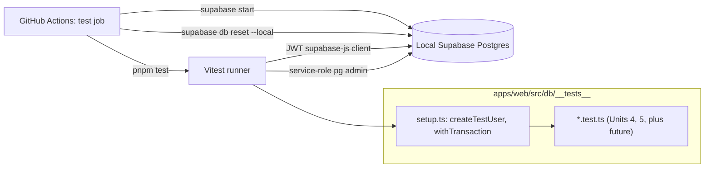

# Schema Foundation Backfill — Implementation Plan

## Overview

Discharge issue [#43](https://github.com/ryanssareen/daily-athlete/issues/43) — five infrastructure and cleanup items tied to schema-plan Unit 4 (athlete profile, [PR #41](https://github.com/ryanssareen/daily-athlete/pull/41)). Together they close out the foundation owed before parent schema-plan Unit 5 (`plans` + `planned_workouts`) and product-plan Unit 2.3 (athlete-profile derivation worker) can responsibly start.

Five items, sequenced by dependency:

1. **Vitest + DB test bootstrap** in `apps/web` — parent plan Unit 1 backfill. Gates everything else with tests.
2. **Per-table Zod modules** for the four already-shipped tables (`users`, `entitlements`, `strava_tokens`, `strava_raw_payloads`). Locks the convention set by `athlete-profile.ts`.
3. **Auto-stamping trigger** for `athlete_profiles.manual_field_edited_at` — migration `0005_*`. Moves the R5 lockstep invariant from "app discipline" into the database.
4. **Unit C tests** for `athlete_profiles` (RLS positive + negative + FK cascade + first-touch race). Test scenarios are already drafted in [docs/plans/2026-05-12-001-feat-athlete-profile-schema-plan.md](2026-05-12-001-feat-athlete-profile-schema-plan.md); this is the implementation.
5. **Realtime publication CI guard** — a vitest test asserting `supabase_realtime` membership matches a repo allow-list, plus an AGENTS.md pointer telling future contributors where the allow-list lives.

## Problem Frame

Unit 4 of the parent schema plan landed five separable cleanups onto the floor. Without them:

- No DB tests can run anywhere in the repo. Every subsequent unit (parent plan Units 5–10) would either ship without coverage or each carry its own bespoke test bootstrap.
- The R5 invariant ("manual fields persist; derivation never overwrites") relies on app discipline alone — exactly the kind of contract that rots silently in three months when a new derivation worker forgets the rule.
- The four shipped tables (`users`, `entitlements`, `strava_tokens`, `strava_raw_payloads`) have migrations but no Zod contracts in `packages/shared`. The athlete-profile module set a convention while it was fresh; that convention should be locked across all shipped tables before more land.
- Sensitive tables stay out of `supabase_realtime` by *comment only*. A future migration could silently add one and nothing would catch it.

The work is mostly tooling and conventions — low product-behavior risk, but high foundation-quality risk. Getting this wrong now would cost compounding effort later.

## Requirements Trace

This plan does not introduce new product requirements. It discharges existing commitments:

- **Parent plan Unit 1 backfill** — `apps/web/src/db/server.ts` (existing), `apps/web/src/db/__tests__/setup.ts` (Unit 1 here), per-table Zod modules under `packages/shared/src/` (Unit 2 here). The parent plan called for these as part of Unit 1; they were deferred when the focus shifted to landing schema units.
- **Schema brainstorm R5** — manual fields persist across recomputes; per-field edit timestamps maintained automatically. Unit 3 here moves enforcement into the DB so the invariant cannot rot at the app layer.
- **Schema brainstorm R34 / AGENTS.md** — sensitive tables stay out of realtime. Unit 5 here adds the CI guard.
- **Schema-plan Unit 4 Unit C (deferred)** — tests for `athlete_profiles`. Unit 4 here implements them against the new test infrastructure.

## Scope Boundaries

- No new tables. No changes to schema beyond the lockstep trigger migration.
- No mobile test infrastructure. `apps/mobile` keeps its current setup; testing there is a separate decision.
- No e2e tests, no Playwright, no UI testing. Vitest + Node + Postgres only.
- No reorganization of `packages/shared`. The barrel pattern stays; we add modules, not move them.
- No revision of the realtime allow-list to *include* additional tables — the allow-list starts empty (today's posture) and tables are added only by the migrations that need them.

### Deferred to Separate Tasks

- **Lint rule banning bare `.from("<table>")` for soft-deleted tables** (originally flagged in the parent plan's Risks section): out of scope here; tracked separately because it's an ESLint rule, not a Postgres concern.
- **Future TS drift checker** comparing `supabase gen types typescript` output to hand-authored shapes ([docs/solutions/migration-conventions.md](../solutions/migration-conventions.md)): defer until parent plan Unit 6+ ships and the surface is bigger.

## Context & Research

### Relevant Code and Patterns

- [supabase/migrations/0001_users_and_entitlements.sql](../../supabase/migrations/0001_users_and_entitlements.sql) — defines `public.touch_updated_at()` and the canonical RLS-policy structure that the lockstep trigger function should mirror in style (`SECURITY DEFINER SET search_path = public` pattern from [0003_security_hardening.sql](../../supabase/migrations/0003_security_hardening.sql)).
- [supabase/migrations/0004_athlete_profiles.sql](../../supabase/migrations/0004_athlete_profiles.sql) — the table Unit 3 attaches a trigger to. Already pins `manual_fields` and `manual_field_edited_at` as `JSONB NOT NULL DEFAULT '{}'::jsonb`.
- [packages/shared/src/athlete-profile.ts](../../packages/shared/src/athlete-profile.ts) — sets the per-table module convention Unit 2 follows: `<Entity>RowSchema`, sub-schemas per JSONB column, inferred `<Entity>Row` type.
- [.github/workflows/ci.yml](../../.github/workflows/ci.yml) — existing CI runs `pnpm install --frozen-lockfile=false` + typecheck + lint. Unit 1 adds a `test` job alongside.
- [docs/solutions/migration-conventions.md](../solutions/migration-conventions.md), "Testing" section — already describes the per-test transaction-rollback pattern and the positive+negative RLS rule. Unit 1 implements it; Unit 4 consumes it.
- [AGENTS.md](../../AGENTS.md) — RLS posture, realtime opt-in convention, repo-relative paths.

### Institutional Learnings

- [docs/solutions/migration-conventions.md](../solutions/migration-conventions.md) is the canonical reference. No other relevant solutions exist yet.

### External References

External research deliberately skipped — vitest setup with Supabase is well-trodden; the codebase has clear local patterns; no high-risk topic in this plan (no auth/payments/external API changes).

## Key Technical Decisions

- **Auto-stamping trigger for lockstep (decided with user).** A `BEFORE INSERT OR UPDATE` trigger on `athlete_profiles` rewrites `NEW.manual_field_edited_at` based on a key-by-key diff of `NEW.manual_fields` vs `OLD.manual_fields`. Authoritative DB-side enforcement: callers no longer write `manual_field_edited_at` directly. Considered and rejected: a key-set CHECK (catches drift at write time but doesn't auto-fill — leaves more work for callers) and status-quo app discipline (footgun; the kind of bug that surfaces in three months).
- **`supabase start` for the test Postgres**, in both local dev and CI. The repo already has [supabase/config.toml](../../supabase/config.toml); GitHub Actions `ubuntu-latest` has Docker; Supabase CLI keys for `supabase start` are deterministic so CI does not need new secrets. Considered and rejected: a GitHub Actions Postgres service container (less faithful to production posture — different default extensions, different `auth` schema setup).
- **Per-test transaction-rollback**, not per-test schema recreate. Faster, matches [docs/solutions/migration-conventions.md](../solutions/migration-conventions.md). Trade-off: tests cannot easily exercise commit-only behaviors (replication, advisory locks). Acceptable for the test surface in this plan.
- **JWT-bound supabase-js client as the primary test surface** (rather than direct PG queries via `pg` driver). This means tests exercise RLS exactly as production code does, with the same SDK and the same JWT-binding semantics. The `pg` driver is available as an escape hatch for setup/teardown that needs to run as service-role.
- **Realtime CI guard implemented as a vitest test**, not a shell script or pgTAP. Reuses Unit 1's test runner and Postgres bootstrap — no new tooling. Allow-list lives in repo as a typed constant, imported by the test.
- **Vitest in `packages/shared` too**, not just `apps/web`. Pure-Zod tests don't need a DB and shouldn't drag in `apps/web` overhead. Two vitest configs is acceptable; the version stays pinned in both.
- **BYTEA columns in Zod as `z.instanceof(Uint8Array)`.** Buffer satisfies Uint8Array. These columns (`strava_tokens.access_token_enc`, `refresh_token_enc`) are never deserialized client-side — the schema exists for row-contract completeness.
- **Allow-list starts empty.** No table is yet a member of `supabase_realtime`. Migrations that add membership do so by *also* updating the allow-list in the same PR; the CI guard catches divergence.
- **No mobile test runner in this plan.** Mobile testing (Detox, Maestro, Jest-Expo) is a separate decision deferred until product plan Unit 4.x calls for it.

## Open Questions

### Resolved During Planning

- *Lockstep enforcement mechanism?* — Auto-stamping trigger (Unit 3). User decision; see Key Technical Decisions.
- *Test runner?* — vitest, in both `apps/web` and `packages/shared`.
- *Postgres provisioning in CI?* — `supabase start` via the CLI.
- *Realtime guard mechanism?* — vitest test against the live publication.
- *BYTEA in Zod?* — `z.instanceof(Uint8Array)`.
- *Allow-list location?* — `supabase/realtime-allowlist.ts` exported as a typed const.
- *`entitlement_key` shape?* — `z.string()` with a doc comment listing currently-known keys. Closed enum is premature; we don't have a v1 list yet.

### Deferred to Implementation

- **Per-test BEGIN/ROLLBACK transaction wrapping** — Unit 1 (this plan) substituted track-and-cleanup via the Supabase admin API. Reason: supabase-js routes every query through a separate PostgREST HTTP call, so no DB transaction can span multiple SDK calls. The substitute provides equivalent test isolation (auth.users → public.users → athlete-data cascade handles teardown) but failures surface via `console.warn` rather than implicit rollback. Documented in `apps/web/src/db/__tests__/setup.ts`.
- **Exact trigger function name.** The trigger and its companion function will live in the migration; pick a clear name (`athlete_profiles_stamp_manual_edits` or similar) during implementation.
- **Whether the trigger also handles full-row replacement** (`UPDATE ... SET manual_fields = $new_blob`). Default behavior: any top-level key whose value changes (or is added, or is removed) gets its timestamp updated (or removed). The migration test scenarios pin this; refine if real callers find an awkward edge.
- **CI cache strategy** for `supabase start`. If Docker pull becomes the slowest CI step, add a step that caches the Supabase Docker image. Defer until measured.
- **Whether to use Vitest's pool option `forks` vs `threads`** for DB tests. Default `forks` (fresh process per test file) is safer when DB connections aren't carefully scoped; switch to `threads` only if cold-start becomes a bottleneck.

## High-Level Technical Design

> *This illustrates the intended approach and is directional guidance for review, not implementation specification. The implementing agent should treat it as context, not code to reproduce.*

### Lockstep trigger semantics (Unit 3)

```
BEFORE INSERT OR UPDATE ON athlete_profiles
FOR EACH ROW EXECUTE FUNCTION stamp_manual_edits()

stamp_manual_edits():
  if OLD is NULL:                           -- INSERT
    for each top-level key in NEW.manual_fields:
      NEW.manual_field_edited_at[key] := now()::text
  else:                                     -- UPDATE
    if NEW.manual_fields IS DISTINCT FROM OLD.manual_fields:
      let added_or_changed = keys in NEW where NEW[key] IS DISTINCT FROM OLD[key]
      let removed = keys in OLD missing from NEW
      for each key in added_or_changed:
        NEW.manual_field_edited_at[key] := now()::text
      for each key in removed:
        NEW.manual_field_edited_at := NEW.manual_field_edited_at - key
  return NEW
```

Key semantics decisions encoded above:

- **Authoritative.** Trigger always wins; callers should never write `manual_field_edited_at` directly. Migration comment + test scenario assert this.
- **No-op update is a no-op.** Setting `manual_fields` to its existing value does not update timestamps. (`IS DISTINCT FROM` short-circuits.)
- **Removed keys lose their timestamp.** If the athlete clears `weight_kg`, the `weight_kg` entry in `manual_field_edited_at` is also removed.
- **Derivation-only writes are no-ops.** `UPDATE ... SET baselines = ..., derived_at = ...` does not touch `manual_fields`, so the trigger runs but makes no changes.

### Test infrastructure shape (Unit 1)



## Implementation Units

- [x] **Unit 1: Vitest + DB test bootstrap in `apps/web`**

**Goal:** Stand up the test runner, the Postgres bootstrap helpers, the test-user / JWT-client factory, and the CI job that runs all of it. Prove it with one smoke test.

**Requirements:** Parent plan Unit 1 backfill.

**Dependencies:** None — runs first.

**Files:**
- Create: `apps/web/vitest.config.ts`
- Create: `apps/web/src/db/__tests__/setup.ts`
- Create: `apps/web/src/db/__tests__/smoke.test.ts`
- Modify: `apps/web/package.json` (vitest dev deps, `test` script)
- Modify: `.github/workflows/ci.yml` (new `test` job that runs `supabase start`, applies migrations, runs vitest)
- Modify: `pnpm-lock.yaml` (vitest install)

**Approach:**
- Vitest pinned to a recent stable line (1.x or 2.x — pick latest at implementation time). Node test environment; no jsdom; pool `forks` by default.
- `setup.ts` exports `createTestUser(opts?)` and `signInAs(user)` returning a JWT-bound `@supabase/supabase-js` client. Uses the Supabase CLI's deterministic local-dev `anon` and `service_role` keys; reads them from environment variables that the CI step exports after `supabase start`.
- Service-role client is the escape hatch for test setup/teardown (creating `auth.users` rows, asserting cross-user invariants).
- Per-test transaction rollback: each `it()` wraps its DB work in `BEGIN ... ROLLBACK`. The helper that does this returns the JWT client and accepts an inner async function.
- The CI step adds `supabase` to the runner (via the official setup-cli action or by installing the binary), runs `supabase start`, captures the printed JWT secrets into the job env, then `pnpm install` and `pnpm --filter @da2/web test`.
- Smoke test asserts the harness works: `createTestUser()` returns a JWT client, `select auth.uid()` matches the user's id, a row inserted in one transaction is invisible in the next test.

**Patterns to follow:** [docs/solutions/migration-conventions.md](../solutions/migration-conventions.md) "Testing" section (transaction rollback pattern).

**Test scenarios:**
- *Happy path:* `pnpm --filter @da2/web test` runs the smoke test and passes locally and in CI.
- *Happy path:* `createTestUser()` mirrors into `public.users` (the existing `handle_new_auth_user` trigger fires).
- *Happy path:* a JWT-bound `supabase.from("users").select("*")` returns exactly the caller's row (RLS still in play, sanity-checks Unit 1 didn't break it).
- *Edge case:* two `createTestUser()` calls return distinct ids; a query as user A on user B's id returns zero rows.
- *Edge case:* transaction-rollback: insert in `it("A")` is invisible in `it("B")`.
- *Integration:* one full migration apply via `supabase db reset` precedes the test run; CI logs show all four shipped migrations applied (and after Units 3/5 land, the new migration too).

**Verification:**
- New CI job appears on PR checks named "Test (apps/web)" or similar.
- `pnpm --filter @da2/web test` works locally given `supabase start` is running.
- The smoke test file is the floor for every subsequent DB test in the repo.

---

- [ ] **Unit 2: Per-table Zod modules for already-shipped tables**

**Goal:** Add Zod schemas and inferred TS types for `users`, `entitlements`, `strava_tokens`, `strava_raw_payloads`, mirroring the convention set by `athlete-profile.ts`. Lock the per-table pattern across `packages/shared`.

**Requirements:** Parent plan Unit 1 backfill (Zod contracts for shipped tables).

**Dependencies:** None blocking, but should land before parent plan Unit 5 starts so the convention is settled. Tests in this unit benefit from Unit 1's runner but can also be standalone (pure Zod, no DB).

**Files:**
- Create: `packages/shared/src/users.ts`
- Create: `packages/shared/src/entitlement.ts`
- Create: `packages/shared/src/strava-token.ts`
- Create: `packages/shared/src/strava-raw-payload.ts`
- Create: `packages/shared/src/__tests__/users.test.ts`
- Create: `packages/shared/src/__tests__/entitlement.test.ts`
- Create: `packages/shared/src/__tests__/strava-token.test.ts`
- Create: `packages/shared/src/__tests__/strava-raw-payload.test.ts`
- Create: `packages/shared/vitest.config.ts`
- Modify: `packages/shared/src/index.ts` (barrel re-exports)
- Modify: `packages/shared/package.json` (vitest dev dep, `test` script)

**Approach:**
- Each module exports `<Entity>RowSchema` and the inferred `<Entity>Row` type. Where the column is an enum-shaped TEXT with a CHECK constraint in SQL, the Zod schema uses `z.enum([...])` with the exact value set.
- `users.ts`: `RoleFlagSchema = z.enum(["athlete","coach"])`, `UserRowSchema` with `role_flags: z.array(RoleFlagSchema).min(1)` matching the SQL `cardinality(role_flags) >= 1` check, `timezone: z.string()`, full set of timestamp + deleted_at columns.
- `entitlement.ts`: `EntitlementSourceSchema = z.enum(["revenuecat"])`, `EntitlementRowSchema` mirroring the composite PK `(user_id, entitlement_key)` as a pair of fields, `entitlement_key: z.string()` (open-ended; the v1 vocabulary is not pinned).
- `strava-token.ts`: BYTEA columns as `z.instanceof(Uint8Array)`. Note in module comment that these are never deserialized client-side and exist for completeness only.
- `strava-raw-payload.ts`: `StravaRawKindSchema = z.enum(["webhook","hydration"])`, `payload: z.unknown()` (the inner shape varies per kind and per Strava API change; not worth pinning here).
- Tests are pure Zod — no DB. They live under `packages/shared/src/__tests__/` and run via the new vitest config there.
- Barrel re-exports all four modules alongside the existing `athlete-profile` exports.

**Patterns to follow:** [packages/shared/src/athlete-profile.ts](../../packages/shared/src/athlete-profile.ts) — file structure, naming convention, inline comment style, `.passthrough()` usage where inner shapes stay loose.

**Test scenarios:** *(applied per module)*
- *Happy path:* parsing a representative row succeeds; inferred type fields match expected names and types.
- *Edge case (enums):* invalid enum value (e.g., `role_flags: ["admin"]`, `source: "stripe"`, `kind: "polling"`) rejects with a Zod error naming the offending field.
- *Edge case (`users.role_flags`):* empty array rejects (matches the SQL `cardinality >= 1` check).
- *Edge case (BYTEA):* `access_token_enc: "string-not-bytes"` rejects; a `Buffer.from(...)` accepts (Buffer satisfies `Uint8Array`).
- *Edge case (`entitlements`):* `active` of wrong type rejects; `expires_at` is optional and accepts ISO-8601 datetime.
- *Edge case (`strava_raw_payloads`):* `payload: { foo: "bar" }` accepts (`z.unknown()` is permissive); the `user_id` constraint matching the SQL check (`kind = 'webhook' OR user_id IS NOT NULL`) is NOT enforced by Zod — comment in the module noting that the SQL guard is the source of truth.

**Verification:**
- `pnpm --filter @da2/shared typecheck` passes.
- `pnpm --filter @da2/shared test` passes (new tests).
- `pnpm --filter @da2/web typecheck` still passes (barrel updates don't break consumers).

---

- [ ] **Unit 3: Auto-stamping trigger for `manual_field_edited_at` (migration `0005`)**

**Goal:** Move the R5 lockstep invariant from app discipline into the database. After this lands, callers no longer write `manual_field_edited_at`; the trigger maintains it.

**Requirements:** Schema brainstorm R5; closes issue #43 item 4.

**Dependencies:** Migration `0004_athlete_profiles.sql` (already shipped). Unit 1 vitest infrastructure for the tests.

**Files:**
- Create: `supabase/migrations/0005_athlete_profiles_lockstep_trigger.sql`
- Create: `apps/web/src/db/__tests__/athlete-profile-lockstep.test.ts`

**Approach:**
- `BEFORE INSERT OR UPDATE` trigger on `public.athlete_profiles`. Function written in PL/pgSQL with `LANGUAGE plpgsql SECURITY DEFINER SET search_path = public`, matching the convention in [supabase/migrations/0003_security_hardening.sql](../../supabase/migrations/0003_security_hardening.sql).
- On INSERT: iterate every top-level key of `NEW.manual_fields` and write `now()::text` into `NEW.manual_field_edited_at[key]`.
- On UPDATE with `NEW.manual_fields IS DISTINCT FROM OLD.manual_fields`: diff key-by-key. Added or changed keys get fresh timestamps; removed keys are stripped from `NEW.manual_field_edited_at` via `jsonb - key`.
- On UPDATE with `NEW.manual_fields IS NOT DISTINCT FROM OLD.manual_fields`: leave `NEW.manual_field_edited_at` untouched (handles derivation-only writes cleanly).
- Migration comment makes clear: **callers should not write `manual_field_edited_at` directly**; if they do, the trigger overwrites their value. The trigger is the single source of truth.
- See the High-Level Technical Design pseudo-code above for the exact intended shape.

**Patterns to follow:** [supabase/migrations/0001_users_and_entitlements.sql](../../supabase/migrations/0001_users_and_entitlements.sql) `touch_updated_at()` for trigger structure; [supabase/migrations/0003_security_hardening.sql](../../supabase/migrations/0003_security_hardening.sql) for `SECURITY DEFINER SET search_path = public` posture.

**Test scenarios:**
- *Happy path (INSERT new manual fields):* insert row with `manual_fields = '{"age": 34}'` → `manual_field_edited_at.age` is a fresh timestamp.
- *Happy path (UPDATE adds key):* update setting `manual_fields = '{"age": 34, "weight_kg": 72}'` → `manual_field_edited_at.age` unchanged, `manual_field_edited_at.weight_kg` is fresh.
- *Happy path (UPDATE changes value):* set `manual_fields.age = 35` → `manual_field_edited_at.age` is later than the original. Use `pg_sleep(0.001)` or compare on monotonic increase rather than equality.
- *Edge case (UPDATE removes key):* set `manual_fields = '{"weight_kg": 72}'` (drops `age`) → `manual_field_edited_at` no longer contains an `age` key.
- *Edge case (no-op UPDATE on manual_fields):* set `manual_fields` to its existing value → `manual_field_edited_at` is byte-identical.
- *Edge case (derivation-style UPDATE, baselines only):* `UPDATE ... SET baselines = '{...}', derived_at = now()` without touching `manual_fields` → `manual_field_edited_at` byte-identical. Proves the R5 invariant: derivation cannot corrupt manual-edit timestamps even by accident.
- *Edge case (caller tries to bypass):* `UPDATE ... SET manual_fields = ..., manual_field_edited_at = '{"age": "2020-01-01T00:00:00Z"}'` → trigger overwrites; the resulting `manual_field_edited_at.age` is now-ish, not 2020.
- *Edge case (target_event sub-shape):* `manual_fields.target_event = {...}` is treated as a single top-level key from the trigger's perspective; inner changes count as a change to `target_event` as a whole.
- *Integration (RLS):* same user A inserts and updates own profile; trigger fires under RLS-bound JWT path. No `42501` errors.

**Verification:**
- All eight scenarios above pass under vitest against a freshly-reset DB.
- `EXPLAIN ANALYZE` of a representative UPDATE shows the trigger invocation in the plan (sanity check that the trigger is actually attached).
- Migration applies cleanly via `supabase db reset` with the four prior migrations.

---

- [ ] **Unit 4: Unit C tests for `athlete_profiles`**

**Goal:** Implement the test scenarios already drafted in [docs/plans/2026-05-12-001-feat-athlete-profile-schema-plan.md](2026-05-12-001-feat-athlete-profile-schema-plan.md) under Unit C. RLS positive + negative, FK cascade, first-touch race, basic shape invariants. Updated to reflect that Unit 3's trigger now auto-stamps timestamps.

**Requirements:** Schema-plan Unit 4 Unit C (deferred at landing time of PR #41).

**Dependencies:** Unit 1 (test runner + helpers). Unit 3 (lockstep trigger — some test scenarios change because the trigger now exists).

**Files:**
- Create: `apps/web/src/db/__tests__/athlete-profile.test.ts`

**Approach:**
- Lift each scenario from the Unit 4 plan Unit C section verbatim, with these adjustments now that Unit 3 ships first:
  - The original "R5 — schema-permits-invariant" scenario becomes a *stronger* assertion: derivation-style updates leave `manual_field_edited_at` byte-identical because the trigger does nothing when `manual_fields` is unchanged. This test now ties to Unit 3's behavior.
  - The original "Zod parse" scenarios stay (they don't need DB infra and could even live in `packages/shared/src/__tests__/athlete-profile.test.ts` — implementer choice). Keep them under `apps/web` if the row-shape test wants to read a real row.
- Two-user pattern: use Unit 1's `createTestUser` to mint userA and userB. RLS positive/negative scenarios assert exactly the expected visibility.
- The load-bearing FK-cascade test: delete `auth.users.id = userA.id` (or `public.users`) and assert `athlete_profiles` for userA is gone. This test pins the contract that allows parent-plan Unit 10 to omit `athlete_profiles` from `delete_user_cascade`.

**Patterns to follow:** Unit 1's `setup.ts` helpers; the test scenarios already documented in the Unit 4 plan.

**Test scenarios:** *(carried forward from the Unit 4 plan with adjustments)*
- *Happy path:* INSERT athlete_profile with `manual_fields = '{"age": 34, "weight_kg": 72}'` → SELECT returns it; `manual_field_edited_at` has fresh stamps for both keys (Unit 3 effect).
- *Happy path:* INSERT with `baselines = '{}'`, `derived_at = NULL` (sparse-data case) — succeeds.
- *Edge case (R5 — strengthened by Unit 3):* INSERT manual fields, then derivation-style UPDATE (`baselines`, `derived_at` only) → `manual_fields` and `manual_field_edited_at` both byte-identical. (Same scenario as Unit 3's derivation-only case, asserted here too to pin the user-facing R5 invariant.)
- *Edge case:* second INSERT for same `user_id` raises PK violation (`23505`).
- *Edge case:* `updated_at` advances on UPDATE (proves `touch_updated_at` trigger still fires alongside the new trigger).
- *Edge case (first-touch race):* two concurrent `INSERT ... ON CONFLICT (user_id) DO NOTHING` for same user → exactly one row exists, no error surfaces, the trigger ran once.
- *Integration (RLS positive):* userA's JWT, `SELECT * FROM athlete_profiles` returns userA's row.
- *Integration (RLS negative):* userA's JWT, query for `user_id = userB.id` returns zero rows; UPDATE / INSERT targeting userB's id is rejected (`42501`).
- *Integration (FK cascade — load-bearing):* delete userA from `auth.users` → userA's `athlete_profiles` row gone. **If this test ever needs to be relaxed, parent plan Unit 10 must add `athlete_profiles` to `delete_user_cascade` first.**

**Verification:**
- `pnpm --filter @da2/web test athlete-profile` runs ≥9 scenarios green.
- CI green on the test job for this file.

---

- [ ] **Unit 5: Realtime publication CI guard**

**Goal:** Ensure no future migration silently adds a sensitive table to `supabase_realtime`. Replace comment-only documentation with an automated check.

**Requirements:** AGENTS.md realtime-opt-in policy; closes issue #43 item 5.

**Dependencies:** Unit 1 (vitest runner + DB connection).

**Files:**
- Create: `supabase/realtime-allowlist.ts`
- Create: `apps/web/src/db/__tests__/realtime-publication.test.ts`
- Modify: `AGENTS.md` (one paragraph under the RLS / Realtime section pointing at the allow-list as the source of truth)

**Approach:**
- `supabase/realtime-allowlist.ts` exports a typed constant: `export const REALTIME_ALLOWLIST: readonly string[] = []`. Today the list is empty (no shipped table is a `supabase_realtime` member). When parent plan Unit 5 or 6 adds the first table, that migration's PR also adds the table name here.
- The vitest test imports the allow-list, queries `SELECT tablename FROM pg_publication_tables WHERE pubname = 'supabase_realtime'` (via the service-role client — system-catalog query, not RLS), and compares to the allow-list.
- Failure modes are explicit: the test reports unexpected additions (`<table> is in publication but not in allow-list`) and unexpected removals (`<table> is in allow-list but not in publication`) separately, so the diff is actionable.
- AGENTS.md addition: a short paragraph telling future contributors "to add a table to realtime, update both `supabase/realtime-allowlist.ts` and the migration's `ALTER PUBLICATION` in the same PR; CI will fail if they drift."

**Patterns to follow:** Unit 1's `setup.ts` for service-role client; no other in-repo pattern (this is the first system-catalog test).

**Test scenarios:**
- *Happy path:* allow-list is empty, `pg_publication_tables` for `supabase_realtime` returns zero rows → test passes.
- *Failure scenario (manual):* the implementer should run the test once locally after temporarily `ALTER PUBLICATION supabase_realtime ADD TABLE public.users;` to confirm the failure message is actionable. Revert before committing. (This is a one-time manual check, not an automated test.)
- *Edge case (drift in the other direction):* if the implementer adds a table name to the allow-list without an `ALTER PUBLICATION` migration → test passes for "no unexpected additions" but fails with "expected `<table>` in publication". Single test, covers both directions.

**Verification:**
- CI test job runs the new file and it passes against the post-migration DB.
- AGENTS.md update is visible in the diff.

---

## System-Wide Impact

- **Interaction graph:** Unit 3's trigger fires on every INSERT/UPDATE on `athlete_profiles`. Existing test-only code paths that touch the table (from Unit 4) must not also write `manual_field_edited_at` — Unit 4's tests are written under the new posture. Future endpoints in product plan Unit 2.3 (derivation, profile UI) must also follow the new convention; documented in the migration comment.
- **Error propagation:** Trigger failures raise as Postgres errors at INSERT/UPDATE time. The trigger is non-destructive (it only computes JSONB diffs and writes timestamps), so failure should be exceptionally rare. Service-role paths see the same trigger; tests cover both JWT and service-role write paths.
- **State lifecycle risks:** The trigger handles INSERT separately from UPDATE so the `OLD IS NULL` case is unambiguous. Bulk updates (`UPDATE ... WHERE athlete_id IN (...)`) fire the trigger per row, as expected.
- **API surface parity:** Mobile and web both consume `packages/shared` — Unit 2's Zod modules ship to both. Unit 3 changes the implicit contract for writes: any caller (mobile route handler, web route handler, future Inngest job) must stop writing `manual_field_edited_at`. This is comment-documented in the migration; no code consumes the table yet so no callers exist to migrate.
- **Integration coverage:** Unit 1 provides the harness, Units 3/4/5 are the first three integration test suites. The CI test job is now a hard gate; merging a PR with red tests requires explicit override.
- **Unchanged invariants:** RLS policies on `athlete_profiles` (3 self-only) are unchanged by Unit 3 — the trigger runs under the row's existing security context. The realtime exclusion posture is unchanged in surface (still no tables in publication); Unit 5 turns the *enforcement* from comments into a CI check. `public.touch_updated_at` continues to fire alongside the new stamp trigger; the two triggers do not interact.

## Phased Delivery

The five units fit naturally into two phases, primarily driven by Unit 1's role as a gate.

### Phase A — Foundations
- **Unit 1** (vitest + bootstrap) and **Unit 2** (Zod backfill). Can ship in the same PR or as two stacked PRs. Unit 1 introduces the test runner; Unit 2 uses it for pure-Zod tests in `packages/shared`. After Phase A lands, every following unit can ship with tests as a hard gate.

### Phase B — Coverage and Hardening
- **Unit 3** (lockstep trigger) — small migration plus its own test file.
- **Unit 4** (athlete-profile Unit C tests) — depends on Unit 3 because some scenarios assert trigger behavior.
- **Unit 5** (realtime CI guard) — independent of 3/4; can land first if convenient.

Phase A and Phase B can interleave across PRs; the dependency is strict per-unit, not per-phase.

## Risks & Dependencies

| Risk | Likelihood | Impact | Mitigation |
|---|---|---|---|
| `supabase start` in CI is slow (>2 min cold) | Med | Low | Acceptable for now; cache the Supabase Docker image only if CI runtime becomes a problem. |
| Trigger semantics on no-op UPDATE surprise a future caller | Low | Med | Migration comment + explicit test scenario for the no-op case. |
| Trigger overwrites a caller's intentional historical-stamp write | Med | Low | This is the *desired* behavior; documented in migration comment and tested. |
| Vitest version drift between `apps/web` and `packages/shared` | Med | Low | Pin to the same version; CI runs both, so divergence shows up as a failure rather than silent drift. |
| BYTEA-as-Uint8Array confuses contributors used to `Buffer` | Low | Low | Module comment explains that Node `Buffer` satisfies `Uint8Array`; tests prove it. |
| Allow-list and `ALTER PUBLICATION` drift across PRs | Med | Med | Unit 5's CI guard is the protection — that's the entire point of the unit. AGENTS.md note makes the contributor flow obvious. |
| Test-user creation via service-role admin API leaks `auth.users` between test runs | Med | Low | Tests run against `supabase db reset`-clean DB in CI; locally, the per-test transaction wrapper rolls back, but `auth.users` inserts are not transactional with public schema by default. Add a teardown step in `setup.ts` that purges `auth.users` test rows after each suite. |
| Trigger function performance under bulk derivation backfill | Low | Low | Derivation-only writes are no-ops (`manual_fields` unchanged → fast path). Manual-field UPDATEs are athlete-driven and per-row; not bulk. |

## Success Metrics

- All five items in issue [#43](https://github.com/ryanssareen/daily-athlete/issues/43) are closed.
- CI has a `test` job that runs on every PR and gates merge.
- The R5 invariant becomes a Postgres invariant, not an app convention.
- `packages/shared` has Zod modules for all five shipped tables (athlete-profile + the four backfilled).
- A future migration that adds a sensitive table to `supabase_realtime` fails CI immediately.

## Documentation / Operational Notes

- **AGENTS.md** gets one paragraph under the realtime section (Unit 5).
- **Update parent plan** [docs/plans/2026-05-02-002-feat-database-schema-plan.md](2026-05-02-002-feat-database-schema-plan.md): tick Unit 1 backfill, note Unit 4 Unit C now landed, note migration `0005` exists.
- **Update issue #43** as each unit lands; close when all five checkboxes flip.
- **No new `docs/solutions/*.md` required** unless implementation surprises emerge. The lockstep-trigger pattern is generic enough to be worth a solutions doc if a *second* table ever needs the same enforcement — defer until that need lands.
- **No runbook required.** This is dev-tooling and test infrastructure; no production rollout concerns.

## Sources & References

- **Origin documents:** [docs/brainstorms/2026-05-02-database-schema-requirements.md](../brainstorms/2026-05-02-database-schema-requirements.md) (R5 lockstep), [AGENTS.md](../../AGENTS.md) (realtime opt-in).
- **Parent plan:** [docs/plans/2026-05-02-002-feat-database-schema-plan.md](2026-05-02-002-feat-database-schema-plan.md) (Unit 1 backfill).
- **Related plan:** [docs/plans/2026-05-12-001-feat-athlete-profile-schema-plan.md](2026-05-12-001-feat-athlete-profile-schema-plan.md) (Unit 4 of which is now shipping via [PR #41](https://github.com/ryanssareen/daily-athlete/pull/41); Unit C of that plan is Unit 4 of this plan).
- **Tracking issue:** [#43](https://github.com/ryanssareen/daily-athlete/issues/43).
- **Conventions:** [docs/solutions/migration-conventions.md](../solutions/migration-conventions.md).
- **Prior migrations referenced:** [supabase/migrations/0001_users_and_entitlements.sql](../../supabase/migrations/0001_users_and_entitlements.sql), [supabase/migrations/0003_security_hardening.sql](../../supabase/migrations/0003_security_hardening.sql), [supabase/migrations/0004_athlete_profiles.sql](../../supabase/migrations/0004_athlete_profiles.sql).
