# Plans and Planned Workouts Schema — Implementation Plan

## Overview

Land the `plans` and `planned_workouts` tables. `plans` is the first-class container ("training plan") with at most one active row per athlete; `planned_workouts` is the per-day workout surface, optionally hung off a plan (or floating as ad-hoc with `plan_id IS NULL`). Together they are the foundation that every athlete-facing feature reads from: the calendar, the weekly review, the "today's workout" mobile screen, and downstream Phase B/C units (`completed_workouts`, `workout_matches`, `weekly_reviews`, etc.).

This is Unit 5 of the parent schema plan ([docs/plans/2026-05-02-002-feat-database-schema-plan.md](2026-05-02-002-feat-database-schema-plan.md)), advancing R7–R10 from the schema brainstorm. Athlete-self RLS only; coach-side read access lands in parent plan Unit 8 as a consolidated RLS pass.

After this unit lands, parent plan Phase B is half-complete (Unit 6 — completed_workouts + workout_matches — is the natural successor) and the product-plan Phase 2 work (Strava ingest, weekly review generation, calendar rendering) is unblocked.

## Problem Frame

See origin: [docs/brainstorms/2026-05-02-database-schema-requirements.md](../brainstorms/2026-05-02-database-schema-requirements.md), requirements R7–R10.

Two intertwined surfaces with subtly different lifecycles:

- **Plans** are coarse-grained — they exist as `active` or `archived`, switching events archives the previous and creates a new one. Exactly one active plan per athlete at any time. Re-plans triggered by accepted weekly reviews carry `created_from_review_id` so attribution is queryable.
- **Planned workouts** are per-day rows that may or may not belong to a plan. Ad-hoc workouts (an athlete schedules a one-off ride outside any plan) are first-class — `plan_id IS NULL` is supported by design. Calendar and weekly-review queries hit this table hot.

The hard parts:

1. **One-active-plan-per-athlete** must hold across concurrent writes. Soft-delete makes "active" a moving target: a plan with `status='active'` but `deleted_at IS NOT NULL` is not really active. A partial unique index `WHERE status = 'active' AND deleted_at IS NULL` enforces this without making archived/deleted rows non-unique.
2. **JSONB structure** for `planned_workouts.structure` (warm-up / main / cool-down with intervals + targets) needs to be queryable enough to render but free enough to evolve as the AI prompt converges. Top-level shape is permissive; columns are first-class for everything that filters or sorts.
3. **Forward FK** — `plans.created_from_review_id` would FK `weekly_reviews(id)`, but `weekly_reviews` doesn't exist yet (parent plan Unit 7). This unit stores the column as plain UUID; the FK gets added later in a follow-up migration.
4. **Realtime publication** — these are the first two tables in the repo that need realtime delivery (mobile + web both subscribe to calendar updates). This unit is the first consumer of the allow-list pattern established in foundation-backfill Unit 5.
5. **Calendar query latency budget** is P95 < 50ms over a 4-week window per the parent plan's success metrics. A partial index `(athlete_id, scheduled_date) WHERE deleted_at IS NULL` covers the common path.

## Requirements Trace

- **R7** — Athlete has at most one active plan; switching events archives the previous. Satisfied by Unit 1's partial unique index `plans_one_active_per_athlete` on `(athlete_id) WHERE status = 'active' AND deleted_at IS NULL` and the `status` CHECK enum.
- **R8** — Ad-hoc workouts are supported: `planned_workouts.plan_id` is nullable. Satisfied by Unit 1's column definition and tested explicitly in Unit 3.
- **R9** — Plan structure stored as semi-structured JSONB plus first-class columns for the indexable surface (`athlete_id`, `scheduled_date`, `sport`, `status`, `planned_load`). Satisfied by Unit 1's schema and Unit 2's permissive Zod contract.
- **R10** — Plan status transitions are explicit (`active` → `archived`); `created_from_review_id` available for off-cycle replans. Satisfied by Unit 1's CHECK + the nullable UUID column (FK deferred — see Scope Boundaries).

## Scope Boundaries

- **Coach-side RLS is not in this plan.** Parent plan Unit 8 consolidates coach-side RLS into a single pass across all athlete-data tables. This unit ships only the athlete-self policies.
- **`weekly_reviews` table is not in this plan.** Parent plan Unit 7 introduces it. `plans.created_from_review_id` exists as a plain UUID column here; the FK to `weekly_reviews(id)` is added in the follow-up migration that introduces the table.
- **`completed_workouts` and `workout_matches` are not in this plan.** Parent plan Unit 6. No FK from `planned_workouts` to them in this plan; the `status` column transitions from `planned` to `completed` via app code when a match is created (the table that contains those match rows lands later).
- **`workout_edits` audit log is not in this plan.** Parent plan Unit 7. Edit attribution columns (`edited_by_kind`, `edited_by_user_id`, `edited_at`) exist on `planned_workouts` for the live-state read path; the audit log writes alongside them in Unit 7.
- **Final JSONB shape for `planned_workouts.structure`** is deferred to product plan Unit 3.2 (AI prompt iteration). This unit reserves the column as `JSONB NOT NULL DEFAULT '{}'::jsonb` with a permissive Zod shape.
- **Final semantics of `planned_load`** (TSS-equivalent vs hours vs custom) deferred to product plan Unit 2.3. Stored as `NUMERIC NULL`.
- **The actual realtime subscription test** (a WebSocket subscriber receiving live events) is out of scope. The realtime publication CI guard from foundation-backfill Unit 5 covers membership; event delivery is a Supabase platform property we trust.

### Deferred to Separate Tasks

- **Add FK from `plans.created_from_review_id` to `weekly_reviews(id)`**: lands in the same migration that creates `weekly_reviews` (parent plan Unit 7). Today's migration declares the column as plain UUID with a comment pointing to the deferral.
- **Covering index vs plain composite on `(athlete_id, scheduled_date)`** with `INCLUDE (sport, status, planned_load)`: parent plan defers this until measured on seeded data. Start with the plain composite.
- **`local_date` cached column** (athlete-tz-projected) on planned/completed workouts for fast "today" / "this week" queries: parent plan defers until calendar query latency requires it.

## Context & Research

### Relevant Code and Patterns

- [supabase/migrations/0001_users_and_entitlements.sql](../../supabase/migrations/0001_users_and_entitlements.sql) — canonical pattern for RLS + trigger structure; defines `public.touch_updated_at()` (we do NOT use it on these tables — see Key Technical Decisions).
- [supabase/migrations/0004_athlete_profiles.sql](../../supabase/migrations/0004_athlete_profiles.sql) — most recent migration; demonstrates the comment convention for documenting RLS deferrals, realtime exclusions, and cascade contracts.
- [supabase/migrations/0005_athlete_profiles_lockstep_trigger.sql](../../supabase/migrations/0005_athlete_profiles_lockstep_trigger.sql) — example of a substantive PL/pgSQL trigger with `SECURITY DEFINER SET search_path = public`. This unit needs no trigger; reference for style only.
- [supabase/migrations/0006_realtime_publication_query_function.sql](../../supabase/migrations/0006_realtime_publication_query_function.sql) — establishes the realtime publication-membership query path that the CI guard uses.
- [packages/shared/src/athlete-profile.ts](../../packages/shared/src/athlete-profile.ts) and [packages/shared/src/users.ts](../../packages/shared/src/users.ts) — the per-table module convention this unit follows: `<Entity>RowSchema`, sub-schemas for enums and JSONB blobs, inferred TS types via `z.infer`, `.datetime({ offset: true })` for all timestamps.
- [packages/shared/src/realtime-allowlist.ts](../../packages/shared/src/realtime-allowlist.ts) — the single source of truth for `supabase_realtime` membership. This unit adds two entries; the CI guard verifies the migration's `ALTER PUBLICATION` matches.
- [apps/web/src/db/__tests__/athlete-profile.test.ts](../../apps/web/src/db/__tests__/athlete-profile.test.ts) — test patterns to mirror: RLS positive/negative, PK violation, FK cascade, first-touch race, AthleteProfileRowSchema parse-real-row.
- [apps/web/src/db/__tests__/setup.ts](../../apps/web/src/db/__tests__/setup.ts) — `createTestUser`, `serviceClient`, hostname guard. Reused as-is.
- [docs/solutions/migration-conventions.md](../solutions/migration-conventions.md) — naming, soft-delete policy (this unit follows it — both tables get `deleted_at`), UTC convention, RLS positive+negative test requirement.
- [AGENTS.md](../../AGENTS.md) — RLS posture, soft-delete list (parent plan brainstorm pre-declared `plans` and `planned_workouts` as soft-delete tables), realtime opt-in.

### Institutional Learnings

- [docs/solutions/migration-conventions.md](../solutions/migration-conventions.md) is the only solutions doc to date. No table-specific learnings yet. The cross-table patterns from the foundation backfill (track-and-cleanup tests, JWT-bound RLS testing, realtime allow-list) all apply here unchanged.
- The partial-unique-with-soft-delete pattern hasn't been used in this repo yet — this unit introduces it. If it works cleanly it becomes a documented pattern that future units (`coach_athlete_links` "one active link per athlete" in parent Unit 8, `completed_workouts` "one Strava row per athlete" in parent Unit 6) all reuse.

### External References

External research deliberately skipped. Postgres partial unique indexes are well-documented standard, the team has shipped 6 migrations of similar shape recently, and there is no high-risk topic surface in this unit (no auth/payments/external API — the closest is realtime publication, which the foundation backfill already proved out).

## Key Technical Decisions

- **Single migration for both tables** (`0007_plans_and_planned_workouts.sql`), not two. Matches parent plan intent; lets the FK from `planned_workouts.plan_id` to `plans.id` exist in the same file rather than relying on migration ordering.
- **Migration number is `0007`**, not `0004` as the parent plan said. The +3 shift (`0003_security_hardening`, `0005_lockstep_trigger`, `0006_realtime_helper`) compounds. Every Unit 6+ migration shifts by the same amount; this plan captures the corrected number.
- **No `updated_at` column on either table.** Parent plan brainstorm sketch deliberately lists `created_at`, `archived_at`, `deleted_at` on `plans` and `created_at`, `deleted_at`, `edited_at` on `planned_workouts`. Lifecycle is tracked by explicit columns, not a generic `updated_at`. Skipping `touch_updated_at` keeps writes a bit faster and avoids ambiguity ("why did this update if the visible state didn't change?"). Reconsider if a generic last-touch timestamp becomes useful for cache invalidation.
- **`edited_at` is app-set, not trigger-set.** It's the audit-attribution column for the most-recent edit (R13 in the brainstorm). The app writes it explicitly when an athlete or coach edits a workout. The audit-log table (`workout_edits`, parent Unit 7) is the durable history; this column is the live-state convenience.
- **Partial unique index `plans_one_active_per_athlete` on `(athlete_id) WHERE status = 'active' AND deleted_at IS NULL`** enforces R7. Postgres's partial-index uniqueness is checked at INSERT/UPDATE time; archive-then-create transitions work cleanly because the old `active` row's `status` flips to `archived` (or it gets soft-deleted) before the new one is inserted.
- **Partial composite index `(athlete_id, scheduled_date) WHERE deleted_at IS NULL`** on `planned_workouts` covers the calendar query. Soft-delete-aware, supports range scans over date windows, keeps the index small (no rows for deleted workouts).
- **`plan_id` and `athlete_id` both stored on `planned_workouts` — no FK ties them.** Per brainstorm and parent plan. Ad-hoc workouts need `athlete_id` even when `plan_id` is NULL. Cross-row consistency (plan A's athlete matches workout A's athlete) is an app-layer invariant, asserted in tests.
- **`created_from_review_id` declared as plain UUID with no FK.** The FK is added later when `weekly_reviews` lands. Migration comment names the deferral explicitly so a future "audit the schema" pass doesn't trip on the missing FK.
- **Two tables added to `supabase_realtime` and to `REALTIME_ALLOWLIST` in the same PR.** First consumers of the allow-list. The migration runs `ALTER PUBLICATION supabase_realtime ADD TABLE public.plans;` and the same for `planned_workouts`; the allow-list export gets both names. The CI guard verifies they match.
- **No DELETE policy on either table; only soft-delete in normal flow.** Hard-delete happens via the account-deletion cascade (parent plan Unit 10). The DELETE-permission path is not exposed to athletes or coaches.
- **`status` enum values are pinned in CHECK constraints in SQL AND `z.enum([...])` in Zod**, in lockstep. Updating one requires updating the other in the same PR. Same for `sport` and `source`.
- **`planned_load NUMERIC NULL`** — not pinning units yet (TSS-equivalent vs minutes vs custom). Migration comment notes the deferral to product plan Unit 2.3. The Zod shape is `z.number().nullable().optional()`.

## Open Questions

### Resolved During Planning

- *Migration number?* — `0007_plans_and_planned_workouts.sql`.
- *One migration or two?* — One.
- *`updated_at` trigger?* — No, explicit lifecycle columns (`archived_at`, `deleted_at`, `edited_at`) instead.
- *`created_from_review_id` FK now or later?* — Later, when `weekly_reviews` lands.
- *Realtime?* — Yes, both tables. Allow-list update in the same PR.
- *Coach-side RLS?* — Deferred to parent Unit 8.
- *Cross-row consistency between `planned_workouts.athlete_id` and `plans.athlete_id`?* — App-layer invariant; not enforced in SQL.
- *Soft-delete?* — Yes, both tables. Reads filter `deleted_at IS NULL` by default.
- *Hard-delete policy?* — None for athletes/coaches; reserved for parent Unit 10 cascade.

### Deferred to Implementation

- **Final inner JSONB shape of `planned_workouts.structure`.** Converges with product plan Unit 3.2 (AI prompt iteration). Top-level keys are reserved (`warmup`, `main`, `cooldown`, `intervals`, etc.) but inner schema stays permissive (`.passthrough()` over `z.unknown()` blobs).
- **Exact `edited_by_kind` vocabulary.** Will mirror `workout_edits.actor_role` ({`athlete`, `coach`, `ai_review`}) when that table lands in parent Unit 7. For now, Zod pins these three values but the SQL column is plain TEXT (no CHECK) so the vocabulary can grow without a migration.
- **Whether to add `INCLUDE` clause to the calendar partial index.** Parent plan says measure first; defer.
- **Whether `local_date` cached column is needed for the "today" query.** Defer until calendar latency demands it.
- **Exact failure semantics when a coach tries to UPDATE a planned_workout** before coach-side RLS lands (Unit 8). For now, the coach JWT path is RLS-blocked silently; user-visible behavior is "the edit didn't apply." Coach-side endpoints don't exist yet, so no user impact.

## High-Level Technical Design

> *This illustrates the intended approach and is directional guidance for review, not implementation specification. The implementing agent should treat it as context, not code to reproduce.*

### Table shapes

```
plans
  id UUID PK DEFAULT gen_random_uuid()
  athlete_id UUID NOT NULL REFERENCES public.users(id) ON DELETE CASCADE
  status TEXT NOT NULL CHECK (status IN ('active','archived'))
  event_type TEXT NULL
  event_date DATE NULL
  source TEXT NOT NULL CHECK (source IN ('ai_generated','coach_assigned','imported'))
  created_from_review_id UUID NULL   -- FK to weekly_reviews added later
  created_at TIMESTAMPTZ NOT NULL DEFAULT now()
  archived_at TIMESTAMPTZ NULL
  deleted_at TIMESTAMPTZ NULL

INDEX plans_one_active_per_athlete UNIQUE (athlete_id) WHERE status='active' AND deleted_at IS NULL
INDEX plans_athlete_lookup (athlete_id) WHERE deleted_at IS NULL   -- supports listing all of an athlete's plans

planned_workouts
  id UUID PK DEFAULT gen_random_uuid()
  athlete_id UUID NOT NULL REFERENCES public.users(id) ON DELETE CASCADE
  plan_id UUID NULL REFERENCES public.plans(id) ON DELETE SET NULL
  scheduled_date DATE NOT NULL
  sport TEXT NOT NULL CHECK (sport IN ('swim','bike','run','strength','mobility','other'))
  structure JSONB NOT NULL DEFAULT '{}'::jsonb
  planned_load NUMERIC NULL
  status TEXT NOT NULL DEFAULT 'planned' CHECK (status IN ('planned','completed','skipped','moved'))
  rationale TEXT NULL
  edited_by_kind TEXT NULL
  edited_by_user_id UUID NULL REFERENCES public.users(id) ON DELETE SET NULL
  edited_at TIMESTAMPTZ NULL
  created_at TIMESTAMPTZ NOT NULL DEFAULT now()
  deleted_at TIMESTAMPTZ NULL

INDEX planned_workouts_calendar (athlete_id, scheduled_date) WHERE deleted_at IS NULL
```

### ON DELETE behavior

- `users` deleted → `plans.athlete_id` cascades (whole plan gone), `planned_workouts.athlete_id` cascades, `planned_workouts.edited_by_user_id` SET NULL (preserve the audit row, just orphan the attribution).
- `plans` soft-deleted → `planned_workouts.plan_id` remains pointing at the soft-deleted plan (read paths filter `deleted_at IS NULL`).
- `plans` hard-deleted (account-deletion cascade only) → `planned_workouts.plan_id` SET NULL by FK.

### Realtime publication

```
ALTER PUBLICATION supabase_realtime ADD TABLE public.plans;
ALTER PUBLICATION supabase_realtime ADD TABLE public.planned_workouts;
```

REALTIME_ALLOWLIST becomes `["plans", "planned_workouts"]`. CI guard verifies.

### State transition sketch (plans)

```mermaid
stateDiagram-v2
  [*] --> active : INSERT (only one allowed per athlete via partial unique)
  active --> archived : athlete switches events, ai replan, coach replans
  active --> deleted : soft-delete (rare; preserves history)
  archived --> deleted : soft-delete (cleanup)
  deleted --> [*] : hard-delete via account cascade (Unit 10)
```



### Read paths (informational)

- **Calendar (athlete view):** `SELECT id, scheduled_date, sport, status, planned_load FROM planned_workouts WHERE athlete_id = auth.uid() AND scheduled_date BETWEEN $1 AND $2 AND deleted_at IS NULL ORDER BY scheduled_date;` — hits the partial composite index.
- **Active plan lookup:** `SELECT * FROM plans WHERE athlete_id = auth.uid() AND status = 'active' AND deleted_at IS NULL;` — hits the partial unique index.
- **Plan archive list:** `SELECT * FROM plans WHERE athlete_id = auth.uid() AND deleted_at IS NULL ORDER BY created_at DESC;` — hits the plain athlete-lookup index.

## Implementation Units

- [ ] **Unit 1: Migration `0007_plans_and_planned_workouts.sql` + realtime publication membership**

**Goal:** Create both tables, indexes, CHECK constraints, RLS policies, and wire them into `supabase_realtime`. Update `REALTIME_ALLOWLIST` so the CI guard from foundation-backfill Unit 5 passes.

**Requirements:** R7, R8, R9, R10.

**Dependencies:** Migrations 0000–0006 (all on main). No code-side prerequisites.

**Files:**
- Create: `supabase/migrations/0007_plans_and_planned_workouts.sql`
- Modify: `packages/shared/src/realtime-allowlist.ts` (add `"plans"`, `"planned_workouts"`)

**Approach:**
- One migration creates both tables. Foreign keys to `public.users` use `ON DELETE CASCADE`; `planned_workouts.plan_id` uses `ON DELETE SET NULL` so a hard-deleted plan doesn't take ad-hoc workouts down with it (hard-delete only happens via account cascade); `planned_workouts.edited_by_user_id` uses `ON DELETE SET NULL` to preserve the audit row.
- Indexes created in the same migration:
  - `plans_one_active_per_athlete` partial UNIQUE on `(athlete_id) WHERE status = 'active' AND deleted_at IS NULL`.
  - `plans_athlete_lookup` partial index on `(athlete_id) WHERE deleted_at IS NULL` for listing all of an athlete's plans.
  - `planned_workouts_calendar` partial composite on `(athlete_id, scheduled_date) WHERE deleted_at IS NULL`.
- `ALTER PUBLICATION supabase_realtime ADD TABLE public.plans;` and the same for `planned_workouts`.
- `REALTIME_ALLOWLIST` becomes `["plans", "planned_workouts"]` (alphabetical or insertion order — pick one consistently). The export type signature stays `readonly string[]`.
- `ENABLE ROW LEVEL SECURITY` on both tables.
- Three athlete-self policies per table (SELECT, INSERT, UPDATE). No DELETE policy on either; soft-delete via UPDATE `deleted_at`.
- Top-of-file comment block explains:
  - Coach-side RLS is deferred to parent plan Unit 8.
  - `created_from_review_id` FK is deferred to the migration that introduces `weekly_reviews` (parent Unit 7).
  - Both tables are intentionally in `supabase_realtime` (and in `REALTIME_ALLOWLIST`) because the calendar UI subscribes to them.
  - Soft-delete is the user-facing path; hard-delete is reserved for the account-deletion cascade.

**Patterns to follow:**
- [supabase/migrations/0004_athlete_profiles.sql](../../supabase/migrations/0004_athlete_profiles.sql) for RLS structure, scope-notes comment block, and the "intentionally absent from delete_user_cascade" comment style.
- [supabase/migrations/0006_realtime_publication_query_function.sql](../../supabase/migrations/0006_realtime_publication_query_function.sql) for what the realtime allow-list expects (post-migration publication membership).
- [packages/shared/src/realtime-allowlist.ts](../../packages/shared/src/realtime-allowlist.ts) for the export shape.

**Test scenarios:**
- *Integration:* the existing realtime-publication CI guard (`apps/web/src/db/__tests__/realtime-publication.test.ts`) passes after this migration applies — proves the `ALTER PUBLICATION` + `REALTIME_ALLOWLIST` update match.
- *Integration (grep-level audit on the migration file before commit):* PK + FK ON DELETE clauses present, 3 athlete-self policies per table, no DELETE policy, ENABLE RLS on both, partial unique index named `plans_one_active_per_athlete`, partial composite index on planned_workouts, no `ALTER TABLE ... ADD COLUMN` deferred patches.

**Verification:**
- `supabase db reset` (in CI test job) applies the migration cleanly.
- `pg_dump --schema-only` shows both tables with the expected columns, indexes, triggers (none), and `rowsecurity = true`.
- Realtime CI guard test passes on the post-migration DB.

---

- [ ] **Unit 2: Zod modules `packages/shared/src/plan.ts` and `planned-workout.ts` + pure-Zod tests**

**Goal:** Row schemas + inferred TS types + sub-schemas for the enums, mirroring the convention set in `athlete-profile.ts` and the four foundation-backfill modules.

**Requirements:** R9 (typed contract for the structure JSONB), R10 (typed status enum).

**Dependencies:** Unit 1 (so the contract has a real table behind it).

**Files:**
- Create: `packages/shared/src/plan.ts`
- Create: `packages/shared/src/planned-workout.ts`
- Create: `packages/shared/src/__tests__/plan.test.ts`
- Create: `packages/shared/src/__tests__/planned-workout.test.ts`
- Modify: `packages/shared/src/index.ts` (barrel re-exports)

**Approach:**

`plan.ts` exports:
- `PlanStatusSchema = z.enum(["active", "archived"])`
- `PlanSourceSchema = z.enum(["ai_generated", "coach_assigned", "imported"])`
- `PlanRowSchema` matching the table columns: `id` uuid, `athlete_id` uuid, `status`, `event_type` nullable string, `event_date` nullable string (ISO date), `source`, `created_from_review_id` nullable uuid, `created_at`, `archived_at` nullable, `deleted_at` nullable. All timestamps use `.datetime({ offset: true })`.
- Inferred TS types: `PlanRow`, `PlanStatus`, `PlanSource`.

`planned-workout.ts` exports:
- `SportSchema = z.enum(["swim", "bike", "run", "strength", "mobility", "other"])`
- `PlannedWorkoutStatusSchema = z.enum(["planned", "completed", "skipped", "moved"])`
- `EditedByKindSchema = z.enum(["athlete", "coach", "ai_review"])`. Pinned in Zod even though the SQL column is plain TEXT (no CHECK) — the SQL is open to support a future vocabulary, but v1 callers must use one of these three.
- `PlannedWorkoutStructureSchema = z.object({}).passthrough()`. Permissive top-level (no required keys yet); inner content converges with product plan Unit 3.2. Comment in code documents that the AI prompt iteration will tighten this.
- `PlannedWorkoutRowSchema` matching the table columns: `id`, `athlete_id`, `plan_id` nullable uuid, `scheduled_date` (ISO date string), `sport`, `structure`, `planned_load` nullable number, `status`, `rationale` nullable string, `edited_by_kind` nullable, `edited_by_user_id` nullable uuid, `edited_at` nullable timestamp, `created_at`, `deleted_at` nullable.
- Inferred TS types: `PlannedWorkoutRow`, `Sport`, `PlannedWorkoutStatus`, `EditedByKind`, `PlannedWorkoutStructure`.

Tests cover each enum (accept/reject), each row schema (happy path, nullability allowances, UUID validation, date validation, timestamp offset format), and the soft-delete / archived case (`deleted_at` populated, `archived_at` populated). Pure-Zod, no DB.

Barrel update: `export * from "./plan"` and `export * from "./planned-workout"` in alphabetical position.

**Patterns to follow:**
- [packages/shared/src/athlete-profile.ts](../../packages/shared/src/athlete-profile.ts) for module-level comment style, enum naming, `<Entity>RowSchema` + inferred type pattern.
- [packages/shared/src/users.ts](../../packages/shared/src/users.ts) for the enum-with-multiple-values pattern (`RoleFlagSchema`).
- [packages/shared/src/__tests__/users.test.ts](../../packages/shared/src/__tests__/users.test.ts) for test structure: enum acceptance/rejection, row happy path, nullability, timestamp-offset acceptance.

**Test scenarios:**

*plan.test.ts (≈14 scenarios):*
- *Happy path:* `PlanRowSchema.parse(...)` accepts a fully-populated active plan.
- *Happy path:* accepts archived plan (`status='archived'`, `archived_at` set).
- *Happy path:* accepts soft-deleted plan (`deleted_at` set).
- *Happy path:* `event_type` / `event_date` are nullable (a generic non-event plan).
- *Happy path:* `created_from_review_id` is nullable (plan not from a review).
- *Edge case:* rejects unknown `status` (e.g., `"paused"`).
- *Edge case:* rejects unknown `source` (e.g., `"stripe"`).
- *Edge case:* rejects non-UUID `id` / `athlete_id` / `created_from_review_id`.
- *Edge case (PlanStatusSchema):* accepts each documented value; rejects others.
- *Edge case (PlanSourceSchema):* same.
- *Edge case (timestamps):* accepts `2026-05-13T10:30:00+00:00`; rejects `not a date`.
- *Edge case (event_date):* accepts ISO date string; that field is a `string`, not pinned to date-only format at the Zod level (matches the SQL `DATE` column where PostgREST returns ISO `YYYY-MM-DD`).
- *Edge case:* rejects rows missing required fields (`status`, `source`, `created_at`).

*planned-workout.test.ts (≈18 scenarios):*
- *Happy path:* `PlannedWorkoutRowSchema.parse(...)` accepts a fully-populated plan-attached workout.
- *Happy path:* accepts ad-hoc workout (`plan_id: null`).
- *Happy path:* accepts unedited workout (`edited_by_kind`, `edited_by_user_id`, `edited_at` all null).
- *Happy path:* accepts edited workout with all three attribution fields set.
- *Happy path:* accepts soft-deleted workout.
- *Edge case (SportSchema):* each of `swim/bike/run/strength/mobility/other` accepts; `"rowing"` rejects.
- *Edge case (PlannedWorkoutStatusSchema):* each of `planned/completed/skipped/moved` accepts; `"in_progress"` rejects.
- *Edge case (EditedByKindSchema):* each of `athlete/coach/ai_review` accepts; `"system"` rejects.
- *Edge case (planned_load):* accepts numeric; accepts null; rejects strings.
- *Edge case (structure):* accepts arbitrary nested objects (passthrough); accepts `{}`.
- *Edge case (UUIDs):* rejects malformed `id`, `athlete_id`, `plan_id`, `edited_by_user_id`.
- *Edge case (scheduled_date):* accepts ISO date string; rejects non-string.
- *Edge case (timestamps):* accept offset format; reject malformed.
- *Edge case:* rejects rows missing required fields (`athlete_id`, `scheduled_date`, `sport`, `status`, `created_at`).

**Verification:**
- `pnpm --filter @da2/shared typecheck` passes.
- `pnpm --filter @da2/shared test` passes both new files (~32 new tests added).
- `pnpm --filter @da2/web typecheck` still passes (barrel update doesn't break consumers).

---

- [ ] **Unit 3: DB integration tests `plans.test.ts` and `planned-workouts.test.ts`**

**Goal:** Exercise the schema invariants against a real Postgres: partial unique index for one-active-plan, FK behavior, RLS positive/negative, calendar query correctness, and a Zod-roundtrip parse of real PostgREST data.

**Requirements:** Verification surface for R7 (one-active-plan), R8 (ad-hoc), R9 (JSONB roundtrip), R10 (status transitions).

**Dependencies:** Unit 1 + Unit 2 (need both the migration and the Zod schemas).

**Files:**
- Create: `apps/web/src/db/__tests__/plans.test.ts`
- Create: `apps/web/src/db/__tests__/planned-workouts.test.ts`

**Approach:**
- Reuse `createTestUser` and `serviceClient` from existing `apps/web/src/db/__tests__/setup.ts`.
- Two-user pattern for RLS negatives, mirroring `athlete-profile.test.ts`.
- For the calendar query test, INSERT 10 planned workouts spanning a 28-day window and assert the date-range query returns the expected subset. Don't try to assert the EXPLAIN plan from vitest — that's brittle. The functional correctness is what matters; performance is asserted separately via the parent plan's success metric (manual check on seeded data).
- Zod-roundtrip test: insert real data via service role, `select(...)` it back, then `PlanRowSchema.parse(...)` or `PlannedWorkoutRowSchema.parse(...)` — proves the schema matches PostgREST output.

**Patterns to follow:**
- [apps/web/src/db/__tests__/athlete-profile.test.ts](../../apps/web/src/db/__tests__/athlete-profile.test.ts) for RLS pos/neg + cascade + Zod-roundtrip layout.
- [apps/web/src/db/__tests__/athlete-profile-lockstep.test.ts](../../apps/web/src/db/__tests__/athlete-profile-lockstep.test.ts) for trigger-style multi-step scenarios (although this unit has no triggers).

**Test scenarios:**

*plans.test.ts (≈12 scenarios):*
- *Happy path:* INSERT plan with `status='active'`, `source='ai_generated'` → row visible to athlete via JWT client.
- *Happy path:* INSERT `active`, then UPDATE `status='archived'`, then INSERT new `active` → both rows exist, partial unique index allows it.
- *Happy path (R7 — soft-delete edition):* INSERT `active`, soft-delete (`UPDATE deleted_at=now()`), INSERT new `active` for same athlete → second INSERT succeeds (deleted_at IS NULL clause).
- *Edge case (R7):* INSERT `active`, then INSERT a second `active` without archiving the first → `23505` on the partial unique index `plans_one_active_per_athlete`.
- *Edge case:* INSERT with `status='paused'` → CHECK constraint violation.
- *Edge case:* INSERT with `source='stripe'` → CHECK constraint violation.
- *Edge case:* `event_type` and `event_date` accept NULL (generic plan).
- *Edge case:* `created_from_review_id` accepts NULL.
- *Integration (RLS positive):* userA JWT, `SELECT * FROM plans` returns userA's plans.
- *Integration (RLS negative):* userA JWT, query for userB's plans returns zero rows.
- *Integration (RLS UPDATE negative):* userA JWT trying to UPDATE userB's plan → either zero rows affected or `42501`; verify underlying data preserved.
- *Integration (FK cascade — load-bearing):* `auth.users` delete → `plans` rows for that user gone. Pins the contract for the future `delete_user_cascade` function.
- *Integration:* `PlanRowSchema.parse(...)` round-trips a real PostgREST-returned plan row including soft-delete and archived states.

*planned-workouts.test.ts (≈14 scenarios):*
- *Happy path:* INSERT planned workout with `plan_id` pointing at an existing plan → row visible.
- *Happy path (R8):* INSERT planned workout with `plan_id = NULL` (ad-hoc) → row visible; subsequent SELECT by athlete sees it.
- *Happy path:* INSERT with full `structure` JSONB → SELECT round-trips bytes.
- *Edge case:* INSERT with `plan_id` pointing at a non-existent plan → FK violation (`23503`).
- *Edge case:* INSERT with `sport='rowing'` → CHECK constraint violation.
- *Edge case:* INSERT with `status='in_progress'` → CHECK constraint violation.
- *Edge case:* `status` defaults to `planned` when not specified.
- *Edge case:* `planned_load` accepts NULL and a numeric value.
- *Edge case (edit attribution):* UPDATE setting `edited_by_kind='coach'`, `edited_by_user_id=<coach uuid>`, `edited_at=now()` → values persist; no trigger interferes.
- *Edge case (no athlete_id <-> plan_id consistency in SQL):* INSERT a planned workout for athlete A with `plan_id` pointing at athlete B's plan → succeeds at the DB level (no constraint enforces this); this is documented as an app-layer invariant. The test asserts the surprising-to-newcomers behavior so future devs don't waste time chasing it.
- *Integration (RLS positive):* userA JWT, calendar query (`SELECT id, scheduled_date, sport FROM planned_workouts WHERE athlete_id = <self> AND scheduled_date BETWEEN x AND y AND deleted_at IS NULL ORDER BY scheduled_date`) returns user A's workouts in date order.
- *Integration (RLS negative):* userA JWT cannot see userB's workouts; UPDATE attempts blocked (zero rows affected or `42501`).
- *Integration (FK cascade — athlete):* `auth.users` delete → all planned_workouts for that user gone.
- *Integration (FK SET NULL — plan):* hard-delete a plan (via service-role; simulates account cascade) → planned workouts for that plan have `plan_id` set to NULL (and remain visible to the athlete).
- *Integration:* `PlannedWorkoutRowSchema.parse(...)` round-trips a real row with all nullable fields populated and a non-trivial `structure` JSONB.

**Verification:**
- `pnpm --filter @da2/web test plans` runs ≥12 scenarios green.
- `pnpm --filter @da2/web test planned-workouts` runs ≥14 scenarios green.
- CI test job green.
- A spot-check `EXPLAIN ANALYZE` on a 28-day calendar query against seeded data (1000 workouts per athlete) shows `planned_workouts_calendar` partial index in the plan — this is a manual verification step before merge, not an automated assertion.

---

## System-Wide Impact

- **Interaction graph:** Both tables become realtime publication members. Mobile and web subscribe to their own user's row changes via `supabase_realtime`. Today no subscriber code exists; the wiring lands in product plan Phase 2 (calendar UI) and Phase 3 (mobile calendar). Adding tables to the publication is invisible until subscribers connect.
- **Error propagation:** CHECK constraint violations surface as Postgres error code `23514`. FK violations as `23503`. Unique constraint violations as `23505`. Route handlers that touch these tables (added in product plan) must translate these to user-facing errors at the API boundary. The parent plan's System-Wide Impact section already documents this expectation.
- **State lifecycle risks:**
  - **Soft-delete + RLS interaction.** Every read path must filter `deleted_at IS NULL` AND obey RLS. Forgetting one allows leakage. Future query helpers should default to live-rows; tests assert the filter is present.
  - **Partial unique index + concurrent INSERTs.** Two concurrent INSERTs of `status='active'` for the same athlete: the second fails with `23505`. Application code that "creates an active plan" should be inside a transaction with the archive-the-old logic to keep the window tight, OR rely on the unique violation as a feedback signal.
  - **Status transitions in app code.** The CHECK only constrains the set of values, not the transitions. Going from `archived` back to `active` is SQL-legal; whether it's product-legal is an app-layer concern.
- **API surface parity:** No endpoints today. When `/api/me/plans/active` and `/api/me/workouts/[date-range]` land (product plan Unit 2.x/3.x), they must use `PlanRowSchema` and `PlannedWorkoutRowSchema` for both reads and writes.
- **Integration coverage:** RLS pos/neg, FK cascade, partial unique index are the safety net (Unit 3 tests). Calendar query performance is asserted manually on seeded data; revisit if observed P95 breaks the parent plan's 50ms budget.
- **Pattern-setting:** This unit introduces the **partial-unique-with-soft-delete** pattern. Reused by parent Unit 6 (`completed_workouts (athlete_id, strava_activity_id) WHERE strava_activity_id IS NOT NULL`), parent Unit 8 (`coach_athlete_links (athlete_user_id) WHERE status='active' AND deleted_at IS NULL`). After this unit ships, write `docs/solutions/partial-unique-with-soft-delete.md` to capture the recipe.
- **Unchanged invariants:** `public.users.timezone` remains the timezone source of truth. `public.touch_updated_at` is unused by these tables (lifecycle tracked via explicit columns). The existing realtime publication members list grows from `[]` to `["plans", "planned_workouts"]`; the CI guard from foundation-backfill Unit 5 enforces correctness.

## Risks & Dependencies

| Risk | Likelihood | Impact | Mitigation |
|---|---|---|---|
| Partial unique index doesn't behave as expected on edge cases (NULL athlete_id, race between archive and INSERT) | Low | Med | Three explicit test scenarios in Unit 3 (`active+archive+new`, `active+soft-delete+new`, `two-active-collision`) cover the named cases. NULL `athlete_id` is rejected by NOT NULL — not relevant. |
| Soft-deleted plan leaves planned_workouts pointing at it; reads return ghost data | Med | Med | All read paths must filter `plans.deleted_at IS NULL` when joining. A future query helper / ESLint rule (Risk in parent plan) will enforce this. For now, tests in Unit 3 assert the default-filter behavior. |
| Forward FK on `created_from_review_id` becomes an orphaned column if Unit 7 (weekly_reviews) drifts | Low | Low | Migration comment names the deferral explicitly. A grep across all later migrations for `created_from_review_id` catches drift. |
| Adding the first realtime publication members in production exposes a Supabase config bug we haven't hit before | Low | Med | The CI guard test verifies membership against the allow-list immediately. Local `supabase start` + Unit 3 tests run the post-migration realtime path, so any wiring issue surfaces before merge. |
| App writes `edited_at` inconsistently with the actual edit (e.g., updates a workout without touching the attribution columns) | Med | Low | Mitigated when `workout_edits` audit log lands in parent Unit 7 — the audit row is canonical, `edited_at` is convenience. For now, the test in Unit 3 asserts the UPDATE-and-stamp pattern works; app code is expected to follow it. |
| JSONB `structure` shape drift between Zod permissive schema and what the AI prompt eventually emits | Med | Med | Permissive `.passthrough()` Zod now; tighten in product plan Unit 3.2 once the prompt converges. Eval harness (product plan Unit 3.1) validates against `packages/shared` schemas. |
| Calendar query latency creeps past 50ms when athletes have thousands of historical planned workouts | Med | Med | Partial index `WHERE deleted_at IS NULL` keeps index small. If P95 still breaks the budget, revisit `INCLUDE` clause OR move to `local_date` cached column. Deferred to measurement. |
| Coach-side endpoints built before parent Unit 8 ships will silently see no rows | Low | Low | No coach-side endpoint exists today. Parent product plan sequences coach work after Unit 8. The migration comment documents the deferral; reviewer-visible. |

## Documentation / Operational Notes

- Update the parent plan ([docs/plans/2026-05-02-002-feat-database-schema-plan.md](2026-05-02-002-feat-database-schema-plan.md)) Unit 5 entry to:
  - Tick the checkbox once this lands.
  - Note migration number is `0007_*` (parent plan said `0004_*`; +3 shift now).
  - Note Unit 6 migration will be `0008_*` (or higher, depending on the deferred FK migration order).
- Write `docs/solutions/partial-unique-with-soft-delete.md` after this unit ships. The pattern recurs in parent Units 6 and 8; documenting it now saves re-derivation later.
- No new runbook required. No production data exists yet — local dev only.

## Sources & References

- **Origin document:** [docs/brainstorms/2026-05-02-database-schema-requirements.md](../brainstorms/2026-05-02-database-schema-requirements.md), R7–R10.
- **Parent plan:** [docs/plans/2026-05-02-002-feat-database-schema-plan.md](2026-05-02-002-feat-database-schema-plan.md), Unit 5.
- **Sibling plans:** [docs/plans/2026-05-12-001-feat-athlete-profile-schema-plan.md](2026-05-12-001-feat-athlete-profile-schema-plan.md), [docs/plans/2026-05-12-002-feat-schema-foundation-backfill-plan.md](2026-05-12-002-feat-schema-foundation-backfill-plan.md).
- **Conventions:** [docs/solutions/migration-conventions.md](../solutions/migration-conventions.md), [AGENTS.md](../../AGENTS.md).
- **Prior migrations to mirror:** [supabase/migrations/0004_athlete_profiles.sql](../../supabase/migrations/0004_athlete_profiles.sql), [supabase/migrations/0006_realtime_publication_query_function.sql](../../supabase/migrations/0006_realtime_publication_query_function.sql).
- **Prior PRs to reference:** [#41](https://github.com/ryanssareen/daily-athlete/pull/41), [#44](https://github.com/ryanssareen/daily-athlete/pull/44), [#46](https://github.com/ryanssareen/daily-athlete/pull/46), [#47](https://github.com/ryanssareen/daily-athlete/pull/47), [#48](https://github.com/ryanssareen/daily-athlete/pull/48), [#49](https://github.com/ryanssareen/daily-athlete/pull/49).
