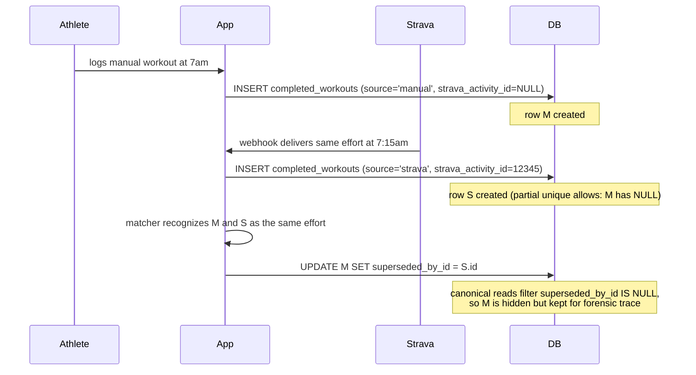

# Completed Workouts and Workout Matches Schema — Implementation Plan

## Overview

Land the `completed_workouts` and `workout_matches` tables. `completed_workouts` is the canonical record of every real-world effort (Strava-sourced or manually logged); `workout_matches` is the 1:1 link table that ties 0..1 planned workouts to 0..1 completed workouts with a confidence score and method.

This is Unit 6 of the parent schema plan ([docs/plans/2026-05-02-002-feat-database-schema-plan.md](2026-05-02-002-feat-database-schema-plan.md)), advancing R14–R22 from the schema brainstorm. Athlete-self RLS only; coach-side read access lands in parent plan Unit 8.

After this unit lands, the Strava ingest path (product plan Phase 2) is unblocked: webhook handlers can write idempotent `completed_workouts` rows, the matcher worker can link them to `planned_workouts`, and the calendar UI gains real activity data.

## Problem Frame

See origin: [docs/brainstorms/2026-05-02-database-schema-requirements.md](../brainstorms/2026-05-02-database-schema-requirements.md), requirements R14–R22.

The hard parts:

1. **Strava idempotency (R15).** Webhooks fire at-least-once: the same `strava_activity_id` may arrive multiple times within seconds. A partial unique index `(athlete_id, strava_activity_id) WHERE strava_activity_id IS NOT NULL` makes the upsert idempotent. Manual rows with `strava_activity_id = NULL` are not constrained (athletes log multiple ad-hoc workouts per day).
2. **The manual-then-Strava merge (R21).** Athlete logs a workout manually at 7am; the Strava webhook delivers the same effort at 7:15am. App code creates a new `completed_workouts` row from Strava data (preferred source) and sets `superseded_by_id` on the manual row pointing at the Strava row. Both rows remain readable for forensic trace; reads filter `superseded_by_id IS NULL` for the canonical surface. The self-referential FK enables this.
3. **1:1 match cardinality (R19).** A `workout_matches` row connects exactly one planned workout to exactly one completed workout. Both sides are nullable in the sense that "unmatched" is the default state — but when a match exists, no other live match for either side can exist. Two partial unique indexes `WHERE deleted_at IS NULL` enforce both directions.
4. **Match re-linking via soft-delete (R20).** Coach or athlete decides the auto-match was wrong: soft-delete the existing match row, insert a new one. The partial unique predicate allows this because the soft-deleted row exits the index.
5. **R18 ToS compliance.** No raw 1Hz stream data ever lands in the DB. Only `summary_stats` JSONB (averages, maxes, zones, normalized power, TSS-equivalent). Migration comment documents the constraint; reviewer-visible.
6. **R17 Strava-delete semantics.** When Strava sends a delete event, the `completed_workouts` row is soft-deleted (never hard). If the deletion is the only completion link for a planned workout, app code transitions that planned workout's `status` from `completed` back to `planned`. The schema supports this; the orchestration is app-layer (product plan Unit 2.4).

## Requirements Trace

- **R14** — Canonical `completed_workouts` row per real-world effort, `source IN ('strava','manual')`. Satisfied by Unit 1's table + CHECK.
- **R15** — Strava UNIQUE per athlete for webhook idempotency. Satisfied by partial unique index `completed_workouts_strava_idempotency` on `(athlete_id, strava_activity_id) WHERE strava_activity_id IS NOT NULL`.
- **R16** — Raw payloads persisted in `strava_raw_payloads` (already exists, migration 0002). No new work.
- **R17** — Strava delete → soft-delete on `completed_workouts`. Schema supports it; orchestration is app-layer.
- **R18** — No raw 1Hz streams. Schema deliberately omits a streams column; comment documents the ToS constraint.
- **R19** — `workout_matches` link table, 0..1 on each side. Satisfied by Unit 1's table + two partial unique indexes.
- **R20** — Confidence score + method on each match; re-linking via soft-delete works because the partial unique excludes deleted rows.
- **R21** — `superseded_by_id` self-FK on `completed_workouts` for the manual-then-Strava merge.
- **R22** — Matcher tolerance defaults: deferred to product plan Unit 2.4. This unit only ships the storage surface.

## Scope Boundaries

- **Coach-side RLS** deferred to parent plan Unit 8.
- **The matcher itself** (background worker that creates `workout_matches` rows from Strava deliveries) is product plan Unit 2.4. This unit ships the table, not the logic.
- **The Strava webhook handler** that writes `completed_workouts` is product plan Unit 2.1/2.2. Out of scope here.
- **`planned_workouts.status` transition** from `completed` back to `planned` on Strava delete (R17 second half) is app-layer; not enforced by the schema.
- **Match confidence formula and tolerance defaults** (R22) are deferred to product plan Unit 2.4 — validated with real Strava data.
- **Final shape of `summary_stats` JSONB** is deferred to product plan Unit 2.2 (Strava normalization). This unit reserves the column as `JSONB NOT NULL DEFAULT '{}'::jsonb` with a permissive Zod shape.
- **`workout_edits` integration with `workout_matches`** — none needed in this unit. Match creation/deletion is not audited via `workout_edits`; if that's wanted later, it lands with parent Unit 7.

### Deferred to Separate Tasks

- **Trend-query covering index** on `(athlete_id, started_at DESC) INCLUDE (sport, distance_m, duration_s)`: parent plan defers until measured.
- **Match-method-specific indexes** (e.g., `WHERE method = 'auto_same_day_sport'`): defer until the matcher's read patterns are known.
- **The `superseded_by_id` chain audit** — querying "all manual rows superseded by this Strava row" is supported by the FK but not indexed. Add an index if the audit path becomes hot.

## Context & Research

### Relevant Code and Patterns

- [supabase/migrations/0007_plans_and_planned_workouts.sql](../../supabase/migrations/0007_plans_and_planned_workouts.sql) — most recent migration; sets the convention for two-tables-one-migration, partial-unique-with-soft-delete, scope-notes comment block, realtime publication membership wiring. This unit follows the same shape.
- [docs/solutions/partial-unique-with-soft-delete.md](../solutions/partial-unique-with-soft-delete.md) — the pattern doc this unit is the second canonical example of. After this unit lands, update the doc with the new examples (Strava idempotency + 1:1 match link).
- [packages/shared/src/plan.ts](../../packages/shared/src/plan.ts) and [packages/shared/src/planned-workout.ts](../../packages/shared/src/planned-workout.ts) — the convention for per-table Zod modules. This unit adds `completed-workout.ts` and `workout-match.ts`.
- [apps/web/src/db/__tests__/plans.test.ts](../../apps/web/src/db/__tests__/plans.test.ts) and [apps/web/src/db/__tests__/planned-workouts.test.ts](../../apps/web/src/db/__tests__/planned-workouts.test.ts) — test patterns to mirror, particularly the partial unique 23505 collision, the cross-user RLS pos/neg, and the FK cascade load-bearing test.
- [packages/shared/src/realtime-allowlist.ts](../../packages/shared/src/realtime-allowlist.ts) — the allow-list grows from 2 to 4 entries.
- [supabase/migrations/0002_strava_infra.sql](../../supabase/migrations/0002_strava_infra.sql) — `strava_raw_payloads` already exists; no changes to it. Referenced for R16.

### Institutional Learnings

- [docs/solutions/partial-unique-with-soft-delete.md](../solutions/partial-unique-with-soft-delete.md) — the pattern this unit reuses twice (Strava idempotency on `completed_workouts`, 1:1 link enforcement on `workout_matches`). After this unit lands, append both examples to the solutions doc as the canonical reuse sites.
- [docs/solutions/migration-conventions.md](../solutions/migration-conventions.md) — naming, soft-delete policy, RLS posture.
- The cross-table consistency invariant from Unit 5 (`planned_workouts.athlete_id` vs `plans.athlete_id`) recurs here: `workout_matches.planned_workout_id` and `workout_matches.completed_workout_id` should belong to the same athlete, but SQL doesn't enforce it. Tests document the surprise.

### External References

External research deliberately skipped — this is the seventh migration we've shipped of similar shape, and there is no new technology surface (no auth/payments/external API; Strava webhook handling is product plan, not schema).

## Key Technical Decisions

- **Single migration `0008_completed_workouts_and_matches.sql`**, not split. The FK from `workout_matches.completed_workout_id` to `completed_workouts.id` belongs in the same file. Matches parent plan intent and the Unit 5 precedent.
- **Migration number `0008`**, not `0005` as the parent plan says. +3 shift since Foundation Backfill (already updated in the parent plan, but worth restating).
- **Self-referential FK on `completed_workouts.superseded_by_id`** with `ON DELETE SET NULL`. Supports R21 merge without making the supersession unsafe if the Strava row is hard-deleted (account cascade).
- **Partial unique `completed_workouts_strava_idempotency` on `(athlete_id, strava_activity_id) WHERE strava_activity_id IS NOT NULL`** for R15. Manual rows with `strava_activity_id = NULL` are deliberately unconstrained.
- **Index `(athlete_id, started_at DESC) WHERE deleted_at IS NULL`** for trend queries (last-N completed workouts).
- **`workout_matches` has TWO partial unique indexes**, one on each side. `WHERE deleted_at IS NULL` enables soft-delete-driven re-linking per R20.
- **`workout_matches.confidence NUMERIC CHECK (confidence >= 0 AND confidence <= 1)`** — numeric in `[0,1]`.
- **`workout_matches.method TEXT CHECK (method IN ('auto_same_day_sport','manual_user_link','merged_from_manual'))`** — closed enum for v1 matchers.
- **No raw streams column on `completed_workouts`.** Per R18 / Strava ToS. Migration comment explicitly documents the omission and the policy.
- **`completed_workouts.started_at TIMESTAMPTZ NOT NULL`** — single timestamp source for the workout's effective time. Display formatting (athlete-local) happens at the read boundary using `public.users.timezone`.
- **`completed_workouts.distance_m NUMERIC NULL`** and **`duration_s INTEGER NULL`** as first-class indexable columns. Strava always provides these; manual entries may omit. Nullable for flexibility.
- **No `updated_at` on either table.** Lifecycle tracked by explicit columns: `completed_workouts` has `deleted_at` and `superseded_by_id`; `workout_matches` has `matched_at` and `deleted_at`. Matches the Unit 5 precedent.
- **Both tables added to `supabase_realtime`.** Calendar UI subscribes to completion events (to flip a planned-workout card from "scheduled" to "done") and to match events (when a match is created or re-linked, the UI updates).
- **`REALTIME_ALLOWLIST` grows from 2 to 4 entries.** Alphabetized: `completed_workouts`, `planned_workouts`, `plans`, `workout_matches`.

## Open Questions

### Resolved During Planning

- *Migration number?* — `0008`.
- *One migration or two?* — One.
- *`updated_at` trigger?* — No.
- *Self-FK on `superseded_by_id`?* — Yes, with `ON DELETE SET NULL`.
- *Raw streams column?* — No. R18 / Strava ToS.
- *Realtime?* — Both tables.
- *Coach-side RLS?* — Deferred to parent Unit 8.
- *Match confidence as enum or numeric?* — Numeric (0..1) with CHECK.
- *Match method vocabulary?* — Closed enum: `auto_same_day_sport`, `manual_user_link`, `merged_from_manual`.

### Deferred to Implementation

- **Final inner JSONB shape of `summary_stats`.** Converges with product plan Unit 2.2 (Strava normalization). Zod stays `.passthrough()` until then.
- **Matcher tolerance defaults** (R22) — date window, sport-equivalence rules, duration tolerance. Product plan Unit 2.4.
- **Trend-query covering index decision** — measure on seeded data first.
- **Match-method index** — defer until matcher read patterns are known.
- **Whether `superseded_by_id` chain audit needs an index** — defer until the audit path becomes hot.

## High-Level Technical Design

> *This illustrates the intended approach and is directional guidance for review, not implementation specification. The implementing agent should treat it as context, not code to reproduce.*

### Table shapes

```
completed_workouts
  id UUID PK DEFAULT gen_random_uuid()
  athlete_id UUID NOT NULL REFERENCES public.users(id) ON DELETE CASCADE
  source TEXT NOT NULL CHECK (source IN ('strava','manual'))
  strava_activity_id BIGINT NULL          -- nullable; manual rows have NULL
  started_at TIMESTAMPTZ NOT NULL
  sport TEXT NOT NULL                     -- same vocabulary as planned_workouts.sport
  distance_m NUMERIC NULL
  duration_s INTEGER NULL
  summary_stats JSONB NOT NULL DEFAULT '{}'::jsonb   -- permissive; tighten in Unit 2.2
  superseded_by_id UUID NULL REFERENCES public.completed_workouts(id) ON DELETE SET NULL
  created_at TIMESTAMPTZ NOT NULL DEFAULT now()
  deleted_at TIMESTAMPTZ NULL

PARTIAL UNIQUE completed_workouts_strava_idempotency
    (athlete_id, strava_activity_id) WHERE strava_activity_id IS NOT NULL
INDEX completed_workouts_athlete_started
    (athlete_id, started_at DESC) WHERE deleted_at IS NULL

workout_matches
  id UUID PK DEFAULT gen_random_uuid()
  planned_workout_id UUID NOT NULL REFERENCES public.planned_workouts(id) ON DELETE CASCADE
  completed_workout_id UUID NOT NULL REFERENCES public.completed_workouts(id) ON DELETE CASCADE
  confidence NUMERIC NOT NULL CHECK (confidence >= 0 AND confidence <= 1)
  method TEXT NOT NULL CHECK (method IN ('auto_same_day_sport','manual_user_link','merged_from_manual'))
  matched_at TIMESTAMPTZ NOT NULL DEFAULT now()
  deleted_at TIMESTAMPTZ NULL

PARTIAL UNIQUE workout_matches_one_per_planned
    (planned_workout_id) WHERE deleted_at IS NULL
PARTIAL UNIQUE workout_matches_one_per_completed
    (completed_workout_id) WHERE deleted_at IS NULL
```

### R21 manual-then-Strava merge sketch



### R20 re-linking via soft-delete sketch

```mermaid
sequenceDiagram
  participant Coach
  participant App
  participant DB

  Note over DB: workout_match row R links planned P to completed C
  Coach->>App: "this match is wrong, link C to different planned P2 instead"
  App->>DB: UPDATE workout_matches SET deleted_at = now() WHERE id = R.id
  Note over DB: R exits the two partial unique indexes
  App->>DB: INSERT workout_matches (planned=P2, completed=C, method='manual_user_link')
  Note over DB: insert succeeds; partial unique no longer collides on C
```

### Realtime publication membership

```
ALTER PUBLICATION supabase_realtime ADD TABLE public.completed_workouts;
ALTER PUBLICATION supabase_realtime ADD TABLE public.workout_matches;
```

REALTIME_ALLOWLIST becomes `["completed_workouts", "planned_workouts", "plans", "workout_matches"]` (alphabetical).

## Implementation Units

- [ ] **Unit 1: Migration `0008_completed_workouts_and_matches.sql` + realtime publication membership**

**Goal:** Create both tables with all columns, constraints, indexes, RLS, and add to `supabase_realtime`. Update `REALTIME_ALLOWLIST` so the CI guard passes.

**Requirements:** R14, R15, R17 (storage), R18, R19, R20 (storage), R21 (storage).

**Dependencies:** Migrations 0000–0007 (all on main). `completed_workouts.athlete_id → users` and `workout_matches.planned_workout_id → planned_workouts` exist; `workout_matches.completed_workout_id` references the new table in this file.

**Files:**
- Create: `supabase/migrations/0008_completed_workouts_and_matches.sql`
- Modify: `packages/shared/src/realtime-allowlist.ts` (4 entries, alphabetized)

**Approach:**
- One migration creates both tables.
- FK ON DELETE behaviour:
  - `completed_workouts.athlete_id → users(id) CASCADE`
  - `completed_workouts.superseded_by_id → completed_workouts(id) SET NULL` (self-referential; preserves trail when supersedor hard-deleted)
  - `workout_matches.planned_workout_id → planned_workouts(id) CASCADE`
  - `workout_matches.completed_workout_id → completed_workouts(id) CASCADE`
- Indexes:
  - `completed_workouts_strava_idempotency` partial UNIQUE on `(athlete_id, strava_activity_id) WHERE strava_activity_id IS NOT NULL`
  - `completed_workouts_athlete_started` partial composite on `(athlete_id, started_at DESC) WHERE deleted_at IS NULL`
  - `workout_matches_one_per_planned` partial UNIQUE on `(planned_workout_id) WHERE deleted_at IS NULL`
  - `workout_matches_one_per_completed` partial UNIQUE on `(completed_workout_id) WHERE deleted_at IS NULL`
- `ALTER PUBLICATION supabase_realtime ADD TABLE` for both.
- `REALTIME_ALLOWLIST = ["completed_workouts", "planned_workouts", "plans", "workout_matches"]` alphabetized.
- ENABLE RLS on both. Athlete-self SELECT/INSERT/UPDATE on both. No DELETE policy.
- Top-of-file comment block covers: ToS R18 (no raw streams), coach-side RLS deferral, soft-delete-only normal-flow teardown, the R21 supersession trail, the R20 re-link semantics.

**Patterns to follow:**
- [supabase/migrations/0007_plans_and_planned_workouts.sql](../../supabase/migrations/0007_plans_and_planned_workouts.sql) for the two-tables-one-migration structure, RLS pattern, realtime wiring, and scope-notes comment style.
- [docs/solutions/partial-unique-with-soft-delete.md](../solutions/partial-unique-with-soft-delete.md) for the partial-unique pattern (used twice in this migration).

**Test scenarios:**
- *Integration:* the existing realtime-publication CI guard (`apps/web/src/db/__tests__/realtime-publication.test.ts`) passes after this migration applies — proves `ALTER PUBLICATION` + `REALTIME_ALLOWLIST` update match.
- *Integration (grep-level audit on the migration file before commit):* PK + FK ON DELETE clauses correct (1 CASCADE + 1 SET NULL on completed_workouts; 2 CASCADE on workout_matches), 3 athlete-self policies per table, no DELETE policies, ENABLE RLS on both, both partial unique indexes named correctly, partial composite for trend query, no `updated_at` column, no raw-streams column, `ALTER PUBLICATION` lines × 2.

**Verification:**
- `supabase db reset` applies the migration cleanly.
- `pg_dump --schema-only` shows both tables with expected columns, indexes, and `rowsecurity = true`.
- Realtime CI guard test passes; `REALTIME_ALLOWLIST` matches publication membership.

---

- [ ] **Unit 2: Zod modules `packages/shared/src/completed-workout.ts` and `workout-match.ts` + pure-Zod tests**

**Goal:** Row schemas + inferred TS types + sub-schemas for the enums, following the convention locked across packages/shared.

**Requirements:** R14 (typed contract for the completion row), R20 (typed match contract).

**Dependencies:** Unit 1 (so the contract has a real table behind it).

**Files:**
- Create: `packages/shared/src/completed-workout.ts`
- Create: `packages/shared/src/workout-match.ts`
- Create: `packages/shared/src/__tests__/completed-workout.test.ts`
- Create: `packages/shared/src/__tests__/workout-match.test.ts`
- Modify: `packages/shared/src/index.ts` (barrel re-exports)

**Approach:**

`completed-workout.ts` exports:
- `CompletedWorkoutSourceSchema = z.enum(["strava","manual"])`
- `SummaryStatsSchema = z.object({}).passthrough()` — permissive; final shape per product plan Unit 2.2
- `CompletedWorkoutRowSchema` covering all columns. `strava_activity_id` as `z.number().int().nullable()` (BIGINT, fits in JS number range for foreseeable Strava IDs); `distance_m` as `z.number().nullable()`; `duration_s` as `z.number().int().nullable()`; `superseded_by_id` as `z.string().uuid().nullable()`.

`workout-match.ts` exports:
- `WorkoutMatchMethodSchema = z.enum(["auto_same_day_sport","manual_user_link","merged_from_manual"])`
- `WorkoutMatchRowSchema` covering all columns. `confidence` as `z.number().min(0).max(1)` (mirrors SQL CHECK).

Sport vocabulary on `completed_workouts.sport` is the same as `planned_workouts.sport`. Import and reuse `SportSchema` from `planned-workout.ts` rather than redeclaring.

**Patterns to follow:**
- [packages/shared/src/plan.ts](../../packages/shared/src/plan.ts) and [packages/shared/src/planned-workout.ts](../../packages/shared/src/planned-workout.ts) for the per-table module convention.
- [packages/shared/src/__tests__/planned-workout.test.ts](../../packages/shared/src/__tests__/planned-workout.test.ts) for the test structure.

**Test scenarios:**

*completed-workout.test.ts (≈15 scenarios):*
- *Happy path:* full Strava row parses cleanly.
- *Happy path:* full manual row parses (strava_activity_id null).
- *Happy path:* soft-deleted row.
- *Happy path:* superseded row (superseded_by_id set).
- *Happy path:* sparse manual row (distance_m and duration_s both null).
- *Edge case (source):* rejects unknown source like `"healthkit"`.
- *Edge case (sport):* rejects sport outside the 6-value vocabulary.
- *Edge case (UUID):* rejects malformed id / athlete_id / superseded_by_id.
- *Edge case (timestamps):* accepts offset-format timestamps.
- *Edge case (numeric):* `distance_m: "5000"` (string) rejects; `distance_m: 5000.5` accepts.
- *Edge case:* missing required field (athlete_id, source, started_at, sport, created_at).

*workout-match.test.ts (≈12 scenarios):*
- *Happy path:* full row with `method='auto_same_day_sport'`, `confidence=0.92`.
- *Happy path:* manual link `method='manual_user_link'`, `confidence=1.0`.
- *Happy path:* merged-from-manual.
- *Happy path:* soft-deleted match.
- *Edge case (confidence boundary):* `confidence=0` and `confidence=1` both accept; `-0.01` and `1.01` reject.
- *Edge case (method):* rejects unknown method.
- *Edge case (UUID):* rejects malformed planned_workout_id / completed_workout_id / id.
- *Edge case (timestamps):* offset-format accepts.
- *Edge case:* missing required field.

**Verification:**
- `pnpm --filter @da2/shared typecheck` passes.
- `pnpm --filter @da2/shared test` adds ~27 tests; total should hit ~112.

---

- [ ] **Unit 3: DB integration tests `completed-workouts.test.ts` and `workout-matches.test.ts`**

**Goal:** Exercise the schema invariants against a real Postgres: Strava idempotency, manual-Strava merge, 1:1 match enforcement, re-link via soft-delete, RLS, FK cascade, calendar query correctness, Zod-roundtrip.

**Requirements:** R14, R15, R17, R19, R20, R21 (verification).

**Dependencies:** Unit 1 + Unit 2.

**Files:**
- Create: `apps/web/src/db/__tests__/completed-workouts.test.ts`
- Create: `apps/web/src/db/__tests__/workout-matches.test.ts`

**Approach:**
- Reuse `createTestUser` and `serviceClient` from `apps/web/src/db/__tests__/setup.ts`.
- Two-user pattern for RLS negatives.
- For the manual-then-Strava merge scenario, INSERT a manual row, INSERT a Strava row (succeeds because manual has NULL strava_activity_id), then UPDATE the manual row's `superseded_by_id` to point at the Strava row. Assert the canonical-read filter (`WHERE superseded_by_id IS NULL`) returns only the Strava row.
- For re-linking, INSERT a match, soft-delete it, INSERT a new match — assert the second succeeds and the soft-deleted row remains (`deleted_at IS NOT NULL`).

**Patterns to follow:**
- [apps/web/src/db/__tests__/plans.test.ts](../../apps/web/src/db/__tests__/plans.test.ts) and [apps/web/src/db/__tests__/planned-workouts.test.ts](../../apps/web/src/db/__tests__/planned-workouts.test.ts) for the test structure.
- [apps/web/src/db/__tests__/setup.ts](../../apps/web/src/db/__tests__/setup.ts) `createTestUser` helper.

**Test scenarios:**

*completed-workouts.test.ts (≈14 scenarios):*
- *Happy path:* athlete INSERT Strava completion via JWT, reads it back.
- *Happy path:* INSERT manual completion (strava_activity_id NULL); second manual INSERT for same athlete also succeeds (no false-uniqueness collision).
- *R15:* INSERT same `(athlete_id, strava_activity_id)` twice without `ON CONFLICT` → 23505 second time.
- *R15:* INSERT with `ON CONFLICT (athlete_id, strava_activity_id) DO UPDATE` is idempotent — second invocation updates summary_stats without creating a duplicate row.
- *R17 (storage half):* UPDATE `completed_workouts SET deleted_at = now()` succeeds (no DELETE policy needed); subsequent SELECT with `deleted_at IS NULL` filter excludes the row.
- *R21:* INSERT manual row M, INSERT Strava row S, UPDATE M SET superseded_by_id = S.id → succeeds. Canonical read (`WHERE superseded_by_id IS NULL`) returns only S.
- *Edge case:* superseded_by_id pointing at a non-existent UUID → 23503 FK violation.
- *Edge case:* source CHECK rejects unknown values.
- *Edge case:* sport CHECK rejects unknown values.
- *Integration (RLS positive):* athlete reads own.
- *Integration (RLS negative):* cross-user SELECT zero rows.
- *Integration (RLS WITH CHECK):* cross-user INSERT 42501.
- *Integration (FK cascade):* deleting auth.users removes completed_workouts.
- *Integration (Zod-roundtrip):* `CompletedWorkoutRowSchema` parses a real Strava row including `started_at` offset timestamp and JSONB `summary_stats`.

*workout-matches.test.ts (≈14 scenarios):*
- *Happy path:* INSERT a match row linking planned P and completed C with confidence 0.92 and method `auto_same_day_sport`.
- *R19/R20 (planned side):* second match for same planned_workout_id → 23505.
- *R19/R20 (completed side):* second match for same completed_workout_id → 23505.
- *R20 re-link via soft-delete:* soft-delete the existing match, INSERT new match for same planned and/or same completed → succeeds.
- *Edge case (confidence boundary):* `confidence = 0` and `confidence = 1` accept at SQL CHECK; `-0.01` and `1.01` reject (23514).
- *Edge case (method):* unknown method rejected by CHECK.
- *Edge case (FK):* INSERT with `planned_workout_id` pointing at non-existent planned → 23503.
- *Edge case (FK):* INSERT with `completed_workout_id` pointing at non-existent completed → 23503.
- *Documented surprise:* INSERT a match where planned and completed belong to DIFFERENT athletes — SQL accepts. Pins the cross-athlete-mismatch SQL behaviour for future contributors. App-layer guard only.
- *Integration (RLS positive):* athlete's matches visible via JWT (joins to planned_workouts.athlete_id transitively? Actually RLS on workout_matches doesn't have an athlete_id column — needs explicit policy expression using EXISTS).
- *Integration (RLS negative):* cross-user can't see other's matches.
- *Integration (FK cascade — planned):* deleting a planned_workout (via account cascade simulation) cascades to its workout_matches rows.
- *Integration (FK cascade — completed):* deleting a completed_workout cascades to its workout_matches rows.
- *Integration (Zod-roundtrip):* `WorkoutMatchRowSchema` parses a real row.

**Important RLS note for `workout_matches`:** unlike `completed_workouts`, `workout_matches` has no `athlete_id` column. RLS policies must use an EXISTS subquery against `planned_workouts` (or `completed_workouts`) to determine ownership:

```sql
CREATE POLICY workout_matches_self_select ON public.workout_matches
    FOR SELECT USING (
        EXISTS (
            SELECT 1 FROM public.planned_workouts pw
            WHERE pw.id = workout_matches.planned_workout_id
              AND pw.athlete_id = auth.uid()
        )
    );
```

This deferral is OK because joining to `planned_workouts` is RLS-aware. INSERT/UPDATE policies should mirror the pattern. **This is a planning-time decision worth re-validating in the migration:** if the `EXISTS` subquery causes RLS issues (e.g., it's evaluated under elevated privileges in a way that bypasses planned_workouts RLS), an alternative is to add `athlete_id` to `workout_matches` directly as a denormalized column. Resolve during implementation.

**Verification:**
- `pnpm --filter @da2/web test completed-workouts` runs ≥14 scenarios green.
- `pnpm --filter @da2/web test workout-matches` runs ≥14 scenarios green.
- CI test job green; total scenario count crosses 80 (~70 prior + ≥28 new).

---

## System-Wide Impact

- **Interaction graph:** Both tables become realtime publication members; total membership grows to 4. Mobile and web subscribe to their own user's row changes. Today no subscriber code exists; the wiring lands in product plan Phase 2.
- **Error propagation:** Postgres error codes (`23505` for unique, `23503` for FK, `23514` for CHECK, `42501` for RLS). Route handlers (eventually) translate to user-facing errors.
- **State lifecycle risks:**
  - Soft-delete + RLS: every read path filters `deleted_at IS NULL` AND obeys RLS. Worsened slightly here because the canonical-read surface ALSO needs `superseded_by_id IS NULL`. ESLint rule and/or query helper would help; deferred per parent plan Risks section.
  - The R21 supersession trail is forensic-only after creation. If an app path "unsupersedes" by clearing `superseded_by_id`, the manual row reappears as live data — this is intentional but worth pinning in a test scenario.
- **API surface parity:** No endpoints yet. When `/api/me/strava/webhook` lands (product plan Unit 2.1), it must validate inputs against the StravaActivity input schema (separate from `CompletedWorkoutRowSchema`) and use `ON CONFLICT (athlete_id, strava_activity_id) DO UPDATE` for R15 idempotency.
- **Integration coverage:** Strava idempotency replay, manual-then-Strava merge, 1:1 match enforcement, re-link via soft-delete — these four are the tests that prove the schema delivers the requirements.
- **Pattern reuse:** This unit is the second canonical example of partial-unique-with-soft-delete (and the first with a NULL-aware partial unique on top of a regular column). After this unit ships, append both examples to `docs/solutions/partial-unique-with-soft-delete.md`.
- **Unchanged invariants:** `public.users.timezone` remains the timezone source. `public.touch_updated_at` is unused. The realtime publication grows from 2 → 4 members; the CI guard enforces correctness.

## Risks & Dependencies

| Risk | Likelihood | Impact | Mitigation |
|---|---|---|---|
| `workout_matches` RLS policies using EXISTS subqueries against `planned_workouts` produce unexpected results | Med | Med | Tests explicitly exercise the policy paths (positive + negative). If EXISTS turns out to be unreliable, fall back to a denormalized `athlete_id` column on `workout_matches`. Decision resolves during Unit 1 implementation. |
| Manual-then-Strava merge produces orphan trails if `superseded_by_id` chains form a cycle (M -> S -> M) | Low | Low | Convention: the chain always points from manual → Strava → newest. App-layer enforcement (matcher in Unit 2.4) is the source of discipline. SQL allows cycles; tests don't exercise that path. |
| Partial unique on `strava_activity_id` doesn't catch a malformed webhook with `strava_activity_id = NULL` from a buggy payload | Low | Low | App-layer validation (Zod on the webhook payload) rejects NULL `strava_activity_id` for `source='strava'` rows. Schema deliberately accepts the NULL case for manual-row support. |
| Match-method enum vocabulary needs to grow (e.g., adding `auto_geofence_match`) | Med | Low | CHECK constraint requires a migration to amend. Acceptable; growth is slow. |
| Cross-athlete `workout_matches.planned_workout_id`/`completed_workout_id` mismatch (matched workouts belong to different users) | Med | Med | Documented surprise; test pins behavior. App-layer matcher must validate athlete identity. Future hardening: BEFORE INSERT trigger or column-level denormalization. |
| Realtime publication broadcasts full `summary_stats` JSONB to subscribers; could become large | Low | Low | v1 plan generation produces small payloads. ce:review residual #51 already flags the generic JSONB-size-vs-Realtime-cap concern. |

## Documentation / Operational Notes

- Update parent plan ([docs/plans/2026-05-02-002-feat-database-schema-plan.md](2026-05-02-002-feat-database-schema-plan.md)) Unit 6 entry: tick checkbox, note migration `0008` (already shifted in the parent plan).
- Append the two new partial-unique-with-soft-delete examples to [docs/solutions/partial-unique-with-soft-delete.md](../solutions/partial-unique-with-soft-delete.md):
  - `completed_workouts_strava_idempotency` — the NULL-aware variant
  - `workout_matches_one_per_planned` + `workout_matches_one_per_completed` — the 1:1 link variant
- Optional: write `docs/solutions/strava-webhook-idempotency.md` capturing the `ON CONFLICT (athlete_id, strava_activity_id) DO UPDATE` pattern for the webhook handler (product plan Unit 2.1). Defer until that handler lands.

## Sources & References

- **Origin document:** [docs/brainstorms/2026-05-02-database-schema-requirements.md](../brainstorms/2026-05-02-database-schema-requirements.md), R14–R22.
- **Parent plan:** [docs/plans/2026-05-02-002-feat-database-schema-plan.md](2026-05-02-002-feat-database-schema-plan.md), Unit 6.
- **Sibling plans:** [docs/plans/2026-05-13-001-feat-plans-planned-workouts-schema-plan.md](2026-05-13-001-feat-plans-planned-workouts-schema-plan.md), [docs/plans/2026-05-12-002-feat-schema-foundation-backfill-plan.md](2026-05-12-002-feat-schema-foundation-backfill-plan.md).
- **Conventions:** [docs/solutions/migration-conventions.md](../solutions/migration-conventions.md), [docs/solutions/partial-unique-with-soft-delete.md](../solutions/partial-unique-with-soft-delete.md), [AGENTS.md](../../AGENTS.md).
- **Prior migrations to mirror:** [supabase/migrations/0007_plans_and_planned_workouts.sql](../../supabase/migrations/0007_plans_and_planned_workouts.sql), [supabase/migrations/0004_athlete_profiles.sql](../../supabase/migrations/0004_athlete_profiles.sql).
- **Prior PRs to reference:** [#50](https://github.com/ryanssareen/daily-athlete/pull/50), [#52](https://github.com/ryanssareen/daily-athlete/pull/52), [#53](https://github.com/ryanssareen/daily-athlete/pull/53).
