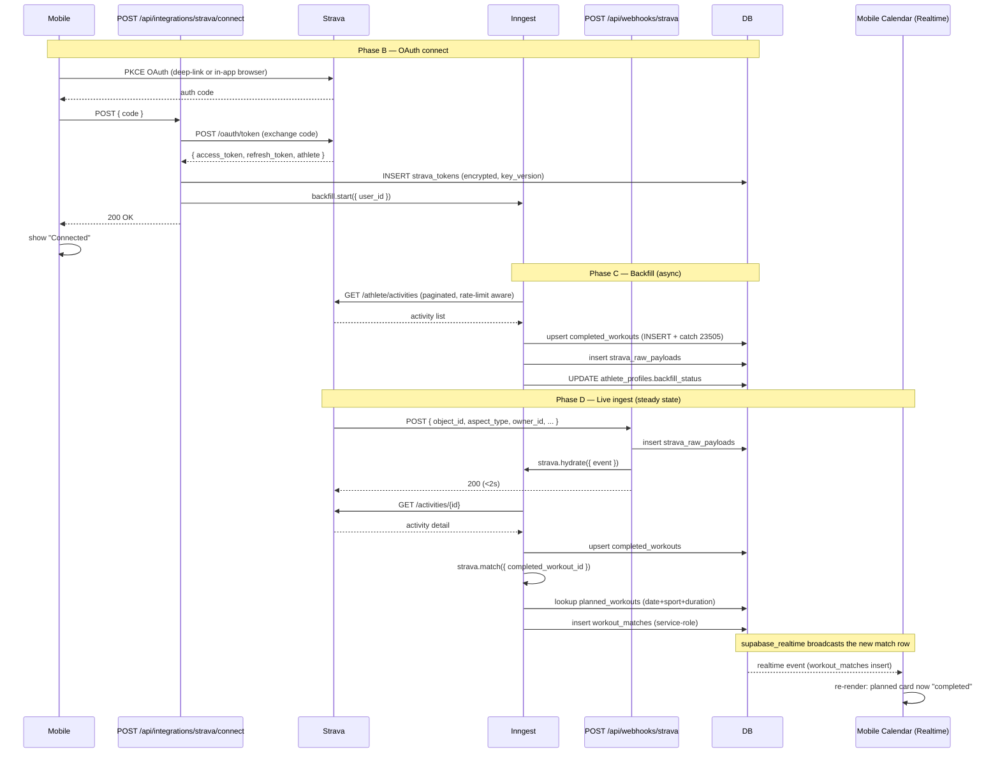

# Strava Integration — Implementation Plan

## Overview

Land the Strava integration end-to-end: OAuth connect on mobile, encrypted server-side token storage with versioned rotation, a `StravaClient` wrapper with refresh-on-401 + rate-limit awareness, on-connect backfill of the athlete's last 200 activities, webhook ingest of new/updated/deleted activities, a matcher that links completed workouts to planned workouts, and manual completion entry on mobile. The schema for all this is already on main (parent schema plan Units 4–6); this plan delivers the application code that fills the tables.

This plan covers **product plan Units 2.1, 2.2, and 2.4**, broken into four phases of one PR each (Phase D may be two PRs). The schema's completed_workouts / workout_matches / strava_tokens / strava_raw_payloads tables are the contract; this plan implements the writers and readers.

After this plan lands:
- Athletes can connect Strava from the mobile app.
- Their last 200 activities are backfilled into `completed_workouts`.
- New activities arrive via webhook within seconds and auto-match to planned workouts.
- Manual completions work for athletes without Strava (or off-Strava workouts).
- The athlete-profile derivation worker (product plan Unit 2.3) is unblocked.
- The calendar UI (product plan Unit 2.5) has real activity data.

## Problem Frame

See origin: [docs/plans/2026-05-02-001-feat-ai-endurance-training-app-plan.md](2026-05-02-001-feat-ai-endurance-training-app-plan.md), Units 2.1, 2.2, 2.4. The schema plan ([docs/plans/2026-05-02-002-feat-database-schema-plan.md](2026-05-02-002-feat-database-schema-plan.md)) provides the storage contract.

The hard parts:

1. **OAuth + secure token storage.** Strava issues OAuth tokens; we must store the refresh token server-side, encrypted, with rotation support. AGENTS.md specifies Node-side AES-256-GCM via `node:crypto`, with versioned keys (`STRAVA_TOKEN_KEYS=v:hex,v2:hex,...`). The symmetric key never traverses SQL — the encryption happens inside Route Handlers, the ciphertext goes into `strava_tokens.access_token_enc` / `refresh_token_enc` BYTEA columns.
2. **At-least-once webhook delivery.** Strava webhooks are retried indefinitely on non-2xx. Hydration must be idempotent (R15, already enforced by the partial unique on `(athlete_id, strava_activity_id)`). The webhook handler must respond `<2s` with 200, so actual work is offloaded to a queue (Inngest, per parent plan Unit 1.5).
3. **Rate limits.** Strava limits 100 reqs / 15 min and 1000 reqs / day per application. Backfill of 200 activities per athlete is right at the edge if 5 athletes connect simultaneously. We need pessimistic single-athlete backoff on 429 plus a global tracker.
4. **R21 merge: manual-then-Strava.** Athlete logs a workout manually at 7am. Strava webhook delivers the same effort at 7:15am. The matcher must recognize this, insert the Strava row, and set `manual.superseded_by_id = strava.id`. The self-FK is already in place; the logic is the application's responsibility.
5. **Token revocation handling.** Athlete disconnects Strava from Strava's side. Our token gets 401s; the user must be prompted to re-auth. Status flows on the profile.
6. **Mobile + web cross-stack OAuth.** OAuth happens on mobile via `expo-auth-session` with PKCE, but the code-for-token exchange is server-side (Next.js Route Handler) so the client secret never lives on the device.

## Requirements Trace

From the schema brainstorm and product plan:

- **R1** (Strava connect) — Phase B
- **R2** (Strava backfill) — Phase C
- **R12** (canonical completion record) — Phase C + Phase D
- **R13** (manual completion) — Phase D
- **R14** (planned ↔ completed match) — Phase D
- **R15** (Strava webhook idempotency) — Phase D (storage already enforced in schema)
- **R17** (Strava delete event) — Phase D
- **R18** (no raw 1Hz streams; only summary stats) — Phase C + D
- **R20** (match method + confidence + re-linkable) — Phase D
- **R21** (manual-then-Strava merge) — Phase D
- **R22** (matcher tolerance defaults) — Phase D (defaults documented; refined later)

## Scope Boundaries

- **No coach-side endpoints.** Coach views of athlete activities land later with parent schema plan Unit 8.
- **No raw stream samples.** Per R18 / Strava ToS. We persist only summary statistics.
- **No deletion of athlete account flow.** That's parent schema plan Unit 10.
- **No live Strava sync for activities older than the 200-activity backfill window.** Pre-existing activities not in the backfill range are not ingested.
- **No multi-account Strava per user.** One Strava account per `users.id`; the `strava_tokens.user_id PK` enforces this.
- **No calendar UI in this plan.** Product plan Unit 2.5 owns calendar rendering. This plan's Realtime events fire; the UI subscribers are someone else's PR.
- **No coach-initiated match override.** Manual re-link via `manual_user_link` method works for the athlete; coach UI is parent schema plan Unit 8.
- **No retroactive matcher run.** When the matcher's tolerance defaults change, we don't re-match historical rows. Each match is recorded with the method/confidence in effect at the time.

### Deferred to Separate Tasks

- **Profile derivation worker** (product plan Unit 2.3) — separate plan; reads `completed_workouts` and writes `athlete_profiles.baselines`.
- **Coach views of activities** — parent schema plan Unit 8.
- **Final matcher confidence formula tuning** — happens during product plan Unit 2.4 iteration with real Strava data; this plan ships sensible v1 defaults.
- **Strava data deletion job** (per-activity DELETE to Strava when an athlete deletes their account) — parent schema plan Unit 10.
- **Activity edit detection** (Strava sends `update` events when an athlete corrects an activity post-upload) — Phase D handles the `update` event as a re-hydration; richer edit semantics deferred.

## Context & Research

### Relevant Code and Patterns

- [supabase/migrations/0002_strava_infra.sql](../../supabase/migrations/0002_strava_infra.sql) — defines `strava_tokens` (encrypted BYTEA columns, `key_version` from 0003) and `strava_raw_payloads`. The plan's Phase A token-crypto module writes to and reads from these columns.
- [supabase/migrations/0008_completed_workouts_and_matches.sql](../../supabase/migrations/0008_completed_workouts_and_matches.sql) — the target schema for backfill (Phase C) and webhook hydration (Phase D). The R15 idempotency comment block documents the two supported supabase-js upsert patterns (INSERT + catch 23505 + UPDATE, or RPC into a Postgres function); webhook hydration uses one of these.
- [packages/shared/src/completed-workout.ts](../../packages/shared/src/completed-workout.ts) — `CompletedWorkoutRowSchema` and `CompletedWorkoutSourceSchema`. Strava activity normalization (Phase C) must produce data matching this contract.
- [packages/shared/src/workout-match.ts](../../packages/shared/src/workout-match.ts) — `WorkoutMatchRowSchema` and `WorkoutMatchMethodSchema`. Matcher (Phase D) writes rows matching this contract.
- [packages/shared/src/strava-token.ts](../../packages/shared/src/strava-token.ts) — `StravaTokenRowSchema` with BYTEA + `key_version`. Token-crypto module's wire contract.
- [packages/shared/src/strava-raw-payload.ts](../../packages/shared/src/strava-raw-payload.ts) — raw webhook payload archive contract.
- [apps/web/src/db/__tests__/setup.ts](../../apps/web/src/db/__tests__/setup.ts) — JWT-bound test client + `createTestUser` helper. All phases reuse this for DB-backed tests.
- [apps/web/src/db/__tests__/completed-workouts.test.ts](../../apps/web/src/db/__tests__/completed-workouts.test.ts) — the test patterns for write paths; particularly the INSERT-catch-23505-UPDATE fallback (Phase D will use the same pattern in production code).
- [AGENTS.md](../../AGENTS.md) sections "Secrets" and "Background jobs" — token encryption posture, queue layer expectations, never-await-long-tasks rule.
- [infra/README.md](../../infra/README.md) — already documents `STRAVA_CLIENT_ID`, `STRAVA_CLIENT_SECRET`, `STRAVA_TOKEN_KEYS` as deployment-time env vars.

### Institutional Learnings

- [docs/solutions/partial-unique-with-soft-delete.md](../solutions/partial-unique-with-soft-delete.md) — covers the idempotency pattern Phase D's webhook hydration relies on.
- [docs/solutions/migration-conventions.md](../solutions/migration-conventions.md) — Phase C adds a column to `athlete_profiles`; follow these conventions.
- No prior Strava code in the repo. No prior Inngest setup. This plan establishes both patterns.

### External References

- Strava API reference: https://developers.strava.com/docs/reference/ — endpoints: `POST /oauth/token` (refresh), `GET /athlete`, `GET /athlete/activities`, `GET /activities/{id}`.
- Strava webhook events: https://developers.strava.com/docs/webhooks/ — subscription model + delivery contract.
- Strava ToS / data deletion API: https://www.strava.com/legal/api — the R18 raw-streams prohibition + per-activity delete API for Unit 10.
- Inngest Next.js setup: https://www.inngest.com/docs/quick-start (single serve handler at `app/api/inngest/route.ts`; dev server `npx inngest-cli@latest dev`).
- expo-auth-session PKCE: https://docs.expo.dev/versions/latest/sdk/auth-session/ — for the mobile OAuth flow.

## Key Technical Decisions

### Phase A — Foundation

- **Token encryption: AES-256-GCM via `node:crypto`** with versioned keys in `STRAVA_TOKEN_KEYS` (format `v:hex,v2:hex,...`). The highest-numbered version is used for new encryptions; all listed versions are tried on decryption. Each row stamps `key_version`. Per AGENTS.md.
- **Inngest as the queue layer.** Parent plan Unit 1.5 listed it as the default candidate; this plan commits. Inngest's dev server runs locally; production deploys point at the Inngest cloud or self-hosted endpoint.
- **Inngest serve handler at `apps/web/app/api/inngest/route.ts`.** Standard Next.js pattern; Inngest functions register against this single endpoint.
- **Sport normalization is a hand-authored map** in `apps/web/src/strava/sport-normalization.ts`. v1 mapping is documented in this plan; expand as needed when real-world Strava data surfaces gaps.
- **Env-var validation at startup.** Extend `apps/web/src/config.ts` (mentioned in AGENTS.md but may need creating) to refuse boot in production when `STRAVA_*` placeholders are present.

### Phase B — OAuth + StravaClient

- **OAuth on mobile via `expo-auth-session` with PKCE.** Code-for-token exchange happens in a server-side Next.js Route Handler. The Strava client secret never lives on the device.
- **Deep-link first when Strava app is installed; in-app browser fallback.** `expo-auth-session` supports both transparently with `useProxy` and explicit redirect URI configuration.
- **`StravaClient` is a thin per-user wrapper.** Constructed with a `user_id`. On each call, it loads the (encrypted) tokens, decrypts, performs the request, and handles 401 by refreshing transparently and retrying once. After a successful call, it touches `strava_tokens.last_used_at` (UPDATE, doesn't change the token value).
- **Refresh-on-401, not refresh-on-expiry-time.** Strava's clocks vs ours can drift; we trust the 401 response code as the source of truth and refresh reactively. Cheaper than a clock-comparison check on every call.
- **`StravaClient.fetch()` returns the raw `Response`** rather than parsed JSON. Callers decide parsing. Keeps the client small and lets tests mock fetch directly.
- **Rate-limit headers** (`X-RateLimit-Limit`, `X-RateLimit-Usage`) are surfaced via a public field on the client; backfill (Phase C) reads it to decide whether to pause.

### Phase C — Backfill

- **Backfill triggered by Unit 2.1's connect route**, not by a separate user action. On successful token exchange, the connect route enqueues `backfill.start({ user_id })` to Inngest.
- **Backfill paginates `/athlete/activities` in pages of 200**. Stops at 200 activities total OR end of athlete history, whichever is first.
- **Backfill writes to `completed_workouts` using the INSERT + catch 23505 fallback** documented in migration 0008. The supabase-js `.upsert()` 42P10 issue makes ON CONFLICT unusable via the SDK.
- **Backfill writes to `strava_raw_payloads`** with `kind = 'hydration'` for each activity's detail payload. Bounded retention (30 days, parent schema plan Unit 3) sweeps these.
- **Backfill status lives on `athlete_profiles.backfill_status JSONB`** added by a small migration in Phase C. Shape: `{ provider: 'strava', state: 'queued'|'in_progress'|'complete'|'failed'|'needs_reauth', total: number, completed: number, started_at, completed_at, error_message }`. The mobile profile screen reads this for the progress indicator.
- **On 429, the Inngest function uses `step.sleep()` for the retry-after delay** plus exponential backoff. No tight retry loop.
- **On refresh-token-expired (401 from token refresh, not from API call), set `state: 'needs_reauth'`** and mark the row. UI prompts the athlete.

### Phase D — Webhook + matcher + manual completion

- **Webhook GET handler responds to verification challenge.** Strava issues a GET with `hub.challenge` and `hub.verify_token`; if `hub.verify_token === STRAVA_WEBHOOK_VERIFY_TOKEN`, respond `200 {"hub.challenge": <value>}`. Run once at subscription registration.
- **Webhook POST handler MUST respond `<2s` with 200.** It writes to `strava_raw_payloads` synchronously (≤50ms) and enqueues `strava.hydrate({ event })` to Inngest, then returns. All real work is async.
- **Hydration Inngest function** loads the activity via `GET /activities/{id}`, normalizes the sport, upserts `completed_workouts` (INSERT + catch 23505 + UPDATE), then enqueues `strava.match({ completed_workout_id })`.
- **Matcher service is app-side** (`apps/web/src/services/match-workout.ts`), not a Postgres function. Reasons: easier to test, easier to evolve the confidence formula, no service-role function-permission issues.
- **Matcher v1 defaults**:
  - Date window: `started_at` within ±1 day of `planned_workout.scheduled_date`
  - Sport: must match exactly (no cross-sport)
  - Duration: completed `duration_s` within ±50% of planned `structure.main.duration_s` (when present; else any duration)
  - Confidence: `0.6 * date_proximity + 0.3 * duration_proximity + 0.1 * single_candidate_bonus`, clamped to [0,1]
  - Cutoff: confidence < 0.3 → don't auto-match (leave for manual)
- **The matcher writes via service-role**, intentionally bypassing RLS — this is the documented "service-role bypass" path from PR #54 review. The matcher MUST validate athlete identity before insert (`planned.athlete_id === completed.athlete_id`).
- **R21 merge logic**: on hydration of a Strava row S, check if there's already a `completed_workouts` row M with `source='manual'`, `athlete_id = S.athlete_id`, and `started_at` within ±30 min of S. If yes, after S is inserted, set `M.superseded_by_id = S.id`.
- **Manual completion mobile screen** is a modal form at `apps/mobile/app/(modals)/log-workout.tsx`. Athlete picks sport, duration, distance, notes. POSTs to `apps/web/app/api/workouts/manual/route.ts` which writes via the athlete-self RLS path.
- **R17 Strava delete events**: hydration distinguishes `event.aspect_type` of `create`, `update`, `delete`. Delete sets `deleted_at`. The matcher then re-evaluates: if the deleted Strava row was the only completion link for a planned workout, app code transitions `planned_workouts.status` back to `planned`.

## Open Questions

### Resolved During Planning

- *Queue layer choice?* — Inngest (user pre-committed in plan request; parent plan default).
- *Token encryption algorithm?* — AES-256-GCM (AGENTS.md).
- *Matcher location (SQL vs app)?* — App-side (easier evolution).
- *Matcher v1 defaults?* — Documented above; refine in iteration.
- *Sport normalization map?* — v1 mapping in Phase A.
- *Webhook verify token storage?* — Generated random secret, stored as `STRAVA_WEBHOOK_VERIFY_TOKEN` env var, registered with Strava once.
- *Rate-limit strategy?* — Single-athlete pessimistic backoff on 429 via Inngest `step.sleep()`; global tracker deferred until multi-tenant volume justifies.
- *Manual completion form fields?* — sport, duration, distance, started_at, notes. Sport + duration are required; distance optional. Matches the schema's required NOT NULL fields.

### Deferred to Implementation

- **Exact Inngest function names and IDs.** Decide during implementation; document in the Inngest dashboard / config file.
- **Exact `apps/web/src/config.ts` location.** AGENTS.md references it; may need creating. Phase A creates it if missing.
- **Test mocking strategy for Strava API.** MSW (Mock Service Worker), `nock`, or a hand-rolled fetch wrapper. Pick the lightest option during Phase B; document in `docs/solutions/strava-test-mocking.md` after the first phase lands.
- **The exact Realtime event payload shape** the mobile calendar (product plan Unit 2.5) subscribes to. Phase D fires the events; the consumer plan owns the shape.
- **Whether `last_used_at` updates are batched** or per-call. v1: per-call. Optimize if write rate becomes a concern.
- **CI mocking of Inngest in tests.** Inngest provides `@inngest/test` for unit testing functions; integration tests with the local dev server are heavier. Phase A picks the v1 test approach.

## High-Level Technical Design

> *This illustrates the intended approach and is directional guidance for review, not implementation specification. The implementing agent should treat it as context, not code to reproduce.*

### Cross-phase flow



### Token encryption flow (Phase A)

```
encrypt(plaintext_bytes, current_key_version) -> { ciphertext_bytes, key_version }
  iv = randomBytes(12)
  cipher = createCipheriv('aes-256-gcm', currentKey, iv)
  encrypted = cipher.update(plaintext_bytes) || cipher.final()
  authTag = cipher.getAuthTag()
  return { ciphertext: iv || authTag || encrypted, key_version }

decrypt(ciphertext_bytes, key_version) -> plaintext_bytes
  key = STRAVA_TOKEN_KEYS[key_version]   # throws if missing
  iv, authTag, encrypted = split(ciphertext_bytes, [12, 16, rest])
  decipher = createDecipheriv('aes-256-gcm', key, iv)
  decipher.setAuthTag(authTag)
  return decipher.update(encrypted) || decipher.final()
```

Layout in the BYTEA column: `iv(12 bytes) || authTag(16 bytes) || ciphertext(N bytes)`. Self-contained; no separate auth-tag column needed.

### Matcher confidence formula (Phase D v1)

```
date_proximity = 1.0 - min(|started_at - scheduled_date.midnight| / 24h, 1.0)
                   # 1.0 if exactly midnight of the scheduled date, falls to 0 over 24h

duration_proximity = if planned.structure.main.duration_s exists:
                       1.0 - min(|completed.duration_s - planned_duration| / planned_duration, 1.0)
                     else:
                       0.5    # neutral

single_candidate_bonus = 0.1 if only one planned workout in the window, else 0.0

confidence = clamp(0.6 * date_proximity + 0.3 * duration_proximity + single_candidate_bonus, 0, 1)
```

Sport must match exactly. Below 0.3 confidence → don't auto-match (leave for manual review).

### Sport normalization (Phase A v1)

| Strava `sport_type` | Our `sport` |
|---|---|
| Run, TrailRun | run |
| Ride, MountainBikeRide, GravelRide, EBikeRide, VirtualRide, EMountainBikeRide | bike |
| Swim | swim |
| WeightTraining, Workout, Crossfit | strength |
| Yoga, Stretching, Pilates | mobility |
| (anything else) | other |

Stored in `apps/web/src/strava/sport-normalization.ts` as a hand-authored object map. Gaps default to `other`.

## Implementation Units

---

### Phase A — Foundation prereqs (1 PR)

- [x] **Unit A1: Token encryption module**

**Goal:** Node-side AES-256-GCM encryption/decryption for Strava tokens, with versioned key support.

**Requirements:** AGENTS.md "Secrets"; supporting R1.

**Dependencies:** None (foundational).

**Files:**
- Create: `apps/web/src/security/token-crypto.ts`
- Create: `apps/web/src/security/__tests__/token-crypto.test.ts`
- Modify: `apps/web/package.json` if `node:crypto` polyfills needed (likely no change for Node target)

**Approach:**
- Export `encrypt(plaintext: Uint8Array, currentVersion: number): { ciphertext: Uint8Array, keyVersion: number }`.
- Export `decrypt(ciphertext: Uint8Array, keyVersion: number): Uint8Array`.
- Export `currentKeyVersion(): number` reading from `STRAVA_TOKEN_KEYS` env (format `1:hex,2:hex,3:hex`); returns the highest version.
- Internal `loadKeys(): Map<number, Buffer>` parses the env var once, caches in module scope. Throws if `STRAVA_TOKEN_KEYS` is missing or empty.
- Layout: `iv(12) || authTag(16) || ciphertext(N)`.
- Module-load-time validation: each parsed key must be exactly 32 bytes (256 bits). Reject placeholder strings (`hex`, all zeros, `xxx`) in production via `apps/web/src/config.ts` (see A3).

**Patterns to follow:** Standard `node:crypto` AES-256-GCM. No third-party libraries.

**Test scenarios:**
- *Happy path:* encrypt(`hello`) → ciphertext bytes; decrypt(ciphertext, keyVersion) → original `hello`.
- *Happy path:* encrypt with version 2, decrypt with version 2 → round-trips.
- *Edge case:* multi-version key rotation — encrypt with version 1, then config grows to include version 2; decrypt(version-1 ciphertext, version 1) still works (older keys retained).
- *Error path:* decrypt with wrong key version → throws (auth tag fails).
- *Error path:* tampered ciphertext (flip a bit in the auth tag) → throws.
- *Error path:* `STRAVA_TOKEN_KEYS` missing → `loadKeys` throws clearly.
- *Error path:* `STRAVA_TOKEN_KEYS` contains placeholder (`hex`, all zeros) → `currentKeyVersion` rejects in production.
- *Edge case:* IV is fresh per call (encrypt same plaintext twice → different ciphertexts).
- *Edge case:* empty plaintext (0-byte input) → round-trips.

**Verification:**
- `pnpm --filter @da2/web test token-crypto` passes.
- TypeScript types compile.

---

- [x] **Unit A2: Inngest serve handler + dev config**

**Goal:** Scaffolding for the Inngest queue layer. Next.js serve handler at `/api/inngest`, dev server config, no functions yet.

**Requirements:** Parent plan Unit 1.5 (queue layer); supporting R2, R12-R15.

**Dependencies:** None (foundational).

**Files:**
- Create: `apps/web/src/inngest/client.ts` (the `Inngest` instance with app id)
- Create: `apps/web/src/inngest/functions/index.ts` (empty array; functions added in Phase C/D)
- Create: `apps/web/app/api/inngest/route.ts` (the serve handler)
- Modify: `apps/web/package.json` — add `inngest` dep and `inngest-cli` devDep
- Modify: `apps/web/.env.example` — add `INNGEST_EVENT_KEY=`, `INNGEST_SIGNING_KEY=` (with comments noting local-dev values are deterministic)
- Modify: `.github/workflows/ci.yml` — no change for v1 (Inngest tests run locally against dev server; CI uses `@inngest/test` for unit-style function testing)

**Approach:**
- `apps/web/src/inngest/client.ts` instantiates `new Inngest({ id: 'da2-web', eventKey, signingKey })`. Single source of truth for the app id and event/signing keys (the `-web` suffix scopes the namespace to this app for when we add a separate worker app later).
- `apps/web/app/api/inngest/route.ts` exports the standard Next.js handler from `inngest/next`: `export const { GET, POST, PUT } = serve({ client, functions })`.
- `inngest/functions/index.ts` exports an empty array. Functions register against this array in Phase C/D.
- `.env.example` documents the dev keys; production uses real keys from the Inngest dashboard.
- The `inngest-cli` dev server is invoked via `pnpm --filter @da2/web run dev:inngest` (script added to package.json) — runs alongside `next dev`.

**Patterns to follow:** Inngest Next.js Quick Start.

**Test scenarios:**
- *Integration:* `pnpm --filter @da2/web typecheck` clean (proves the serve handler types correctly).
- *Test expectation: minimal in this unit.* Functions arrive in C/D with their own tests.

**Verification:**
- `GET /api/inngest` (against `next dev`) returns 200 with Inngest's introspection JSON.
- Inngest dev server can connect to the serve handler and list zero functions.

---

- [x] **Unit A3: Env var validation + secrets surface**

**Goal:** `apps/web/src/config.ts` validates required env vars at boot; refuses production startup with placeholder secrets.

**Requirements:** AGENTS.md "Secrets" config-validator clause.

**Dependencies:** None.

**Files:**
- Create or modify: `apps/web/src/config.ts`
- Create: `apps/web/src/__tests__/config.test.ts`
- Modify: `apps/web/.env.example` — add `STRAVA_CLIENT_ID=`, `STRAVA_CLIENT_SECRET=`, `STRAVA_TOKEN_KEYS=`, `STRAVA_WEBHOOK_VERIFY_TOKEN=` with one-line comments

**Approach:**
- Export a Zod-validated `config` object covering Supabase (existing) + Strava + Inngest env.
- In `NODE_ENV === 'production'`, refuse to construct the object if any `STRAVA_*` value is `''`, `xxx`, `hex`, or all zeros.
- Other environments: warn but proceed (so local dev with empty Strava values doesn't crash the whole app).
- Import-once-at-boot pattern; re-export the validated object.

**Patterns to follow:** Existing env-loading patterns in apps/web (if any); otherwise standard Zod-on-process.env shape.

**Test scenarios:**
- *Happy path:* all env vars present + valid → config object returned.
- *Error path:* `NODE_ENV=production` + `STRAVA_TOKEN_KEYS=hex` → throws.
- *Error path:* missing `STRAVA_CLIENT_ID` in production → throws.
- *Edge case:* `NODE_ENV=test`, missing Strava keys → warns but does not throw.
- *Edge case:* `STRAVA_TOKEN_KEYS=1:abc` (key too short) → throws clearly.

**Verification:**
- Tests pass in apps/web.
- CI typecheck clean.

---

- [x] **Unit A4: Sport normalization map**

**Goal:** Hand-authored Strava `sport_type` → our 6-value enum mapping.

**Requirements:** R12 (canonical completion); supporting R2, R14.

**Dependencies:** None.

**Files:**
- Create: `apps/web/src/strava/sport-normalization.ts`
- Create: `apps/web/src/strava/__tests__/sport-normalization.test.ts`

**Approach:**
- Export a `STRAVA_SPORT_MAP: Record<string, Sport>` const with the v1 mapping documented in the plan's HLD section.
- Export `normalizeSport(stravaSportType: string): Sport` — looks up the map; falls back to `'other'`.
- `Sport` type imported from `@da2/shared`.

**Patterns to follow:** Pure-data module; no side effects.

**Test scenarios:**
- *Happy path:* each documented Strava sport_type maps to the correct enum.
- *Edge case:* unknown sport_type (e.g., `'Snowboard'`) → `'other'`.
- *Edge case:* empty string → `'other'`.
- *Edge case:* case mismatch (`'run'` vs `'Run'`) — Strava uses PascalCase; verify the map keys are exact match (no case folding).

**Verification:**
- `pnpm --filter @da2/web test sport-normalization` passes.

---

### Phase B — Unit 2.1: OAuth + StravaClient + connect route + token persistence (1 PR)

- [ ] **Unit B1: StravaClient with refresh-on-401 + rate-limit awareness**

**Goal:** Per-user Strava API client. Loads encrypted tokens, decrypts, makes requests, refreshes on 401 and retries once.

**Requirements:** R1.

**Dependencies:** A1, A3, A4.

**Files:**
- Create: `apps/web/src/strava/client.ts`
- Create: `apps/web/src/strava/__tests__/client.test.ts`

**Approach:**
- Class `StravaClient` constructed via factory `createStravaClient(userId, supabaseAdmin)` (the admin client is needed because token reads bypass RLS).
- Public `fetch(path: string, init?: RequestInit): Promise<Response>` — makes the call against `https://www.strava.com/api/v3${path}`, adds `Authorization: Bearer ${access_token}`, captures rate-limit headers.
- On 401: refresh via `POST https://www.strava.com/oauth/token` with `grant_type=refresh_token`; persist the new tokens (encrypted, with current key version); retry the original request once.
- On 401 from the refresh endpoint itself: throw a typed `StravaReauthRequired` error.
- Public `rateLimits: { fifteenMin: number, daily: number }` — populated from response headers.
- Public `touchLastUsed(): Promise<void>` — UPDATE `strava_tokens.last_used_at` to `now()`. Called by callers after successful operations.
- All token reads/writes go through the encryption module (A1).

**Test scenarios:** *(uses fetch mocking; chosen library decided in A2 follow-up)*
- *Happy path:* `fetch('/athlete')` with valid token → 200, rate-limit headers populated.
- *Edge case:* first call returns 401, refresh succeeds, retry returns 200 → caller sees the 200.
- *Error path:* both call and refresh return 401 → throws `StravaReauthRequired`.
- *Error path:* call returns 429 → returns the 429 response (caller decides retry strategy; client doesn't auto-retry on rate limits).
- *Edge case:* `last_used_at` updates after a successful call without altering token bytes.
- *Edge case:* multiple instances of `StravaClient` for the same user across concurrent requests — refresh-collision: if two requests both hit 401 simultaneously, one refresh succeeds and the other reads the freshly-written token and retries. Tests pin behaviour but acceptable single-refresh-loses-the-race outcome (the loser surfaces a transient error and the calling Inngest function retries).

**Verification:**
- Unit tests pass with mocked fetch.
- Type-only check: `StravaReauthRequired` is exported and importable from callers.

---

- [ ] **Unit B2: Connect route + token persistence**

**Goal:** `POST /api/integrations/strava/connect` exchanges the OAuth code for tokens, persists encrypted, enqueues backfill.

**Requirements:** R1.

**Dependencies:** B1.

**Files:**
- Create: `apps/web/app/api/integrations/strava/connect/route.ts`
- Create: `apps/web/src/db/strava-tokens.ts` (helpers: `upsertStravaToken`, `getStravaToken`, `deleteStravaToken`)
- Create: `apps/web/app/api/integrations/strava/connect/__tests__/route.test.ts`

**Approach:**
- Route handler validates input via a Zod schema (`{ code: string, redirect_uri: string }`) in `packages/shared` or inline.
- Uses the JWT-bound supabase-js client to confirm the caller's identity (RLS-bound write to `strava_tokens.user_id = auth.uid()`).
- Calls Strava's `/oauth/token` with grant_type=`authorization_code`, client_id, client_secret, code, redirect_uri.
- Encrypts both tokens via A1; INSERTs / upserts (`ON CONFLICT user_id DO UPDATE`) into `strava_tokens`. The upsert handles re-connect.
- Stamps `athlete_strava_id` from the response.
- Enqueues `backfill.start({ user_id })` to Inngest (the function arrives in C2).
- Returns `{ status: 'connected', athlete_strava_id: number }`.

**Patterns to follow:** Standard Next.js Route Handler with Zod input validation.

**Test scenarios:**
- *Happy path:* valid code → Strava returns tokens → row written → backfill event sent → 200 to client.
- *Error path:* Strava returns 400 (invalid code) → 400 to client with clear message.
- *Error path:* re-connect (athlete already has a row) → upsert replaces tokens, athlete_strava_id may differ if user switched Strava accounts.
- *Edge case:* re-connect with different `athlete_strava_id` for an existing `user_id` — the unique index on `athlete_strava_id` may collide if some OTHER user has the same athlete_strava_id. The OAuth callback handler MUST upsert via `INSERT ... ON CONFLICT (athlete_strava_id) DO UPDATE SET user_id = EXCLUDED.user_id, ...` (already documented in migration 0002's re-connect contract).
- *Integration:* after success, the Inngest dev server shows the `backfill.start` event in its log.
- *Error path:* Strava unreachable (network error) → 502 to client.

**Verification:**
- DB integration test creates a user, mocks the Strava token exchange, calls the route, asserts the encrypted row exists with the right `user_id` and `athlete_strava_id`.

---

- [ ] **Unit B3: Mobile Strava connect screen**

**Goal:** Athlete taps "Connect Strava" in the mobile app, completes OAuth, returns to a "Connected" state.

**Requirements:** R1.

**Dependencies:** B2.

**Files:**
- Create: `apps/mobile/src/integrations/strava.tsx`
- Modify: `apps/mobile/app/(tabs)/profile.tsx` (add connect button + status display)
- Create: `apps/mobile/src/integrations/__tests__/strava.test.tsx` (Jest or Vitest — match the existing mobile test runner; if none, this unit defers to manual QA and adds a TODO)

**Approach:**
- Use `expo-auth-session` with PKCE: client_id from `EXPO_PUBLIC_STRAVA_CLIENT_ID`, redirect URI configured via Expo's deep-link scheme (`da2://strava-oauth`).
- Discovery doc: `https://www.strava.com/oauth/authorize` (auth endpoint), `https://www.strava.com/api/v3/oauth/token` (token endpoint, but we POST to our server, not Strava directly).
- After receiving the auth code from Strava, the mobile screen POSTs it (and the redirect URI) to `apps/web/app/api/integrations/strava/connect`. The server-side route is the one calling Strava's token endpoint (so the client_secret never lives on the device).
- On success, show "Connected to Strava" + a progress indicator that subscribes to the athlete_profiles row's `backfill_status` JSONB.
- On user denial / error, show a retry button.
- Deep-link when Strava app is installed (Strava registers `strava://oauth/authorize/...`); else web fallback via `expo-web-browser`.

**Patterns to follow:** `expo-auth-session` Strava examples in the Expo docs.

**Test scenarios:** *(mobile testing tooling is sparse in this repo; some scenarios are manual QA)*
- *Happy path (manual QA):* fresh install → tap Connect → complete OAuth in Strava app → return to "Connected" state.
- *Edge case (manual QA):* Strava app not installed → web fallback via in-app browser → success.
- *Error path (manual QA):* user denies on Strava → return to profile with "Try again" button.
- *Integration (unit test if mobile test runner exists):* mocked POST to `/connect` returns success → screen state transitions to Connected.

**Verification:**
- Manual QA in Expo Go or a dev build: connect flow works end-to-end against a real Strava account.

---

### Phase C — Unit 2.2: Backfill + Inngest job + backfill-status migration (1 PR)

- [ ] **Unit C1: Backfill-status migration**

**Goal:** Add `backfill_status JSONB` to `athlete_profiles` for per-provider progress tracking.

**Requirements:** R2 (user-visible backfill progress).

**Dependencies:** None (the column is purely additive).

**Files:**
- Create: `supabase/migrations/0009_athlete_profiles_backfill_status.sql`
- Modify: `packages/shared/src/athlete-profile.ts` — add `backfill_status` to the Zod row schema
- Modify: `packages/shared/src/__tests__/athlete-profile.test.ts` — add scenarios for the new column

**Approach:**
- `ALTER TABLE public.athlete_profiles ADD COLUMN backfill_status JSONB NOT NULL DEFAULT '{}'::jsonb;`
- Shape documented in `BackfillStatusSchema` (Zod): `{ provider: 'strava', state: 'queued'|'in_progress'|'complete'|'failed'|'needs_reauth', total?: number, completed?: number, started_at?: ISO datetime, completed_at?: ISO datetime, error_message?: string }`.
- The lockstep trigger from migration 0005 fires on this column too because it watches `manual_fields` only — verify it doesn't accidentally treat `backfill_status` as a manual edit (it shouldn't; the trigger only inspects `manual_fields`).
- Migration comment notes that backfill_status is owned by the backfill worker (service-role writes), not the athlete.

**Patterns to follow:** [supabase/migrations/0004_athlete_profiles.sql](../../supabase/migrations/0004_athlete_profiles.sql) for the table; [supabase/migrations/0005_athlete_profiles_lockstep_trigger.sql](../../supabase/migrations/0005_athlete_profiles_lockstep_trigger.sql) for verifying trigger isolation.

**Test scenarios:**
- *Happy path:* migration applies cleanly; `backfill_status` column exists with default `'{}'::jsonb`.
- *Integration:* updating `backfill_status` via service role does NOT trigger the lockstep trigger (manual_fields untouched → manual_field_edited_at unchanged). Pin this regression.
- *Zod:* `BackfillStatusSchema` accepts each state value; rejects unknown states.

**Verification:**
- DB test in `apps/web/src/db/__tests__/athlete-profile-backfill-status.test.ts` proves the column exists and the trigger isolation holds.

---

- [ ] **Unit C2: Backfill Inngest function**

**Goal:** On-connect, paginate the athlete's last 200 Strava activities, normalize, write to `completed_workouts` + `strava_raw_payloads`, update `backfill_status`.

**Requirements:** R2.

**Dependencies:** A1–A4, B1, B2, C1.

**Files:**
- Create: `apps/web/src/strava/backfill.ts` (the synchronous logic — paginate + normalize)
- Create: `apps/web/src/jobs/backfill-strava.ts` (the Inngest function wrapper)
- Modify: `apps/web/src/inngest/functions/index.ts` (register the new function)
- Create: `apps/web/src/db/completed-workouts.ts` (helpers: `insertCompletedWorkout`, `upsertStravaCompletedWorkout`)
- Create: `apps/web/src/strava/__tests__/backfill.test.ts`

**Approach:**
- Inngest function id `backfill.start`. Triggered by `backfill.start` event from B2.
- Step 1: set `backfill_status = { state: 'in_progress', started_at: now }`.
- Step 2: paginate `/athlete/activities?per_page=200&page=N`. Loop until either 200 activities total OR the page returns fewer than 200 results.
- Step 3 per activity: normalize sport, build the `completed_workouts` row, run the INSERT + catch-23505 + UPDATE pattern from migration 0008's comment block. Also INSERT into `strava_raw_payloads` with `kind='hydration'`.
- Step 4 on each page: update `backfill_status.completed += page_size`.
- Step 5: on 429, use `step.sleep('rate-limit', '15m')` and retry.
- Step 6: on `StravaReauthRequired` from B1, set `state='needs_reauth'` and exit.
- Step 7: on success, set `state='complete', completed_at: now`.
- Backfill writes via service-role (it operates across user data). Each write explicitly filters by the user_id passed in the event payload.

**Patterns to follow:**
- Inngest `step.run`, `step.sleep`, `step.sleepUntil` primitives for retry-safe progress.
- The INSERT-catch-23505-UPDATE pattern from `apps/web/src/db/__tests__/completed-workouts.test.ts`.

**Test scenarios:**
- *Happy path:* mocked Strava returns 200 activities across 2 pages → 200 rows in `completed_workouts`, status='complete'.
- *Edge case:* athlete has 47 activities total → finishes cleanly with status='complete', `total: 47, completed: 47`.
- *Edge case:* Strava returns an unknown sport_type → row stored with `sport='other'` (per A4 normalization).
- *Error path:* mid-backfill 429 → function sleeps + retries; eventual success.
- *Error path:* mid-backfill 401 → `StravaReauthRequired` → status='needs_reauth' and no further pages fetched.
- *Edge case (idempotency):* backfill run twice for the same athlete → no duplicate `completed_workouts` rows; raw payloads are re-archived (acceptable; retention sweep cleans).
- *Integration:* end-to-end against Inngest dev server with a mocked Strava — backfill_status row transitions queued → in_progress → complete; completed_workouts populated.

**Execution note:** *Start with a failing integration test that submits a `backfill.start` event and asserts the final `backfill_status` state. Then implement the function.*

**Verification:**
- Inngest dev server runs the function end-to-end against a fixture Strava response.
- DB shows ~200 rows in completed_workouts with normalized sports and decrypted tokens working.

---

### Phase D — Unit 2.4: Webhook + hydration + matcher + manual completion (1–2 PRs)

- [ ] **Unit D1: Webhook route (verify + ingest)**

**Goal:** Strava webhook endpoint. GET handles verification challenge; POST receives events and enqueues hydration. Responds <2s.

**Requirements:** R12, R15 (idempotency at the route layer).

**Dependencies:** A2 (Inngest).

**Files:**
- Create: `apps/web/app/api/webhooks/strava/route.ts`
- Create: `apps/web/app/api/webhooks/strava/__tests__/route.test.ts`

**Approach:**
- GET handler reads `hub.challenge` and `hub.verify_token` query params. If `verify_token === STRAVA_WEBHOOK_VERIFY_TOKEN`, respond `200 { "hub.challenge": <value> }`. Else 403.
- POST handler:
  - Parse the event payload (Zod schema): `{ object_type: 'activity'|'athlete', object_id: number, aspect_type: 'create'|'update'|'delete', owner_id: number, ... }`.
  - Write to `strava_raw_payloads` synchronously (`kind='webhook'`, `payload=<full body>`, `user_id=NULL` initially — resolver below).
  - Resolve `user_id` from `strava_tokens.athlete_strava_id = owner_id` (service-role lookup).
  - If resolved: UPDATE the raw payload row with `user_id`, then enqueue `strava.hydrate({ event, user_id })` to Inngest.
  - If unresolved (Strava sent a webhook for an athlete we don't have a token for, e.g., a race during disconnect): still archive the raw payload (now with NULL user_id), log a warning, return 200.
  - Always return 200 within 2s. If the DB write or enqueue takes too long, fire-and-forget the enqueue and return.

**Patterns to follow:**
- Existing webhook handler patterns are not in the repo; this unit establishes the convention.
- The verification token is stored in `STRAVA_WEBHOOK_VERIFY_TOKEN` env var, validated by A3.

**Test scenarios:**
- *Happy path (GET):* verify token matches → returns `200 { "hub.challenge": <value> }`.
- *Error path (GET):* verify token mismatch → 403.
- *Happy path (POST):* valid event for a known athlete → raw payload archived with user_id set, hydrate event enqueued, 200.
- *Edge case (POST):* event for an unknown owner_id → raw payload archived with NULL user_id, no enqueue, 200.
- *Edge case (POST):* duplicate webhook delivery (Strava retry) → raw payload row inserted twice (no dedup at this layer; hydration is the idempotency gate via the partial unique index on completed_workouts).
- *Error path (POST):* invalid JSON / missing fields → 400 (but log enough to debug; Strava treats 4xx as success-don't-retry; consider 200 + log for resilience).
- *Integration:* enqueue actually arrives in Inngest dev server.

**Verification:**
- Webhook subscription registered with Strava (manual step against the real Strava API in a sandbox account); verification succeeds.

---

- [ ] **Unit D2: Hydration Inngest function**

**Goal:** Pull the activity detail from Strava, normalize, upsert into `completed_workouts`, then trigger matching.

**Requirements:** R12, R15, R17 (delete events), R18 (no raw streams).

**Dependencies:** A1–A4, B1, C2 (reuses completed-workouts helpers), D1.

**Files:**
- Create: `apps/web/src/jobs/strava-hydrate.ts`
- Modify: `apps/web/src/inngest/functions/index.ts` (register)
- Create: `apps/web/src/strava/__tests__/hydrate.test.ts`

**Approach:**
- Inngest function id `strava.hydrate`. Triggered by `strava.hydrate` event.
- On `aspect_type='create'` or `'update'`:
  - GET `/activities/{object_id}` via `StravaClient(user_id)`.
  - Normalize sport via A4.
  - Build the `completed_workouts` row.
  - INSERT + catch 23505 + UPDATE (the supabase-js fallback documented in migration 0008).
  - On `update`: this is the same upsert path (R17 handles the delete branch).
  - After upsert succeeds: enqueue `strava.match({ completed_workout_id })`.
- On `aspect_type='delete'`:
  - UPDATE `completed_workouts SET deleted_at = now() WHERE athlete_id = $user_id AND strava_activity_id = $object_id`.
  - Enqueue `strava.match.delete({ completed_workout_id })` so the matcher can transition any linked planned_workout back to `status='planned'`.
- Retry policy: Inngest step retries with exponential backoff. Max 5 attempts per activity, then dead-letter.

**Test scenarios:**
- *Happy path (create):* event fires → activity fetched → row inserted → match event enqueued.
- *Happy path (update):* event for existing activity → row's summary_stats updated; match event re-enqueued.
- *Happy path (delete):* event fires → existing row soft-deleted; match-delete event enqueued.
- *Edge case:* `create` event for an activity already in the DB (Strava retried before update event was processed) → 23505 caught, UPDATE applied, exactly one row.
- *Error path:* Strava returns 404 (activity deleted between webhook and hydration) → log, skip, no exception.
- *Error path:* `StravaReauthRequired` mid-hydration → status update on athlete_profiles + function exits without retry.
- *Edge case (R18 compliance):* the GET response is checked for any `streams` field; the hydration code MUST NOT persist it. A test injects a mock response with a `streams` key and asserts the resulting row has no field derived from it.

**Verification:**
- End-to-end against Inngest dev server: webhook → hydrate → completed_workouts row appears within 5s.

---

- [ ] **Unit D3: Matcher service**

**Goal:** When a completed_workouts row arrives (or is deleted), find candidate planned_workouts and create/remove a `workout_matches` row.

**Requirements:** R14, R17, R20, R22.

**Dependencies:** D2.

**Files:**
- Create: `apps/web/src/services/match-workout.ts`
- Create: `apps/web/src/jobs/match-workout.ts` (the Inngest function wrapper for `strava.match` events)
- Modify: `apps/web/src/inngest/functions/index.ts` (register)
- Create: `apps/web/src/services/__tests__/match-workout.test.ts`

**Approach:**
- The matcher is **service-role** (uses the admin client). Why: it reads/writes across athlete data (planned + completed + matches) and must work regardless of whether the athlete is online. Service-role bypasses RLS — the matcher MUST validate athlete identity before every write (the documented bypass path from PR #54 review).
- Inputs: `completed_workout_id` (UUID). The matcher loads the row, gets `athlete_id`, `started_at`, `sport`, `duration_s`.
- Query candidates: `SELECT * FROM planned_workouts WHERE athlete_id = $athlete AND deleted_at IS NULL AND sport = $sport AND scheduled_date BETWEEN ($started_at::date - 1) AND ($started_at::date + 1) AND status IN ('planned', 'moved')`.
- For each candidate, compute confidence per the HLD formula.
- Pick the highest-confidence candidate ≥ 0.3.
- Before insert: validate `planned.athlete_id === completed.athlete_id` (the cross-athlete guard).
- INSERT a `workout_matches` row with the chosen planned, completed, confidence, `method='auto_same_day_sport'`.
- Soft-delete any previous live match for this completed_workout (R20-style replacement).
- UPDATE `planned_workouts.status = 'completed'` for the matched plan.
- On delete (separate event `strava.match.delete({ completed_workout_id })`): find the live match, soft-delete it, transition `planned_workouts.status` back to `'planned'` if this was the only completion link.
- The R21 manual-then-Strava merge fires here too: before inserting the new Strava row's match, check if there's a `completed_workouts` row with `source='manual'`, `athlete_id` matching, `started_at` within ±30 min. If yes, set `manual.superseded_by_id = strava.id` (the schema's self-FK).

**Test scenarios:**
- *Happy path:* planned run on 2026-05-13; completed run on 2026-05-13 same duration → match row created with high confidence (~0.95).
- *Happy path (re-match on Strava update):* an `update` re-hydration of an already-matched completion triggers re-match; the prior match is soft-deleted; new match created. (Or, if confidence didn't change, leave the existing match. v1: always re-create for simplicity.)
- *Edge case (R22 cutoff):* completed run 3 days off the planned run → no candidates within the ±1 day window → no match created.
- *Edge case:* two equally-good candidates → pick the one with the closest scheduled_date; tie-break by `planned_workouts.id` lexicographic.
- *Edge case:* sport mismatch (planned 'run', completed 'bike') → no match; the date-window query excludes by sport.
- *Edge case:* completed workout's athlete differs from a candidate's athlete (cross-athlete guard) → match NOT inserted; log warning.
- *R21:* manual row exists at 7am, Strava row arrives at 7:15am → matcher's pre-insert check finds the manual row, after inserting Strava row sets `manual.superseded_by_id = strava.id`. Canonical reads now return only the Strava row.
- *R17 delete path:* delete event fires → live match soft-deleted; planned_workouts.status transitions back to 'planned'.
- *Re-link race:* two concurrent matcher invocations for the same planned_workout (e.g., two Strava activities arrive within seconds) → one INSERT wins; the loser hits 23505 from the partial unique on `planned_workout_id`. Inngest step retry kicks in; the retry sees the existing match and either soft-deletes-and-replaces or leaves it (depending on confidence).
- *Integration:* full flow webhook → hydrate → match. Calendar subscriber receives the match-row Realtime event.

**Execution note:** *Test-first for the confidence formula and candidate-window query. Service-role bypass risk: every test scenario explicitly verifies athlete identity matches before write.*

**Verification:**
- Unit tests for the formula and candidate selection pass.
- Integration test: full pipeline matches a planted Strava activity to a planted planned workout in under 5s end-to-end against `supabase start` + Inngest dev.

---

- [ ] **Unit D4: Manual completion**

**Goal:** Mobile screen and server endpoint for an athlete to log a workout manually (no Strava).

**Requirements:** R13.

**Dependencies:** D3 (the matcher applies to manual completions too).

**Files:**
- Create: `apps/web/app/api/workouts/manual/route.ts`
- Create: `apps/web/app/api/workouts/manual/__tests__/route.test.ts`
- Create: `apps/mobile/app/(modals)/log-workout.tsx`
- Modify: `apps/mobile/app/(tabs)/calendar.tsx` (add "+ Log workout" button — surface details depend on existing calendar layout)

**Approach:**
- Route handler `POST /api/workouts/manual` accepts `{ sport, started_at, duration_s, distance_m?, rationale? }` validated via Zod (from `packages/shared`).
- JWT-bound write to `completed_workouts` with `source='manual', strava_activity_id=NULL`. RLS WITH CHECK enforces ownership.
- After insert: enqueue `strava.match({ completed_workout_id })` (yes, the matcher works for manual rows too — same event, same code path).
- Mobile modal screen with form inputs. Pre-fills `started_at = now()`. Validates duration > 0.
- On submit success: dismiss modal, refresh calendar.

**Patterns to follow:** Standard Next.js Route Handler with Zod input + JWT-bound supabase-js client.

**Test scenarios:**
- *Happy path:* athlete POSTs valid manual workout → row inserted, match event enqueued.
- *Edge case:* athlete posts a workout that matches an existing planned workout → matcher creates the match.
- *Error path:* missing `sport` → 400.
- *Error path:* `started_at` in the future → 400 (validate at the boundary; the schema doesn't constrain it).
- *RLS:* athlete cannot post for another user (request body's `athlete_id` is ignored; server sets it from `auth.uid()`).
- *Integration:* manual completion triggers Realtime event; calendar UI updates.

**Verification:**
- Manual QA on mobile: log a workout → appears on calendar within seconds.
- Server tests pass.

---

## System-Wide Impact

- **Interaction graph:** Tokens flow Mobile → Connect Route → Strava → DB (encrypted) → StravaClient → Strava → DB (rows). Webhook events flow Strava → Webhook Route → Inngest → Hydration → DB → Matcher → DB. Realtime fans out to mobile + web calendar subscribers (future plan). Inngest itself is a new external dependency; the dev workflow now requires both `next dev` and `inngest-cli dev` running.
- **Error propagation:** Strava 4xx/5xx surface as typed errors (`StravaReauthRequired`, generic `StravaError`); 401 retries once via refresh, 429 backs off, 5xx retries with Inngest's exponential backoff (max 5 attempts then dead-letter). DB write failures inside Inngest steps surface as step failures and Inngest retries the step (not the whole function).
- **State lifecycle risks:**
  - **Token re-encryption on rotation.** When `STRAVA_TOKEN_KEYS` adds a new version, existing rows stamped with older versions still decrypt fine (old keys retained). On the next refresh, the new token is written with the new version. Migration runbook is documented (token-crypto module + a small backfill script when needed).
  - **Backfill mid-flight on token expiry.** If a refresh fails partway through backfill, status becomes `'needs_reauth'`. The next connect attempt should resume from `completed` count, not restart from page 1. v1: restarts from page 1 (idempotent INSERT+catch+UPDATE makes this safe but expensive). Optimize later.
  - **Webhook idempotency.** Hydration relies on the partial unique on `(athlete_id, strava_activity_id) WHERE strava_activity_id IS NOT NULL`. Migration comment + ce:review residual #55 cover this contract.
  - **Race between webhook hydration and backfill.** An athlete connects, backfill starts, webhook fires for a new activity. Both write to `completed_workouts`. The partial unique prevents duplicates either way. v1: live with it; if backfill + webhook race produces noise, add a lock per `(user_id, strava_activity_id)` later.
- **API surface parity:** All paths use Zod schemas from `packages/shared` for request/response validation. The `strava_tokens` row contract from `packages/shared/src/strava-token.ts` is the wire format the token-crypto module produces (BYTEA = `iv || authTag || ciphertext`).
- **Integration coverage:**
  - The full webhook → hydrate → match → calendar pipeline must be tested end-to-end at least once before Phase D merges. Requires Inngest dev server + mocked Strava + the supabase test harness.
  - Token refresh under load (refresh-collision in B1) is hard to test deterministically — covered with a comment in the test file plus a manual stress-test plan.
- **Unchanged invariants:** The schema is unchanged except for C1's additive `backfill_status` column. RLS posture unchanged. The realtime publication unchanged (no new tables join). Token encryption module respects AGENTS.md "Secrets" section literally.

## Risks & Dependencies

| Risk | Likelihood | Impact | Mitigation |
|---|---|---|---|
| `STRAVA_TOKEN_KEYS` env var format gets misconfigured in production | Med | High | A3 validates at boot in production; refuses placeholder values. Runbook in `docs/solutions/strava-token-crypto.md` (added in Phase A). |
| Inngest dev server diverges from production behavior (silent retry differences, event ordering) | Med | Med | Integration tests run against the dev server; production deploys use the same SDK. Document any local-vs-prod gotchas as they surface. |
| Strava rate limit (100 / 15min) is exceeded during initial alpha (50+ athletes connecting same hour) | Med | Med | Backfill respects 429 via `step.sleep`. Connect route is not rate-limit-tight (one token exchange per athlete). If hit, athletes see "backfill queued" status; resolved on next 15-min window. |
| Webhook URL not registered with Strava in time for first real users | Med | High | Pre-deploy checklist in `docs/launch/strava-webhook-runbook.md` (added in Phase D). The verification GET handler is part of D1 so registration is one curl command. |
| Cross-athlete match created by buggy matcher (despite the explicit guard) | Low | High | Service-role bypass test in D3 explicitly asserts the guard; ce:review residual #55 tracks an optional BEFORE INSERT trigger for defense-in-depth. |
| R21 merge picks the wrong manual row (e.g., athlete logs the wrong sport manually) | Med | Low | The ±30-min window + sport match scope this tightly. If the merge is wrong, the athlete can manually re-link via `manual_user_link` method (R20). |
| Token refresh race produces a transient error visible to athletes (e.g., backfill restart) | Low | Low | Inngest retries the step. If the retry sees a freshly-refreshed token, the next call succeeds. v1: accept the rare flicker. |
| Strava sport_type vocabulary grows; `'other'` bucket starts hiding meaningful distinctions | Med | Low | Add a new mapping line in `apps/web/src/strava/sport-normalization.ts`; no migration needed. |
| Backfill takes longer than expected (200 activities ÷ ~5 reqs/sec = ~40s; plus 15-min waits on rate-limit) | Med | Low | Status field surfaces progress to the athlete. UI says "Backfilling in the background; we'll let you know when it's done." |
| Matcher confidence formula needs tuning before alpha | High | Med | v1 defaults are documented; first real-data review is product plan Unit 2.4 iteration. Plan to A/B confidence cutoffs against a coach-graded set. |
| Mobile OAuth deep-link doesn't return cleanly on iOS / Android (platform quirks) | Med | Med | `expo-auth-session` handles common cases. Manual QA on both platforms in B3 before merge. |
| Inngest is added as an SDK dep + an external SaaS commit; pricing or availability shifts | Low | Med | Migration path to alternatives (QStash, Supabase Edge Functions + pg_cron) is documented in parent plan Unit 1.5. v1 commits to Inngest. |

## Phased Delivery

| Phase | PRs | Units | Verification |
|---|---|---|---|
| A. Foundation prereqs | 1 | A1, A2, A3, A4 | Inngest dev server serves `/api/inngest`; token-crypto + config + sport map tests pass |
| B. OAuth + StravaClient + connect | 1 | B1, B2, B3 | Athlete completes Strava OAuth in dev build; encrypted token persists; backfill event visible in Inngest |
| C. Backfill | 1 | C1, C2 | Test athlete with fixture Strava response gets 200 rows in completed_workouts + `state='complete'` |
| D. Webhook + hydration + matcher + manual completion | 1–2 | D1, D2, D3, D4 | Real Strava webhook (sandbox account) triggers calendar transition in <5s; manual completion works |

Phase D can land as one PR or split (D1+D2 in one, D3+D4 in another) — implementer's call based on size after Phase C lands.

## Documentation Plan

- `docs/solutions/strava-token-crypto.md` (Phase A) — capture the AES-256-GCM layout, key rotation procedure, and the placeholder-detection logic.
- `docs/solutions/inngest-setup.md` (Phase A) — local dev workflow (`next dev` + `inngest-cli dev`), function registration pattern, CI testing strategy.
- `docs/solutions/strava-webhook-dedup.md` (Phase D) — covers the at-least-once delivery + partial-unique idempotency story (parent schema plan already promised this).
- `docs/launch/strava-webhook-runbook.md` (Phase D) — how to register the webhook with Strava, rotate the verify token, debug a stuck subscription.
- README addition: how to run the full Strava stack locally (env vars, dev server, fixture data).
- Update `AGENTS.md` "Secrets" section if the token-crypto module diverges from what's described there (it shouldn't; AGENTS.md was written ahead of implementation).

## Operational / Rollout Notes

- **Local dev:** `next dev` + `inngest-cli dev` + `supabase start` all three running. The Inngest dev server runs on port 8288 by default and exposes a UI for inspecting events.
- **Staging deploy:** point at Strava's production OAuth + webhook endpoints with a sandbox Strava app. Register the webhook subscription via curl as part of the deploy runbook.
- **Production deploy:** same setup with prod Strava app + prod Inngest account. Rotate `STRAVA_TOKEN_KEYS` to a fresh key version before the first real athlete connects.
- **Monitoring focus:**
  - Inngest dashboard for function failures, retry counts, dead-lettered events.
  - Postgres logs for unexpected 23505 / 23514 / 23503 / 42501 codes against `completed_workouts` or `workout_matches`.
  - Strava webhook subscription health (Strava emits a 410 if our endpoint stays down too long, automatically unsubscribing).
- **Rollback:** the Phase A migration is purely additive; rollback would be drop the new column. Other phases are pure code; revert the PRs. No data loss in either direction.

## Sources & References

- **Origin document:** [docs/plans/2026-05-02-001-feat-ai-endurance-training-app-plan.md](2026-05-02-001-feat-ai-endurance-training-app-plan.md), Units 2.1, 2.2, 2.4.
- **Schema plan:** [docs/plans/2026-05-02-002-feat-database-schema-plan.md](2026-05-02-002-feat-database-schema-plan.md) (the contract this plan fills).
- **Schema review residuals:** [#51](https://github.com/ryanssareen/daily-athlete/issues/51), [#55](https://github.com/ryanssareen/daily-athlete/issues/55) — relevant for the cross-athlete matcher guard and the JSONB-size-cap concern.
- **AGENTS.md** sections "Secrets" and "Background jobs".
- **Strava API**: developers.strava.com.
- **Inngest Next.js setup**: inngest.com/docs/quick-start.
