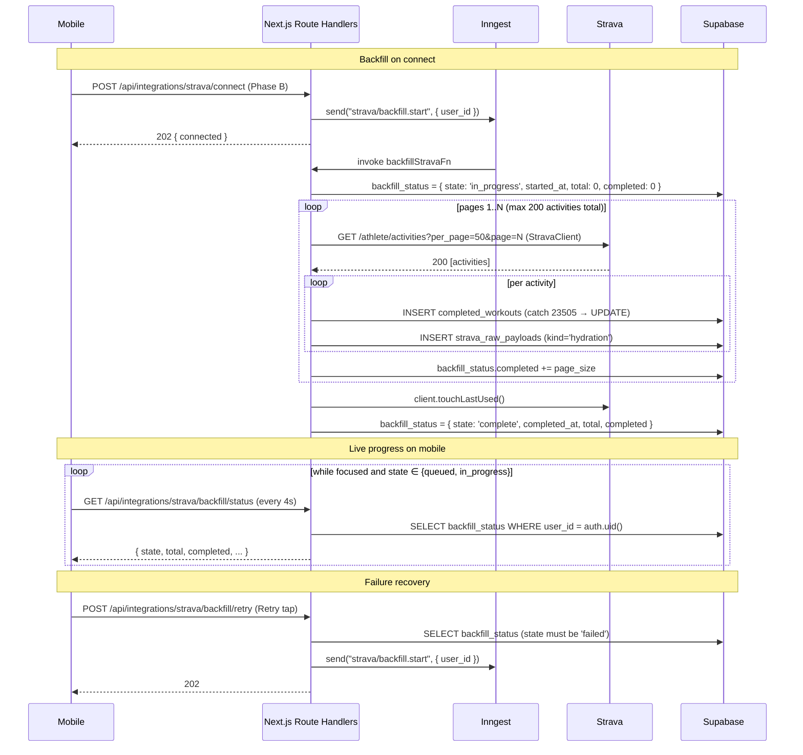

# Strava Phase C — Backfill + User-Facing Progress

## Enhancement Summary

**Deepened on:** 2026-05-16 (same day as plan creation, /effort max + ultrathink).
**Sections enhanced:** all (Overview through Sources).
**Research agents used:** security-sentinel, performance-oracle, data-integrity-guardian, architecture-strategist, kieran-typescript-reviewer, code-simplicity-reviewer, pattern-recognition-specialist, julik-frontend-races-reviewer, data-migration-expert, best-practices-researcher (Inngest), framework-docs-researcher (Strava/Supabase/Expo), plus API-contract and reliability passes.

### Key Improvements (apply during implementation)

1. **Use `per_page=200` × 1 page, not 50 × 4.** Cuts Strava read budget 4×; still allows progress display via UI animation between mark-in-progress and mark-complete. (Source: Strava docs + framework-docs research; corrects performance.)
2. **Replace the separate `backfillStravaFailedFn` with the built-in `onFailure` option on `createFunction`.** Inngest's documented idiom; gives typed access to the original event (no nested `event.data.event.data.user_id`); colocates failure handling; cannot drift on rename. (Source: Inngest research + architecture review.)
3. **Throw `NonRetriableError` for `StravaReauthRequired` and `StravaKeyRotationError` instead of `return`ing cleanly.** `NonRetriableError` halts retries AND triggers `onFailure` — so the `failed`/`needs_reauth` state write happens via the central handler, not duplicated per error class. (Source: Inngest research.)
4. **Use `RetryAfterError` for 429 backoff** (purpose-built; consumes one retry attempt with a custom delay). Strava does NOT document a `Retry-After` header — compute delay by parsing `X-RateLimit-Usage` to next 15-min boundary. (Source: Strava docs + Inngest research.)
5. **Fix the broken auth helper.** Plan referenced `createServerSupabaseClient()` which doesn't exist in this repo. Use the established pattern: `const supabase = await createServerClient();` (from `@/auth/server`) + `const { user, error } = await resolveAuth(supabase, request);` (from `@/auth/bearer`). The Bearer pattern is required for mobile JWT auth. (Source: security review + repo conventions.)
6. **Add `Origin` / `Sec-Fetch-Site` check on the retry POST.** JWT-bound POSTs in this codebase have no SameSite cookie protection; the retry endpoint is the first new JWT-only POST and needs an explicit CSRF posture. (Source: security review.)
7. **Do NOT return raw activity payloads from `step.run`.** Inngest stores all step return values in Inngest Cloud unencrypted. Strava activities contain GPS, heart-rate, device-id PII — the same data the project refuses to ship over Realtime. Persist inside the step; return `{ inserted: N }`. Optionally adopt `@inngest/middleware-encryption` for end-to-end step encryption. (Source: security review.)
8. **Drop `/api/integrations/strava/backfill/status` endpoint.** Mobile reads `athlete_profiles.backfill_status` directly via supabase-js with JWT-bound RLS. Eliminates a route + test file + network hop. Schema contract still lives in `packages/shared`. (Source: simplicity + architecture reviews.)
9. **Move backfill schemas to `packages/shared/src/strava-backfill.ts`** (new file). Add typed error-code enums (`StravaBackfillRetryErrorCodeSchema`) and response-envelope schemas. Phase B established this pattern (`strava-connect.ts`); Phase C must match. Tighten `error_code` to a closed `z.enum([...])` so it can't leak arbitrary `err.message` strings into the DB and onto the device. (Source: pattern + security + API contract reviews.)
10. **Use a single discriminated-union-by-state schema** (`state` optional → empty default parses as `state: undefined`), not `z.union([z.object({}).strict(), BackfillStatusSchema])`. Removes the "is `state` in this object?" branch from every consumer. (Source: TypeScript review.)
11. **Always normalize the empty default to `{ provider: "strava", state: "queued" }`** on the read path. The mobile reducer should never see `{}` — it has no defined transition for it. (Source: architecture + migration + reliability reviews; all flagged this independently.)
12. **Monotonic count merge in the mobile reducer.** `completed = Math.max(prev, incoming)`; never let the counter tick backward (Retry → server writes `queued` with no `completed` → UI must keep showing the prior count). (Source: frontend races + reliability + architecture reviews.)
13. **Polling hook lifecycle hardening (`use-backfill-status.ts`):** (a) use `AbortController` for in-flight cancellation, (b) `useRef` the `onStatus` callback so a parent re-render doesn't trigger a tight polling loop, (c) `clearTimeout` in cleanup, (d) `AppState` listener to force a refetch on `active`, (e) capped exponential backoff on error (max ~5 attempts). The plan's current hook has 3 HIGH-severity races. (Source: frontend races review.)
14. **Promote `INNGEST_SIGNING_KEY` and `INNGEST_EVENT_KEY` from warn-only to hard-fail in production** (`apps/web/src/config.ts`). Phase C is the first dependent consumer; without signing, `/api/inngest` accepts unsigned POSTs and an attacker can forge `strava/backfill.start` for any `user_id`. (Source: security + data-integrity reviews.)
15. **Add Postgres CHECK constraint** on `backfill_status` for well-formed-ness (object type, state enum if present). Belt-and-suspenders against admin tools / fixtures writing garbage. (Source: data-integrity + migration reviews.)
16. **Add user-existence pre-check at function start.** If `users` row was deleted (account deletion cascade) between connect and worker pickup, return cleanly without burning retries. (Source: data-integrity review.)
17. **Add Zod parse for Strava response bodies** in place of `as StravaActivity[]` cast. Validates at the boundary per repo conventions. (Source: TypeScript review.)
18. **Add `StravaKeyRotationError` catch branch** in the function. Currently falls through to generic retry path — burns 3+ retries on a deterministic operator-action-required failure. (Source: TypeScript review.)
19. **Define `classifyError`'s contract explicitly** (closed return type, no `err.message` echo). (Source: TypeScript + security reviews.)
20. **Specify reducer transition for the empty / `queued` state** + add a `backfill_retrying` state for the Retry-in-flight window. (Source: architecture + frontend races reviews.)
21. **Use `process.env.EXPO_PUBLIC_API_URL`** (current Expo SDK 50+ idiom), not `Constants.expoConfig?.extra?.apiUrl` (legacy). (Source: framework-docs research.)
22. **Use `supabase.auth.getClaims()`** in server handlers (2026 Supabase idiom; signature-validates JWT locally), not `getUser()`. (Source: framework-docs research.)
23. **Add an Inngest watchdog function** (scheduled every 15 min) that demotes `in_progress` rows older than 10 min to `failed`. Move from "Future Considerations" into Phase C scope — it's the only recovery path for several failure modes the plan acknowledges. (Source: reliability review.)
24. **Add Inngest `idempotencyKey: "{{event.data.user_id}}"`** with a short window (60s) to backfill events. Prevents reconnect-spam from queueing 5 redundant runs. (Source: performance review.)

### New Considerations Discovered

- **Inngest Cloud storage of step state is a PII surface.** Anything you return from `step.run` is stored unencrypted in Inngest's database and visible in their dashboard. This is the most important security finding from the deepen pass.
- **The Phase C ↔ Phase D transport boundary is undocumented.** Phase C uses polling on `athlete_profiles.backfill_status`; Phase D's webhook hydration will push `completed_workouts` over Realtime. Document the rule: backfill state = polling; per-workout updates = Realtime.
- **The lost-update risk on `completed_workouts` is real once Phase D ships.** Backfill and webhook hydration both write the same `(athlete_id, strava_activity_id)` rows; INSERT-catch-23505-UPDATE absorbs duplicates but doesn't prevent older data from clobbering newer data. Pin a `last_updated_at` discriminator before Phase D lands.
- **`per_page=200` × 1 page eliminates ~75% of intra-page step boundaries.** Combined with `RetryAfterError`, the function shrinks from ~14 steps to ~3 (mark-in-progress, fetch-and-persist, mark-complete via `onFailure` or success path).
- **Inngest billing/quota:** each `step.run` is metered separately. The plan's 14-step shape × 1000 backfills/month is ~14k executions — well within free tier but worth knowing as Phase D adds more functions.
- **Strava ToS does not numerically cap historical backfills**, but §2.14(d) forbids using Strava data for ML model training. Relevant when Phase E/F adds AI insights — verify before training.
- **Strava device-attribution requirement (Oct 2025 rollout):** if Phase D ever surfaces device info in the UI, the device maker (Garmin, Wahoo, Apple) must be attributed. Out of Phase C scope, flag for Phase D.

### Severity Map of Findings

| Severity | Count | Examples |
|---|---|---|
| Critical | 2 | Broken auth helper name (`createServerSupabaseClient`); step.run return-value PII to Inngest Cloud |
| High | 8 | Inngest signing-key warn-only; missing `StravaKeyRotationError` branch; reducer empty-state undefined; unmemoized `onStatus` tight loop; count can tick backward; `error_code` open string; classifyError unspecified; lost-update vs Phase D |
| Medium | 12 | TOCTOU on retry; error envelope drift from Phase B; logger format inconsistency; insertHydrationPayload duplication on retry; per-page step over-decomposition; `touchLastUsed` placement; etc. |
| Low | 10 | COMMENT not enforced; redundant `.eq` (keep — actually a 95% perf win); rollback path documentation; etc. |

The two Critical items must be fixed before merging C2. The High items should all be addressed in the same PR. Mediums and lows are amendments to land during implementation.

---

## Overview

Phase C closes the Strava integration loop: an Inngest function paginates the athlete's last 200 Strava activities on first connect, normalizes them, persists to `completed_workouts` + `strava_raw_payloads`, and tracks state in `athlete_profiles.backfill_status`. The mobile Strava section shows live progress, distinguishes `failed` (Retry) from `needs_reauth` (Reconnect), and flips silently to a "Connected — N activities imported" terminal state. Backend transients are absorbed by Inngest's built-in retries before any failure reaches the athlete.

Phase C is the first concrete consumer of the Phase A/B foundations: token crypto, StravaClient, the Inngest singleton, and the mobile reducer.

## Problem Statement

Phase B shipped the OAuth handshake but the mobile "connected" state currently renders a static placeholder ("Backfilling your recent activities — we'll show progress here soon.") and no backend reads it. From the athlete's perspective, connecting Strava does nothing visible.

Phase C must:
1. Make the Strava connection produce real, queryable data (the 200-activity history backing R2).
2. Make the connection *feel* real — live progress, clear failure recovery, distinct CTAs for `failed` vs `needs_reauth`.
3. Lay groundwork for Phase D (webhook → hydrate → match) by establishing the `completed_workouts` write pattern and the Inngest function registry.

## Proposed Solution

**Backend** (units C1, C2):
- One additive migration adds `backfill_status JSONB` to `athlete_profiles`.
- One Inngest function (`strava/backfill.start` listener) paginates `/athlete/activities`, writes one row at a time using INSERT-catch-23505-UPDATE (the documented supabase-js workaround for partial unique indexes), updates `backfill_status` per page, and absorbs transient failures via Inngest's built-in retries. Terminal failures land in `failed` or `needs_reauth`.

**Mobile** (units C3, C4):
- Extend the existing Phase B reducer with backfill substates (`backfill_in_progress { count, total }`, `backfill_complete { count }`, `backfill_failed`). Reuse the existing `needs_reauth` state already wired in Phase B.
- Use `useFocusEffect` + polling (every 4s while focused and state is non-terminal) to read `backfill_status`. Polling is the deliberate choice — see Key Decisions.
- Retry tap → `POST /api/integrations/strava/backfill/retry` (new endpoint) → re-enqueues `strava/backfill.start`. Reconnect tap → re-runs the existing Phase B OAuth flow.

## Technical Approach

### Architecture



### Implementation Units

#### Unit C1: Add `backfill_status` column to `athlete_profiles` + shared schemas (1 PR)

**Goal:** Additive migration with CHECK constraint; shared Zod schemas in new `strava-backfill.ts` module; integration test that proves trigger isolation and CHECK enforcement.

**Requirements:** R2.

**Dependencies:** None (purely additive).

**Must-fix items applied from /deepen-plan (R.14):**
- ✅ Schemas live in new `packages/shared/src/strava-backfill.ts` (not `athlete-profile.ts`) per R.8
- ✅ Single-object schema with optional `state` (not `z.union([empty, populated])`) per R.13
- ✅ Closed `error_code` enum (no raw `err.message` leak channel) per R.2
- ✅ Postgres CHECK constraint enforces well-formed-ness per R.3
- ✅ Rollback comment + `lock_timeout` per R.3
- ✅ Pre-flight checks documented (see Verification)

**Files:**
- Create: `supabase/migrations/0009_athlete_profiles_backfill_status.sql`
- Create: `packages/shared/src/strava-backfill.ts` — `BackfillStatusColumnSchema`, `StravaBackfillErrorCodeSchema`, `StravaBackfillRetryErrorCodeSchema`, `StravaBackfillRetryResponseSchema`, `StravaBackfillRetryErrorResponseSchema`.
- Modify: `packages/shared/src/athlete-profile.ts` — add `backfill_status: BackfillStatusColumnSchema` to the row Zod schema (imports from `./strava-backfill`).
- Modify: `packages/shared/src/__tests__/athlete-profile.test.ts` — add roundtrip + state-enum scenarios + empty-default-parses scenarios.
- Modify: `packages/shared/src/index.ts` — re-export all the new symbols from `strava-backfill.ts`.
- Create: `packages/shared/src/__tests__/strava-backfill.test.ts` — Zod test (each state value parses; closed enum rejects arbitrary strings; empty-default parses with `state: undefined`).
- Create: `apps/web/src/db/__tests__/athlete-profile-backfill-status.test.ts` — DB test for: trigger isolation (lockstep trigger no-ops); CHECK constraint enforcement (23514 on malformed JSONB); service-role write succeeds; athlete-self SELECT works through RLS; cross-user SELECT blocked.

**Migration:** See the SQL block under "Updated migration" further down in this Unit — it includes the CHECK constraint, `lock_timeout`, and rollback comment.

**Zod schemas (in NEW file `packages/shared/src/strava-backfill.ts`)** — single object with optional `state` per R.8 + R.13; closed `error_code` enum per R.2:
```typescript
import { z } from "zod";

// Closed enum — never leak raw err.message into the DB / mobile UI
export const StravaBackfillErrorCodeSchema = z.enum([
  "needs_reauth",
  "rate_limited",
  "key_rotation",
  "max_retries_exhausted",
  "watchdog_demoted",
  "network",
  "corrupt_state",
  "unknown",
]);
export type StravaBackfillErrorCode = z.infer<typeof StravaBackfillErrorCodeSchema>;

// Single shape with optional state — empty default {} parses as { state: undefined }
export const BackfillStatusColumnSchema = z.object({
  provider: z.literal("strava").optional(),
  state: z.enum(["queued", "in_progress", "complete", "failed", "needs_reauth"]).optional(),
  estimated_total: z.number().int().nonnegative().optional(),
  completed: z.number().int().nonnegative().optional(),
  started_at: z.string().datetime({ offset: true }).optional(),
  completed_at: z.string().datetime({ offset: true }).optional(),
  error_code: StravaBackfillErrorCodeSchema.optional(),
  attempt: z.number().int().positive().optional(),
}).strict();
export type BackfillStatusColumn = z.infer<typeof BackfillStatusColumnSchema>;

// Retry endpoint contracts (R.4)
export const StravaBackfillRetryErrorCodeSchema = z.enum([
  "unauthorized",
  "no_strava_connection",
  "already_in_progress",
  "needs_reconnect",
  "enqueue_failed",
  "internal_error",
]);
export type StravaBackfillRetryErrorCode = z.infer<typeof StravaBackfillRetryErrorCodeSchema>;

export const StravaBackfillRetryResponseSchema = z.object({
  status: z.literal("queued"),
  backfill_status: BackfillStatusColumnSchema,
});
export const StravaBackfillRetryErrorResponseSchema = z.object({
  error: StravaBackfillRetryErrorCodeSchema,
});
```
Re-export everything from `packages/shared/src/index.ts`. `athlete-profile.ts` then imports `BackfillStatusColumnSchema` as the column type — no need to define schemas in two places.

**Updated migration** (per R.3 — add Postgres CHECK constraint, rollback comment, lock_timeout):
```sql
-- supabase/migrations/0009_athlete_profiles_backfill_status.sql
--
-- Backfill status JSONB on athlete_profiles. Phase C of Strava integration.
-- See: docs/plans/2026-05-16-001-feat-strava-phase-c-backfill-plan.md (Unit C1).
--
-- DDL safety:
-- - Default '{}'::jsonb is IMMUTABLE; ALTER is metadata-only (Postgres 11+ fast path).
-- - ACCESS EXCLUSIVE held for catalog update only; microseconds at current scale.
-- - No row rewrite. No realtime publication change (athlete_profiles is and remains forbidden).
--
-- Rollback:
--   ALTER TABLE public.athlete_profiles DROP COLUMN backfill_status;
-- Lossy but safe: backfill_status is derived state. To restore, re-enqueue
-- strava/backfill.start for every connected user_id (cf. strava_tokens rows).

SET lock_timeout = '5s';

ALTER TABLE public.athlete_profiles
  ADD COLUMN backfill_status JSONB NOT NULL DEFAULT '{}'::jsonb;

-- R.3: well-formed-ness guard; defense in depth against admin/fixture writes
-- that bypass the Zod boundary.
ALTER TABLE public.athlete_profiles
  ADD CONSTRAINT athlete_profiles_backfill_status_well_formed CHECK (
    jsonb_typeof(backfill_status) = 'object'
    AND (
      backfill_status = '{}'::jsonb
      OR (
        backfill_status ? 'state'
        AND jsonb_typeof(backfill_status -> 'state') = 'string'
        AND (backfill_status ->> 'state') IN ('queued','in_progress','complete','failed','needs_reauth')
        AND (NOT backfill_status ? 'provider' OR (backfill_status ->> 'provider') = 'strava')
      )
    )
  );

RESET lock_timeout;

COMMENT ON COLUMN public.athlete_profiles.backfill_status IS
  'Per-provider backfill state. Service-role writes only (Inngest backfill worker). '
  'NOT in supabase_realtime publication (athlete_profiles is forbidden per AGENTS.md). '
  'Mobile reads via supabase-js with JWT-bound RLS (4s focus-polling). '
  'Shape pinned by BackfillStatusColumnSchema in packages/shared/src/strava-backfill.ts. '
  'Empty object {} = pre-Phase-C row or never-connected; consumer treats as implicit "queued".';
```

**Test scenarios:**
- *Happy path:* migration applies; column exists; default is `{}`.
- *CHECK constraint:* `UPDATE ... SET backfill_status = '"string"'::jsonb` returns 23514. `{state: "bogus"}` returns 23514. `{state: "queued"}` succeeds.
- *Trigger isolation:* update `backfill_status` via service role → `manual_field_edited_at` unchanged (lockstep trigger no-ops because `manual_fields` not in NEW row delta).
- *Zod roundtrip:* each `state` value parses; unknown state rejected; empty `{}` parses with `state: undefined`.
- *Closed error_code:* attempting to write `{state: "failed", error_code: "arbitrary string"}` via Zod rejects.
- *RLS:* authenticated athlete can SELECT their own row including `backfill_status`; another athlete cannot.

**Verification:**
- DB test passes against `supabase start`.
- `pnpm typecheck` and `pnpm test` green in `packages/shared` and `apps/web`.
- **Pre-flight checks against the target DB before deploying** (per R.3):
  - `SELECT count(*) FROM public.athlete_profiles;` — confirm small N (≤100 in dev/prod today)
  - `SELECT column_name FROM information_schema.columns WHERE table_schema='public' AND table_name='athlete_profiles' AND column_name='backfill_status';` — confirm 0 rows (column not already added)
  - `SELECT tablename FROM pg_publication_tables WHERE pubname='supabase_realtime' AND tablename='athlete_profiles';` — confirm 0 rows (realtime guard still intact)
- **Post-deploy verification:**
  - Column exists with `'{}'::jsonb` default
  - All existing rows have `backfill_status = '{}'::jsonb`
  - CHECK constraint `athlete_profiles_backfill_status_well_formed` exists
  - Smoke test rejects `'"queued"'::jsonb` (string not object) with 23514

---

#### Unit C2: Backfill Inngest function + retry endpoint (1 PR)

**Goal:** The actual backfill — paginate, normalize, persist, update status. Plus the retry endpoint. Mobile reads status directly via supabase-js + RLS (no status endpoint needed; see R.5).

**Requirements:** R1, R2, R5, R6, R8.

**Dependencies:** C1; Phase A (token crypto, sport normalization, Inngest singleton); Phase B (StravaClient, connect route's event emission).

**Must-fix items applied from /deepen-plan (R.14):**
- ✅ Status endpoint removed — mobile reads via supabase-js + RLS
- ✅ `createServerSupabaseClient()` → `createServerClient()` + `resolveAuth()` for Bearer-auth from mobile
- ✅ Built-in `onFailure` option (no separate function); `NonRetriableError` for permanent failures; `RetryAfterError` for 429
- ✅ `step.run` does not return raw activity payloads (Inngest Cloud PII)
- ✅ Closed `error_code` enum (no raw `err.message` leak)
- ✅ Per-page collapsed to single `process-page-N` step; `per_page=200` × 1 page
- ✅ Promote `INNGEST_SIGNING_KEY` and `INNGEST_EVENT_KEY` to `requireProd` in `config.ts` (config change, in this PR)

**Files:**
- Create: `apps/web/src/strava/backfill-helpers.ts` — pure named helpers: `markBackfillInProgress`, `processActivityPage`, `markBackfillComplete`, `normalizeActivity`. No Inngest primitives.
- Create: `apps/web/src/inngest/functions/backfill-strava.ts` — Inngest function wrapper around the helpers.
- Create: `apps/web/src/inngest/functions/backfill-watchdog.ts` — scheduled watchdog (every 15 min) that demotes `in_progress` rows older than 10 min to `failed` (see R.10).
- Modify: `apps/web/src/inngest/functions/index.ts` — register `backfillStravaFn` and `backfillWatchdog`.
- Create: `apps/web/src/db/completed-workouts.ts` — `insertOrUpdateStravaCompletedWorkout(admin, row)` helper using INSERT + catch 23505 + UPDATE.
- Create: `apps/web/src/db/strava-raw-payloads.ts` — `insertHydrationPayload(admin, { user_id, payload })` with whitelist sanitizer (no `streams` field per R18).
- Create: `apps/web/src/db/backfill-status.ts` — `updateBackfillStatus(admin, user_id, status: BackfillStatus)` (full-object replace, no partial merges per R.3).
- Create: `apps/web/app/api/integrations/strava/backfill/retry/route.ts` — `POST` handler.
- Create: `packages/shared/src/strava-backfill.ts` — `BackfillStatusSchema`, `BackfillStatusColumnSchema`, `StravaBackfillErrorCodeSchema` (closed enum), `StravaBackfillRetryErrorCodeSchema`, `StravaBackfillRetryResponseSchema`. Re-export from `packages/shared/src/index.ts`.
- Create: `apps/web/src/strava/schemas.ts` — `StravaActivitySchema` Zod schema (validates `/athlete/activities` response; no `as` cast).
- Modify: `apps/web/src/config.ts` — promote `INNGEST_SIGNING_KEY` and `INNGEST_EVENT_KEY` from `warnings.push` to `requireProd`.
- Modify: `apps/web/src/strava/errors.ts` — add `classifyError(err: unknown): StravaBackfillErrorCode` with closed return type.
- Create: `apps/web/src/strava/__tests__/backfill-helpers.test.ts` — unit tests for the pure helpers.
- Create: `apps/web/src/inngest/functions/__tests__/backfill-strava.test.ts` — Inngest function test using `@inngest/test`.
- Create: `apps/web/app/api/integrations/strava/backfill/retry/__tests__/route.test.ts`
- Modify: `apps/web/src/strava/__tests__/msw-handlers.ts` — extend with `/athlete/activities` GET handler (single response, since per_page=200 × 1 page).
- Modify: `apps/web/package.json` — add `@inngest/test` to devDependencies; regenerate `pnpm-lock.yaml`.
- Create: `docs/solutions/strava-backfill-operations.md` — runbook for stuck-status recovery, Inngest event re-fire, log queries.

**Function definition** (incorporates R.2 fixes — built-in `onFailure`, `NonRetriableError`/`RetryAfterError`, no payload in step returns, `per_page=200`, user-existence pre-check, Zod parse, single per-page step):
```typescript
// apps/web/src/inngest/functions/backfill-strava.ts
import { NonRetriableError, RetryAfterError } from "inngest";
import { z } from "zod";
import { inngest } from "@/inngest/client";
import { createAdminClient } from "@/db/admin";
import { createStravaClient } from "@/strava/client";
import {
  StravaReauthRequired,
  StravaRateLimited,
  StravaKeyRotationError,
  classifyError,
} from "@/strava/errors";
import { StravaActivitySchema } from "@/strava/schemas";
import { updateBackfillStatus } from "@/db/backfill-status";
import {
  markBackfillInProgress,
  processActivityPage,
  markBackfillComplete,
  userExists,
  computeRateLimitBackoffMs,
} from "@/strava/backfill-helpers";

const MAX_ACTIVITIES = 200;
const PER_PAGE = 200; // Strava max; 1 request covers the whole backfill (R.2)

export const backfillStravaFn = inngest.createFunction(
  {
    id: "strava-backfill",
    name: "Strava backfill on first connect",
    retries: 4, // Inngest default; absorbs transients before user sees 'failed'
    concurrency: [
      { limit: 50 },                                            // account ceiling
      { scope: "fn", key: "event.data.user_id", limit: 1 },     // per-user serial
    ],
    idempotency: "event.data.user_id",                          // 60s dedupe window
    onFailure: async ({ event, error, step, logger }) => {
      // event.data.event.data is the ORIGINAL triggering event
      const userId = z.string().uuid().parse(event.data.event.data.user_id);
      const admin = createAdminClient();
      const errorCode = error.name === "NonRetriableError"
        ? (classifyError(error) === "needs_reauth" ? "needs_reauth" : "key_rotation")
        : "max_retries_exhausted";
      const finalState = errorCode === "needs_reauth" ? "needs_reauth" : "failed";
      await step.run("mark-terminal", () =>
        updateBackfillStatus(admin, userId, {
          provider: "strava",
          state: finalState,
          error_code: errorCode,
        })
      );
      logger.error(`[strava.backfill] backfill_${finalState}`, { user_id: userId, error_code: errorCode });
    },
  },
  { event: "strava/backfill.start" },
  async ({ event, step, logger }) => {
    const { user_id } = event.data;
    const admin = createAdminClient();

    // R.2: user-existence pre-check; bail cleanly if account was deleted.
    if (!(await userExists(admin, user_id))) {
      logger.warn("[strava.backfill] backfill_aborted_user_deleted", { user_id });
      return;
    }

    await step.run("mark-in-progress", async () => {
      await markBackfillInProgress(admin, user_id);
      logger.info("[strava.backfill] backfill_started", { user_id });
    });

    try {
      const client = createStravaClient(user_id, admin);
      let page = 1;
      let totalImported = 0;

      while (totalImported < MAX_ACTIVITIES) {
        // R.2: combined fetch+persist+progress step. Returns COUNT ONLY
        // (no PII in step state stored by Inngest Cloud).
        const result = await step.run(`process-page-${page}`, async () => {
          const res = await client.fetch(
            `/athlete/activities?per_page=${PER_PAGE}&page=${page}`
          );
          if (res.status === 429) {
            // Don't reuse client's StravaRateLimited; throw RetryAfterError directly
            const delayMs = computeRateLimitBackoffMs(res);
            throw new RetryAfterError("strava_rate_limited", delayMs);
          }
          if (!res.ok) throw new Error(`strava_${res.status}`); // generic; redacted
          // Validate with Zod (no `as` cast per R.2)
          const activities = z.array(StravaActivitySchema).parse(await res.json());
          const inserted = await processActivityPage({
            admin,
            userId: user_id,
            activities,
            cap: MAX_ACTIVITIES - totalImported,
          });
          // Inline progress write — saves a separate step boundary
          await updateBackfillStatus(admin, user_id, {
            provider: "strava",
            state: "in_progress",
            completed: totalImported + inserted,
            estimated_total: MAX_ACTIVITIES,
          });
          return { inserted, hasMore: activities.length === PER_PAGE };
        });

        totalImported += result.inserted;
        if (!result.hasMore || result.inserted === 0) break;
        page += 1;
      }

      await step.run("mark-complete", async () => {
        await markBackfillComplete({ admin, client, userId: user_id, total: totalImported });
        logger.info("[strava.backfill] backfill_complete", { user_id, total: totalImported });
      });
    } catch (err) {
      if (err instanceof StravaReauthRequired) {
        // R.2: NonRetriableError halts retries AND triggers onFailure
        throw new NonRetriableError("strava_reauth_required", { cause: err });
      }
      if (err instanceof StravaKeyRotationError) {
        throw new NonRetriableError("strava_key_rotation", { cause: err });
      }
      if (err instanceof StravaRateLimited) {
        // From StravaClient's body-inspection path; convert to typed retry
        throw new RetryAfterError("strava_rate_limited", computeRateLimitBackoffMs(null));
      }
      // R.2: redact error message before re-throw so Inngest history
      // never stores raw err.message (could contain PostgREST hint: fragments).
      const code = classifyError(err);
      logger.error("[strava.backfill] backfill_attempt_failed", { user_id, error_code: code });
      throw new Error(code); // bare code, no message echo
    }
  },
);
```

**Watchdog function** (R.10 — scheduled, every 15 min):
```typescript
// apps/web/src/inngest/functions/backfill-watchdog.ts
export const backfillWatchdog = inngest.createFunction(
  { id: "strava-backfill-watchdog", name: "Strava backfill watchdog" },
  { cron: "*/15 * * * *" },
  async ({ step, logger }) => {
    const admin = createAdminClient();
    const stuck = await step.run("find-stuck", async () => {
      // service-role: cross-user query is the watchdog's purpose
      const { data } = await admin
        .from("athlete_profiles")
        .select("user_id, backfill_status")
        .filter("backfill_status->>state", "eq", "in_progress")
        .lt("backfill_status->>started_at", new Date(Date.now() - 10 * 60 * 1000).toISOString());
      return data ?? [];
    });
    for (const row of stuck) {
      await step.run(`demote-${row.user_id}`, async () => {
        await updateBackfillStatus(admin, row.user_id, {
          provider: "strava",
          state: "failed",
          error_code: "watchdog_demoted",
        });
        logger.warn("[strava.backfill] watchdog_demoted", { user_id: row.user_id });
      });
    }
  },
);
```

**Retry endpoint** (R.4 fixes: real auth helpers, CSRF posture, shared error codes, TOCTOU-safe conditional UPDATE, send-first ordering, snapshot in response):
```typescript
// apps/web/app/api/integrations/strava/backfill/retry/route.ts
import { NextResponse } from "next/server";
import { createClient as createServerClient } from "@/auth/server";
import { resolveAuth } from "@/auth/bearer";
import { createAdminClient } from "@/db/admin";
import { inngest } from "@/inngest/client";
import {
  StravaBackfillRetryErrorCodeSchema,
  BackfillStatusColumnSchema,
  type StravaBackfillRetryErrorCode,
} from "@da2/shared";

function errorJson(code: StravaBackfillRetryErrorCode, status: number) {
  return NextResponse.json({ error: code }, { status });
}

function rejectCrossOrigin(request: Request): NextResponse | null {
  // R.4: CSRF posture on JWT-bound POST. Browsers don't send
  // Sec-Fetch-Site cross-origin without preflight.
  const sfs = request.headers.get("sec-fetch-site");
  if (sfs && sfs !== "same-origin" && sfs !== "none") {
    return errorJson("unauthorized", 403);
  }
  return null;
}

export async function POST(request: Request) {
  const csrfReject = rejectCrossOrigin(request);
  if (csrfReject) return csrfReject;

  const supabase = await createServerClient();
  const { user, error: authErr } = await resolveAuth(supabase, request);
  if (authErr || !user) return errorJson("unauthorized", 401);

  const admin = createAdminClient();

  // R.4: cross-check Strava token exists before enqueue, to prevent
  // backfills that will deterministically fail with needs_reauth.
  // service-role: explicit user filter required
  const { data: token } = await admin
    .from("strava_tokens")
    .select("user_id")
    .eq("user_id", user.id)
    .maybeSingle();
  if (!token) return errorJson("no_strava_connection", 422);

  // service-role: explicit user filter required (RLS-bypass write)
  // R.4: TOCTOU-safe — UPDATE only succeeds if state is 'failed';
  // two simultaneous Retry taps can't both pass + both enqueue.
  const newStatus = { provider: "strava" as const, state: "queued" as const };
  const { data: updated, error: updateErr } = await admin
    .from("athlete_profiles")
    .update({ backfill_status: newStatus })
    .eq("user_id", user.id)
    .filter("backfill_status->>state", "eq", "failed")
    .select("backfill_status");

  if (updateErr) {
    console.error("[strava.backfill.retry] db_error", JSON.stringify({
      user_id: user.id,
      error_class: updateErr.constructor?.name ?? "unknown",
    }));
    return errorJson("internal_error", 500);
  }

  if (!updated || updated.length === 0) {
    // Determine why the conditional UPDATE matched 0 rows
    const { data: cur } = await admin
      .from("athlete_profiles")
      .select("backfill_status")
      .eq("user_id", user.id)
      .maybeSingle();
    const current = BackfillStatusColumnSchema.parse(cur?.backfill_status ?? {});
    if (current.state === "needs_reauth") return errorJson("needs_reconnect", 422);
    if (current.state === "queued" || current.state === "in_progress") {
      return errorJson("already_in_progress", 409);
    }
    return errorJson("internal_error", 500);
  }

  try {
    await inngest.send({ name: "strava/backfill.start", data: { user_id: user.id } });
  } catch (err) {
    // R.4: revert column to 'failed' so the user can try again
    await admin
      .from("athlete_profiles")
      .update({ backfill_status: { provider: "strava", state: "failed", error_code: "enqueue_failed" } })
      .eq("user_id", user.id);
    console.error("[strava.backfill.retry] enqueue_failed", JSON.stringify({
      user_id: user.id,
      error_class: (err as { constructor?: { name?: string } })?.constructor?.name ?? "unknown",
    }));
    return errorJson("enqueue_failed", 502);
  }

  // R.4: return the new snapshot so mobile doesn't need a poll cycle
  // to see the state transition.
  return NextResponse.json(
    { status: "queued", backfill_status: BackfillStatusColumnSchema.parse(updated[0].backfill_status) },
    { status: 202 }
  );
}
```

**Status endpoint:** REMOVED. Mobile reads `athlete_profiles.backfill_status` directly via supabase-js with JWT (athlete-self RLS). See `use-backfill-status.ts` in Unit C3 for the read pattern. Saves a route + test file + network hop. Schema contract stays in `packages/shared/src/strava-backfill.ts`.

**INSERT-catch-23505-UPDATE helper:**
```typescript
// apps/web/src/db/completed-workouts.ts
export async function insertOrUpdateStravaCompletedWorkout(admin: SupabaseClient, row: CompletedWorkoutRow) {
  // service-role: explicit user filter required (row.athlete_id is the user_id)
  const { error } = await admin.from("completed_workouts").insert(row);
  if (!error) return;
  if (error.code !== "23505") throw error;

  // service-role: explicit user filter required
  await admin.from("completed_workouts").update({
    sport: row.sport,
    started_at: row.started_at,
    distance_m: row.distance_m,
    duration_s: row.duration_s,
    summary_stats: row.summary_stats,
  })
    .eq("athlete_id", row.athlete_id)
    .eq("strava_activity_id", row.strava_activity_id);
}
```

**Test scenarios:**
- *Happy path (`@inngest/test`):* fire `strava/backfill.start` → assert state transitions queued → in_progress → complete; assert N rows in `completed_workouts`; assert `touchLastUsed` called once.
- *Edge (zero activities):* fixture returns `[]` → state transitions queued → in_progress → complete with `completed: 0`.
- *Edge (partial < 200):* fixture returns 47 activities total → complete with `completed: 47`.
- *Edge (sport unknown):* `sport_type: "Pickleball"` in fixture → row stored with `sport='other'`.
- *Error (needs_reauth):* StravaClient throws `StravaReauthRequired` → catch raises `NonRetriableError` → `onFailure` writes `state='needs_reauth'`; Inngest does NOT retry; partial rows from page 1 remain.
- *Error (key rotation):* StravaClient throws `StravaKeyRotationError` → catch raises `NonRetriableError` → `onFailure` writes `state='failed', error_code='key_rotation'`.
- *Error (rate-limited):* Strava returns 429 → `RetryAfterError` thrown with computed backoff → Inngest waits then retries → eventual success.
- *Error (transient 5xx):* page returns 500 once → Inngest retries with default backoff → eventual success; user never sees `failed`.
- *Error (retries exhausted):* generic Error 5 times → `onFailure` fires → writes `state='failed', error_code='max_retries_exhausted'`.
- *User-deletion mid-flight:* delete user row after `mark-in-progress`; next step's `userExists` check returns false → function returns cleanly, no retries burned.
- *Inngest event-payload shape regression:* feed a real `inngest/function.failed` event into `onFailure`; assert the `z.string().uuid().parse(event.data.event.data.user_id)` extraction succeeds.
- *Idempotency:* run backfill twice with overlapping activities → no duplicate `completed_workouts` rows (23505 caught, UPDATE applied).
- *Concurrency:* two `strava/backfill.start` events for the same user_id arrive within 60s → `idempotency` dedupes the second; only one run executes.
- *Concurrency (>60s apart):* two events arrive 90s apart → both run, `concurrency.limit: 1` serializes; second is fully idempotent (rows already present).
- *Reconnect during in-progress:* drive backfill to `in_progress`; user re-runs OAuth (connect route re-emits event); concurrency key serializes; final state `complete` with rows from both runs absorbed.
- *Retry endpoint (state=failed):* POST returns 202 + snapshot in body + state becomes `queued` + event enqueued.
- *Retry endpoint (state=in_progress):* POST returns 409 `already_in_progress`.
- *Retry endpoint (state=needs_reauth):* POST returns 422 `needs_reconnect`.
- *Retry endpoint (no strava_tokens):* POST returns 422 `no_strava_connection`.
- *Retry endpoint (CSRF):* POST with `Sec-Fetch-Site: cross-site` returns 403.
- *Retry endpoint (TOCTOU):* two concurrent retries against `failed` state → first wins (202), second sees rowcount=0 and returns 409 (because subsequent SELECT shows `queued`).
- *Retry endpoint (enqueue failure):* mock `inngest.send` to throw → DB reverts to `failed` → 502 returned.
- *Watchdog:* seed an `in_progress` row with `started_at` >10 min ago → run watchdog → row demoted to `failed` with `error_code='watchdog_demoted'`.
- *Mobile read via RLS:* user A's JWT-bound supabase-js client cannot read user B's `backfill_status` (positive + negative test).
- *Logging audit:* grep diff for tokens, refresh_tokens, raw Strava error bodies, raw `err.message` echoes → zero hits.
- *Inngest run-history audit:* contrived failure injection; assert Inngest's stored error message for the run contains only the typed enum code, no `Bearer`, no `\x`-prefixed hex.

**Verification:**
- All tests pass.
- Manual: against local `supabase start` + `pnpm dev:inngest`, fire a `strava/backfill.start` event for a test user with seeded `strava_tokens` → backfill_status transitions visible in DB.

---

#### Unit C3: Mobile live progress + polling (1 PR)

**Goal:** Replace the static placeholder with a live progress indicator. Add Retry and Reconnect CTAs wired to the right code paths.

**Requirements:** R3, R4, R6, R7.

**Dependencies:** C1 (column exists), C2 (retry endpoint + shared schemas).

**Must-fix items applied from /deepen-plan (R.14):**
- ✅ Hook reads `athlete_profiles.backfill_status` directly via supabase-js JWT-bound client + RLS (no `/backfill/status` route)
- ✅ `useRef` for callback (prevents tight polling loop from parent re-renders)
- ✅ `AbortController` per effect run + explicit `clearTimeout` in cleanup
- ✅ Monotonic count merge in reducer (`Math.max(prev, incoming)`)
- ✅ `AppState` listener forces refetch on `active`
- ✅ Capped exponential backoff (4s, 8s, 16s, 30s, 60s; max 5 errors → surface error state)
- ✅ `backfill_retrying` state added (covers tap → next-poll gap)
- ✅ Empty-status normalization (server default `{}` → reducer treats as `queued` UI)
- ✅ Hook returns `{ status, isPolling, error, refetch }` (idiomatic React)

**Files:**
- Modify: `apps/mobile/src/integrations/strava-machine.ts` — extend the state union with backfill states + `backfill_retrying`; add monotonic-merge logic for `backfill_status_received`.
- Modify: `apps/mobile/src/integrations/strava.tsx` — replace the static `connected` branch; wire polling hook, Retry, Reconnect; memoize derived `enabled` flag.
- Create: `apps/mobile/src/integrations/use-backfill-status.ts` — RLS-bound supabase-js read + lifecycle-safe polling.
- Modify: `apps/mobile/src/integrations/__tests__/strava.test.tsx` — add scenarios for new states + monotonic count merge.
- Create: `apps/mobile/src/integrations/__tests__/use-backfill-status.test.ts` — hook unit test (renderHook + fake timers + abort assertions).

**Reducer extension** (R.7 — flat states with semantic field names + monotonic merge):
```typescript
// Add to state union:
| { kind: "backfill_in_progress"; athleteStravaId: number; completed: number; estimated_total: number }
| { kind: "backfill_complete"; athleteStravaId: number; importedCount: number }
| { kind: "backfill_failed"; athleteStravaId: number; partialImportedCount?: number; errorCode?: string }
| { kind: "backfill_retrying"; athleteStravaId: number; partialImportedCount?: number }

// Add to action union:
| { type: "backfill_status_received"; status: BackfillStatusColumn; athleteStravaId: number }
| { type: "retry_tapped" }
| { type: "retry_response"; success: boolean; snapshot?: BackfillStatusColumn }

// In reducer:
case "backfill_status_received": {
  // R.6: normalize empty default to 'queued' UI
  const state = action.status.state ?? "queued";
  const incomingCompleted = action.status.completed ?? 0;
  // R.6: monotonic merge — never let count tick backward
  const prevCompleted =
    state.kind === "backfill_in_progress" ? state.completed :
    state.kind === "backfill_failed" ? (state.partialImportedCount ?? 0) :
    state.kind === "backfill_retrying" ? (state.partialImportedCount ?? 0) : 0;
  const completed = Math.max(prevCompleted, incomingCompleted);
  switch (state) {
    case "queued":
    case "in_progress":
      return { kind: "backfill_in_progress", athleteStravaId: action.athleteStravaId,
               completed, estimated_total: action.status.estimated_total ?? 200 };
    case "complete":
      return { kind: "backfill_complete", athleteStravaId: action.athleteStravaId,
               importedCount: action.status.completed ?? 0 };
    case "failed":
      return { kind: "backfill_failed", athleteStravaId: action.athleteStravaId,
               partialImportedCount: completed, errorCode: action.status.error_code };
    case "needs_reauth":
      return { kind: "needs_reauth" };
  }
}
case "retry_tapped":
  if (state.kind !== "backfill_failed") return state;  // guard double-tap
  return { kind: "backfill_retrying", athleteStravaId: state.athleteStravaId,
           partialImportedCount: state.partialImportedCount };
case "retry_response":
  if (state.kind !== "backfill_retrying") return state;  // stale response
  if (!action.success) {
    return { kind: "backfill_failed", athleteStravaId: state.athleteStravaId,
             partialImportedCount: state.partialImportedCount };
  }
  // Use the snapshot from the retry response if provided (R.4 returns one)
  if (action.snapshot) {
    return reducer(state, { type: "backfill_status_received",
                            status: action.snapshot, athleteStravaId: state.athleteStravaId });
  }
  return { kind: "backfill_in_progress", athleteStravaId: state.athleteStravaId,
           completed: state.partialImportedCount ?? 0, estimated_total: 200 };
```

**Polling hook** (R.6 — RLS-bound direct read, AbortController, useRef, AppState, capped backoff, refetch):
```typescript
// apps/mobile/src/integrations/use-backfill-status.ts
import { useCallback, useEffect, useRef, useState } from "react";
import { useFocusEffect } from "expo-router";
import { AppState } from "react-native";
import { supabase } from "@/auth/supabase";
import { BackfillStatusColumnSchema, type BackfillStatusColumn } from "@da2/shared";

const BACKOFFS_MS = [4000, 8000, 16000, 30000, 60000];
const MAX_CONSECUTIVE_FAILURES = 5;

export function useBackfillStatus(enabled: boolean): {
  status: BackfillStatusColumn | null;
  isPolling: boolean;
  error: Error | null;
  refetch: () => void;
} {
  const [status, setStatus] = useState<BackfillStatusColumn | null>(null);
  const [isPolling, setIsPolling] = useState(false);
  const [error, setError] = useState<Error | null>(null);
  const tickRef = useRef<(() => Promise<void>) | null>(null);

  useFocusEffect(useCallback(() => {
    if (!enabled) return;
    const ac = new AbortController();
    let timeoutId: ReturnType<typeof setTimeout> | null = null;
    let inFlight = false;
    let failureCount = 0;
    setIsPolling(true);

    const tick = async () => {
      if (ac.signal.aborted || inFlight) return;
      inFlight = true;
      try {
        // R.6: RLS-bound direct DB read. The .eq is a 95% perf win
        // (Supabase RLS planner hint) + defense in depth.
        const { data, error: dbErr } = await supabase
          .from("athlete_profiles")
          .select("backfill_status")
          .eq("user_id", (await supabase.auth.getClaims()).data?.claims.sub ?? "")
          .abortSignal(ac.signal)
          .maybeSingle();
        if (ac.signal.aborted) return;
        if (dbErr) throw dbErr;
        const parsed = BackfillStatusColumnSchema.parse(data?.backfill_status ?? {});
        // R.6: normalize empty default to a 'queued' shape
        const normalized = parsed.state ? parsed : { provider: "strava" as const, state: "queued" as const };
        setStatus(normalized);
        setError(null);
        failureCount = 0;
        if (["complete", "failed", "needs_reauth"].includes(normalized.state ?? "")) {
          setIsPolling(false);
          return;
        }
      } catch (err) {
        if (ac.signal.aborted) return;
        const e = err instanceof Error ? err : new Error(String(err));
        if (e.name === "AbortError") return;
        failureCount += 1;
        setError(e);
        if (failureCount >= MAX_CONSECUTIVE_FAILURES) {
          setIsPolling(false);
          return;  // surface error state; user can pull to refresh
        }
      } finally {
        inFlight = false;
        if (!ac.signal.aborted && isPollingShouldContinue(status, failureCount)) {
          const delay = BACKOFFS_MS[Math.min(failureCount, BACKOFFS_MS.length - 1)];
          timeoutId = setTimeout(tick, delay);
        }
      }
    };
    tickRef.current = tick;
    tick();

    return () => {
      if (timeoutId) clearTimeout(timeoutId);
      ac.abort();
      tickRef.current = null;
      setIsPolling(false);
    };
  }, [enabled]));  // intentionally omit setState callbacks; they're stable

  // R.6: AppState listener forces refetch on foreground
  useEffect(() => {
    const sub = AppState.addEventListener("change", (next) => {
      if (next === "active" && tickRef.current) void tickRef.current();
    });
    return () => sub.remove();
  }, []);

  const refetch = useCallback(() => {
    if (tickRef.current) void tickRef.current();
  }, []);

  return { status, isPolling, error, refetch };
}

function isPollingShouldContinue(status: BackfillStatusColumn | null, failureCount: number): boolean {
  if (failureCount >= MAX_CONSECUTIVE_FAILURES) return false;
  if (!status || !status.state) return true;
  return !["complete", "failed", "needs_reauth"].includes(status.state);
}
```

**Caller wiring in `strava.tsx`** (key snippets):
```tsx
const enabled = useMemo(
  () => (state.kind === "connected"
      || state.kind === "backfill_in_progress"
      || state.kind === "backfill_retrying")
      && oauthState !== "opening"
      && oauthState !== "posting",
  [state.kind, oauthState]
);
const { status, refetch } = useBackfillStatus(enabled);
useEffect(() => {
  if (status) dispatch({
    type: "backfill_status_received",
    status,
    athleteStravaId: /* current */,
  });
}, [status]);

const onRetry = async () => {
  dispatch({ type: "retry_tapped" });
  try {
    const res = await api<{ status: "queued"; backfill_status: BackfillStatusColumn }>(
      "/api/integrations/strava/backfill/retry",
      { method: "POST" }
    );
    dispatch({ type: "retry_response", success: true, snapshot: res.backfill_status });
    refetch();  // immediate poll, no 4s dead air
  } catch {
    dispatch({ type: "retry_response", success: false });
  }
};
```

**UI surfaces:**
| State | Display | Brand mark | Primary action |
|---|---|---|---|
| `connected` (queued state) | "Importing your Strava activities…" + spinner | Powered by Strava | none |
| `backfill_in_progress` | "Importing 142 of ~200 activities…" + progress bar | Powered by Strava | none |
| `backfill_complete` (N > 0) | "Connected — 200 activities imported." | Powered by Strava | none |
| `backfill_complete` (N = 0) | "Connected to Strava — log a workout on Strava to see it here." | Powered by Strava | none |
| `backfill_failed` | "We couldn't finish importing your Strava activities." | Powered by Strava | Retry import (disabled after tap until next status response) |
| `needs_reauth` | "Strava connection expired." (existing copy) | Powered by Strava | Reconnect Strava (re-runs OAuth via existing `onConnect`) |

**Test scenarios:**
- *Polling:* hook calls status endpoint on focus; stops on terminal state; backs off on network error.
- *State transitions:* mock status responses driving reducer queued → in_progress → complete.
- *Retry tap:* button disables on tap; POST returns 202; next poll returns `queued`; button stays disabled until state transitions out of `failed`.
- *Reconnect tap:* invokes existing `onConnect` handler (verifies it's wired to the same Phase B flow, not Retry).
- *Zero activities:* status `complete` with `completed: 0` renders the zero-state copy.
- *Background return:* leave the screen, come back, polling resumes from current server state (not stale local state).

**Verification:**
- 6+ mock-based tests pass.
- Manual QA on EAS dev build: connect Strava → see progress count tick up → terminal state correctly displayed.
- Strava brand mark visible across all post-connect states.

---

### Alternative Approaches Considered

**Supabase Realtime subscription instead of polling.**
*Why considered:* sub-second latency; no client-side timer; pushes scale better.
*Why rejected:*
- AGENTS.md explicitly forbids `athlete_profiles` from `supabase_realtime` (PII in `manual_fields`); the realtime allow-list has CI guard against adding it.
- The alternative (introduce a narrow `backfill_progress` table just for realtime) adds a second source of truth, a join on every read, and a migration that touches cascade rules.
- No realtime subscription exists in mobile yet; this would be the first, requiring a websocket lifecycle pattern and bundle-size hit.
- For a 2-3 minute backfill, a 4s polling cadence is fast enough.

**Single `step.run` for the whole backfill vs many small steps.**
*Why considered:* simpler code; fewer Inngest invocations.
*Why rejected:* loses retry granularity. If `persist-page-3` fails after 2 pages persisted, the whole thing replays page 1+2 — wasted Strava API budget. Per-page steps memoize completed pages and only retry the failed one.

**Hard-fail on `needs_reauth` (throw instead of return).**
*Why considered:* simpler control flow.
*Why rejected:* Inngest treats throws as retry triggers. Throwing on `needs_reauth` would consume 3 retries before the `onFailure` handler fires; meanwhile the user sees `in_progress` indefinitely. Returning cleanly + writing state inside the function avoids this.

## System-Wide Impact

### Interaction Graph

`POST /connect` (Phase B) → emits `strava/backfill.start` → Inngest invokes `backfillStravaFn` → reads `strava_tokens` (service-role) → calls Strava `/athlete/activities` paginated → writes `completed_workouts` + `strava_raw_payloads` → updates `athlete_profiles.backfill_status` → if all retries exhaust, `inngest/function.failed` event fires → `backfillStravaFailedFn` writes terminal `failed`. Mobile polls `GET /backfill/status` while focused; reducer drives the displayed state. Retry tap → `POST /backfill/retry` (validates current state, re-enqueues).

### Error & Failure Propagation

- `StravaRateLimited` thrown by client → Inngest retry (backoff) → may eventually succeed; logged at each retry.
- `StravaReauthRequired` thrown by client → function returns cleanly + writes `needs_reauth`; Inngest does NOT retry.
- `StravaKeyRotationError` thrown by client → bubbles up as a generic error → Inngest retry; on exhaustion → `failed`. Operator action required (add missing key version to env).
- DB `23505` on `completed_workouts` → caught by `insertOrUpdateStravaCompletedWorkout` → UPDATE applied; not surfaced.
- DB error on `backfill_status` write → throws → Inngest retry; logged.
- Polling fetch error on mobile → silently retries with 8s backoff (UI stays on last known state).
- Retry endpoint enqueue failure → 502 to client; reducer transitions to `backfill_failed` (already current state); user can tap again.

### State Lifecycle Risks

- **Partial backfill on `needs_reauth`:** rows from completed pages persist. On reconnect, the backfill re-runs and the INSERT-catch-23505-UPDATE path absorbs duplicates idempotently. No orphan cleanup needed.
- **Partial backfill on terminal `failed`:** same. Retry tap re-runs from page 1; duplicates absorbed.
- **`backfill_status` stuck in `queued`:** can happen if the Inngest event was enqueued but the worker never picked it up (Inngest down). Retry tap reads `queued` → returns 409. Recovery: operator clears `backfill_status` manually, or Phase D adds a watchdog. Documented as a known operational risk.
- **`backfill_status` stuck in `in_progress`:** Inngest function crashed mid-run with no `onFailure` (extremely rare). Same recovery path as above.

### API Surface Parity

- `POST /api/integrations/strava/connect` (Phase B) and `POST /api/integrations/strava/backfill/retry` (new) both enqueue the same event. Connect is OAuth-bearing; Retry is JWT-only. The Inngest function doesn't distinguish.
- `GET /api/integrations/strava/backfill/status` is read-only; mirrors RLS for athlete-self read of `athlete_profiles`.

### Integration Test Scenarios

- **End-to-end against `supabase start` + Inngest dev:** create test user → seed `strava_tokens` → POST connect (or fire backfill.start) → poll status endpoint → state transitions queued → in_progress → complete → `completed_workouts` populated with the expected fixture data.
- **Reconnect after needs_reauth:** drive backfill into `needs_reauth` (StravaClient mock throws on page 2) → user re-runs OAuth → second backfill completes idempotently with no duplicate rows.
- **Concurrency:** fire two backfill.start events for the same user_id within 100ms → Inngest concurrency key serializes them; second completes as no-op (rows already present).
- **Retry endpoint state guard:** drive backfill to `in_progress` → POST retry → 409. Drive to `failed` → POST retry → 202.
- **Trigger isolation:** update `backfill_status` 5 times → `manual_field_edited_at` unchanged each time.

## Acceptance Criteria

### Functional Requirements

- [ ] R1: `strava/backfill.start` event triggers paginated import of up to 200 activities. (C2)
- [ ] R2: `athlete_profiles.backfill_status` transitions queued → in_progress → complete on success; `failed` / `needs_reauth` on terminal error. (C1, C2)
- [ ] R3: Mobile shows live count while screen is focused, updated within ~4s of backend progress. (C3)
- [ ] R4: Terminal `complete` shows "Connected — N activities imported"; zero-state copy when N=0. (C3)
- [ ] R5: Transient failures (5xx, rate limits) are absorbed by Inngest retries before reaching `failed`. (C2)
- [ ] R6: `failed` shows Retry button; tap re-enqueues via `/backfill/retry`; button disables after tap. (C2, C3)
- [ ] R7: `needs_reauth` shows Reconnect button; tap re-runs Phase B OAuth (existing flow). (C3)
- [ ] R8: Every backfill event (success and failure) emits a structured log entry with namespaced prefix `[strava.backfill.*]`. (C2)
- [ ] Multi-device: opening the Strava section on a second device renders the same progress count as the originator within one polling cycle. (C3)
- [ ] Remount after >30s background refetches status from server and renders canonical state. (C3, intrinsic to focus-effect polling)

### Non-Functional Requirements

- [ ] Backfill of 200 activities completes in ≤ 5 min under normal Strava API conditions.
- [ ] No tokens, refresh tokens, or raw Strava error bodies appear in logs (logging audit grep returns 0 hits).
- [ ] `athlete_profiles` does NOT appear in `supabase_realtime` publication (CI guard verifies).
- [ ] All `service-role` queries carry the `// service-role: explicit user filter required` comment.

### Quality Gates

- [ ] `pnpm typecheck && pnpm test` green in all touched packages.
- [ ] DB integration tests pass against local `supabase start`.
- [ ] Manual QA on EAS dev build covers connect → progress → complete and connect → needs_reauth → reconnect.
- [ ] `apps/web/src/db/__tests__/realtime-publication.test.ts` still passes (no allow-list change).

## Success Metrics

- An athlete connecting Strava on a real device sees the progress count tick up from 0 to N (N ≤ 200) within a few minutes, then a terminal "Connected — N activities imported" state, without any retry interaction.
- ≥ 95% of connect flows reach `complete` on the first attempt (assumes Strava API healthy; baseline established post-launch).
- Zero log entries containing token bytes or full Strava error bodies (grep audit).

## Dependencies & Risks

| Risk | Likelihood | Impact | Mitigation |
|---|---|---|---|
| Strava ToS limits historical backfill to fewer than 200 activities | Low | High | Listed as deferred research in the brainstorm. Implementer must verify before C2 ships and adjust `MAX_ACTIVITIES` + copy if needed. |
| `@inngest/test` API surface differs from what the plan assumes | Med | Low | First test is written exploratorily; refactor remaining tests once the pattern is pinned. Solution doc `inngest-setup.md` captures the convention. |
| Inngest event retention (3-day free tier) → if backfill_status gets stuck and the originating event has expired, manual recovery requires re-firing the event with `inngest.send` | Low | Med | Document recovery procedure in `docs/solutions/strava-backfill-operations.md`. |
| Mobile polling adds load to `GET /backfill/status` if many users connect simultaneously | Low | Med | 4s cadence + auto-stop on terminal state caps requests. Add cheap rate-limit later if needed. |
| `same_user_reconnect` (Phase B decision) re-emits `backfill.start` on every reconnect | Med | Low | Inngest concurrency key serializes; idempotent writes absorb. Acceptable. |
| Inngest signing key missing in dev → silent no-op | Low | Low | Already warned at boot in Phase A. Solution doc covers. |

## Resource Requirements

- 1 implementer; 2-3 days for C1+C2; 1-2 days for C3 including manual QA.
- Local: `supabase start`, `pnpm dev:inngest`, `next dev`.
- For manual QA: EAS dev build + Strava sandbox account with seeded activities.

## Future Considerations

- **Push notification on backfill complete:** explicitly out of scope. When a second push use case lands (e.g., new workout pushed by coach), add `expo-notifications` + push-token table + server-side SDK as one foundation, then trigger push from this function's `mark-complete` step.
- **Watchdog for stuck `backfill_status`:** a scheduled Inngest function that detects `in_progress` rows older than 1h and either retries or transitions to `failed`. Defer until incidence justifies.
- **Backfill window expansion:** v1 is last 200 activities. Future: last N days, sport-specific filters, full history. Schema change limited to `BackfillStatusSchema` extension; pagination loop already generic.
- **Server-side alerting:** add Sentry / Slack route for `[strava.backfill] backfill_failed` events once failure baselines are observable.

## Documentation Plan

- Update: `docs/solutions/inngest-setup.md` — append the `@inngest/test` pattern with a worked example from C2's test file.
- Create: `docs/solutions/strava-backfill-operations.md` — runbook for stuck `backfill_status` recovery, Inngest event re-fire procedure, log queries for grepping `[strava.backfill.*]` events in Vercel.
- Update: `docs/launch/strava-oauth-portal-setup.md` (Phase B doc) — note that Phase C now actively imports activities; brand-mark requirement extends to progress + done states.

## Research Insights (from /deepen-plan)

Findings below are organized by the section of the plan they amend. Severity tags: `[CRIT]`, `[HIGH]`, `[MED]`, `[LOW]`. Citations link to the agent that surfaced each item.

### R.1 — Architecture: polling vs Realtime (Unit C3)

- `[MED]` **Phase C ↔ Phase D transport boundary.** Phase C polls `athlete_profiles.backfill_status`; Phase D's webhook hydration will push `completed_workouts` over Realtime (already in allow-list). Document explicitly in Future Considerations: backfill state = polling; per-workout updates = Realtime. The Strava section's "imported activities" count is a derived view of the backfill cycle only — Phase D scope expansion is required for live post-backfill counts. *(architecture review)*
- `[KEEP]` The polling decision is correct. AGENTS.md forbids `athlete_profiles` from realtime; a separate `backfill_progress` table is rejected as second source of truth; mobile has no realtime precedent and a 4s cadence is fine for a 2-3 min flow. Do not re-decide.

### R.2 — Inngest function shape (Unit C2)

- `[HIGH]` **Use built-in `onFailure` option on `createFunction`**, not a separate `inngest/function.failed` listener. Documented idiomatic API:
  ```typescript
  inngest.createFunction(
    {
      id: "strava-backfill",
      retries: 4,                                              // 4 retries = 5 attempts; default
      concurrency: [
        { limit: 50 },                                          // global ceiling per account
        { scope: "fn", key: "event.data.user_id", limit: 1 },   // per-user serial
      ],
      idempotency: "event.data.user_id",                        // 60s dedupe window
      onFailure: async ({ event, error, step, logger }) => {
        // event.data.event.data is the ORIGINAL event (Inngest wraps it)
        const userId = event.data.event.data.user_id;
        await step.run("mark-backfill-failed", () =>
          updateBackfillStatus(admin, userId, {
            provider: "strava",
            state: "failed",
            error_code: classifyError(error) ?? "max_retries_exhausted",
          })
        );
      },
    },
    { event: "strava/backfill.start" },
    async ({ event, step, logger }) => { /* main handler */ }
  );
  ```
  Avoids: separate function id + magic-string filter (`event.data.function_id == 'strava-backfill'`) that breaks silently on rename. *(Inngest research, architecture review, data-integrity review.)*

- `[HIGH]` **Use `NonRetriableError` for permanent failures**, not clean `return`. `NonRetriableError` halts retries immediately AND triggers `onFailure`. A clean `return` skips both — the run shows as "completed" in the dashboard and `onFailure` never runs to write `state='failed'`. Rewrite the catch:
  ```typescript
  try { /* paginate + persist */ }
  catch (err) {
    if (err instanceof StravaReauthRequired) {
      // Use NonRetriableError so onFailure fires and writes 'needs_reauth'
      throw new NonRetriableError("strava_reauth_required", { cause: err });
    }
    if (err instanceof StravaKeyRotationError) {
      throw new NonRetriableError("strava_key_rotation", { cause: err });
    }
    if (err instanceof StravaRateLimited) {
      throw new RetryAfterError("strava_rate_limited", computeBackoffMs(err));
    }
    throw err;  // generic; let Inngest retry with default backoff
  }
  ```
  Then `onFailure` reads `event.data.error.name` to differentiate `failed` vs `needs_reauth`. *(Inngest research, TypeScript review.)*

- `[HIGH]` **Use `RetryAfterError` for 429 backoff.** Purpose-built; consumes one retry attempt with a custom delay. Strava does NOT document a `Retry-After` header — compute the delay from `X-RateLimit-Usage`:
  ```typescript
  function computeBackoffMs(_: StravaRateLimited): number {
    const now = new Date();
    const nextWindow = Math.ceil(now.getMinutes() / 15) * 15;
    const next = new Date(now);
    next.setMinutes(nextWindow, 0, 0);
    return next.getTime() - now.getTime();
  }
  ```
  `step.sleep` / `step.sleepUntil` are wrong for this — they don't signal "this attempt failed." *(Strava docs + Inngest research.)*

- `[HIGH]` **Do NOT return raw activity payloads from `step.run`.** Inngest stores all step return values in Inngest Cloud unencrypted. Strava activities contain GPS, heart-rate, device-id PII — the same data the project refuses to ship over Realtime. Either:
  1. Persist inside the step; return `{ inserted: N }` only, OR
  2. Adopt `@inngest/middleware-encryption` on the Inngest client for end-to-end step encryption.
  Option 1 also makes the function tighter:
  ```typescript
  await step.run(`process-page-${page}`, async () => {
    const res = await client.fetch(`/athlete/activities?per_page=${PER_PAGE}&page=${page}`);
    if (res.status === 429) throw new RetryAfterError(...);
    if (!res.ok) throw new Error(`strava_${res.status}`);
    const activities = z.array(StravaActivitySchema).parse(await res.json());
    for (const a of activities) {
      await insertOrUpdateStravaCompletedWorkout(admin, normalizeActivity(user_id, a));
    }
    return { inserted: activities.length };  // count only; no PII
  });
  ```
  *(security review — the most important finding from the deepen pass.)*

- `[HIGH]` **`retries: 3` × raw `throw err` = up to 3 stored copies of `err.message` in Inngest Cloud.** Wrap `throw err` with `throw new Error(classifyError(err))` to ensure only typed enum codes hit Inngest's history. The "audit grep for tokens" success metric must extend to Inngest run history, not just Vercel logs. *(security review.)*

- `[MED]` **Collapse per-page steps to one `process-page-N` step.** The plan's 3-way split (`fetch-page-N`, `persist-page-N`, `progress-page-N`) is over-decomposed. Combined into one step: still per-page retry granularity, INSERT-catch-23505-UPDATE absorbs partial-page replays. Drops step count from ~14 to ~6, shaves ~800-1200ms, reduces Inngest billing. *(performance + simplicity reviews.)*

- `[MED]` **Use `per_page=200` × 1 page**, not 50 × 4. Cuts Strava read budget 4× (the read endpoint limit is 100 req / 15 min). For progress UX, the count animation can interpolate between "0 of ~200" → "200 of 200" client-side. *(Strava docs research.)*

- `[MED]` **Add `idempotencyKey: "{{event.data.user_id}}"` with 60s window** to backfill events. Prevents reconnect-spam from queueing N redundant runs. *(performance review.)*

- `[MED]` **Pre-check user existence at function start.** `SELECT id FROM users WHERE id = $1 AND deleted_at IS NULL`. If absent, log `backfill_aborted_user_deleted` and `return` cleanly — don't burn retries on a deleted user. When the account-deletion cascade (Unit 10) ships, also register Inngest `cancelOn: [{ event: "user/account.deleted", match: "data.user_id" }]`. *(data-integrity review.)*

- `[MED]` **Move `touchLastUsed()` to the `mark-in-progress` step** (or call at both ends). Current plan only calls at success; failed runs leave `last_used_at` stale. Phase D's stale-token sweep design depends on this being "last *attempted* use," not "last successful use." *(architecture review.)*

- `[MED]` **Define `classifyError` with a closed return type** in `apps/web/src/strava/errors.ts`:
  ```typescript
  export function classifyError(err: unknown): StravaErrorCode | "unknown" {
    if (err instanceof StravaError) return err.code;
    if (err instanceof Error && /abort|timeout|ECONNRESET|ENOTFOUND/i.test(err.message)) {
      return "network";
    }
    return "unknown";
  }
  ```
  Never `return err.message`. Tighten `BackfillStatusSchema.error_code` to a Zod enum matching this. *(security + TypeScript reviews.)*

- `[MED]` **Validate Strava response bodies via Zod**, not `as StravaActivity[]` cast. `z.array(StravaActivitySchema).parse(await res.json())`. Defines `StravaActivitySchema` once in `apps/web/src/strava/schemas.ts`. *(TypeScript review.)*

- `[MED]` **Extract pure helpers from the function body.** `markBackfillInProgress`, `fetchActivityPage`, `persistActivityPage`, `recordPageProgress`, `markBackfillComplete` — each unit-testable without `@inngest/test`. The wrapper becomes ~30 lines of orchestration. Reusable in Phase D's hydration path. *(TypeScript review; architecture review notes the current pure/wrapper split is leaky as drafted.)*

- `[LOW]` **Sanitize hydration payload before archival.** Whitelist known fields to prevent any future `streams` field from violating R18 ("no raw 1Hz streams"). *(reliability review.)*

- `[LOW]` **Verify `strava_raw_payloads` uniqueness story.** If no `(user_id, source_id, kind)` unique constraint, every retried page duplicates raw rows. Confirm during implementation; if missing, add `ON CONFLICT DO NOTHING`. *(reliability + performance reviews.)*

### R.3 — Migration C1

- `[MED]` **Add a Postgres CHECK constraint** for `backfill_status` well-formed-ness:
  ```sql
  ALTER TABLE public.athlete_profiles
    ADD CONSTRAINT athlete_profiles_backfill_status_well_formed CHECK (
      jsonb_typeof(backfill_status) = 'object'
      AND (
        backfill_status = '{}'::jsonb
        OR (
          backfill_status ? 'state'
          AND jsonb_typeof(backfill_status -> 'state') = 'string'
          AND (backfill_status ->> 'state') IN ('queued','in_progress','complete','failed','needs_reauth')
          AND (backfill_status ? 'provider' = false OR (backfill_status ->> 'provider') = 'strava')
        )
      )
    );
  ```
  Defense in depth against admin/fixture writes that bypass Zod. *(data-integrity + migration reviews.)*

- `[MED]` **`updateBackfillStatus` must take a full `BackfillStatus` object** (not partial merges). JSONB column updates in supabase-js are full-column replaces — a partial-merge call site can clobber `provider` and break Zod parsing on the next read. *(data-integrity review.)*

- `[LOW]` **Add `SET lock_timeout = '5s'`** in the migration to fail fast rather than block indefinitely. PG 11+ fast-path applies because `'{}'::jsonb` is immutable; ALTER is metadata-only. *(migration review.)*

- `[LOW]` **Add rollback comment to migration header:**
  ```sql
  -- Rollback: ALTER TABLE public.athlete_profiles DROP COLUMN backfill_status;
  -- Lossy but safe: backfill_status is derived state. To restore, re-enqueue
  -- strava/backfill.start for every connected user_id.
  ```
  *(migration review.)*

### R.4 — Retry endpoint

- `[CRIT]` **Fix `createServerSupabaseClient()` — it does not exist in this repo.** Use:
  ```typescript
  import { createClient as createServerClient } from "@/auth/server";
  import { resolveAuth } from "@/auth/bearer";

  export async function POST(request: Request) {
    const supabase = await createServerClient();
    const { user, error: authErr } = await resolveAuth(supabase, request);
    if (authErr || !user) return errorJson("unauthorized", 401);
    // ...
  }
  ```
  Without this fix, every mobile call 401s. *(security review.)*

- `[CRIT]` **Add CSRF posture to the retry POST.** JWT-bound POSTs have no SameSite cookie defense. Either:
  1. Reject if `Origin` is cross-origin to the app
  2. Require `Sec-Fetch-Site` ∈ `{same-origin, none}`
  3. Require a header browsers won't send cross-origin without preflight (e.g., `X-Da2-Client: mobile`)
  *(security review.)*

- `[HIGH]` **Handle "never connected" — 422 not enqueue.** If `strava_tokens` row doesn't exist OR `backfill_status = {}`, return 422 `no_strava_connection` instead of writing `queued` and enqueuing a backfill that will deterministically fail. *(TypeScript + API contract reviews.)*

- `[HIGH]` **Use 422 for `needs_reauth`, not 409.** 409 = conflict with current state (correct for `already_in_progress`); 422 = precondition failure (correct for needing OAuth). Letting mobile branch on status code without parsing body. *(API contract review.)*

- `[HIGH]` **Make UPDATE conditional on current state** (TOCTOU fix):
  ```sql
  UPDATE athlete_profiles
     SET backfill_status = '{"provider":"strava","state":"queued"}'::jsonb
   WHERE user_id = $1
     AND backfill_status ->> 'state' = 'failed';
  -- Check rowcount; return 409 if 0 rows.
  ```
  Two simultaneous Retry taps no longer both pass the check + both enqueue. *(security review.)*

- `[HIGH]` **Invert SELECT/UPDATE/send order on failure-handling**: send first; if send fails, the DB stays in `failed` (correct state). Current order writes `queued` then sends; if send fails, DB is `queued` with no worker. *(architecture review.)*

- `[MED]` **Return new `backfill_status` snapshot in the 202 success body.** Eliminates 0-4s UI dead-zone between Retry tap and next poll showing transition. *(API contract review.)*

- `[MED]` **Move all error codes to `packages/shared/src/strava-backfill.ts`:**
  ```typescript
  export const StravaBackfillRetryErrorCodeSchema = z.enum([
    "unauthorized",
    "no_strava_connection",
    "already_in_progress",
    "needs_reconnect",
    "enqueue_failed",
    "internal_error",
  ]);
  ```
  Mirrors `StravaConnectErrorCodeSchema` from Phase B. Mobile imports for type-safe branching. *(pattern + API contract reviews.)*

- `[MED]` **Adopt Phase B's `errorJson(code, status)` helper.** Extract to `apps/web/src/lib/structured-log.ts` or duplicate inline. *(pattern + TypeScript reviews.)*

- `[LOW]` **Code-name style consistency:** Phase B uses `strava_account_already_linked` (noun phrase, surface-prefix). Phase C plan uses `already_in_progress` (verb phrase, no prefix). Recommend: `backfill_already_in_progress`, `strava_needs_reconnect`, `strava_not_connected`. *(pattern review.)*

### R.5 — Status endpoint

- `[REMOVE]` **Eliminate `GET /api/integrations/strava/backfill/status` entirely.** Mobile reads `athlete_profiles.backfill_status` directly via supabase-js with JWT-bound RLS. Saves a route + test file + network hop. Schema parsing moves into the polling hook. *(simplicity + architecture reviews.)*

  If keeping the route despite this (e.g., for ETag/Cache-Control hooks):
  - `[MED]` Add `Cache-Control: private, no-store` and `ETag: <hash-of-state-plus-completed>` for 304 short-circuit on unchanged polls. ETag halves egress in the steady-state.
  - `[MED]` Use `.maybeSingle()` not `.single()` so a missing row returns `null` instead of erroring. Then return `{ provider: "strava", state: "queued" }` (the normalized default).
  - `[MED]` Wrap `BackfillStatusColumnSchema.parse` in try/catch; on parse failure return `{ state: "failed", error_code: "corrupt_state" }` and log.
  - `[LOW]` Use `supabase.auth.getClaims()` not `getUser()` (2026 Supabase idiom; local JWT verification, no Auth roundtrip on every poll).

### R.6 — Mobile polling hook (`use-backfill-status.ts`)

- `[HIGH]` **Unmemoized `onStatus` creates a tight polling loop.** Every parent re-render passes a fresh arrow → `useCallback` deps change → effect tears down + remounts → fires `tick` immediately → polls land at sub-second cadence. Fix with `useRef`:
  ```typescript
  const onStatusRef = useRef(onStatus);
  useEffect(() => { onStatusRef.current = onStatus; }, [onStatus]);
  // then in tick: onStatusRef.current(status);
  // and: useFocusEffect(useCallback(..., [enabled])) -- omit onStatus from deps
  ```
  *(frontend races review; mandatory fix.)*

- `[HIGH]` **Overlapping ticks from rapid focus/blur.** Two `useFocusEffect` runs both have in-flight `tick`s; both resolve and dispatch out of order → UI counter jitters `50 → 100 → 50 → 100`. Fix with `AbortController` per effect run:
  ```typescript
  useFocusEffect(useCallback(() => {
    if (!enabled) return;
    const ac = new AbortController();
    let timeoutId: ReturnType<typeof setTimeout> | null = null;
    let isPolling = false;
    const tick = async () => {
      if (ac.signal.aborted || isPolling) return;
      isPolling = true;
      try {
        const status = await api<BackfillStatus>("/api/...", { signal: ac.signal });
        if (ac.signal.aborted) return;
        onStatusRef.current(status);
        if (["complete","failed","needs_reauth"].includes(status.state ?? "")) return;
      } catch (err) {
        if (ac.signal.aborted || (err as any)?.name === "AbortError") return;
      } finally {
        isPolling = false;
        if (!ac.signal.aborted) timeoutId = setTimeout(tick, 4000);
      }
    };
    tick();
    return () => { if (timeoutId) clearTimeout(timeoutId); ac.abort(); };
  }, [enabled]));
  ```
  Requires `api()` to support `init.signal` (small change in `apps/mobile/src/api/client.ts`). *(frontend races review.)*

- `[HIGH]` **Monotonic count merge in reducer**, not in the hook. `completed = Math.max(prev, incoming)`. Prevents Retry resetting `47 → 0`; prevents replica-lag from rendering count going backward. *(frontend races + architecture reviews.)*

- `[MED]` **Hook returns state, not callback-prop.** Idiomatic React:
  ```typescript
  function useBackfillStatus(enabled: boolean): {
    status: BackfillStatus | null;
    isPolling: boolean;
    error: Error | null;
    refetch: () => void;
  }
  ```
  Caller `useEffect`s on `status` change to dispatch. Testable in isolation via `renderHook`. *(TypeScript review.)*

- `[MED]` **Expose `refetch` from the hook** so the Retry tap can force a poll instead of waiting up to 4s for the next cycle. Closes the "button disabled until next status response" gap. *(frontend races review.)*

- `[MED]` **Add `AppState` listener to force refetch on `active`.** `useFocusEffect` doesn't fire on background/foreground transitions — only screen navigation. *(frontend races + framework-docs reviews.)*

- `[MED]` **Capped exponential backoff on error** (4s, 8s, 16s, 30s, 60s). After 5 consecutive failures, surface a "Couldn't load status" UI state rather than polling silently forever. *(frontend races + reliability reviews.)*

- `[MED]` **Disable polling during OAuth.** When `oauthState.kind ∈ {opening, posting}`, the backfill polling should pause. Otherwise two state machines race. *(frontend races review.)*

- `[MED]` **Differentiate auth errors (401/403/404) from network/5xx.** Stop polling on auth errors; back off on transient. *(reliability review.)*

- `[LOW]` **Inline the hook into `strava.tsx`** if it stays single-consumer (per simplicity review). If kept as a separate file, accept the `apiCaller` test seam consistent with `StravaConnectSection`. *(simplicity + pattern reviews.)*

### R.7 — Mobile reducer (Unit C3)

- `[HIGH]` **Specify the empty-`backfill_status` reducer transition.** When status returns `{}` or `{ state: undefined }`, what does the reducer do? Currently undefined behavior. Either:
  1. Server-side normalize: status endpoint (if kept) or direct DB read (preferred) maps `{}` → `{ provider: "strava", state: "queued" }`.
  2. Reducer maps `state: undefined` to the `connected` UI state (queued display).
  *(architecture, migration, TypeScript reviews — all flagged independently.)*

- `[MED]` **Add `backfill_retrying` state.** Between Retry tap and the next status poll, the user is in a distinct state (button disabled, "Restarting…" copy). The current plan has no defined state for this window. *(frontend races + architecture reviews.)*

- `[MED]` **Rename fields for semantic clarity:**
  ```typescript
  | { kind: "backfill_in_progress"; athleteStravaId: number; completed: number; estimated_total: number }
  | { kind: "backfill_complete"; athleteStravaId: number; importedCount: number }
  | { kind: "backfill_failed"; athleteStravaId: number; reason?: string; partialImportedCount?: number }
  ```
  `total` means different things in in-progress vs complete; rename to disambiguate. `partialImportedCount` enables nicer copy ("we imported 73; tap retry to finish the rest"). *(TypeScript review.)*

- `[MED]` **Guard `retry_tapped` against double-tap:** `if (state.kind !== "backfill_failed") return state;`. *(frontend races review.)*

- `[KEEP]` **Flat discriminant pattern is right.** Don't nest. The existing `kind: "..."` pattern works with TS exhaustiveness; nesting breaks one-pass switch. Plan's flat extension is correct. *(TypeScript review.)*

- `[FUTURE]` **Split into `oauthReducer` + `backfillReducer` composed in a `useStravaSection` hook** when Phase D adds incremental-sync states or when a second provider (Garmin) needs the pattern. Not in Phase C scope. *(architecture review.)*

### R.8 — Schemas (`packages/shared`)

- `[HIGH]` **Move `BackfillStatusSchema` and related types to `packages/shared/src/strava-backfill.ts`** (new file). Reasoning: per-provider, multi-state, cross-cutting concern that doesn't belong inside `athlete-profile.ts`'s "one file per table" convention. Mirrors how `SportSchema` lives with `planned-workout.ts`. *(pattern review.)*

- `[HIGH]` **Replace the `z.union` with a single object schema that has optional `state`**:
  ```typescript
  export const BackfillStatusColumnSchema = z.object({
    provider: z.literal("strava").optional(),
    state: z.enum(["queued", "in_progress", "complete", "failed", "needs_reauth"]).optional(),
    total: z.number().int().nonnegative().optional(),
    completed: z.number().int().nonnegative().optional(),
    started_at: z.string().datetime({ offset: true }).optional(),
    completed_at: z.string().datetime({ offset: true }).optional(),
    error_code: StravaBackfillErrorCodeSchema.optional(),  // CLOSED enum, not z.string()
    attempt: z.number().int().positive().optional(),
  }).strict();
  ```
  Removes the `"state" in status` branch from every consumer. Closes the `error_code` leak channel. Uses `.datetime({ offset: true })` to match existing convention in `athlete-profile.ts:110`. *(TypeScript + security reviews.)*

- `[MED]` **Add `StravaBackfillErrorCodeSchema = z.enum([...])`** (closed set: `needs_reauth`, `rate_limited`, `key_rotation`, `max_retries_exhausted`, `network`, `corrupt_state`, `unknown`). Prevents any path where `err.message` echoes into the DB and onto the device. *(security review.)*

- `[MED]` **Audit schema breadth.** UI consumes `state`, `completed`, `total` (rename to `estimated_total`/`importedCount`). `started_at`, `completed_at`, `error_code`, `attempt` are not displayed — keep them for operational debugging (queryable in DB) but document they're not part of the mobile contract. *(simplicity review.)*

### R.9 — Config / production hardening

- `[HIGH]` **Promote `INNGEST_SIGNING_KEY` and `INNGEST_EVENT_KEY` to `requireProd`** in `apps/web/src/config.ts`. Phase C is the first dependent consumer; without signing key set, `/api/inngest` accepts unsigned POSTs and an attacker can forge backfill events for any user_id. The current "warn-only at boot" posture is wrong now. *(security + data-integrity reviews.)*

- `[MED]` **Defensively validate `user_id` is a UUID** in `onFailure` (or the listener), even with signing enforced. `z.string().uuid().parse(event.data.event.data.user_id)`. *(security review.)*

- `[MED]` **Document Supabase Pro plan as a hard requirement** for production. Free plan PostgREST will throttle at >100 concurrent connects with 4s polling. *(performance review.)*

### R.10 — Operations / Documentation (new Unit C4 — Watchdog)

- `[MED → IN SCOPE]` **Add a watchdog Inngest function** (scheduled every 15 min):
  ```typescript
  export const backfillWatchdog = inngest.createFunction(
    { id: "strava-backfill-watchdog" },
    { cron: "*/15 * * * *" },
    async ({ step }) => {
      // Find rows stuck in_progress for > 10 min
      const stuck = await step.run("find-stuck", () => /* SELECT */);
      for (const row of stuck) {
        await step.run(`demote-${row.user_id}`, () =>
          updateBackfillStatus(admin, row.user_id, {
            provider: "strava",
            state: "failed",
            error_code: "watchdog_demoted",
          })
        );
      }
    },
  );
  ```
  The only automated recovery path for several failure modes the plan acknowledges. Move from Future Considerations into Phase C scope. *(reliability + data-integrity reviews.)*

- `[MED]` **Add `docs/solutions/strava-backfill-operations.md`** before C2 ships (not after). Cover: stuck-status recovery, Inngest event re-fire procedure, Vercel log queries for `[strava.backfill.*]` grepping, Inngest dashboard navigation, env-var precheck procedure. *(reliability review.)*

- `[LOW]` **Add naming conventions to `docs/solutions/inngest-setup.md`:**
  - Function `id`: `<surface>-<verb>` kebab-case (`strava-backfill`, `strava-hydrate`)
  - Event name: `<surface>/<noun>.<verb>` (`strava/backfill.start`)
  - Function `name`: prose with capitals
  Codify before Phase D doubles the namespace. *(pattern review.)*

- `[LOW]` **Pino logger integration on the Inngest client** for production-queryable structured logs (ship to Datadog/Axiom/etc.). Inngest dashboard is best for single-run debug; aggregator for cross-run "show me all failures for user X." *(Inngest research.)*

### R.11 — Tests (Unit C2/C3)

- `[MED]` **Collapse duplicate test scenarios.** `rate-limited` and `transient 5xx` both test Inngest retry — collapse to one. Two 409 paths (`in_progress` vs `needs_reauth`) on retry endpoint — collapse to one negative path. *(simplicity review.)*

- `[MED]` **Test the failure-event payload shape** via roundtrip:
  ```typescript
  const FailedEventDataSchema = z.object({
    event: z.object({ data: z.object({ user_id: z.string().uuid() }) }),
    error: z.object({ name: z.string(), message: z.string() }),
  });
  // assert against a real fire of the failure path
  ```
  Prevents silent regression if Inngest changes the event shape. *(TypeScript + data-integrity reviews.)*

- `[MED]` **Concurrent-write test for `completed_workouts`** — add to Phase D's plan (not C2, but flag here). Phase C's 23505-catch-UPDATE has lost-update risk when Phase D's hydration path adds a second writer to `(athlete_id, strava_activity_id)`. *(data-integrity review.)*

- `[MED]` **`re-connect during in-progress backfill`** test scenario: first completes → second begins → final state is `complete` with rows from second run absorbed via 23505. Locks the `same_user_reconnect` contract. *(pattern review.)*

- `[LOW]` **`@inngest/test` example** — first test pins the convention. Add to `docs/solutions/inngest-setup.md` once C2 lands. Template from Inngest research:
  ```typescript
  const t = new InngestTestEngine({ function: backfillStravaFn });
  test("4-page backfill writes 200 rows", async () => {
    const { result } = await t.execute({
      events: [{ name: "strava/backfill.start", data: { user_id: "u1" } }],
      steps: [/* mock step returns by id */],
    });
    expect(result).toMatchObject({ total_inserted: 200 });
  });
  ```

### R.12 — Strava ToS / Brand

- `[KEEP]` **200-activity backfill is permitted** per Strava API Agreement (no numerical cap on historical reads). Verified §2.10, §2.14(d). *(framework-docs research.)*

- `[FLAG FOR LATER]` **§2.14(d) forbids using Strava data for ML model training.** Relevant when Phase E/F (AI insights) ships. Not Phase C.

- `[KEEP]` **"Powered by Strava" mark on all post-connect states** is conservative-correct. Brand guidelines don't enumerate screens explicitly but Strava's stance is "anywhere Strava data is displayed." *(framework-docs research.)*

- `[FLAG FOR LATER]` **Device-attribution requirement (Oct 2025 rollout):** if Phase D ever surfaces device info (Garmin/Wahoo/Apple), the device maker must be attributed. Out of Phase C scope.

### R.13 — Framework idioms (2026)

- `[MED]` **Use `supabase.auth.getClaims()` not `getUser()`** in server handlers. `getClaims()` validates JWT signature against published public keys locally; `getUser()` does a network roundtrip to Auth. For a polled endpoint, this matters. *(framework-docs research.)*

- `[MED]` **Use `process.env.EXPO_PUBLIC_API_URL`** (current Expo SDK 50+ pattern with Expo Router), not `Constants.expoConfig?.extra?.apiUrl` (legacy). Must be a literal static dot-access (Metro inlines at build). *(framework-docs research.)*

- `[KEEP]` **`.eq('user_id', user.id)` with RLS is officially recommended** by Supabase — 171ms → 9ms speedup per their benchmark because the planner can use an index seek instead of evaluating the RLS expression row-by-row. Keep it, add a comment that it's perf + defense-in-depth. *(framework-docs research.)*

- `[KEEP]` **`NextResponse.json(body, { status })`** is the App Router idiom (not bare `Response.json`). Plan already uses this correctly.

- `[KEEP]` **`z.union` (not `z.discriminatedUnion`)** is the right tool for empty-OR-typed. `z.discriminatedUnion` requires a literal discriminator key present in every branch. But better: collapse to a single schema with optional `state` (see R.8). *(framework-docs research.)*

### R.14 — Severity Summary

Items must be addressed in this order before C2 merges:

1. **R.4 (Critical):** fix `createServerSupabaseClient()` → `createServerClient()` + `resolveAuth()`; add CSRF posture on POST.
2. **R.2 (High):** stop returning raw activity payloads from `step.run` (Inngest Cloud PII).
3. **R.9 (High):** promote `INNGEST_SIGNING_KEY` to `requireProd`.
4. **R.2 (High):** rewrite catch with `NonRetriableError` + `RetryAfterError`; use built-in `onFailure`.
5. **R.6 (High):** `useRef` for `onStatus`; `AbortController` per effect run.
6. **R.7 + R.8 (High):** specify empty-state reducer transition; collapse schema to single object with optional fields and closed `error_code` enum.

Mediums and lows are best-applied during implementation; many are documentation or test additions rather than code changes.

---

## Sources & References

### Origin

- **Origin document:** [docs/brainstorms/2026-05-16-strava-phase-c-backfill-requirements.md](../brainstorms/2026-05-16-strava-phase-c-backfill-requirements.md). Carried-forward decisions: (1) full user-facing flow (backend + progress + retry + reconnect), (2) backend auto-retry via Inngest + manual Retry button after exhaustion, (3) silent done signal (no push), (4) distinct Reconnect CTA on `needs_reauth`, (5) 200-activity scope confirmed, (6) structured logging on all failure paths.

### Internal References

- Existing Strava integration plan: [docs/plans/2026-05-13-003-feat-strava-integration-plan.md](2026-05-13-003-feat-strava-integration-plan.md) — Phase C section (lines 577-655) for the original technical sketch; this plan supersedes and adds the user-facing units.
- StravaClient (Phase B): `apps/web/src/strava/client.ts` — factory, error types, rate-limit fields.
- Token crypto (Phase A): `apps/web/src/security/token-crypto.ts` — encrypt/decrypt/currentKeyVersion.
- Sport normalization (Phase A): `apps/web/src/strava/sport-normalization.ts:48` — `normalizeSport()`.
- Inngest singleton: `apps/web/src/inngest/client.ts:13`.
- Inngest registry: `apps/web/src/inngest/functions/index.ts` — currently empty; C2 adds first entry.
- Connect route's existing event emission: `apps/web/app/api/integrations/strava/connect/route.ts:270` — confirms `strava/backfill.start` event name and `{ user_id }` payload.
- Mobile reducer: `apps/mobile/src/integrations/strava-machine.ts` — existing state union, `set_needs_reauth` action already wired for external dispatch.
- `completed_workouts` schema + idempotency comment: `supabase/migrations/0008_completed_workouts_and_matches.sql:57-138`.
- Partial-unique-with-soft-delete pattern: `docs/solutions/partial-unique-with-soft-delete.md`.
- INSERT-catch-23505-UPDATE pinned test: `apps/web/src/db/__tests__/completed-workouts.test.ts`.
- Realtime allow-list + CI guard: `packages/shared/src/realtime-allowlist.ts`; `apps/web/src/db/__tests__/realtime-publication.test.ts`.
- AGENTS.md: realtime forbidden surfaces (line 58), service-role usage (lines 40-47), logging policy (lines 87-91).
- Strava OAuth solution: `docs/solutions/strava-oauth.md` — reauth surface, refresh-collision race fix, logging policy.
- Inngest setup: `docs/solutions/inngest-setup.md` — function registry, local dev workflow, testing posture.
- Migration conventions: `docs/solutions/migration-conventions.md`.

### Related Work

- Previous PRs: #59 (Phase A foundations), #62 (Phase B OAuth + connect), #63 (config Proxy fix).
- Brainstorm PR (likely stale): #60.

### External References (to verify during C2 implementation)

- Strava API `/athlete/activities` rate limits and pagination — verify current limits at `developers.strava.com` before tuning Inngest retry counts.
- Strava Brand Guidelines — confirm Powered-by-Strava mark requirements on progress / done screens.
- Inngest `@inngest/test` — read latest docs before writing the first Inngest function test (no prior pattern in this repo).
