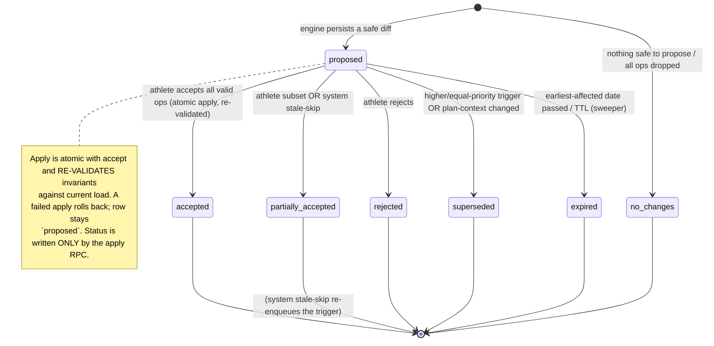
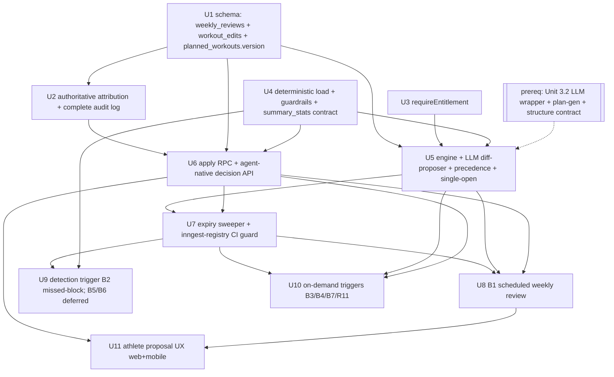

# AI Adaptive Plans — Unified Re-Plan Engine (Category B)

## Overview

Build the **adaptive plans** layer of the AI training core: a single re-plan engine
that reacts to what actually happens in an athlete's training and **proposes** plan
changes the athlete confirms — never silently applies them (R10). One engine, many
trigger entry points (the brainstorm's "Trigger taxonomy" open question, resolved
here as **one engine with multiple triggers**).

The engine is **two layers**:

1. A **deterministic load + guardrail layer** (CTL/ATL/TSB training-load proxy +
   safety invariants) that is the source of truth.
2. An **LLM diff-proposer** that emits a structured set of edit operations against
   the existing plan. The deterministic layer validates every op against the
   invariants *before* the athlete ever sees it **and again at apply time** against
   current load; the LLM never bypasses a guardrail.

This plan covers **category B**, shipping the **reactive** triggers in v1 and **deferring the two
proactive load-driven triggers (B5/B6)** to a follow-up slice (the engine and load module support
them; they're simply not wired in v1, because firing unprompted deload/bump on noisy Strava-only data
is the highest trust risk):

- **B1** Weekly adaptive review (scheduled) — the baseline (R9–R11, was Unit 3.4). **[v1]**
- **B2** Missed-block recovery (multi-day gap). **[v1]**
- **B3** Schedule-shock reshape (availability change). **[v1]**
- **B4** Event change (date moved / canceled / added). **[v1]**
- **B5** Overreaching / fatigue deload (load-trend proxy). **[deferred — follow-up slice]**
- **B6** Over-performance progression bump. **[deferred — follow-up slice]**
- **B7** Single-workout swap (on-demand). **[v1]**

It also **builds the adaptation foundation**: the `weekly_reviews` and `workout_edits`
tables, a trustworthy attribution + row-version foundation on `planned_workouts`, the
proposal lifecycle, the transactional apply path, the entitlement gate, and the
deterministic training-load module.

> **Deepening note (2026-05-25):** a data-integrity and an architecture review
> hardened this plan. Key changes from the first draft: a monotonic `version` token
> replaces `edited_at` as the staleness baseline; a dedicated attribution-foundation
> unit (Unit 2) makes the coach-overwrite guardrail's signal trustworthy and turns
> `workout_edits` into a *complete* edit log; the apply path re-validates invariants
> against current load (not just staleness) and soft-deletes; `weekly_reviews` status
> is RPC-only (no self-UPDATE); precedence is folded into the engine unit so the
> decision and the supersede-then-insert write stay atomic; and the decision API is
> agent-native.

## Problem Frame

The existing AI-plan design (origin: `docs/brainstorms/2026-05-02-ai-endurance-training-app-requirements.md`,
R9–R11; product plan `docs/plans/2026-05-02-001-feat-ai-endurance-training-app-plan.md`
Unit 3.4) specified a single weekly adaptive review. The use-case brainstorm
(`docs/brainstorms/2026-05-25-ai-athlete-plans-use-cases.md`, category B) expands
that into seven distinct triggers and surfaces three open questions this plan resolves:

- **Trigger taxonomy** — "is that one adaptive engine with multiple entry points, or
  distinct flows?" → **One engine, multiple triggers.** Every trigger funnels into the
  same generate → validate → propose → confirm → apply pipeline; triggers differ only
  in their detection logic and the scope/pre-analysis they hand the engine.
- **Plan model generality** (no-date rolling plans A2, multi-race seasons A3) → **out
  of scope.** Those are *category A* (plan creation) and need schema work on the
  one-active-plan model. This plan keeps the current "one active plan, optional single
  event" model and only *re-plans an existing plan*.
- **Prioritization** — category B is the chosen next slice after the
  event-periodization core.

The wedge depends on trust: "AI silently changed my plan" is the trust-killer the
whole product is designed to avoid. R10 (propose, never apply) is the spine of every
unit here.

## Requirements Trace

Origin requirements (from the AI-app requirements doc):

- **R9.** Once per training week, the AI proposes plan adjustments for the next 1–3
  weeks based on completed / missed / over-performed workouts and load trends. → Units 5, 8, 9
- **R10.** The athlete must explicitly accept, reject, or modify proposed adjustments
  before they apply (no silent replans). → Units 1, 6, 11 (the spine across all)
- **R11.** The athlete can manually trigger an off-cycle replan. → Unit 10

Brainstorm category-B use cases (plan-local trace IDs B1–B7):

- **B1** Weekly adaptive review → Unit 8
- **B2** Missed-block recovery → Unit 9
- **B3** Schedule-shock reshape → Unit 10
- **B4** Event change → Unit 10
- **B5** Overreaching / fatigue deload → **deferred** (engine + load module support it; not wired in v1)
- **B6** Over-performance progression bump → **deferred** (same)
- **B7** Single-workout swap → Unit 10

Cross-cutting (from the brainstorm's "Cross-Cutting Considerations"):

- **X1** Athlete-confirmed, no silent replans (R10) across the whole surface → spine, Units 1/6/11
- **X2** Inputs vs. v1 data limits — Strava-only, no HRV/sleep; readiness inferred from
  training history only → Units 4, 9 (conservative load proxy)
- **X3** Guardrails — refuse unrealistic asks, injury-safety conservatism, no medical
  claims → Unit 4 (deterministic invariant validator), enforced at generation and apply
- **X4** Adaptation is a paid feature (alongside the AI-plan entitlement) → Unit 3

## Scope Boundaries

**Prerequisite (assumed to ship separately, NOT built here):**

- **AI plan-generation pipeline** (product plan Unit 3.2, `apps/web/src/ai/`) and the
  **shared LLM provider wrapper** (Langfuse-traced Anthropic/OpenAI client). This
  engine *adapts an existing generated plan* and *reuses the LLM client*. It cannot be
  executed end-to-end until Unit 3.2 lands, but every unit here is independently
  buildable and testable against fixtures.
- **Pinned cross-plan contract (de-risks the prerequisite):** the engine depends only
  on an **explicitly enumerated subset of `planned_workouts.structure`** (duration /
  load / intensity-target fields), not the full evolving JSONB. **Freeze units and
  value-domains, not just field names** — e.g. `duration_s` integer seconds, `load`
  TSS-equivalent number, `intensity_target` a tagged union of `%ftp | zone | pace` —
  the invariant math reads these values' *semantics*, so a name-only match with differing
  units (seconds vs minutes, TSS vs kJ) would compute unsafe decisions while tests stay
  green. Unit 4 and Unit 5 share one representative `structure` fixture; the first
  integration task when 3.2 lands is to assert 3.2's real `structure` is a *superset* of
  that fixture **and that a few real workouts produce the fixture-predicted TSS**
  (value-semantics, not just key presence). `EditOp.changes` is typed against that frozen
  subset, never `.passthrough()`.

**Deferred to a follow-up slice (in category B, not v1):**

- **B5 (fatigue deload) and B6 (progression bump)** — the proactive, load-*decision* triggers. The
  unified engine, the load module, and the precedence function are built to accommodate them, but they
  are not wired as live triggers in v1: firing unprompted "you're overreaching"/"let's push harder" on
  a Strava-only proxy (no HRV/sleep) is the highest trust risk, and it's safer to validate the load proxy
  via B1's framing first. Adding them later is additive (new triggers extend the precedence function).

**Explicitly out of scope (carried from the brainstorm's non-goals):**

- Category **A** (plan creation): no-date rolling plans (A2), multi-race seasons (A3),
  beginner on-ramps (A5), etc. The one-active-plan-per-athlete model is unchanged.
- Category **C** (daily insights / pre-workout briefings / readiness nudges).
- Category **D** (coach AI augmentation — coach-directed bulk adjust, AI-drafted coach
  comments, plan-quality linter). Coaches still *see* AI edits via attribution, but the
  AI does not act on the coach's behalf.
- Category **E** (conversational assistant / chat).
- Category **F** (race-readiness score, retrospectives, race-day strategy).
- No HRV / sleep / HealthKit / non-Strava ingest (bounds the load proxy in Unit 4).
- No new sports beyond the existing swim/bike/run/strength/mobility/other vocabulary.
- No medical/diagnostic claims anywhere.

## Context & Research

### Relevant Code and Patterns

Foundation already built (the engine reads/writes these):

- `supabase/migrations/0007_plans_and_planned_workouts.sql` — `plans` (one active per
  athlete via partial unique index `plans_one_active_per_athlete`; `event_date` **nullable**;
  soft-delete; `source` enum; **forward-declared `created_from_review_id UUID` with NO
  FK** — this plan closes it). `planned_workouts` (`status` planned/completed/skipped/moved;
  `structure` JSONB; `planned_load NUMERIC`; `edited_by_kind`/`edited_by_user_id`/`edited_at`;
  **no DELETE RLS policy** — soft-delete only; both tables in `supabase_realtime`).
- `packages/shared/src/planned-workout.ts` — `EditedByKindSchema = ["athlete","coach","ai_review"]`
  already anticipates AI-driven edits; `PlannedWorkoutStructureSchema` is permissive
  (`.passthrough()`) with a **known ~10MB Realtime message-size concern** (unaddressed).
- `supabase/migrations/0008_completed_workouts_and_matches.sql` — load-data source;
  `completed_workouts_strava_idempotency` and `workout_matches_one_per_planned`/`_one_per_completed`
  1:1 uniques drive "planned-but-unmatched = missed" detection; `workout_matches.planned_workout_id`
  is `ON DELETE CASCADE` (a hard-delete of a matched workout silently destroys the match — hence
  delete-ops must soft-delete).
- `supabase/migrations/0011_complete_planned_workout_rpc.sql` and
  `0013_supersede_manual_match_rpc.sql` — **the transactional-RPC template** for the
  accept/apply path (`SECURITY DEFINER`, `p_`-prefixed params, `REVOKE … FROM PUBLIC; GRANT EXECUTE … TO service_role`).
- `supabase/migrations/0010_coach_athlete_links.sql` — coach UPDATE policy on workouts;
  the additive EXISTS-subquery coach policy pattern; **and the `users_self_update` `role_flags`
  fix (the precedent that column-level RLS gaps are exploitable in this repo).**
- `supabase/migrations/0016_admin_audit_log.sql` — **the current `delete_user_cascade`
  definition** (not 0010), which deliberately **excludes the append-only `admin_audit_log`**
  ("the append-only trail is preserved on purpose") — the precedent for how `workout_edits`
  is treated.
- `supabase/migrations/0001_users_and_entitlements.sql` — `users.timezone` (athlete-local
  scheduling), `entitlements` (`active`, `expires_at`, service-role-write, self-read).
- `apps/web/app/api/workouts/[id]/status/route.ts` — the existing edit/move/complete spine
  and the **owner-or-linked-coach** authorization gate to mirror. **Stamps only `edited_at`
  (app-clock), never `edited_by_kind`/`edited_by_user_id`** — Unit 2 fixes this.
- `apps/web/app/api/coach/workouts/route.ts` — stamps `edited_by_kind='coach'` **only on
  INSERT (new assignment)**, never on edits to existing workouts — Unit 2 fixes this.
- `apps/web/src/strava/auto-match.ts` + `apps/web/app/api/integrations/strava/webhook/route.ts`
  — additional `planned_workouts` writers (`completed`/revert `completed→planned`), the ABA
  source motivating the `version` token.
- `apps/web/src/inngest/functions/backfill-watchdog.ts` — cron-Inngest template (`{ cron }`);
  `backfill-strava.ts` — concurrency / per-user `idempotency` / `RetryAfterError` / `onFailure` /
  **counts-and-ids-only step returns (no PII in Inngest history)**.
- `apps/web/src/inngest/functions/index.ts` — **functions must be added to `functions[]`**
  to be served (only `adminBackupExport` is currently registered; `backfillStravaFn`/`backfillWatchdog`
  are NOT — do not repeat that omission; Unit 7 adds a CI guard).
- `apps/web/app/api/cron/backfill-watchdog/route.ts` + `apps/web/vercel.json` — the Vercel-cron
  + `CRON_SECRET` pattern (sweeper precedent).
- `packages/shared/src/realtime-allowlist.ts` + `apps/web/src/db/__tests__/realtime-publication.test.ts`
  — CI-guarded realtime allowlist; new tables must be added in the defining PR.
- `apps/web/src/db/__tests__/setup.ts` + `coach-athlete-links.rls.test.ts` — the DB-backed
  positive/negative RLS test harness (mandatory per AGENTS.md for every athlete-data table).
- `apps/web/src/lib/format.ts` (`formatWorkoutDateTime`) + `apps/web/src/auth/roles.ts`
  (`getUserWithRoles` returns `timezone`) — the read/render-boundary timezone pattern.

Designed-but-unbuilt foundation this plan implements (from the schema docs):

- `docs/plans/2026-05-02-002-feat-database-schema-plan.md` — `weekly_reviews` and
  `workout_edits` row contracts; **`workout_edits` is append-only**; both intended realtime members.
- `docs/brainstorms/2026-05-02-database-schema-requirements.md` R11/R28/R29 — proposal
  record shape and "accept writes `workout_edits` with `actor_role=ai_review` + `weekly_review_id`".

### Institutional Learnings

- `docs/solutions/inngest-setup.md` — LLM/weekly-review work goes through Inngest, never
  awaited in a handler; trigger routes return 202. `inngest.send()` **silently no-ops in
  dev** when the dev server is down. Prefer `@inngest/test`.
- `docs/solutions/partial-unique-with-soft-delete.md` — the supersede-then-insert "one open"
  transition **must be one transaction**; a partial unique index only *detects* a concurrent
  violation as `23505` at commit, it does not *serialize* — so the transaction needs an explicit
  per-athlete lock. Reads must always filter `deleted_at IS NULL`.
- `docs/solutions/strava-oauth.md` — enqueue best-effort, return 202, don't roll back the primary
  write on enqueue failure; background writes use service-role + explicit `user_id` filter;
  `needs_reauth` must be tolerated.
- `docs/solutions/strava-workout-enrichment.md` — negative-cache idempotency (stop duplicate
  proposals + retry storms — LLM cost); `Promise.allSettled` over `Promise.all` (a real P1);
  snapshot inputs; never write derived data into `athlete_profiles.manual_fields` (lockstep trigger).
- `docs/solutions/admin-user-moderation.md` — notifications **fail-soft**; persist normalized
  reason codes, keep free-text out of persisted audit.
- `docs/solutions/migration-conventions.md` — RLS + policy + soft-delete + `delete_user_cascade`
  update + paired RLS tests per new user-data table, same PR (CI-gated); no `now()`-dependent
  behavior in SQL — scheduling is app-layer.

### External References

Training-load model (deterministic layer):

- CTL/ATL/TSB (Banister / TrainingPeaks PMC): CTL = 42-day EWMA of daily TSS, ATL = 7-day EWMA,
  TSB = yesterday(CTL − ATL); `today = yest·e^(−1/τ) + TSS·(1−e^(−1/τ))`, τ=42/7.
  https://www.trainingpeaks.com/learn/articles/the-science-of-the-performance-manager/
- TSB thresholds: productive −10…−30; **unscheduled-deload below ≈−30**; race-ready +15…+25;
  detraining sustained > +25. https://www.alancouzens.com/blog/CTLramp.html
- `TSS = IF²·hours·100`; rTSS/sTSS/hrTSS; **hrTSS is the Strava-only fallback** (steady-state
  accurate, intervals less so); duration proxy is last resort — bias conservative.
  https://help.trainingpeaks.com/hc/en-us/articles/204071944-Training-Stress-Scores-TSS-Explained
- Missed-workout rule (don't cram): ≤3 days resume; 4–7 days = unplanned rest week; 1–2 weeks
  regress a phase; >2 weeks back up a block; never cram the taper. https://joefrieltraining.com/missed-workouts/
- Progression: ~10%/week volume ramp (soft cap); **CTL ramp 3–5/week sustainable, >8/week unsafe**;
  long run ≤25–30% weekly volume. https://www.trainingpeaks.com/blog/understanding-trainingpeaks-ramp-rate-for-better-coaching/
- Deload: 3:1 cadence; cut volume ~40–60%; unscheduled deload when TSB < ≈−30.
- Reduced availability: polarized 80/20, protect intensity, shed easy volume.
  https://www.trainingpeaks.com/blog/does-polarized-training-really-work/

Athlete-confirmed UX:

- Runna "Plan Realignment": bounded **named strategies** (Skip/Rearrange/Extend/Rebuild).
  https://support.runna.com/en/articles/10026375-how-to-use-the-plan-realignment-feature
- TrainerRoad Adaptive Training: cadence-gated big changes + pre-labeled expected difficulty.
  https://www.trainerroad.com/adaptive-training
- Athletica: states *why* + *what to expect*; preserves stress balance on swaps.
  https://athletica.ai/sports/triathlon

LLM structured edit-diffs (2026): emit an **edit-op diff** (`{workout_id, op, changes, reason}`),
not a regenerated plan; native structured outputs + **Zod runtime validation regardless** +
retry-on-invalid (≤3). https://dev.to/whoffagents/openai-structured-outputs-vs-zod-which-to-use-for-llm-response-validation-in-2026-366m

## Key Technical Decisions

- **One engine, multiple triggers.** All seven triggers funnel into a shared pipeline:
  *detect → deterministic pre-analysis → LLM diff → deterministic validation → persist
  proposal → notify → athlete confirm → transactional apply (re-validated) → realtime*. A
  `trigger_kind` column on `weekly_reviews` records provenance (B1–B7 + `manual`).
- **Two layers; the deterministic layer is authoritative — at generation AND at apply.**
  CTL/ATL/TSB math + invariant validator (volume-ramp cap ~10%/wk, CTL ramp <8/wk, TSB floor
  ~−30, taper-window protection, never schedule past `event_date`) decide what is *safe*. The
  LLM proposes within those bounds. Because unrelated workouts can complete between generation
  and accept (shifting load), **the apply RPC re-runs the invariant check against current load**,
  not just the per-op staleness check — "no invariant-breaching op reaches an applied state" is
  enforced end-to-end, not only at propose time.
- **Trustworthy attribution is a prerequisite (Unit 2).** The coach-overwrite guardrail keys
  off `edited_by_kind='coach'`, but the existing edit spine never stamps it on coach *edits*
  (only on new assignments). Before the validator can trust that signal, all `planned_workouts`
  writers (status route, coach edit path) must stamp `edited_by_kind`/`edited_by_user_id` and
  append a `workout_edits` row. The validator treats a recently-edited row with `edited_by_kind
  IS NULL` as **conservatively coach-protected** until attribution is authoritative.
- **Recipient routing preserves the coach-review wedge.** If the athlete has an active
  `coach_athlete_links` row, the proposal routes to the **coach** (the coach accepts/modifies/rejects
  on the web app, on the athlete's behalf); **solo athletes self-serve** on mobile/web. The
  `weekly_reviews` row records its `recipient` (`coach`|`athlete`), which sets accept-authority (Unit 6)
  and the notification target. This keeps "AI does the volume, coach adds the judgment" intact for
  coached athletes; richer coach-directed AI authoring stays category D, out of scope. (Adds a coach
  proposal surface to Unit 11.)
- **`workout_edits` is the *complete* edit log.** Athlete, coach, and `ai_review` edits all
  append rows (Unit 2 + Unit 6). It is **append-only** (no UPDATE/DELETE app path; no `deleted_at`).
- **Monotonic `version` token, not `edited_at`.** `planned_workouts.edited_at` is stamped
  inconsistently (app-clock in the status route vs. DB `now()` in RPCs/Strava paths), is
  ms-resolution, and the Strava `completed→planned` revert creates an ABA case. Unit 1 adds a
  `version BIGINT` bumped by a `BEFORE UPDATE` trigger (covers every writer transparently). The
  per-op staleness baseline is `{version}` (status kept for human-readable reporting only).
- **Propose, never apply (R10/X1).** Every trigger produces a `weekly_reviews` proposal the
  athlete accepts / modifies / rejects. **Accept is atomic with apply** via a single
  `SECURITY DEFINER` RPC (mirrors `complete_planned_workout`); a failed apply rolls back and the
  row stays `proposed`.
- **`weekly_reviews.status` is RPC-only — no athlete self-UPDATE.** A general self-UPDATE policy
  would let an athlete forge `proposed → accepted` (desyncing the record from `planned_workouts`)
  or tamper `proposed_changes` to inject unvalidated ops (the `role_flags` hole). RLS grants
  self-SELECT only; the apply RPC is the sole writer of `status` and accepts only **op-ids** for
  the modify subset, never client-supplied op bodies, re-validating `proposed_changes` server-side.
- **Per-op staleness + op-kind preconditions.** At apply the RPC re-reads each target: a `version`
  mismatch → **skip-and-report**; an op targeting a `completed`/matched workout → refuse (the
  athlete already did it); `delete` is **soft-delete** (`deleted_at`, never hard delete — avoids
  the `workout_matches` cascade); `insert` is skipped-and-reported if the target ISO-week's
  composition changed since generation. Plan-context change → whole-proposal `superseded`. Event
  comparison is NULL-safe (`event_date IS DISTINCT FROM snapshot`) so add/cancel are caught.
- **One open plan-scoped proposal per athlete**, enforced by a partial unique index
  `WHERE status='proposed' AND scope='plan' AND deleted_at IS NULL` **plus an explicit
  per-athlete advisory lock** (`pg_advisory_xact_lock` / `SELECT … FOR UPDATE` on the active
  `plans` row) inside the supersede-then-insert transaction — the index alone only detects the
  race as `23505` at commit. A lost race (`23505`) is a **clean no-op** ("another proposal won;
  do not retry the LLM call"), not a Sentry error. Workout-scoped (B7) and `manual` proposals
  are scope-exempt.
- **Trigger precedence is a pure function, folded into the engine (Unit 5).** Decision
  (`(incoming, pending) → supersede | suppress`) and the supersede-then-insert write live in the
  same unit/transaction. Full order: `B4 > B2 > B5 > B1 > B6 > B7` (v1 active subset, B5/B6 deferred:
  `B4 > B2 > B1 > B7`); new triggers extend the function, not a fragile global integer ranking. B7/`manual` exemption is **scope-based** (the
  index), not matrix-based, so it never needs re-ranking. Dedup key for plan-scoped:
  `(athlete_id, ISO-week)`.
- **Entitlement-gated (X4).** Adaptation is part of the existing `ai_plans` paid entitlement. A
  net-new `requireEntitlement`/`hasActiveEntitlement` helper checks at **enqueue/generation**
  (don't spend an LLM call for free users) **and at apply**. Lapsed-while-pending → proposal shown
  **read-only with an upsell**, never silently dropped.
- **Agent-native decision API.** Engine actions are resource-shaped, semantically-named HTTP
  endpoints (`GET /api/weekly-review`, `GET /api/weekly-review/[id]`, `POST …/[id]/accept`,
  `POST …/[id]/reject`, `POST /api/weekly-review` to request a replan), not one body-multiplexed
  handler — an agent can drive the engine, matching the product's agent-native posture.
- **Strava-only, conservative load proxy (X2) — reuse, don't reinvent.** The load layer **reuses**
  the existing `apps/web/src/lib/training-math.ts` TSS computation and the existing
  `build-summary-stats.ts` producer; it does not define a second TSS. Today only power-TSS + a
  duration proxy exist (rTSS/hrTSS are unbuilt), and TSS is computed lazily on detail-page view —
  so Unit 4 must compute TSS at ingest so the series isn't view-biased. In v1 the load proxy feeds
  **B1's framing and the invariant guardrails** (ramp/taper/TSB floor) — not an unprompted fire
  decision, since the proactive load-decision triggers (B5/B6) are **deferred**; that deferral is
  precisely what de-risks the noisy-proxy concern for v1. When B5/B6 are added, gate them on TSS
  confidence (enough power-instrumented workouts). The existing `SummaryStatsSchema` (in
  `packages/shared/src/completed-workout.ts`, currently permissive) is **tightened** into the shared
  contract reports Unit 5.2 imports — not created net-new.
- **Idempotent, cost-guarded triggers.** Conditional-UPDATE negative cache; `Promise.allSettled`
  for input gathering; Inngest step returns carry counts/ids only.
- **`no_changes` is a first-class outcome.** When nothing safe can be proposed, persist a
  `no_changes` row (for the ≥70% accept-rate metric denominator and a "you're on track" surface)
  with no push.

## Open Questions

### Resolved During Planning

- *One engine or distinct flows?* → One engine, multiple triggers.
- *Multi-race / rolling plans (A2/A3)?* → Out of scope (category A).
- *Proposal lifecycle states?* → `proposed → {accepted | partially_accepted | rejected |
  superseded | expired}`, plus terminal `no_changes`. Accept atomic-with-apply; failed apply
  rolls back to `proposed`.
- *`partially_accepted` re-trigger?* → Terminal, but **distinguish cause**: athlete-deselected
  ops are gone (intentional); ops **stale-skipped by the system** re-enqueue the same trigger
  immediately rather than waiting for the next natural one, and clear the `(athlete, ISO-week)`
  dedup so the queue can re-open (avoids a multi-day dead-zone).
- *Staleness baseline?* → Monotonic `version` (not `edited_at`); skip-stale-and-report; refuse ops
  on completed/matched rows; `delete`=soft-delete; `insert` checks week composition; plan-context
  change → supersede; event comparison `IS DISTINCT FROM`.
- *Concurrent proposals?* → One open plan-scoped proposal per athlete (partial unique index +
  per-athlete advisory lock); precedence governs supersede-vs-suppress; `23505` = clean no-op.
- *Status tampering?* → RPC-only status writes; no self-UPDATE; accept takes op-ids only.
- *Coach routing/overwrite?* → **Coached athletes: proposal routes to the coach** (coach is the
  accepter); solo athletes self-serve. Coach-edited rows excluded from AI ops; attribution made
  authoritative first (Unit 2).
- *B5/B6 in v1?* → **Deferred to a follow-up slice.** v1 ships reactive triggers (B1/B2/B3/B4/B7);
  the engine/load module/precedence accommodate B5/B6 additively when the load proxy is validated.
- *Entitlement?* → `ai_plans`; gate at enqueue + apply; lapsed-pending read-only.
- *B1 athlete-local scheduling?* → Hourly cron selects athletes whose local time is Sunday ~18:00;
  idempotency key `(athlete_id, ISO-week)`.
- *Missed-workout false positives?* → `status='planned'` past end-of-local-day + grace (≥36h) with
  no live `workout_matches`; excludes `skipped`/`moved`.
- *Proposal expiry?* → Auto-`expired` when earliest-affected date passes; sweeper cron.
- *Where does apply-time load re-validation run (SQL can't call TS)?* → In Node (`apply.ts`) immediately
  before the RPC, with the RPC taking `FOR UPDATE` locks on the active plan + affected workouts to close the
  drift window; the SQL RPC owns only cheap transaction-local checks.
- *Partial-apply of coordinated proposals?* → `coupled` triggers (deload/progression/reshape) are
  all-or-nothing — any dropped/stale op supersedes the whole proposal; only `independent` triggers partial-apply.

### Deferred to Implementation

- **Exact CTL/ATL/TSB constants and per-sport TSS-proxy mapping** from `summary_stats` — grounded
  by research; exact column mapping converges with the shared `summary_stats` Zod contract in Unit 4.
- **Exact LLM prompt content and edit-op JSON details** — converge against the eval harness (Unit 3.1)
  like generation; the plan fixes the *shape* and the validation contract.
- **Final `proposed_changes` JSON structure** (op list + per-op baselines + narrative) — fixed in
  Unit 1's Zod schema; must respect the ~10MB Realtime payload cap.
- **Migration numbers** — shown as `0019+` for ordering; assign next-available at implementation
  time (0014 already skipped; watch collisions).
- **Notification channel** (push vs. in-app only for v1) — fail-soft regardless.
- **Per-trigger LLM model choice** — tune with the eval harness; the engine is model-agnostic.

## High-Level Technical Design

> *This illustrates the intended approach and is directional guidance for review, not
> implementation specification. The implementing agent should treat it as context, not
> code to reproduce.*

### Pipeline (one engine, all triggers)

```
 detect (trigger)                     [B1 cron | B2 detector | B3/B4/B7 events | R11 manual  (B5/B6 deferred)]
   │  enqueue + 202 (best-effort; nothing lost on Inngest outage)
   ▼
 Inngest function (per trigger)
   │  guards: active non-deleted plan? entitled? Strava not needs_reauth (load triggers)?
   │  precedence (pure fn) + per-athlete advisory lock:
   │     supersede lower/equal pending | suppress if lower than pending | 23505 → clean no-op
   ▼
 deterministic pre-analysis  ──►  CTL/ATL/TSB proxy + trigger framing (gap buckets / TSB floor / date-math)
   ▼
 LLM diff-proposer  ──►  [{workout_id, op: move|modify|skip|insert|delete, changes(structure-subset), reason}]
   ▼
 deterministic VALIDATION  ──►  drop ops breaching invariants (ramp/TSB/taper/past-event)
   │                            + drop coach-edited (or NULL-attribution recent) targets
   │                            + attach per-op baseline {version}; snapshot {plan_id, event_date}
   ▼
 persist weekly_reviews (status=proposed | no_changes)   ──►  Realtime + fail-soft notify
   ▼
 athlete confirms (accept / modify-by-op-id / reject)  — via agent-native API
   ▼
 transactional apply RPC  ──►  re-validate invariants vs CURRENT load → per-op version check
                              → refuse completed/matched → soft-delete on delete-op
                              → apply valid ops, stamp ai_review, append workout_edits
                              → set status (stale-skip → re-enqueue trigger) → Realtime
```

### Proposal lifecycle state machine



### Trigger precedence & scope

| Priority | Trigger | Kind (`trigger_kind`) | Scope | Detection / entry | Load-data dependent? |
|---|---|---|---|---|---|
| 1 (highest) | B4 Event change | `event_change` | plan | profile/event edit | no |
| 2 | B2 Missed-block | `missed_block` | plan | detector (gap + grace) | yes |
| 3 | B5 Fatigue deload *(deferred)* | `fatigue_deload` | plan | detector (TSB < ≈−30) | yes |
| 4 | B1 Weekly review | `weekly` | plan | cron (Sun ~18:00 local) | yes |
| 5 | B6 Progression bump *(deferred)* | `progression_bump` | plan | detector (beats targets) | yes |
| 6 (lowest) | B7 Single-workout swap | `workout_swap` | workout | athlete on-demand | no |
| — | R11 Manual replan | `manual` | plan | athlete on-demand | optional |

Plan-scoped: at most one open proposal per athlete; higher-or-equal supersedes, lower is
suppressed. Workout-scoped (B7) and `manual` are athlete-initiated, in-session, scope-exempt.
Precedence is a pure `(incoming, pending) → supersede | suppress` function (Unit 5), not a global
integer ranking, so new triggers extend it without re-ranking.

### Unit dependency graph



## Implementation Units

Four phases. Phase A is the foundation; Phase B is the engine core; Phase C is the trigger
entry points; Phase D is the athlete surface.

---

### Phase A — Foundation

- [ ] **Unit 1: Schema — `weekly_reviews` + `workout_edits` + `planned_workouts.version`**

**Goal:** Create the two foundation tables, the proposal lifecycle constraints, the single-open
invariant, a monotonic row-version token on `planned_workouts`, and the shared Zod contracts.

**Requirements:** R10, X1; foundation for B1–B7.

**Dependencies:** None (extends existing `plans`/`planned_workouts`).

**Files:**
- Create: `supabase/migrations/0019_weekly_reviews_and_workout_edits.sql`
- Create: `supabase/migrations/0020_validate_plans_created_from_review_fk.sql`
- Create: `supabase/migrations/0021_planned_workouts_version.sql` (version column + `BEFORE UPDATE` trigger)
- Create: `packages/shared/src/weekly-review.ts` (`WeeklyReviewStatusSchema`, `TriggerKindSchema`, `ProposalScopeSchema`, row schema)
- Create: `packages/shared/src/edit-op.ts` (`EditOpSchema` typed against the frozen `structure` subset + `EditOpResultSchema`)
- Create: `packages/shared/src/workout-edit.ts` (append-only audit row schema)
- Modify: `packages/shared/src/index.ts`, `packages/shared/src/realtime-allowlist.ts` (add both tables, alphabetized), `packages/shared/src/planned-workout.ts` (add `version`)
- Modify: the `delete_user_cascade` function (extend the **0016** version)
- Test: `apps/web/src/db/__tests__/weekly-reviews.rls.test.ts`, `apps/web/src/db/__tests__/workout-edits.rls.test.ts`, `apps/web/src/db/__tests__/planned-workouts-version.test.ts`, `packages/shared/src/__tests__/weekly-review.test.ts`, update `realtime-publication.test.ts`

**Approach:**
- `weekly_reviews`: `id`, `athlete_id` FK `ON DELETE CASCADE`, `plan_id` FK, `trigger_kind`,
  `scope`, `recipient` (`coach`|`athlete`, set from the athlete's active coach link at generation —
  drives accept-authority + notification), `status`, `proposed_changes JSONB` (validated op list +
  per-op `{version}` baselines), `narrative`, `event_date_snapshot DATE`, `earliest_affected_date DATE`,
  `generated_at`, `decided_at`, `created_at`, `deleted_at`. The Zod row schema **length-caps** `narrative`
  + per-op `reason` (untrusted LLM strings) and keeps `proposed_changes` under the ~10MB Realtime cap.
- Partial unique index `weekly_reviews_one_open_plan_scoped ON (athlete_id) WHERE status='proposed'
  AND scope='plan' AND deleted_at IS NULL`, with the mandatory "supersede-then-insert in one
  transaction + per-athlete advisory lock; index detects, lock serializes" comment.
- `workout_edits`: **append-only** (no `deleted_at`) — `id`, `planned_workout_id` FK `ON DELETE SET NULL`,
  `athlete_id` FK `ON DELETE CASCADE`, `actor_role` (`athlete`|`coach`|`ai_review`), `actor_user_id`,
  `weekly_review_id` FK `ON DELETE SET NULL`, `field_diff JSONB`, `created_at`. No INSERT policy for
  the authenticated role (service-role writes). **Append-only is enforced by a `BEFORE UPDATE OR DELETE`
  immutability trigger** mirroring `public.admin_audit_log_immutable()` from migration 0016 — RLS alone
  is insufficient because the service-role bypasses it. The trigger permits only the `athlete_id ON
  DELETE CASCADE` teardown path and rejects all other mutations.
- `planned_workouts.version BIGINT NOT NULL DEFAULT 1` + a `BEFORE UPDATE` trigger so every existing
  writer (RPC, status route, Strava match, Strava revert) bumps it transparently. (Migration 0021, on
  a realtime table — its own step.) **Bump only on a change to a *plannable* column**
  (`structure`/`scheduled_date`/`sport`/`planned_load`/`deleted_at`), NOT on every UPDATE — otherwise a
  benign Strava `completed→planned` revert (which changes only `status`) would falsely invalidate a
  pending op targeting a structurally-identical row. The token is monotonic, not a strict +1-per-logical-edit
  counter (the completed path issues two UPDATEs); the staleness contract requires only strictly-increasing.
- Close `plans.created_from_review_id → weekly_reviews(id)` per 0007's recipe, ordered:
  CREATE `weekly_reviews` → backfill `UPDATE plans SET created_from_review_id=NULL WHERE … NOT IN
  (SELECT id FROM weekly_reviews)` → `ADD CONSTRAINT … REFERENCES weekly_reviews(id) ON DELETE SET NULL NOT VALID`
  (0019); `VALIDATE CONSTRAINT` in 0020 (own migration for the lighter-lock scan).
- RLS: `weekly_reviews` **self-SELECT only** (no self-UPDATE — status is RPC-only); INSERT
  service-role. `workout_edits` self-SELECT only; INSERT service-role. Add both to `supabase_realtime`
  + allowlist (CI-guarded).
- `delete_user_cascade` (extend 0016): soft-delete `weekly_reviews` (it has `deleted_at`); **exclude
  `workout_edits`** with an `admin_audit_log`-style comment (teardown via `athlete_id ON DELETE CASCADE`
  on hard account delete — preserves the audit trail during the soft-delete grace window).

**Patterns to follow:** `0007` (partial unique + soft-delete + realtime + the FK recipe), `0016`
(`delete_user_cascade` + append-only exclusion), `0008` (`ON DELETE SET NULL` for non-identity FKs).

**Test scenarios:**
- Happy path: insert a `proposed` plan-scoped row; athlete SELECTs it; service role inserts; status updates only via RPC (Unit 6).
- Edge case (single-open): a second `proposed` plan-scoped insert for the same athlete raises `23505`; a `scope='workout'` proposal coexists.
- Edge case (version): any UPDATE to a `planned_workouts` row increments `version`; the status route, complete RPC, and Strava revert all bump it.
- Edge case (append-only): UPDATE/DELETE on `workout_edits` has no policy/path; the authenticated role is denied.
- Error path (RLS negative): a different athlete cannot SELECT another's `weekly_reviews`/`workout_edits`; a non-service client cannot INSERT either; an athlete cannot UPDATE a `weekly_reviews` status directly.
- Integration: `realtime-publication.test.ts` passes; FK `created_from_review_id` validates after backfill and is `ON DELETE SET NULL` (deleting a review nulls the pointer, doesn't block); `delete_user_cascade` + hard user delete removes all PII in both tables (GDPR).

**Verification:** Local migration applies cleanly; positive+negative RLS tests pass for both tables;
version trigger bumps on every writer; CI realtime guard green.

---

- [ ] **Unit 2: Authoritative attribution + complete audit log across the edit spine**

**Goal:** Make `edited_by_kind`/`edited_by_user_id` reliable on *all* `planned_workouts` writers and
make `workout_edits` a *complete* edit log — so the coach-overwrite guardrail (Unit 4) reads a
trustworthy signal and the audit log isn't AI-only.

**Requirements:** R10, X1 (trust foundation for the guardrail).

**Dependencies:** Unit 1 (needs `workout_edits` + `version`).

**Execution note:** Characterization-first — add coverage of the current (unstamped) status-route
behavior before changing it, so the attribution change is provably additive.

**Files:**
- Modify: `apps/web/app/api/workouts/[id]/status/route.ts` (stamp `edited_by_kind`/`edited_by_user_id` from the resolved caller; append a `workout_edits` row with `actor_role='athlete'|'coach'`)
- Create/Modify: `apps/web/app/api/coach/workouts/route.ts` is **INSERT-only today** (stamps `coach` only on new assignment). A coach *edit/PATCH* path on existing `planned_workouts` **does not exist** and must be created here (or noted as a prereq) to stamp `coach` + append `workout_edits` on coach edits.
- Create: `apps/web/src/db/workout-edits.ts` (append helper, service-role, explicit user filter)
- Test: update `apps/web/app/api/workouts/[id]/status/__tests__/route.test.ts`; add `apps/web/src/db/__tests__/workout-edits-append.test.ts`

**Approach:**
- The status route already distinguishes owner vs. linked coach (`isOwner`/`isLinkedCoach`); use that
  to stamp `edited_by_kind` accordingly on skip/move/complete and append a `workout_edits` row.
- Coach edits to *existing* workouts stamp `edited_by_kind='coach'` (today only new assignments do).
- Unit 4's validator treats a recently-edited row (`edited_at` set) with `edited_by_kind IS NULL`
  as **conservatively coach-protected** until this unit's backfill makes attribution authoritative.

**Patterns to follow:** the existing owner/coach gate in the status route; `0011` complete RPC (extend
to append an audit row if the completion goes through the RPC).

**Test scenarios:**
- Happy path: athlete moves a workout → row stamped `edited_by_kind='athlete'`, `version` bumped, one `workout_edits` row (`actor_role='athlete'`).
- Happy path: coach edits an existing athlete workout → stamped `coach`, `workout_edits` `actor_role='coach'`.
- Edge case: complete via Strava match path → attribution reflects the system path; `workout_edits` records it.
- Integration: after this unit, no normal edit leaves `edited_by_kind` NULL on a touched row; the audit log contains athlete + coach + (later) ai_review entries.

**Verification:** A workout edited by athlete then coach shows two correctly-attributed `workout_edits`
rows and a monotonically increasing `version`.

---

- [ ] **Unit 3: `requireEntitlement` helper (paid-feature gate)**

**Goal:** A single canonical entitlement check (none exists today) used at enqueue/generation and apply.

**Requirements:** X4 (R27).

**Dependencies:** None.

**Files:**
- Create: `apps/web/src/auth/entitlements.ts` (`hasActiveEntitlement(client, userId, key)` + `requireEntitlement(...)` → 402)
- Modify: `packages/shared/src/entitlement.ts` (pin `EntitlementKeySchema` incl. `ai_plans`)
- Test: `apps/web/src/auth/__tests__/entitlements.test.ts`

**Approach:** select `entitlements WHERE user_id AND entitlement_key=key AND active=true AND (expires_at
IS NULL OR expires_at > now())`; works under the user-JWT client (self-read RLS) and under service-role
(explicit `user_id` filter) for crons. Adaptation key = `ai_plans`.

**Patterns to follow:** route-handler auth in `workouts/[id]/status/route.ts`; the core plan's
`requireEntitlement` 402-on-miss.

**Test scenarios:**
- Happy path: active `ai_plans` → true; route proceeds.
- Edge case: `expires_at` past / `active=false` → false.
- Error path: no row → `requireEntitlement` returns 402.
- Integration: service-role cron call returns correct value with explicit `user_id` filter.

**Verification:** Free user gated (402); paid user passes.

---

- [ ] **Unit 4: Deterministic training-load + guardrail module**

**Goal:** The source-of-truth layer — CTL/ATL/TSB load proxy from `completed_workouts`, plus the
invariant validator used at generation AND apply.

**Requirements:** R9, X2, X3.

**Dependencies:** None (reads `completed_workouts`/`workout_matches`/`planned_workouts`).

**Execution note:** Implement the validator and load math **test-first** — pure functions and the
safety contract for everything downstream.

**Files:**
- Create: `apps/web/src/training-load/load-series.ts` (CTL/ATL/TSB EWMA series — **reuses** existing per-workout TSS)
- Create: `apps/web/src/training-load/invariants.ts` (`validateOps(plan, ops, loadState) → {valid, dropped[]}`)
- Create: `apps/web/src/training-load/index.ts`
- Reuse/extend: `apps/web/src/lib/training-math.ts` (existing `computeIF`/`computeTSS`), `apps/web/src/strava/build-summary-stats.ts` (existing `summary_stats` producer — the documented single source of truth)
- Tighten/relocate (NOT create-new): the existing `SummaryStatsSchema` in `packages/shared/src/completed-workout.ts` (currently `z.object({}).passthrough()`) — tighten it and keep `CompletedWorkoutRowSchema`'s import working; this becomes the shared contract reports Unit 5.2 imports
- Test: `apps/web/src/training-load/__tests__/load-series.test.ts`, `invariants.test.ts`

**Approach:**
- Per-workout TSS **reuses** the existing `training-math.ts` computation and the persisted
  `summary_stats.tss`; it does NOT define a second TSS. **Reality check (codebase):** today TSS is
  only computed lazily in `hydrate-workout.ts` (on first detail-page view / single sync); bulk
  backfill (`build-summary-stats.ts`) does NOT compute TSS. So a load series naïvely read from
  `summary_stats.tss` is **view-biased** and undercounts recent load — making TSB look *less*
  fatigued than reality, which would wrongly suppress B5 deloads and green-light B6 bumps. **This
  unit must guarantee TSS for every load-eligible completed_workout independent of detail-page
  hydration** (compute TSS at ingest in `build-summary-stats.ts`, or a bulk TSS sweep), and state
  that unhydrated/missing-TSS workouts are excluded-or-duration-proxied in a way that biases TSB
  *conservative* (lower).
- **Signal tiers (honest):** only power-based TSS and a duration proxy exist in the repo today;
  **rTSS (pace) and hrTSS (HR) are NOT implemented.** Either build them here (naming the
  threshold-pace / LTHR reference-data source) or **gate B5/B6 on TSS confidence** (fire only when
  enough power-instrumented workouts exist). Do not let the safety case rest on unbuilt tiers.
- CTL (42-day)/ATL (7-day) EWMA; TSB = yesterday(CTL−ATL). Expose series + current state + CTL ramp/week.
- `validateOps` drops ops breaching: weekly volume jump > ~10%, CTL ramp > ~8/week, projected TSB < ≈−30,
  any workout inside the taper window or past `event_date` (no-ops when `event_date` NULL), and **ops
  targeting `edited_by_kind='coach'` OR recently-edited NULL-attribution rows** (coach protection,
  per Unit 2). Returns kept + dropped-with-reason. **Same function is invoked at apply against current
  load (Unit 6).**
- Finalize the `summary_stats` Zod contract here as the single source of truth.

**Patterns to follow:** pure-TS testable derivation like `apps/web/src/profile/derive.ts`; snapshot-derived-metrics learning.

**Test scenarios:**
- Happy path: 12 weeks of seeded steady runs → CTL/ATL/TSB match hand-computed EWMA within tolerance.
- Edge case (sparse/manual): low-confidence flag; finite, conservative series.
- Edge case (no event_date): taper/past-event invariants no-op; ramp + TSB still apply.
- Happy path (validator): op pushing weekly volume +25% dropped (`reason='volume_ramp'`); deload op passes.
- Edge case (validator): op targeting a `coach`-edited row dropped (`reason='coach_protected'`); op targeting a recently-edited NULL-attribution row also dropped (conservative).
- Edge case (validator): op past `event_date` dropped; same op passes when `event_date` NULL.

**Verification:** Validator never returns an invariant-breaching op across a generated battery;
load series deterministic for a fixed fixture; `summary_stats` schema imported cleanly by a reports stub.

---

### Phase B — Engine core

- [ ] **Unit 5: Adaptive re-plan engine + LLM diff-proposer + precedence + single-open**

**Goal:** The orchestrator that turns a trigger + context into a validated, persisted proposal —
including the precedence decision and the serialized supersede-then-insert.

**Requirements:** R9, R10, X1, X3.

**Dependencies:** Unit 1, Unit 3, Unit 4. **Prerequisite:** the shared LLM wrapper
(`apps/web/src/ai/llm`) from product Unit 3.2 — built against a fixture LLM here.

**Execution note:** Build generate→validate→persist with a fixture LLM (deterministic canned diffs)
so the unit is fully testable without the live model.

**Files:**
- Create: `apps/web/src/ai/adaptive/engine.ts` (orchestrator)
- Create: `apps/web/src/ai/adaptive/propose.ts` (LLM → `EditOp[]`, Zod safeParse, ≤3 retry-on-invalid)
- Create: `apps/web/src/ai/adaptive/context.ts` (gather plan + completed + profile via `Promise.allSettled`; snapshot `plan_id`/`event_date`/per-op `{version}`)
- Create: `apps/web/src/ai/adaptive/precedence.ts` (pure `(incoming, pending) → supersede | suppress`; also declares each `trigger_kind` as `coupled` or `independent` — coupled proposals are all-or-nothing at apply, per Unit 6)
- Create: `apps/web/src/ai/adaptive/persist.ts` (advisory-lock + supersede-then-insert; `no_changes`; `23505` clean no-op)
- Create: `apps/web/src/db/weekly-reviews.ts` (service-role helpers, explicit user filter)
- Create: `apps/web/src/ai/adaptive/__fixtures__/structure.ts` (the shared `structure`-subset fixture; also used by Unit 4)
- Test: `apps/web/src/ai/adaptive/__tests__/engine.test.ts`, `propose.test.ts`, `precedence.test.ts`, `persist.test.ts`

**Approach:**
- `context.ts` gathers inputs with `Promise.allSettled`; snapshots the staleness baselines.
- `propose.ts` calls the LLM for an `EditOp[]` diff (typed against the frozen `structure` subset),
  `safeParse`, retries ≤3 with the validator error fed back; never regenerates the whole plan.
- `engine.ts` runs `validateOps` (Unit 4); all-dropped/empty → persist `no_changes` (no notification).
- `precedence.ts` decides supersede vs. suppress; `persist.ts` takes a per-athlete advisory lock,
  supersedes a lower/equal pending and inserts the new proposal in one transaction, treating a
  commit-time `23505` as a clean no-op (do not retry the LLM call).
- Respect the ~10MB Realtime payload cap on `proposed_changes`. Service-role writes; counts/ids-only step returns.

**Technical design:** *(directional — see High-Level Technical Design; prompt text + op JSON converge with the eval harness.)*

**Test scenarios:**
- Happy path: fixture safe diff → `proposed` row with validated ops + narrative + `{version}` baselines.
- Edge case: every op breaches an invariant → `no_changes`, no notification.
- Edge case: LLM invalid JSON twice then valid → one `proposed` row, no partial writes.
- Error path: LLM fails all retries → typed error, no row written.
- Edge case (precedence): lower-priority pending → superseded in the same transaction as the insert; higher-priority pending → generation suppressed (no LLM call).
- Edge case (race): two higher-priority triggers race → exactly one `proposed` row, the loser is a clean no-op (no orphaned writes, no double LLM spend).
- Integration: a coach-edited workout in the input is excluded from proposed ops.

**Verification:** With a fixture LLM, the engine deterministically yields the expected outcomes;
no proposal contains an invariant-breaching op; interleaved triggers leave exactly one open plan-scoped proposal.

---

- [ ] **Unit 6: Proposal apply/reject — transactional RPC + agent-native decision API**

**Goal:** Athlete accept/modify/reject. Accept atomically **re-validates invariants against current
load**, applies valid non-stale ops (soft-delete on delete), stamps `ai_review`, writes `workout_edits`,
sets status, emits Realtime — exposed as agent-native endpoints.

**Requirements:** R10, R11, X1, X3.

**Dependencies:** Unit 1, Unit 2, Unit 4.

**Files:**
- Create: `supabase/migrations/0022_apply_weekly_review_rpc.sql` (`apply_weekly_review(p_review_id, p_accepted_op_ids[])` `SECURITY DEFINER`)
- Create: `apps/web/app/api/weekly-review/route.ts` (`GET` list pending; `POST` request a replan — Unit 10 uses POST)
- Create: `apps/web/app/api/weekly-review/[id]/route.ts` (`GET` one)
- Create: `apps/web/app/api/weekly-review/[id]/accept/route.ts`, `apps/web/app/api/weekly-review/[id]/reject/route.ts`
- Create: `apps/web/src/ai/adaptive/apply.ts` (build RPC args from op-ids; map per-op results)
- Test: `apps/web/app/api/weekly-review/[id]/accept/__tests__/route.test.ts`, `apps/web/src/db/__tests__/apply-weekly-review.rls.test.ts`

**Approach:**
- **Where load re-validation runs (resolves the SQL-can't-call-TypeScript problem):** the expensive
  CTL/ATL/TSB re-validation (`validateOps`, Unit 4) is pure TS and runs in `apply.ts` in the Node layer
  **immediately before** invoking the RPC. The RPC then takes `SELECT … FOR UPDATE` row locks on the
  active `plans` row and the affected `planned_workouts` so **no new `completed_workouts`/edits for those
  rows can land between the Node re-validation and commit** — closing the load-drift window without porting
  EWMA math to PL/pgSQL. The RPC itself owns only the cheap, transaction-local checks (per-op `version`
  compare, completed/matched refusal, plan-context `IS DISTINCT FROM`, soft-delete, attribution, status write).
- The RPC, in one transaction: plan-context check first — plan archived/soft-deleted, or `event_date
  IS DISTINCT FROM event_date_snapshot` → abort, mark `superseded`. For each accepted op: compare `version`
  to the baseline (mismatch → skip-and-report); refuse if the target is `completed`/soft-deleted or has a live
  `workout_matches` row; apply move/modify/skip, and **`delete` as soft-delete** (`deleted_at`); for
  `insert`, skip-and-report if the target ISO-week composition changed. Stamp `edited_by_kind='ai_review'`,
  `edited_by_user_id`, append a `workout_edits` row per applied op (`actor_role='ai_review'` + `weekly_review_id`);
  set `plans.created_from_review_id`; set status `accepted` (all applied) / `partially_accepted` (subset or stale-skip).
- **Coupled vs. independent triggers (partial-apply safety).** A deload/progression/reshape proposal is a
  *coordinated set* — half-applying it (some ops re-validation-dropped or stale-skipped) can leave the plan
  worse than before (e.g. easy-volume cut applied but the intensity cut dropped). The trigger taxonomy
  (Unit 5) marks each `trigger_kind` `coupled` or `independent`: for **coupled** proposals, if *any* op is
  dropped/stale at apply, **abort the whole proposal to `superseded` and re-enqueue** rather than partial-apply;
  only **independent** triggers (B7 swap, some B1 edits) may partial-apply.
- **RPC privilege.** `apply_weekly_review` is `SECURITY DEFINER` with `EXECUTE` granted to **`service_role` only**
  (matching `0011`/`0013`); the route handler is the sole authz gate and calls it via the admin client only
  after verifying the caller is the proposal's **recipient** — the athlete for solo athletes, or the linked
  coach for coached athletes (per the recipient routing decision). Status is written **only** here. The endpoint accepts only
  **op-ids** for the modify subset, never op bodies; `proposed_changes` from the row is the sole op source.
- **Untrusted LLM strings.** `narrative` and per-op `reason` (from the LLM) are length-capped in the Unit 1
  Zod schema and rendered as **plain text** (never HTML/markdown-linked) in Unit 11 — no injection/oversize path.
- When `partially_accepted` is caused by **system stale-skip** (not athlete deselection), re-enqueue the
  same trigger and clear the `(athlete, ISO-week)` dedup so the discarded-but-still-valid ops re-propose.
- Authorization mirrors `workouts/[id]/status/route.ts` (owner). Re-check `requireEntitlement('ai_plans')`
  — lapsed → 402, proposal left readable. Realtime emission is free.

**Patterns to follow:** `0011`/`0013` transactional `SECURITY DEFINER` RPC (`REVOKE/GRANT`); owner gate;
`users_self_update` precedent (RPC-only status, no client column writes).

**Test scenarios:**
- Happy path: accept all → workouts updated, `workout_edits` written, status `accepted`, Realtime fires.
- Edge case (per-op staleness/ABA): a target's `version` changed (incl. `planned→completed→planned` Strava revert) → that op skipped + reported, rest applied, status `partially_accepted`, trigger re-enqueued.
- Edge case (completed/matched refusal): an op targeting an already-completed/matched workout is refused.
- Edge case (delete op): a `delete` op soft-deletes (`deleted_at`), never hard-deletes; the `workout_matches` row is untouched.
- Edge case (insert op): the target ISO-week gained a workout since generation → insert skipped + reported.
- Edge case (load drift): unrelated workouts completed since generation push projected TSB < −30 → apply re-validation drops the now-unsafe op.
- Edge case (event add/cancel): `event_date` NULL→date (added) since generation → apply aborts `superseded` (NULL-safe `IS DISTINCT FROM`); symmetric cancel case.
- Edge case (modify): accept 2 of 4 op-ids → only those apply; status `partially_accepted` (athlete-deselected, terminal, no re-enqueue).
- Error path (atomicity): a DB error mid-apply rolls back — no partial workout/audit writes, status stays `proposed`.
- Error path (entitlement lapse): inactive at apply → 402, no writes, proposal readable.
- Error path (authorization/double-apply): non-owner → 403; accepting an already-terminal proposal → 409.

**Verification:** Concurrency test — two simultaneous accepts apply exactly one set; no invariant-breaching
op is ever committed; agent-driven `GET`→`accept` round-trips via the named endpoints.

---

### Phase C — Trigger entry points

- [ ] **Unit 7: Proposal expiry sweeper + Inngest-registry CI guard**

**Goal:** Expire stale proposals, and make "every Inngest function is registered" a CI guarantee
(the recurring footgun) before the trigger units add six functions.

**Requirements:** R9, R10 (lifecycle hygiene).

**Dependencies:** Unit 5, Unit 6.

**Files:**
- Create: `apps/web/src/inngest/functions/weekly-review-expiry-sweeper.ts` (cron)
- Create: `apps/web/app/api/cron/weekly-review-expiry/route.ts` (+ `vercel.json` entry, `CRON_SECRET`)
- Modify: `apps/web/src/inngest/functions/index.ts` (register the sweeper)
- Test: `apps/web/src/inngest/functions/__tests__/registry.test.ts` (asserts every function under `inngest/functions/` is in `functions[]`), `weekly-review-expiry-sweeper.test.ts`

**Approach:**
- Sweeper marks `proposed` rows `expired` once `earliest_affected_date < today` (athlete-local) or past a
  TTL; idempotent; counts-only returns.
- Registry test mirrors the realtime-allowlist CI guard — a defined function that isn't served fails CI.

**Patterns to follow:** `backfill-watchdog.ts` cron + `cron/backfill-watchdog/route.ts` `CRON_SECRET`.

**Test scenarios:**
- Happy path (expiry): a `proposed` row whose earliest-affected date is yesterday → swept to `expired`.
- Edge case (idempotency): running the sweeper twice in a tick window expires each row once.
- Happy path (registry guard): adding a function file without registering it fails the registry test.

**Verification:** The sweeper never expires a still-future proposal; the registry test fails on an
unregistered function and passes once registered.

---

- [ ] **Unit 8: B1 — scheduled weekly adaptive review (the baseline)**

**Goal:** Sunday ~18:00 athlete-local weekly review exercising the entire pipeline.

**Requirements:** R9, R10, B1.

**Dependencies:** Unit 5, Unit 6, Unit 7.

**Files:**
- Create: `apps/web/src/inngest/functions/weekly-review-scheduler.ts` (Inngest-native `{ cron: "0 * * * *" }` hourly function — like `backfill-watchdog.ts`; no Vercel-cron route needed → select due athletes → enqueue)
- Create: `apps/web/src/inngest/functions/weekly-review-run.ts` (per-athlete: guards → engine)
- Create: `apps/web/src/ai/adaptive/schedule.ts` (athlete-local "Sunday ~18:00?" + ISO-week idempotency key)
- Modify: `apps/web/src/inngest/functions/index.ts` (register both)
- Test: `apps/web/src/ai/adaptive/__tests__/schedule.test.ts`, `apps/web/src/inngest/functions/__tests__/weekly-review-run.test.ts`

**Approach:**
- Hourly cron selects athletes whose `users.timezone`-local time is Sunday ~18:00 and not already enqueued
  for the current ISO-week (idempotency key `(athlete_id, iso_week)`); enqueues a per-athlete run. Best-effort
  enqueue + 202.
- Per-athlete run: guards (active non-deleted plan; `requireEntitlement('ai_plans')`; Strava not `needs_reauth`)
  else silent no-op; then invoke the engine with `trigger_kind='weekly'`, scope `plan`, next 1–3 weeks.

**Patterns to follow:** `backfill-watchdog.ts` cron; `backfill-strava.ts` per-user idempotency/concurrency;
render-boundary timezone via `users.timezone`.

**Test scenarios:**
- Happy path: athlete in `America/New_York` selected at the UTC tick for Sun 18:00 ET → `weekly` proposal.
- Edge case (DST): selection holds across a DST boundary (local 18:00, not fixed UTC).
- Edge case (idempotency): two cron ticks in the same hour enqueue once per ISO-week.
- Edge case (guards): no active plan / lapsed entitlement / `needs_reauth` → silent no-op, no LLM call.
- Edge case (`UTC` default): default-`UTC` athlete gets a defined Sunday slot.
- Integration: end-to-end on a fixture LLM — Sunday tick → proposal visible via Realtime.

**Verification:** A simulated multi-timezone roster each gets exactly one weekly proposal at their local
Sunday evening across a 2-week dry run.

---

- [ ] **Unit 9: Detection trigger — B2 missed-block** *(B5/B6 deferred — see below)*

**Goal:** The completion-driven detector that fires an off-cycle reflow when an athlete misses a block.

**Requirements:** R9, R10, B2, X2.

**Dependencies:** Unit 4, Unit 7, Unit 8.

**Files:**
- Create: `apps/web/src/ai/adaptive/detectors/missed-block.ts`
- Create: `apps/web/src/inngest/functions/adaptive-detectors.ts` (daily cron → run detector → enqueue engine)
- Modify: `apps/web/src/inngest/functions/index.ts`
- Test: `apps/web/src/ai/adaptive/detectors/__tests__/missed-block.test.ts`

**Approach:**
- **B2:** "missed" = `status='planned'`, `scheduled_date` past end-of-athlete-local-day by ≥36h grace, no live
  `workout_matches`; excludes `skipped`/`moved`. Bucket the gap (≤3d/4–7d/1–2w/>2w) and pass framing (don't cram; protect taper).
- **Durable Strava-health signal (codebase gap):** there is **no persistent `needs_reauth` flag** on
  `strava_tokens` today — it exists only as the one-time `athlete_profiles.backfill_status` enum and a
  transient runtime error. A daily detector can't read it cheaply, and a token that *silently stopped
  delivering completions* could make planned workouts look "missed." This unit defines a durable signal
  (e.g. a `strava_tokens` column set on refresh-failure) and has B2 read it before flagging missed work.
- Idempotent (negative cache); enqueue the engine with `trigger_kind='missed_block'`.
- **Deferred — B5 (fatigue deload) / B6 (progression bump):** the proactive load-decision detectors
  (`fatigue.ts`, `over-performance.ts`) are **not built in v1** (firing unprompted on a Strava-only proxy
  is the highest trust risk). When added later as their own unit: B5 fires when TSB (Unit 4) < ≈−30 over a
  debounced window with enough instrumented workouts; B6 when actuals beat plan across N sessions; both
  gated on TSS confidence, mutually exclusive via precedence, and suppressed on the Strava-health signal.

**Patterns to follow:** `workout_matches` cardinality for missed detection; conditional-UPDATE negative cache; `Promise.allSettled`.

**Test scenarios:**
- Happy path (B2): 5 consecutive planned-and-unmatched days past grace → `missed_block` reflow (not make-up).
- Edge case (B2 false positive): `skipped`/`moved` days not counted as missed.
- Edge case (B2 webhook lag): a planned workout < 36h old with no match yet is NOT flagged.
- Edge case (Strava-health): token silently stopped delivering → B2 suppressed (missing completions ≠ missed work).

**Verification:** A seeded "misses Tue–Sat" athlete yields one conservative `missed_block` reflow; a clean
week yields no proposal.

---

- [ ] **Unit 10: On-demand & edit triggers — B3 schedule-shock, B4 event change, B7 swap, R11 manual**

**Goal:** Athlete/profile-edit-driven entry points into the same engine, via the agent-native API.

**Requirements:** R10, R11, B3, B4, B7.

**Dependencies:** Unit 5, Unit 6, Unit 7.

**Files:**
- Modify: `apps/web/app/api/weekly-review/route.ts` (the `POST` request-a-replan action — `manual`/`schedule_shock`/`event_change`/`workout_swap`)
- Create: `apps/web/src/ai/adaptive/triggers/on-demand.ts` (map request → trigger_kind + scope + framing)
- Create: the B3/B4 entry points. **No `plans.event_date` writer and no athlete availability *edit* endpoint exist today** (only one-time `apps/web/app/api/onboarding/save/route.ts`); the event-edit and availability-edit endpoints must be created here or declared a dependency on the plan-generation prereq (Unit 3.2), which likely owns event editing. Each enqueues B3/B4 on change.
- Test: `apps/web/app/api/weekly-review/__tests__/route.test.ts`, `apps/web/src/ai/adaptive/triggers/__tests__/on-demand.test.ts`

**Approach:**
- B3: athlete edits weekly hours/days → enqueue a B3 run (re-periodize remaining plan; polarized bias when time-crunched — framing only).
- B4: `event_date` move/cancel/add → enqueue B4 with date-math framing; cancellation → maintenance-block framing (engine invents no new target).
- B7: "swap this workout" → synchronous-feeling workout-scoped proposal (equivalent-stimulus alternative preserving the week's load), scope-exempt, applied in-session via Unit 6's RPC. A B7 in-session apply may stale-invalidate overlapping ops in a pending plan-scoped proposal — intended, safe behavior.
- R11: manual "redo my next N weeks" → plan-scoped `manual` proposal; same lifecycle; may supersede a pending lower-priority plan proposal per precedence.
- All gated by `requireEntitlement('ai_plans')`; routes enqueue + 202 (B7 may run inline within the function-time budget).

**Patterns to follow:** 202-enqueue posture; owner auth gate; agent-native named actions (Unit 6).

**Test scenarios:**
- Happy path (B3): cut weekly hours → re-periodized proposal protecting intensity.
- Happy path (B4 move-later): event +3 weeks → taper repositioned, no past-date ops.
- Edge case (B4 move-earlier): compressed → validator drops ops breaching ramp/taper; proposal stays safe or `no_changes`.
- Edge case (B4 cancel): maintenance-block framing; no new event invented.
- Edge case (event in past): trigger no-ops with a clear result.
- Happy path (B7): "pool closed" → one swim swapped, week intact, applied in-session.
- Edge case (B7 vs pending plan proposal): overlapping ops in the pending proposal are stale-skipped at its apply.
- Happy path (R11): manual replan supersedes a pending lower-priority weekly proposal.
- Error path: free user → 402 on all four.

**Verification:** Each entry point produces a correctly-scoped proposal with the right `trigger_kind`; B7
round-trips accept-and-apply within one interaction.

---

### Phase D — Athlete surface

- [ ] **Unit 11: Athlete proposal UX (web + mobile)**

**Goal:** The propose-then-confirm surface — banner, diff/preview, accept/modify/reject, live updates,
lapsed-read-only.

**Requirements:** R10, R11, X1.

**Dependencies:** Unit 6, Unit 8.

**Files:**
- Create: `apps/mobile/app/(modals)/weekly-review.tsx` (diff preview + accept/modify/reject)
- Create: `apps/mobile/src/adaptive/useProposal.ts` (fetch via `GET /api/weekly-review` + Realtime subscription)
- Create: `apps/web/app/(athlete)/athlete/review/page.tsx` (web parity)
- Create: `apps/web/src/realtime/weekly-reviews.ts` (subscription — net-new; no client subscriptions exist yet)
- Modify: athlete home/calendar to surface the "review ready" banner and `ai_review` attribution
- Test: `apps/mobile/src/adaptive/__tests__/useProposal.test.ts`, `apps/web/app/(athlete)/athlete/review/__tests__/page.test.tsx`

**Approach:**
- **Op-row hierarchy:** each row = before-value → after-value → per-op `reason` (Athletica "why") →
  attribution → staleness badge if applicable. **Page hierarchy:** a human-readable trigger label
  (mapped from `trigger_kind`, e.g. "Based on missed workouts" / "Weekly review" / "You moved your
  event date") → narrative summary → preserved-invariant callouts ("taper protected", "load balance
  maintained") → op list (sorted by date) → action bar. Bounded named actions (Runna) where natural.
- **Cherry-pick (modify) interaction:** ops default to all-selected; each op has a toggle to deselect;
  a running "N of M changes" + load-delta summary updates live; the primary CTA shifts Accept all →
  "Apply N changes" → (none selected) same as Reject. Selection drives the op-ids sent to Unit 6.
- **Required states (don't leave to implementers):** *loading* = skeleton rows matching the op-list
  layout while the first fetch/Realtime subscription establishes; *error* (failed accept/reject) = CTA
  re-enables, inline "Something went wrong — your plan is unchanged, try again", selections preserved;
  *stale-skip* = the op stays inline, struck-through, "Workout changed — this change was skipped"; if a
  follow-up proposal is re-enqueued, tell the athlete one is coming; *`no_changes`* = positive "Reviewed —
  you're on track" empty state with the review date, no action controls; *lapsed entitlement* = full diff
  visible (not blurred), action bar replaced by a single "Renew to apply" upsell + inline explanation.
- **Banner:** placement on mobile home + web calendar/dashboard; content "Your plan was reviewed — N
  changes proposed" (+ trigger label); persists until the proposal is terminal (dismiss doesn't discard).
- **Responsive:** mobile modal = single-column stacked (before→after as sequential rows); web ≥768px =
  two-column (op list + detail); web <768px = mobile layout. Action bar sticky-bottom.
- Subscribe to `weekly_reviews` (+ `planned_workouts`) via Realtime; reconnect-and-refetch on foreground.
- Calendar `ai_review` attribution gets a distinct visual (badge/icon) vs. coach edits.
- **Recipient surfaces:** solo athletes get the proposal on the mobile/web athlete surface above.
  **Coached athletes' proposals route to the coach** — surface the same diff/accept/modify/reject on the
  coach web app (`apps/web/app/(coach)/athletes/[id]/...`), where the coach acts on the athlete's behalf.
  (This is the one piece of coach-side UI in scope; coach-directed AI authoring stays category D.)

**Patterns to follow:** render-boundary timezone (`formatWorkoutDateTime`); the Realtime allowlist tables;
existing athlete pages under `apps/web/app/(athlete)/`.

**Test scenarios:**
- Happy path: a `proposed` row renders a diff; accept applies and the calendar updates via Realtime.
- Happy path (modify): deselect one op and accept → only selected ops apply.
- Edge case (stale-skip): a skipped op shows "couldn't apply — workout changed".
- Edge case (`no_changes`): renders the on-track state, no accept/reject controls.
- Edge case (lapsed entitlement): read-only with upsell; accept disabled.
- Integration: coach-applied vs `ai_review`-applied edits show distinct attribution on the calendar.

**Verification:** Two-surface manual check (mobile + web) — a proposal is reviewed, modified, accepted, and
the change propagates live with correct attribution.

## System-Wide Impact

- **Interaction graph:** triggers (cron + detectors + profile/event edits + on-demand API) → Inngest →
  engine (LLM + deterministic validator) → `weekly_reviews` (Realtime) → athlete confirm (agent-native API)
  → `apply_weekly_review` RPC (re-validates) → `planned_workouts` + `workout_edits` (Realtime) → mobile/web
  calendar. The apply path **must** emit Realtime for all subscribers (free via publication membership).
- **Error propagation:** LLM/Strava failures → soft errors with retry; detectors suppress silently on
  insufficient data; notification fail-soft; a failed apply rolls back to `proposed`; a lost single-open
  race is a clean no-op. Sentry for backend; Langfuse for LLM traces.
- **State lifecycle risks:** concurrent accepts (Unit 6 concurrency test); two triggers racing (Unit 5
  advisory lock + single-open); per-op `version` staleness incl. ABA + completed/matched refusal (Units 1/6);
  apply-time load drift re-validation (Unit 6); proposal expiry (Unit 7); entitlement lapse mid-proposal
  (Units 3/6); Strava `needs_reauth` freezing load data (Unit 9).
- **API surface parity & agent-native:** every web proposal action has a mobile equivalent and is exposed
  as a typed, resource-shaped HTTP action an agent can drive (`GET` list/one, `POST …/accept|reject`,
  `POST` request-replan); both gate on `ai_plans`.
- **Integration coverage:** Realtime propagation of proposals + applied edits, missed-workout detection vs.
  Strava lag, `version`-based staleness skip at apply, apply-time invariant re-validation, single-open
  enforcement under concurrency, coach-edit exclusion — all need cross-layer integration tests.
- **Unchanged vs. changed invariants:** the one-active-plan-per-athlete model is **unchanged** (multi-race/
  rolling plans remain category A). `workout_edits` is append-only. **Changed:** the existing
  `workouts/[id]/status` spine now stamps attribution + appends `workout_edits` (Unit 2) and bumps `version`
  (Unit 1 trigger) — `workout_edits` is therefore a *complete* edit log (athlete/coach/ai_review), not
  AI-only. Strava ToS posture (no raw stream redistribution) is invariant. Coach edits are never silently reverted.

## Risks & Dependencies

| Risk | Likelihood | Impact | Mitigation |
|---|---|---|---|
| Prerequisite Unit 3.2 (LLM wrapper + generated plans) not yet shipped | High | High | Every unit builds/tests against fixtures; engine wired to the live LLM only when 3.2 lands. |
| `structure` JSONB input contract drifts vs. what 3.2 ships | Med | High | Engine depends only on a frozen `structure` *subset*; shared fixture; first 3.2 integration task asserts real `structure` ⊇ fixture (Unit 5 verification). |
| Coach attribution not collected by the edit spine → guardrail reads a stale signal | High | High | **Unit 2 is a blocking prerequisite**: all writers stamp `edited_by_kind`; validator treats NULL-attribution recent edits as coach-protected until then. |
| `edited_at` unreliable as a version token (app-clock vs DB, ms-collision, ABA) | High | High | Monotonic `version BIGINT` + `BEFORE UPDATE` trigger (Unit 1); staleness baseline is `{version}`; ABA test (`planned→completed→planned`). |
| Apply-time load drift (ops safe at generation breach invariants at accept) | Med | High | Apply RPC re-runs `validateOps` against current load, not just per-op staleness (Unit 6). |
| Athlete forges status / tampers `proposed_changes` via self-UPDATE | Med | High | No self-UPDATE policy; status RPC-only; accept takes op-ids only; server re-validates `proposed_changes`. |
| Concurrent triggers create conflicting proposals | Med | High | Single-open partial unique index **+ per-athlete advisory lock**; `23505` = clean no-op (Units 1/5). |
| Destructive ops (delete/insert) bypass the staleness gate | Med | High | `delete`=soft-delete (no `workout_matches` cascade); refuse completed/matched targets; `insert` checks week composition (Unit 6). |
| `delete_user_cascade` / append-only contradiction + GDPR orphan PII | Med | High | Extend the **0016** function; soft-delete `weekly_reviews`, **exclude** `workout_edits` (admin_audit_log precedent), `athlete_id ON DELETE CASCADE` on both for hard-delete teardown (Unit 1). |
| Noisy Strava-only load proxy fires false B5/B6 | Low (v1) | High | **B5/B6 deferred out of v1** — primary mitigation. When they ship: min instrumented-workout gate + debounce + conservative bias + silent suppression. |
| Unregistered Inngest functions (silent cron failure) | Med | Med | CI registry guard test (Unit 7) before six functions land. |
| `weekly_reviews` payload vs. ~10MB Realtime cap | Low | Med | Constrain `proposed_changes` size; op-list + baselines + narrative only (Units 1/5). |
| AI silently overwrites a coach's edit (trust-killer) | Med | High | Validator excludes `edited_by_kind='coach'`/NULL-recent rows; v1 routes proposals to the athlete only (Units 2/4). |
| LLM cost blowup from retriggered jobs | Med | Med | Negative-cache idempotency, `Promise.allSettled`, counts-only returns, entitlement gate before any LLM call. |
| Athlete-local Sunday scheduling wrong across DST / `UTC` default | Med | Med | Hourly cron computes local time each tick; ISO-week idempotency; explicit `UTC` slot (Unit 8). |
| `summary_stats`/TSS code duplicated instead of reused | Med | Med | Unit 4 reuses `training-math.ts` + `build-summary-stats.ts` and tightens the existing `SummaryStatsSchema`, not a parallel implementation. |
| Load series view-biased (TSS computed lazily on detail-page view) | Med | Med | Unit 4 computes TSS at ingest (not on view); B1 framing + invariants read load; B5/B6 (which would fire decisions off it) deferred. |
| `needs_reauth` has no durable flag; silent token death mimics missed work | Med | High | Unit 9 defines a durable Strava-health signal (refresh-failure column) and gates B2 on it. |
| Coupled proposal half-applied leaves plan worse | Med | High | `coupled` triggers (deload/reshape) are all-or-nothing at apply: any dropped/stale op → supersede + re-enqueue (Units 5/6). |
| rTSS/hrTSS unbuilt; safety case leans on missing tiers | Low (v1) | Med | Only relevant to the deferred B5/B6; build them (named reference data) or gate on power-TSS confidence before shipping those. |
| On-demand triggers (B7/R11) bypass the single-open dedup → LLM cost / abuse | Med | Med | Per-athlete rate limit on `POST /api/weekly-review` (N B7/hr, M manual/day) beyond the entitlement gate (Unit 10). |
| LLM `narrative`/`reason` injection or oversize | Low | Med | Length-capped in the Unit 1 Zod schema; rendered as plain text (no HTML/markdown links) in Unit 11. |

## Documentation Plan

- `docs/solutions/adaptive-plan-engine.md` after Units 5/6 — two-layer architecture, the `version`-based
  staleness contract, apply-time re-validation, precedence matrix.
- `docs/solutions/training-load-proxy.md` after Unit 4 — the Strava-only CTL/ATL/TSB proxy + `summary_stats` contract.
- Update `AGENTS.md` if the per-athlete-local cron or the Inngest-registry CI guard becomes a reusable convention.

## Operational / Rollout Notes

- Feature flag `weekly_review_enabled` gates the whole engine; on by default once Phase C passes eval/QA,
  for fast rollback only.
- Ship Phase A + B behind the flag with detectors/cron disabled; enable B1 (Unit 8) first, then the B2
  detector (Unit 9), then on-demand B3/B4/B7/R11 (Unit 10). The proactive B5/B6 triggers are a **later
  slice**, gated on validating the load proxy against B1's framing first.
- Proposals are eval-harness-graded (Unit 3.1) before the flag flips in prod.
- Monitor: proposal accept rate (≥70%), LLM cost per proposal, detector false-positive (suppressed vs.
  fired), apply staleness-skip + load-drift-drop rate, cron enqueue lag, single-open `23505` no-op rate.

## Success Metrics

- **Adaptivity (origin):** ≥70% of paid athletes accept (with or without edits) the weekly review in any active-plan week.
- **Counter-metric (anti-gaming):** proportion of weeks where a *change-bearing* proposal (not `no_changes`) was accepted **and not reverted within N days** — so a conservative do-little engine that emits many `no_changes` can't clear the headline by inflating the denominator. Track `no_changes` rate separately; decide explicitly whether it belongs in the accept-rate denominator.
- No invariant-breaching op ever reaches an applied state (validator coverage at generation AND apply = 100%).
- Apply is atomic: zero partial-apply incidents in production.
- Per-trigger accept/dismiss rates (so the all-7-trigger bet is falsifiable; a trigger that fires often but is rarely accepted is a cut candidate).
- B2 missed-block false-positive rate below an internal bar on the alpha cohort (and B5/B6 likewise when they ship in the follow-up slice).

## Sources & References

- **Origin document:** [docs/brainstorms/2026-05-25-ai-athlete-plans-use-cases.md](../brainstorms/2026-05-25-ai-athlete-plans-use-cases.md)
- Upstream requirements: [docs/brainstorms/2026-05-02-ai-endurance-training-app-requirements.md](../brainstorms/2026-05-02-ai-endurance-training-app-requirements.md) (R9–R11)
- Existing product plan (Unit 3.4 baseline): [docs/plans/2026-05-02-001-feat-ai-endurance-training-app-plan.md](2026-05-02-001-feat-ai-endurance-training-app-plan.md)
- Schema design (weekly_reviews/workout_edits): [docs/plans/2026-05-02-002-feat-database-schema-plan.md](2026-05-02-002-feat-database-schema-plan.md), [docs/brainstorms/2026-05-02-database-schema-requirements.md](../brainstorms/2026-05-02-database-schema-requirements.md)
- Plans/planned_workouts schema: `supabase/migrations/0007_plans_and_planned_workouts.sql`
- Transactional RPC + cascade + audit precedents: `supabase/migrations/0011_complete_planned_workout_rpc.sql`, `0013_supersede_manual_match_rpc.sql`, `0016_admin_audit_log.sql`
- Edit-spine + attribution: `apps/web/app/api/workouts/[id]/status/route.ts`, `apps/web/app/api/coach/workouts/route.ts`
- Institutional learnings: `docs/solutions/inngest-setup.md`, `partial-unique-with-soft-delete.md`, `strava-oauth.md`, `strava-workout-enrichment.md`, `migration-conventions.md`, `admin-user-moderation.md`
- External: see "External References" (TrainingPeaks PMC / Friel / Couzens; Runna / TrainerRoad / Athletica; structured-output + Zod).
