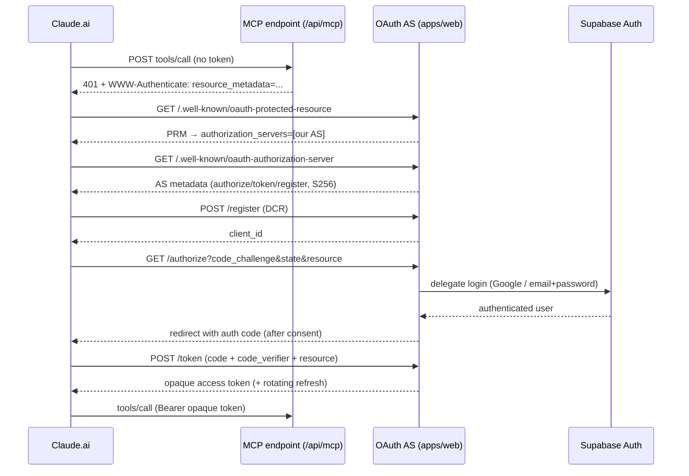
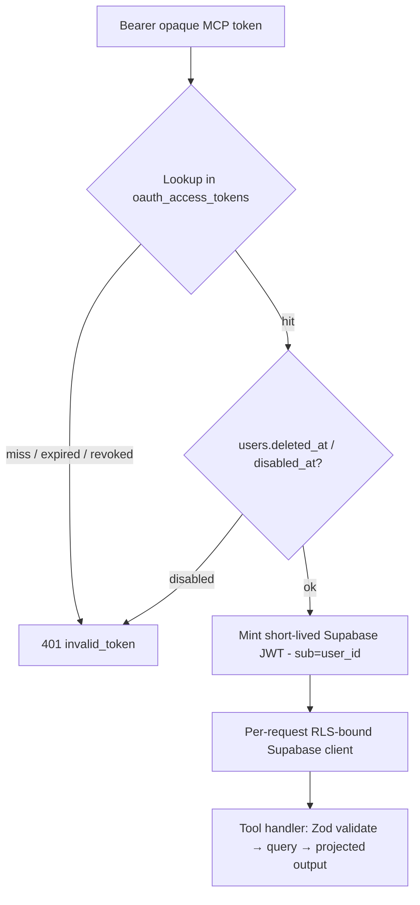

# feat: MCP connector for athlete-stats CRUD

## Summary

Build a remote MCP (Model Context Protocol) server inside `apps/web` so Claude.ai (and any MCP client) can read and write the connected athlete's own Daily-Athlete training data. `apps/web` acts as both the OAuth 2.1 authorization server (hand-rolled, delegating login to existing Supabase auth) and the MCP resource server. Every tool call resolves the bearer token to a Supabase user identity and runs through an RLS-bound client, so Postgres scopes all data to that user. Personal-use scope.

---

## Problem Frame

The athlete already reasons about training inside an AI assistant, but their Daily-Athlete data is trapped behind the app — the only way in is manual copy-paste, which is lossy and leaves the model blind to training load, the active plan, and recent trend. The connector removes that tax for the people building the app (`see origin: docs/brainstorms/2026-06-27-mcp-athlete-stats-connector-requirements.md`).

Two research findings shape the build:
- **The repo has no MCP, OAuth, or JWT primitives** — this is greenfield. The closest precedent is the Strava OAuth flow (`docs/solutions/strava-oauth.md`), whose signed-state + PKCE + JWT-vs-service-role discipline is the structural template.
- **"Writes reuse existing RPCs" conflicts with "no service-role bypass."** Every write RPC (`complete_planned_workout`, `apply_weekly_review`, `create_ai_plan`, `supersede_manual_match`) is `GRANT EXECUTE TO service_role` only, so a user JWT cannot call them. The plan resolves this by doing RLS-direct table writes for the clean paths and deferring the atomic dual-write paths (matched completion, weekly-review apply) out of v1.

---

## Key Technical Decisions

- **Hand-rolled OAuth 2.1 AS in `apps/web`** (user decision, overriding the now-available Supabase native OAuth server). `apps/web` serves discovery metadata, `/authorize`, `/token`, and Dynamic Client Registration; login delegates to Supabase (Google + email/password, per `89fe0af`). Rationale: full control over consent and scopes, no dependency on a still-rolling-out Supabase feature.
- **Opaque MCP tokens, bridged to a minted Supabase JWT per call.** The connector issues opaque access/refresh tokens stored server-side (not a wrapped Supabase refresh token — that would survive password change/ban). On each tool call, the opaque token resolves to a `user_id`; the server checks `users.deleted_at`/`disabled_at`, then mints a short-lived Supabase-compatible JWT (`sub`=user id, `role`=authenticated) signed with the project JWT secret and builds a per-request RLS-bound Supabase client. This preserves the repo's RLS-primary posture (R5) without any service-role bypass in tool execution.
- **RLS-direct writes; defer atomic dual-writes.** Profile `manual_fields`, completed-workout create/edit/soft-delete, and planned-workout create/edit/move/soft-delete are pure RLS table writes. Marking a planned workout `completed` (which also writes `completed_workouts` + `workout_matches` + a planned-status flip) and applying weekly reviews are **deferred** — not because RLS forbids them (all three tables have self-scoped insert/update policies callable under a user JWT), but because no `SECURITY INVOKER` RPC exists to make the three writes atomic the way the service-role `complete_planned_workout` RPC does, so a user-JWT path risks a partial-write orphan (see Scope Boundaries).
- **Explicit output projections, never `SELECT *`.** Each read tool returns a hand-picked field set (R7/AE3). `completed_workouts.summary_stats` device/FTP internals, `strava_activity_id`, and `athlete_profiles.baselines`/`weekly_volume_ewma` are derivation-owned and never returned. A test asserts forbidden fields never appear in any tool payload.
- **`mcp-handler` + `@modelcontextprotocol/sdk`** (approved). `mcp-handler@1.1.0` mounts the Streamable-HTTP transport in App Router and provides `withMcpAuth` (token verification only) + `protectedResourceHandler`; `@modelcontextprotocol/sdk` pinned `>=1.26.0` (security floor) for tool definition. Both are token-verification/transport only — the authorization server is ours to build.
- **Reuse, don't rebuild.** Training-load/trend uses the existing pure-function module `apps/web/src/training-load/` (`buildLoadSeries`); secrets register through `apps/web/src/config.ts`; stored tokens encrypt at rest via `apps/web/src/security/token-crypto.ts` (with the `\x<hex>` BYTEA conversion the crypto solution doc flags).
- **New `edited_by_kind` value `agent`.** Connector-originated planned-workout edits stamp `edited_by_kind = 'agent'` (SQL column is open TEXT; add `agent` to the Zod enum) plus a `workout_edits` audit row, so agent edits are distinguishable from `athlete`/`coach`/`ai_review`.
- **Build target spec `2025-11-25`**, backward-compatible to `2025-06-18`; Streamable HTTP only (legacy SSE skipped); register both `https://claude.ai/api/mcp/auth_callback` and Claude Code loopback redirect URIs.

---

## High-Level Technical Design

### First-time connect (OAuth handshake)



### Per-tool-call token bridge



---

## Output Structure

```
apps/web/
  app/
    api/
      mcp/
        [transport]/route.ts        # MCP Streamable-HTTP endpoint (mcp-handler, runtime=nodejs)
      oauth/
        authorize/route.ts          # /authorize + consent + Supabase login delegation
        token/route.ts              # /token (code exchange + refresh rotation)
        register/route.ts           # Dynamic Client Registration
    .well-known/
      oauth-protected-resource/route.ts   # RFC 9728
      oauth-authorization-server/route.ts # RFC 8414
  src/
    mcp/
      tools/                        # one file per tool group (profile, completed, planned, plans, load)
      tools.ts                      # registerTool wiring
      output-schemas.ts             # .pick() projections (re-exported from @da2/shared where shared)
      identity.ts                   # opaque-token → user_id → minted Supabase JWT → RLS client
      __tests__/
    oauth/
      state.ts                      # HMAC-signed state (mirror Strava)
      pkce.ts                       # S256 verify
      tokens.ts                     # issue/rotate/revoke opaque tokens (encrypt at rest)
      clients.ts                    # DCR storage
      __tests__/
packages/shared/src/
  mcp-tool-io.ts                    # tool input + projected output schemas
supabase/migrations/
  0025_mcp_oauth.sql                # oauth_clients, oauth_authorization_codes, oauth_access_tokens (+RLS, cascade)
```

---

## Requirements Traceability

| Origin requirement | Covered by |
|---|---|
| R1 remote MCP server in apps/web | U1 |
| R2 MCP over HTTP, any client | U1 |
| R3 OAuth login via existing Supabase account | U5 |
| R4 addable by URL, discovery + registration | U4 |
| R5 RLS-scoped, no service-role bypass | U7, U9 |
| R6 writes via shared Zod validation (RPC clause substituted by RLS-direct writes — see Key Technical Decisions) | U9 |
| R7 sensitive surfaces never exposed | U8 (projections), U10 (test) |
| R8 profile read/update | U8, U9 |
| R9 completed workouts CRUD | U8, U9 |
| R10 planned workouts CRUD incl. plan edits | U9 |
| R11 plans read | U8 |
| R12 training load/trend read | U8 |
| AE1 cross-user isolation | U3 (RLS tests), U7 |
| AE2 plan edits match in-app semantics | U9 |
| AE3 no sensitive fields in payloads | U8, U10 |

---

## Implementation Units

Grouped into four phases. U-IDs are stable.

### Phase 1 — Foundations

### U1. MCP endpoint skeleton + transport
- **Goal:** A reachable Streamable-HTTP MCP endpoint that lists tools and returns a spec-correct 401 when unauthenticated.
- **Requirements:** R1, R2
- **Dependencies:** none
- **Files:** `apps/web/app/api/mcp/[transport]/route.ts`, `apps/web/src/mcp/tools.ts`, `apps/web/app/api/mcp/[transport]/__tests__/route.test.ts`, `apps/web/package.json`
- **Approach:** Add `mcp-handler@1.1.0` + `@modelcontextprotocol/sdk@>=1.26.0` (pin to the `mcp-handler` peer). Mount `createMcpHandler` under `app/api/mcp/[transport]/route.ts` with `basePath:"/api/mcp"` (isolated under `/api/mcp` so the dynamic `[transport]` segment never shadows the existing static `app/api/*` siblings), stateless mode (no `Mcp-Session-Id` store) for serverless. Declare `export const runtime = "nodejs"` (JWT minting + `node:crypto` AES-GCM in later units cannot run on Edge). Validate the `Origin` header (DNS-rebinding defense). Wrap with `withMcpAuth(..., { required:true, resourceMetadataPath })` so unauthenticated calls return 401 + `WWW-Authenticate: Bearer resource_metadata="..."`. Prove the transport with a `tools/list` returning the first real read tool stubbed (no throwaway `server.info` stub — U8 lands the real surface).
- **Patterns to follow:** Inngest serve handler `apps/web/app/api/inngest/route.ts` (App Router catch-all + serverless export shape).
- **Test scenarios:**
  - Unauthenticated `tools/call` returns 401 with a `WWW-Authenticate` header carrying `resource_metadata`.
  - `tools/list` returns the registered tool with `title` + `readOnlyHint` annotation present.
  - A request with a mismatched `Origin` is rejected.
- **Verification:** `tools/list` succeeds against a local dev server; 401 shape matches the MCP 2025-11-25 spec.

### U2. Config secrets registration
- **Goal:** Boot-time validation for the connector's new secrets.
- **Requirements:** R3 (supporting)
- **Dependencies:** none
- **Files:** `apps/web/src/config.ts`, `.env.example`, `.env.local`
- **Approach:** Add a `mcpOAuth` group to `RawEnv` + `AppConfig`. New secrets: `MCP_OAUTH_STATE_SIGNING_KEY` (HMAC, 32-byte hex), `MCP_TOKEN_ENCRYPTION_KEY` (reuse the versioned-key shape, or fold into `BACKUP_ENCRYPTION_KEYS`-style `MCP_TOKEN_KEYS`), and `SUPABASE_JWT_SECRET` (for minting the per-call Supabase JWT). Add `validateMcpOAuthProd(v)` inside the `isProd` block — fatal in prod for all three (the connector cannot operate without them), mirroring `validateAdminSessionSigningKeyProd`. Normalize placeholders to `undefined`.
- **Patterns to follow:** `apps/web/src/config.ts` hex-key validators (`validateAdminSessionSigningKeyProd`); secret-handling discipline in `docs/solutions/strava-token-crypto.md` (0600 temp file + shred, never inline).
- **Test scenarios:**
  - Missing `MCP_OAUTH_STATE_SIGNING_KEY` in prod throws at config access.
  - Wrong-length / all-zero key is rejected.
  - Dev/test mode warns but does not throw.
- **Verification:** `loadConfig()` surfaces all three under `config.mcpOAuth`; prod boot fails fast on placeholders.

### U3. OAuth data model migration + RLS
- **Goal:** Persistent storage for DCR clients, authorization codes, and issued tokens, RLS-scoped and cascade-aware.
- **Requirements:** R5, AE1
- **Dependencies:** none
- **Files:** `supabase/migrations/0025_mcp_oauth.sql`, `apps/web/src/db/__tests__/mcp-oauth.rls.test.ts`, `apps/web/src/db/__tests__/workout-edits.rls.test.ts`, `packages/shared/src/realtime-allowlist.ts` (no change — assert exclusion)
- **Approach:** Tables: `oauth_clients` (DCR registrations; `client_id`, redirect URIs, metadata, registering IP for the cap), `oauth_authorization_codes` (short-TTL, PKCE `code_challenge`, `user_id`, `resource`, consumed flag), `oauth_access_tokens` (SHA-256 token hash, `user_id`, `family_id` for rotation-lineage/reuse detection, scopes, `expires_at`, `revoked_at`, encrypted refresh material). All carry `user_id`/owner columns. `ENABLE ROW LEVEL SECURITY` with self-scoped SELECT; **token/code writes are service-role-only** (no INSERT/UPDATE RLS policies — same posture as `strava_tokens`), since issuance happens in the AS, not under a user JWT. Store the access token as a SHA-256 hash (lookup by hash), never plaintext; include an expiry sweep (pg_cron or insert-time cleanup) so spent codes/expired tokens don't accumulate. Add all three to `delete_user_cascade(user_id)`. Never join `supabase_realtime`. **Also add a `workout_edits_self_insert` RLS policy** (`WITH CHECK auth.uid() = athlete_id`): `0019` created only self/coach SELECT policies, so U9's agent-attributed audit row cannot be appended under a user JWT without it — adding it keeps the audit write RLS-direct (no service-role exception).
- **Execution note:** Ship the positive/negative RLS tests in this same unit (AGENTS.md hard rule — no athlete-data table crosses a phase boundary without RLS coverage).
- **Patterns to follow:** `supabase/migrations/0002_strava_infra.sql` (service-role-write-only sensitive table), `docs/solutions/migration-conventions.md`, RLS test harness `apps/web/src/db/__tests__/setup.ts`.
- **Test scenarios:**
  - Covers AE1. A user sees only their own `oauth_access_tokens` rows; a stranger's query returns 0 rows.
  - No INSERT policy: a user-JWT insert into `oauth_access_tokens` is denied.
  - `delete_user_cascade` removes the user's clients/codes/tokens (assert count 0 after cascade).
  - A user JWT can insert a `workout_edits` row for itself (new self_insert policy) but is denied inserting one for another athlete.
  - Realtime-publication guard still passes (none of the new tables joined the publication).
- **Verification:** Local RLS suite green; `delete_user_cascade` CI guard satisfied.

### Phase 2 — OAuth authorization server

### U4. Discovery + Dynamic Client Registration
- **Goal:** The well-known metadata documents and `/register` endpoint Claude needs to discover and register.
- **Requirements:** R4
- **Dependencies:** U3
- **Files:** `apps/web/app/.well-known/oauth-protected-resource/route.ts`, `apps/web/app/.well-known/oauth-authorization-server/route.ts`, `apps/web/app/api/oauth/register/route.ts`, `apps/web/src/oauth/clients.ts`, `apps/web/src/oauth/__tests__/discovery.test.ts`
- **Approach:** PRM (RFC 9728) lists `authorization_servers=[our issuer]` and the resource canonical URL; serve via `protectedResourceHandler` + a CORS `OPTIONS` handler (`metadataCorsOptionsRequestHandler`). AS metadata (RFC 8414) advertises `authorization_endpoint`, `token_endpoint`, `registration_endpoint`, `code_challenge_methods_supported:["S256"]`, `token_endpoint_auth_methods_supported:["none"]`. `/register` (RFC 7591) persists a client + returns `client_id`; validate redirect URIs (exact-match, HTTPS or loopback only; block private-IP SSRF). Accept `application/json`. **Enforce a per-IP registration rate limit (~5/hour) and a hard cap on total `oauth_clients` rows at the handler level here, not deferred** — an open DCR endpoint with no initial-access-token is a storage-DoS vector on the Supabase free tier.
- **Patterns to follow:** route-handler envelope in `apps/web/app/api/activities/manual/route.ts`.
- **Test scenarios:**
  - PRM and AS metadata return the required fields with correct content-type and CORS preflight (`OPTIONS`) answered.
  - `/register` with a valid HTTPS redirect URI returns a `client_id` and persists the client.
  - `/register` with a non-loopback `http://` or private-IP redirect URI is rejected.
- **Verification:** Claude.ai discovery probe order resolves end-to-end against a deployed preview.

### U5. `/authorize` + Supabase login delegation + consent
- **Goal:** The authorization-code + PKCE entry point that authenticates the user via Supabase and issues a code after consent.
- **Requirements:** R3, R4
- **Dependencies:** U2, U3, U4
- **Files:** `apps/web/app/api/oauth/authorize/route.ts`, `apps/web/src/oauth/state.ts`, `apps/web/src/oauth/pkce.ts`, `apps/web/app/api/oauth/authorize/__tests__/route.test.ts`
- **Approach:** Validate `client_id` and exact-match `redirect_uri` **first, before any login delegation** — on an invalid `client_id`/`redirect_uri`, render an error page and **never** redirect to the supplied URI (RFC 6749 §4.1.2.1, open-redirect defense). Reject any request whose `code_challenge_method` is absent or not exactly `S256` (metadata advertising S256 is advisory; clients may still send `plain`). Validate `code_challenge` and `resource` (RFC 8707, bound to the canonical MCP URL). If the user has no Supabase session, delegate to Supabase login (Google / email+password) and return to `/authorize`; assert the return-to-`/authorize` target is **same-origin** so a forged `redirect_back_to`/`next` can't smuggle a third-party destination through the Supabase callback. Render a consent screen (show the client + the requested scope + the redirect hostname prominently). On consent, persist an `oauth_authorization_codes` row (short TTL, single-use) and redirect with `code` + `state`. State is **server-HMAC-signed** with `MCP_OAUTH_STATE_SIGNING_KEY`, TTL 600s, compared with `timingSafeEqual` (no length early-return), never logged — mirroring `docs/solutions/strava-oauth.md`. Set the post-consent state cookie as `__Host-` single-use. Rate-limit `/authorize` per-IP (~20/min).
- **Execution note:** Start with a failing test asserting an unsigned/forged `state` is rejected before exchange.
- **Patterns to follow:** `docs/solutions/strava-oauth.md` (signed state, PKCE, never-log contract); `Sec-Fetch-Site` fail-closed posture from `docs/solutions/admin-user-moderation.md` for the consent POST.
- **Test scenarios:**
  - A forged/expired `state` is rejected; comparison is constant-time.
  - Invalid `client_id` or mismatched `redirect_uri` (even trailing-slash) returns an error page, never a redirect to the supplied URI.
  - Missing `code_challenge`, or `code_challenge_method=plain`, is rejected.
  - Authenticated user + consent produces a single-use code bound to `user_id` and `resource`.
  - `state`, `code`, and tokens never appear in log output (asserted here and in U10).
- **Verification:** Full `/authorize` round-trip issues a code for a signed-in Supabase user; security tests green.

### U6. `/token` — code exchange + refresh rotation
- **Goal:** Exchange an authorization code (with PKCE verifier) for an opaque access token, and rotate refresh tokens.
- **Requirements:** R3
- **Dependencies:** U2, U3, U5
- **Files:** `apps/web/app/api/oauth/token/route.ts`, `apps/web/src/oauth/tokens.ts`, `apps/web/src/oauth/__tests__/token.test.ts`
- **Approach:** Accept `application/x-www-form-urlencoded` (return 415 otherwise). For `grant_type=authorization_code`: verify the code is unconsumed + unexpired, verify PKCE (`S256(code_verifier)==code_challenge`), verify `resource` matches, then issue a short-lived opaque access token (default ~1h) + a rotating refresh token. Store only a hash of the access token; encrypt refresh material at rest via `apps/web/src/security/token-crypto.ts` (apply the `\x<hex>` BYTEA conversion). Store the access token as a SHA-256 hash. For `grant_type=refresh_token`: rotate by stamping the old token `revoked_at` (soft — never delete, the revoked row is the theft signal) and issuing a new one in the same `family_id` — rotation is mandatory for public clients under OAuth 2.1. **Reuse detection:** if a refresh token presented to `/token` is already `revoked_at`, treat it as theft — revoke the entire `family_id` lineage and return `invalid_grant`. Bind every token's audience to the canonical MCP URL. Respond within ~10s. Per-IP rate-limit on this public endpoint.
- **Patterns to follow:** `docs/solutions/strava-token-crypto.md` (versioned AES-256-GCM, BYTEA serialization trap).
- **Test scenarios:**
  - Valid code + verifier returns access + refresh tokens; code is single-use (replay rejected).
  - Wrong `code_verifier` is rejected.
  - `resource`/audience mismatch is rejected.
  - Refresh rotates: the old refresh token is marked `revoked_at` after use (not deleted).
  - Replaying an already-rotated refresh token revokes the whole `family_id` and returns `invalid_grant`, indistinguishable (no timing oracle) from an unknown token.
  - Non-form content-type returns 415.
- **Verification:** Token endpoint issues and refreshes tokens; stored tokens are hashed/encrypted, never plaintext.

### U7. Token verification + Supabase-identity bridge + revocation
- **Goal:** Resolve a presented bearer token to an RLS-bound Supabase client, with account-state checks and disconnect.
- **Requirements:** R5, AE1
- **Dependencies:** U2, U3, U6
- **Files:** `apps/web/src/mcp/identity.ts`, `apps/web/app/api/oauth/token/route.ts` (revoke), `apps/web/src/mcp/__tests__/identity.test.ts`
- **Prerequisite gate (hard — resolve before building U6/U7):** confirm the live project exposes a usable HS256 `SUPABASE_JWT_SECRET`. If it has migrated to asymmetric signing keys (Supabase's default for new projects), local HS256 minting is impossible and the fallback — store + refresh a real Supabase session — is a *different* token model that reshapes U3/U6/U7 and **partially regresses R5** (a wrapped session survives a ban until token expiry, which is exactly what the opaque-token design rejects). This is a privilege-boundary decision, not an implementation detail; settle it before the AS is built so U8/U9 aren't built on an unverified bridge. There is no `SUPABASE_JWT_SECRET` in the repo today and no existing code constructs an RLS client from a self-minted token — this is a brand-new pattern with no precedent to copy.
- **Approach:** Implement `verifyToken(req, token)` for `withMcpAuth`: SHA-256 hash-lookup the access token in `oauth_access_tokens`; reject if missing/expired/revoked; load the `user_id`; **check `users.deleted_at` and `disabled_at`** (reject if either set). Because the bridge mints its own JWT and never calls GoTrue, the GoTrue ban is bypassed — so the `disabled_at`/`deleted_at` column read is the *authoritative* gate here, not a mirror; confirm every disable/delete path sets the column (`docs/solutions/admin-user-moderation.md`). On success, mint a short-lived JWT with `sub`=user_id, `role`="authenticated", `aud`="authenticated", `iss`="<SUPABASE_URL>/auth/v1", `exp`≤60s, signed with the project JWT secret. Construct the RLS client **explicitly** as `createClient(url, ANON_KEY, { global: { headers: { Authorization: "Bearer <minted>" } }, auth: { persistSession: false, autoRefreshToken: false } })` — do **not** use `setSession` (it refreshes against GoTrue with a token GoTrue never issued) and do **not** reuse `apps/web/src/auth/server.ts` (cookie-based, can't carry a bearer). Return `AuthInfo` (user_id + scopes). Re-verify on every request (no session-as-auth); revoke/disconnect marks the token rows `revoked_at`.
- **Patterns to follow:** `apps/web/src/auth/bearer.ts` (`resolveAuth`, for the Bearer-extraction shape only). Do **not** cite `apps/web/src/auth/server.ts` (cookie-based, inapplicable) and do **not** use `apps/web/src/db/admin.ts` in this path.
- **Test scenarios:**
  - Covers AE1. A valid token yields a client scoped to that user; querying another user's rows returns 0 rows.
  - Expired/revoked/unknown token → `invalid_token` (401).
  - Token for a `disabled_at`/`deleted_at` user is rejected even if unexpired.
  - Minted JWT carries `sub`, `role="authenticated"`, `aud="authenticated"`, `iss`, and `exp`≤60s; a real RLS query (not just a JWT-shape assertion) resolves `auth.uid()` to that `sub`.
- **Verification:** A tool call with a real token reads only the owner's rows; disconnect immediately stops access.

### Phase 3 — Tool surface

### U8. Read tools + output projections
- **Goal:** Read-only tools with strict field allowlists, pagination, soft-delete filtering, and timezone resolution.
- **Requirements:** R7, R8, R9 (read), R11, R12, AE3
- **Dependencies:** U7
- **Files:** `apps/web/src/mcp/tools/profile.ts`, `apps/web/src/mcp/tools/completed.ts`, `apps/web/src/mcp/tools/planned.ts`, `apps/web/src/mcp/tools/plans.ts`, `apps/web/src/mcp/tools/load.ts`, `apps/web/src/mcp/output-schemas.ts`, `packages/shared/src/mcp-tool-io.ts`, `apps/web/src/mcp/__tests__/read-tools.test.ts`
- **Approach:** Tools: `profile.get`, `workouts.completed.list`/`.get`, `workouts.planned.list`/`.get`, `plans.list`/`.get`, `training.load_summary`. Each output is an explicit `.pick()` projection in `@da2/shared` — **never `SELECT *`**. Forbidden fields: `strava_activity_id`, `summary_stats` device/FTP internals (`ftp_at_workout`, power/HR device keys), `athlete_profiles.baselines`/`weekly_volume_ewma`/`manual_field_edited_at`. Profile read returns `manual_fields` + a curated derived summary only. Every list applies `deleted_at IS NULL`, a default **plus a server-enforced max** limit (Zod `.max()`, e.g. ≤200 workouts / ≤50 plans — a default alone doesn't stop `limit: 999999`), a cursor, and (for completed/planned) a default date range. `training.load_summary` loads RLS-scoped completed workouts and runs `buildLoadSeries` from `apps/web/src/training-load/` — no new aggregation. Note `buildLoadSeries` is fed the **full** rows (including `summary_stats`, which it reads `ftp_at_workout`/power from) server-side; only the projected CTL/ATL/TSB/ramp output crosses the tool boundary, so the forbidden-field guard applies to the tool *output* schema, not to `buildLoadSeries`' input — don't strip `summary_stats` before the load math. Resolve the connected user's `users.timezone` server-side; interpret bare dates in it. Mark all read tools `readOnlyHint:true`.
- **Patterns to follow:** read helpers `apps/web/src/db/workouts.ts`; `apps/web/src/training-load/index.ts`.
- **Test scenarios:**
  - Covers AE3. For each read tool, the payload omits every forbidden field (table-driven assertion over the forbidden list).
  - `completed.list` excludes soft-deleted rows and respects limit + cursor.
  - `training.load_summary` returns CTL/ATL/TSB from `buildLoadSeries` and contains no raw `summary_stats`.
  - `profile.get` returns only `manual_fields` + curated derived summary, never `baselines`.
  - Bare-date inputs resolve against `users.timezone`, not UTC.
- **Verification:** All read tools return projected, scoped, non-leaking payloads; forbidden-field test green.

### U9. Write tools (RLS-direct)
- **Goal:** Create/update/delete tools for the clean RLS paths, with concurrency, attribution, and honest error mapping.
- **Requirements:** R6, R8 (update), R9 (write), R10, AE2
- **Dependencies:** U7, U8
- **Files:** `apps/web/src/mcp/tools/profile.ts`, `apps/web/src/mcp/tools/completed.ts`, `apps/web/src/mcp/tools/planned.ts`, `packages/shared/src/planned-workout.ts` (`EditedByKindSchema`), `packages/shared/src/workout-edit.ts` (`WorkoutEditActorRoleSchema`), `apps/web/src/db/workout-edits.ts` (reuse `appendWorkoutEdit`), `apps/web/src/mcp/__tests__/write-tools.test.ts`
- **Approach:** Tools: `profile.update` (writes **only** `manual_fields`; let the `0005` trigger stamp `manual_field_edited_at`; reject derived-column writes), `workouts.completed.log`/`.edit`/`.delete`, `workouts.planned.create`/`.edit`/`.move`/`.delete`. All writes go through the RLS-bound client with `athlete_id` taken from auth, never the body. Validate input with the shared Zod schemas. Planned edits: read+return `version`, require it on edit, map a mismatch to a distinct `stale_retry` tool error (mirrors the RPC `skipped_stale` outcome); stamp `edited_by_kind='agent'` + append a `workout_edits` audit row (add `agent` to **both** `EditedByKindSchema` and `WorkoutEditActorRoleSchema`; the audit insert relies on the new `workout_edits_self_insert` policy from U3); bump happens via the `0021` trigger. The `0021` trigger bumps `version` only on plannable-column changes, not status-only edits — so the v1 write tools must not perform status-only transitions (those belong to the deferred matched-completion path); the version guard therefore covers plannable edits only. Soft-delete = `UPDATE deleted_at`; refuse already-deleted rows. **A targeted write affecting 0 rows maps to `not_found_or_forbidden`, never silent ok** (RLS denial returns 0 rows). `workouts.completed.delete` **refuses** when the completed workout has a live `workout_match` (the unmatch/supersede path is deferred — service-role-only today), returning a clear `requires_in_app` error so the model doesn't retry a refusal it can't resolve via v1 tools. Since v1's `log` path only creates *unmatched* completions, this dead-end is narrow but must be documented (U10). Mark mutating tools `destructiveHint:true` where they delete.
- **Patterns to follow:** clean RLS insert `apps/web/app/api/activities/manual/route.ts`; attribution + audit `apps/web/app/api/workouts/[id]/status/route.ts` + `apps/web/src/db/workout-edits.ts`; `version` semantics `supabase/migrations/0021_planned_workouts_version.sql`.
- **Test scenarios:**
  - Covers AE2. Editing a planned workout via the tool produces the same row state + audit row + `version` bump as the in-app status route.
  - `profile.update` writing a derived column (e.g., `baselines`) is rejected; writing `manual_fields` succeeds and stamps `manual_field_edited_at`.
  - Stale `version` on edit returns `stale_retry`, not a silent overwrite.
  - Update/delete targeting a non-owned or non-existent id returns `not_found_or_forbidden` (0 rows ≠ ok).
  - Deleting a matched completed workout is refused.
  - `athlete_id` always comes from auth, never the request body.
- **Verification:** Write tools mutate only owned rows, preserve versioning/soft-delete/attribution, and never report phantom success.

### Phase 4 — Hardening

### U10. Security audit, logging guard, connect docs
- **Goal:** Prove the never-log/never-leak contracts and document adding the connector to Claude.ai.
- **Requirements:** R7, AE3 (system-level)
- **Dependencies:** U4, U5, U6, U8, U9
- **Files:** `apps/web/src/oauth/__tests__/no-secret-logging.test.ts`, `apps/web/src/mcp/__tests__/forbidden-fields.test.ts`, `docs/operational/mcp-connector.md`, `README.md`
- **Approach:** A CI test asserts `code`, `code_verifier`, access/refresh tokens, and signed `state` never appear in log args across the OAuth + MCP routes (extend the Strava logging-audit pattern). A system-level forbidden-field test runs every read tool and asserts no sensitive field leaks (operationalizing R7/AE3 across the whole surface). Document the connect flow, required env vars, the registered redirect URIs (`https://claude.ai/api/mcp/auth_callback` + Claude Code loopback), and the matched-completion consequence (logging via the connector leaves planned days un-closed) in a single platform-agnostic "Connect Claude.ai" section. Verify the per-IP rate limits already enforced in U4 (`/register`), U5 (`/authorize`), and U6 (`/token`) — they are built in those units, not here.
- **Test expectation:** behavioral — logging guard + forbidden-field sweep are the unit's deliverables.
- **Test scenarios:**
  - Driving `/authorize`→`/token` with secrets present, no secret string appears in captured logs.
  - The forbidden-field sweep fails if any tool output schema regresses to include a sensitive field.
- **Verification:** Logging + forbidden-field guards green in CI; docs let a fresh user connect Claude.ai end-to-end.

---

## Scope Boundaries

### Deferred for later (from origin)
- Triggering AI plan generation/regeneration from the connector (the Inngest/Groq path) — plans stay read-only.
- Applying weekly-review adaptations through the connector.
- Coach-facing tools (`coach_athlete_links`).
- Granular per-tool OAuth scopes / per-action consent — single access scope for now.
- Productizing for external users (multi-tenant onboarding, marketplace listing, quota hardening).

### Outside scope (never exposed)
- Strava tokens and raw payloads, entitlements/billing, admin tables — never a tool, never in a payload (R7).

### Deferred to Follow-Up Work (plan-local, surfaced by research)
- **Matched plan-day completion** — marking a planned workout `completed` with the atomic `completed_workouts` + `workout_matches` + status-flip write. RLS permits each write under a user JWT, but there is no `SECURITY INVOKER` RPC to make the three atomic, so the connector would risk a partial-write orphan. Kept out of v1. **Consequence U10 must document:** `workouts.completed.log` creates an *unmatched* completed workout, so logging via the connector does not close out the corresponding planned day — in-app adherence/trend will still show that day as not-done. Ship this consequence in the docs, not silently.
- **Unmatch / supersede** path so a matched completed workout can be deleted cleanly (depends on `supersede_manual_match`, service-role-only today).

---

## Risks & Mitigations

- **Hand-rolled OAuth is the highest-risk surface.** Mitigate by mirroring the audited Strava flow (signed state, PKCE, exact redirect match, never-log test) and by binding token audience to the canonical MCP URL (no token passthrough / confused-deputy).
- **Minting a Supabase JWT requires the project JWT secret.** Confirm during U2/U7 whether the project uses the legacy HS256 secret or has migrated to asymmetric signing keys; the minting strategy must match. If unavailable, fall back to storing+refreshing a Supabase session (with the revocation caveats). *(Deferred to implementation — verify against the live project.)*
- **Spec instability.** MCP auth (`2025-11-25`, CIMD draft-00) and Claude.ai connector behavior are actively shifting; re-verify discovery field names and DCR acceptance against a real Claude.ai connection before declaring done.
- **Token revocation latency.** Short access-token lifetime + per-call `deleted_at`/`disabled_at` check keeps a disconnect/ban effective quickly.

---

## Dependencies / Prerequisites

- New packages: `@modelcontextprotocol/sdk@>=1.26.0`, `mcp-handler@1.1.0` (approved). Pin SDK to the `mcp-handler` peer.
- `SUPABASE_JWT_SECRET` (or asymmetric signing key) available to the runtime for JWT minting.
- Every exposed table already has complete self-scoped RLS (confirmed in research for `plans`, `planned_workouts`, `completed_workouts`, `athlete_profiles`, `users`; none has a DELETE policy → soft-delete via UPDATE is the contract).
- Public HTTPS deployment reachable by Anthropic's egress range; metadata endpoints answer CORS preflight.

---

## Open Questions

### Deferred to Implementation
- Legacy HS256 JWT secret vs. asymmetric signing key for minting the per-call Supabase JWT — verify against the live project (U7).
- Whether to support CIMD in addition to DCR for client registration — DCR is sufficient for personal use; CIMD is additive (U4).
- Exact access-token lifetime (proposed default ~1h) (U6). Rate limiting is resolved: per-IP caps on `/register` (~5/hr + total-row cap), `/authorize` (~20/min), and `/token` are in scope — tune thresholds during implementation.
