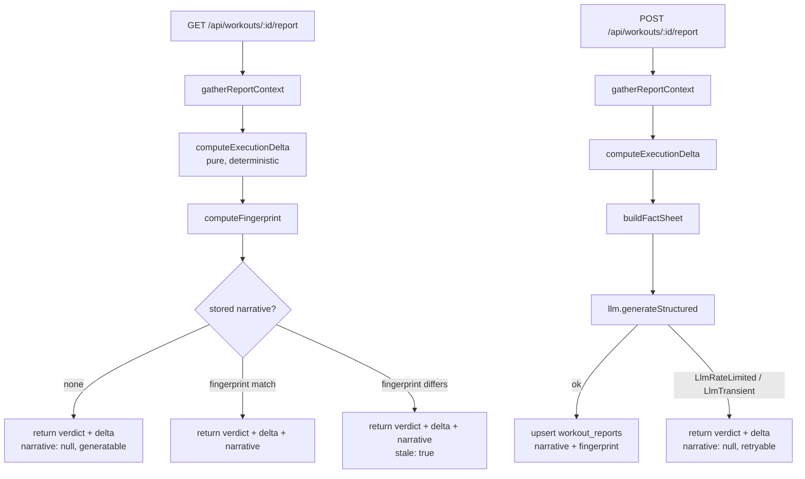

# Per-Workout Reports - Plan

## Goal Capsule

**Objective.** Give an athlete a per-workout debrief that answers one question — *how did I do against my own plan and my own goals* — as a deterministic verdict plus AI narration, generated on demand and cached.

**Product authority.** The Product Contract below (from the `ce-brainstorm` dialogue of 2026-08-17/18). Planning did not change it. **Product Contract preservation: unchanged.**

**Open blockers.** None. Two forks resolved at plan time: mobile ships the Insights tab *and* a workout detail route; coach access ships at the data layer (RLS + API) with UI deferred.

---

## Problem Frame

`apps/web/app/(athlete)/athlete/workouts/[id]/page.tsx` renders a *data view* — HR card, zone breakdown, lap splits from Strava enrichment. It shows an athlete what happened. It does not tell them **how they did**, and it has no notion of what was prescribed.

The athlete's actual question after a session is self-referential: *did I execute what I was supposed to, and does it move me toward my goal?* Answering that requires joining the completed workout to its matched `planned_workouts` prescription and to the athlete's own thresholds — a comparison the product currently never makes on any surface.

`weekly_reviews` (migration `0019`) is the nearest existing thing, but it is week-scoped and it is a **proposal** — it carries `proposed_changes`, an accept/reject lifecycle, and an apply-RPC that edits the plan. A debrief has nothing to accept. The overlap is nominal.

---

## Product Contract

### Actors

- **A1 — Athlete.** Owns the workout, triggers report generation, reads the report on web and mobile.
- **A2 — Linked coach.** Can read a linked athlete's reports through the data layer. No coach-facing UI in this shipment.

### Requirements

- **R1.** An athlete can generate a report for any of their own `completed_workouts` rows, on demand.
- **R2.** The report answers "how did I do" with a **verdict** derived deterministically from prescribed-vs-actual, not from model output.
- **R3.** When the workout is matched to a `planned_workouts` row, the report compares actual execution against that prescription.
- **R4.** When the workout has **no** match (unplanned, ad-hoc, or unmatched), the report is not an error state — it reads the effort on its own terms against the athlete's profile and goal.
- **R5.** The report's narration is an LLM-written coach's note (3–6 sentences) grounded in the computed facts, followed by one forward-looking takeaway.
- **R6.** Narration context includes: the session, the matched plan intent, recent training load, and the athlete's profile, thresholds, event date, and plan goal.
- **R7.** Generation is on demand only. Nothing is generated at ingest.
- **R8.** A generated narrative is cached and reused on subsequent views.
- **R9.** A cached narrative is invalidated only by **material** change to the workout — distance, duration, sport, `summary_stats` (including enrichment arriving), plan match changing, or supersession. Cosmetic changes must not invalidate.
- **R10.** Invalidated narratives regenerate lazily, on next view, never eagerly.
- **R11.** A linked coach can read their athlete's reports at the data layer (RLS + API).
- **R12.** The athlete reads the report on the web workout detail page and on mobile.
- **R13.** When the LLM is unavailable, rate-limited, or fails, the athlete still sees the verdict and the underlying numbers.

### Key Flows

- **F1 — Matched debrief.** Athlete opens a completed workout → verdict and comparison render immediately → athlete taps *Generate report* → narrative appears and is cached → subsequent views read the cache.
- **F2 — Unmatched debrief.** Same flow, comparison block empty, narration reads the effort standalone.
- **F3 — Staleness.** Strava enrichment lands after the report was written → fingerprint mismatch → next view shows the stored narrative marked stale with a regenerate affordance.
- **F4 — Degraded.** LLM rate-limited → verdict and comparison still render → narration surfaces a retry affordance, not an error page.

### Acceptance Examples

- **AE1.** Prescribed 60 min @ `{kind: "ftp_pct", value: 75}`, load 55. Actual 58 min, TSS 61, avg power within band. Verdict: executed as prescribed. Comparison shows duration −2 min, load +6.
- **AE2.** Prescribed 90 min endurance run. Actual 34 min. Verdict: materially under-executed on duration. Narration names the shortfall without inventing a reason.
- **AE3.** A 22-minute unplanned commute ride with no `workout_matches` row. Report generates, comparison block is absent, narration reads it as an unplanned easy effort against the athlete's recent load.
- **AE4.** Report generated, then a non-material field changes (e.g. a `started_at` timestamp correction, or `strava_activity_id` backfill). Fingerprint unchanged, cached narrative served, zero LLM calls. *Note: `completed_workouts` has no `notes` column today — the original wording of this example described an edit the schema cannot express. The fingerprint is minimal by construction (KTD4), so if a notes field is added later it is already excluded.*
- **AE5.** Report generated pre-enrichment, then Strava laps/zones arrive. Fingerprint changes; report renders stale-marked until regenerated.
- **AE6.** Groq returns 429. Route returns the verdict and comparison with `narrative: null` and a retryable status. No 5xx.

### Scope Boundaries

**In scope.** `workout_reports` entity, deterministic execution-delta engine, on-demand generation route, fingerprint-based cache invalidation, web athlete report section, mobile Insights tab + mobile workout detail route, coach read at the data layer.

#### Deferred for later

- Coach-facing report UI (the data layer ships here; the UI needs no migration).
- Auto-generation at ingest, batched or gated.
- Regeneration triggered by anything other than an athlete viewing the workout.

#### Outside this product's identity

- Peer, percentile, or leaderboard comparison. The report is self-referential by design — this was the sharpest product decision in the brainstorm and it is not a "later" item.

---

## Planning Contract

### Key Technical Decisions

**KTD1 — The verdict is arithmetic; only the narrative is AI.** A deterministic `computeExecutionDelta` produces the verdict and the comparison. The LLM receives that computed fact sheet and writes prose over it. Rationale: the athlete's question is a comparison, and comparisons must be reproducible. This also collapses the hallucination surface — the model cannot invent numbers it was not handed — and shrinks the prompt enough to matter against the current Groq tier's token ceiling. Satisfies R2, R13.

**KTD2 — The delta is computed on read; only the narrative is persisted.** The delta is cheap and pure, so recomputing it per request is free and always correct. Consequence: the verdict has **no staleness problem at all**, and the fingerprint/invalidation machinery guards exactly one field — the narrative. Satisfies R9, R10; simplifies U6 substantially.

**KTD3 — Net-new `workout_reports` table, not an extension of `weekly_reviews`.** `weekly_reviews.scope` does admit `'workout'`, but its semantics are proposal semantics (`proposed_changes`, `status IN ('proposed','accepted',…)`, `decided_at`, an apply-RPC). Storing debriefs there would mean permanently-`no_changes` rows and teaching every consumer to ignore half the columns. The reuse is nominal; the coupling is real.

**KTD4 — Fingerprint over the material inputs only.** A stable hash over `{distance_m, duration_s, sport, summary_stats, matched_planned_workout_id, planned_structure, planned_load, superseded_by_id, plan_goal, plan_event_date}`. Fields absent from the hash cannot invalidate, which is what makes R9 hold by construction rather than by discipline.

*Revised after the U6 review.* The original eight-field set was scoped in the same document that fed `plan.goal`, `plan.event_date` and `recentLoad` to the narration prompt — a gap, not a decision. Resolved as follows, and the split is deliberate:

- **`plan_goal` / `plan_event_date` ARE hashed.** Both reach the prompt verbatim and the takeaway is written *toward* them. An athlete who changes their event from a marathon to a 70.3 has invalidated the advice in every stored takeaway; leaving these out left those reports narrating a dead goal forever with `stale: false`. They change once a season, so hashing them costs almost no spurious invalidation.
- **`recentLoad` (CTL/ATL/TSB) is deliberately NOT hashed, permanently.** It is an EWMA over the athlete's whole history, so *any* new activity perturbs it. Hashing it — even coarsely rounded — would mark every past report in the account stale the moment the athlete finishes their next ride, turning `stale` into permanent noise and inviting an unbounded regeneration bill. The three scalars are context colour, and they were TRUE as of the day the report describes; a historical snapshot ageing is not the report going wrong.

**KTD9 — A verdict-category flip is stronger than staleness.** `workout_reports.verdict_code` records the verdict the prose was written against. When the recomputed verdict differs, the response carries `verdictChanged` and both UIs SUPPRESS the note rather than badge it: a note explaining "you came up short" under an "As prescribed" header contradicts the header, and the athlete has no way to tell which to believe. Plain staleness (same category, different numbers) still shows the note behind an "Out of date" badge.

**KTD5 — Synchronous generation in the route handler, no Inngest job.** The prompt is a compact fact sheet, not a full plan, so the call fits comfortably in a serverless invocation. `generate-plan.ts` uses Inngest because plan generation is long and multi-step; this is neither. Revisit only if p95 latency proves otherwise.

**KTD6 — `workout_reports` does NOT join `supabase_realtime`.** Generation is user-initiated and the client knows when it asked; there is no push case. Per `AGENTS.md`, realtime membership is opt-in, so this is an explicit non-addition — `REALTIME_ALLOWLIST` is untouched and the CI guard (`apps/web/src/db/__tests__/realtime-publication.test.ts`) stays green without edits.

**KTD7 — Thresholds come from `summary_stats` snapshots, not from a zones model.** `athlete_profiles.baselines.per_sport` is `z.record(z.unknown())` — zones were deferred and do not exist as a structure. The delta uses `summary_stats.ftp_at_workout` / `hr_max_at_workout` (snapshotted at ingest, so historically correct) plus `manual_fields`. Building a zones model is explicitly out of scope.

**KTD8 — Every delta dimension degrades independently.** `PlannedWorkoutStructureSchema` is `.passthrough()` with only `phase` known, so a coach-authored or hand-edited workout may lack `duration_s`, `load`, or `intensity_target`. Each dimension yields `{status: "unavailable"}` rather than failing the report. The generated-plan path (`GeneratedWorkoutStructureSchema`) supplies all of them; other paths may not.

### High-Level Technical Design



The read path never calls the LLM. That is what makes R13 and F4 fall out of the architecture rather than needing error-handling discipline at each call site.

**Delta shape — as built in U2** (`packages/shared/src/workout-report.ts`; this is the authoritative contract, superseding the pre-implementation sketch):

```ts
type ExecutionDelta =
  | { matched: true;  dimensions: { duration: DimensionDelta;
                                    load: DimensionDelta;
                                    intensity: IntensityDimensionDelta }; verdict: Verdict }
  | { matched: false; verdict: Verdict }

type DimensionDelta =
  | { status: "on_target" | "under" | "over"; prescribed: number; actual: number; deltaPct: number }
  | { status: "unavailable" }            // strict: no other keys permitted

type IntensityDimensionDelta =           // same, plus the target it was resolved against
  | { status: "on_target" | "under" | "over"; target: IntensityTarget;
      prescribed: number; actual: number; deltaPct: number }
  | { status: "unavailable" }

type Verdict = { code: VerdictCode; headline: string }   // headline templated, never model-written

type WorkoutReportResponse = { delta: ExecutionDelta; narration: ReportNarration | null;
                               stale: boolean; generatable: boolean }
```

Three deliberate strengthenings over the original sketch, all made during U2 and adopted:

1. **Discriminated unions with `.strict()`, not optional fields.** KTD8's "each dimension degrades independently" and R4's "no dimensions when unmatched" are now structural guarantees the type system enforces, rather than conventions a test has to police.
2. **`intensity` carries its `IntensityTarget`.** A bare number is ambiguous across `ftp_pct` / `zone` / `pace_s_per_km` — they have different units and different directions of "better". Carrying the target lets the fact sheet and the UI say *what* was being compared.
3. **`verdict` lives inside `ExecutionDelta`, not beside it.** It is computed by the same pure function (KTD2), so it travels with the delta; `WorkoutReportResponse` reaches it as `delta.verdict` rather than duplicating it.

---

## Implementation Units

### U1. `workout_reports` table, RLS, and tests

**Goal.** Persist one narrative per completed workout, readable by the owning athlete and their linked coach.

**Requirements.** R8, R11.

**Dependencies.** None.

**Files.**
- `supabase/migrations/0027_workout_reports.sql`
- `apps/web/src/db/__tests__/workout-reports.rls.test.ts`

**Approach.** One row per `completed_workout_id` (unique). Columns: `id`, `athlete_id` (FK `users`, ON DELETE CASCADE), `completed_workout_id` (FK `completed_workouts`, ON DELETE CASCADE, UNIQUE), `narrative TEXT`, `takeaway TEXT`, `verdict_code TEXT`, `input_fingerprint TEXT NOT NULL`, `model TEXT`, `generated_at TIMESTAMPTZ NOT NULL DEFAULT now()`, `created_at`, `deleted_at`. Soft-delete column present for consistency with the athlete-content convention in `AGENTS.md`, though no user-facing delete flow ships here.

Athlete SELECT policy on `athlete_id = auth.uid()`. Additive coach SELECT policy mirroring the pattern in `0010`/`0019` (join through `coach_athlete_links`). No INSERT/UPDATE/DELETE policies — writes are service-role only from the generation route, which filters by the authenticated athlete explicitly.

Per **KTD6**, do **not** add this table to `supabase_realtime` and do **not** touch `REALTIME_ALLOWLIST`.

**Patterns to follow.** `supabase/migrations/0019_weekly_reviews_and_workout_edits.sql` for the coach-additive SELECT policy and the service-role-write posture. `supabase/migrations/0008_completed_workouts_and_matches.sql` for soft-delete and FK conventions. `docs/solutions/migration-conventions.md`.

**Test scenarios.**
- Athlete SELECTs their own report row — visible.
- Athlete SELECTs another athlete's report row — zero rows (negative RLS, required by `AGENTS.md`).
- Coach with an active `coach_athlete_links` row SELECTs a linked athlete's report — visible.
- Coach with no link to that athlete — zero rows.
- Athlete attempts INSERT/UPDATE/DELETE — rejected (no policy).
- Second insert for the same `completed_workout_id` — rejects on the unique constraint.
- Deleting the parent `completed_workouts` row cascades the report away.
- `workout_reports` is absent from `supabase_realtime` (assert explicitly; the existing publication guard only checks allowlist drift).

**Verification.** Migration applies cleanly against a fresh local stack; both positive and negative RLS assertions pass for athlete and coach.

---

### U2. Shared report contracts

**Goal.** One authoritative Zod definition of the delta, verdict, fact sheet, and report response, importable by web and mobile.

**Requirements.** R2, R3, R4, R5.

**Dependencies.** None (parallel with U1).

**Files.**
- `packages/shared/src/workout-report.ts`
- `packages/shared/src/index.ts` (export)
- `packages/shared/src/__tests__/workout-report.test.ts`

**Approach.** Define `VerdictCodeSchema` (closed enum), `DimensionStatusSchema` (`on_target | under | over | unavailable`), `DimensionDeltaSchema`, `ExecutionDeltaSchema`, `ReportNarrationSchema` (the LLM's output contract: `{ note: string, takeaway: string }`, both length-capped per the untrusted-LLM-string convention used by `weekly_reviews.narrative`), and `WorkoutReportResponseSchema` (what the API returns: delta + verdict + optional narration + `stale` + `generatable`).

`ReportNarrationSchema` is the trust boundary — `src/llm` returns `unknown` by contract and the caller safeParses.

**Patterns to follow.** `packages/shared/src/completed-workout.ts` for row/response schema layering; `packages/shared/src/edit-op.ts` for `IntensityTargetSchema`, which the delta reuses rather than redefining.

**Test scenarios.**
- Valid delta with all three dimensions populated parses.
- Delta with `intensity: {status: "unavailable"}` and no `prescribed` parses (KTD8).
- Unmatched delta (`matched: false`, no dimensions) parses.
- Narration exceeding the length cap is rejected.
- Narration missing `takeaway` is rejected.
- An unknown `verdict_code` string is rejected (closed enum).

**Verification.** `npx tsc --noEmit` clean across the workspace; schema tests pass.

---

### U3. Deterministic execution-delta engine

**Goal.** Pure function from context to `ExecutionDelta` — the verdict, computed without a model.

**Requirements.** R2, R3, R4.

**Dependencies.** U2.

**Files.**
- `apps/web/src/ai/reports/delta.ts`
- `apps/web/src/ai/reports/__tests__/delta.test.ts`

**Approach.** `computeExecutionDelta(context): ExecutionDelta`, pure and side-effect free — no I/O, no clock, no Supabase client. Compares, per dimension:

- **Duration** — `planned.structure.duration_s` vs `completed.duration_s`.
- **Load** — `planned.planned_load` vs `summary_stats.tss ?? tss_equivalent`.
- **Intensity** — `planned.structure.intensity_target` resolved against the workout's snapshotted threshold (`ftp_at_workout` for `ftp_pct`, `hr_max_at_workout` for `zone`, `avg_pace_s_per_km` for `pace_s_per_km`) vs the corresponding actual.

Each dimension independently returns `unavailable` when either side is missing (KTD8). Tolerance bands are named constants in this module, not scattered magic numbers. `matched: false` short-circuits every dimension to absent and yields the `unplanned_effort` verdict — this is the whole of R4's implementation, not a special-cased branch elsewhere.

**Execution note.** Implement this unit test-first. It is pure, it is the load-bearing correctness surface for the entire feature, and the tolerance-band decisions are exactly the kind that should be pinned by tests before the prose narration makes them hard to see.

**Patterns to follow.** `apps/web/src/training-load/invariants.ts` for pure-computation module shape and constant naming.

**Test scenarios.**
- Covers AE1. Prescribed 3600s / load 55; actual 3480s / TSS 61 → duration `on_target`, load `on_target`, verdict `executed_as_prescribed`.
- Covers AE2. Prescribed 5400s; actual 2040s → duration `under`, verdict `under_executed`.
- Covers AE3. `matched: false` → all dimensions absent, verdict `unplanned_effort`.
- Prescribed structure missing `intensity_target` → intensity `unavailable`, other dimensions still computed, verdict `partial_data` only if it alone would have decided the outcome.
- `summary_stats` has neither `tss` nor `tss_equivalent` → load `unavailable`.
- `intensity_target.kind === "ftp_pct"` but `ftp_at_workout` absent → intensity `unavailable`, no divide-by-zero, no NaN in output.
- Actual duration exactly at the tolerance boundary — assert the inclusive/exclusive edge explicitly.
- Zero-duration and zero-load prescriptions do not produce `Infinity` or `NaN` in `deltaPct`.
- Same input twice returns a deeply-equal result (determinism).

**Verification.** Full branch coverage of the dimension matrix; no test in this file constructs a Supabase client or an LLM client.

---

### U4. Context assembly and fingerprint

**Goal.** Load everything the delta and the fact sheet need in one pass, and derive the cache key.

**Requirements.** R6, R9.

**Dependencies.** U2.

**Files.**
- `apps/web/src/ai/reports/context.ts`
- `apps/web/src/ai/reports/fingerprint.ts`
- `apps/web/src/ai/reports/__tests__/context.test.ts`
- `apps/web/src/ai/reports/__tests__/fingerprint.test.ts`

**Approach.** `gatherReportContext({ supabase, athleteId, completedWorkoutId })` returns the completed workout, its matched `planned_workouts` row (via `workout_matches` where `deleted_at IS NULL`, highest `confidence`), the athlete's `athlete_profiles` row, the active plan's `event_date` and goal, and a recent-load window from `src/training-load`.

`computeFingerprint(context)` hashes **only** the material fields named in KTD4, over a canonically-ordered serialization so key order cannot perturb the hash. Everything else on the workout is structurally excluded — this is what makes AE4 true by construction.

Queries run under the user's JWT via `@supabase/ssr` so RLS scopes them (per `AGENTS.md`); no service-role client in this module.

**Patterns to follow.** `apps/web/src/ai/adaptive/context.ts::gatherContext` — mirror its shape, its raw-row interfaces, and its structure-field accessor helpers.

**Test scenarios.**
- Workout with one active match → planned row present in context.
- Workout with a soft-deleted match only → `matched: false`.
- Workout with two matches → the higher-`confidence` row wins, deterministically.
- Superseded manual workout → context reflects the supersession.
- Missing `athlete_profiles` row → context returns null profile without throwing.
- Covers AE4. Changing only a non-material field (`started_at`, `strava_activity_id`, `created_at`) leaves the fingerprint byte-identical.
- Changing `summary_stats` (enrichment arriving) changes the fingerprint.
- Changing the matched planned workout changes the fingerprint.
- Re-serializing the same context with keys inserted in a different order yields the same fingerprint.

**Verification.** Fingerprint stability and sensitivity both pinned by tests; context assembly issues no service-role query.

---

### U5. Narration

**Goal.** Turn the computed fact sheet into a coach's note plus a takeaway, safely.

**Requirements.** R5, R6, R13.

**Dependencies.** U2, U3, U4.

**Files.**
- `apps/web/src/ai/reports/fact-sheet.ts`
- `apps/web/src/ai/reports/narrate.ts`
- `apps/web/src/ai/reports/__tests__/narrate.test.ts`

**Approach.** `buildFactSheet(context, delta)` renders a compact, already-computed summary — the delta, the resolved numbers, recent-load context, the athlete's goal and event date. The model is handed conclusions and figures, never raw payloads, and is instructed that the verdict is fixed and its job is to explain it, not to re-judge it.

`narrate(factSheet)` calls `generateStructured` from `@/llm` with `ReportNarrationSchema` as the soft hint and safeParses the returned `unknown`. Athlete free-text (workout notes, plan goal) is delimited as data per `apps/web/src/ai/prompt-delimiters.ts`, never placed in the instruction region.

`LlmRateLimited`, `LlmTransient`, and `LlmInvalidOutput` propagate as typed failures for U6 to translate — they are never swallowed into a null narrative here, because the route needs to distinguish retryable from permanent.

**Patterns to follow.** `apps/web/src/ai/adaptive/llm-proposer.ts` for the generateStructured→safeParse boundary; `apps/web/src/ai/prompt-delimiters.ts` for untrusted-text delimiting.

**Test scenarios.**
- Well-formed model JSON → parsed narration returned.
- Model returns prose instead of JSON → `LlmInvalidOutput`, no partial write.
- Model returns JSON missing `takeaway` → rejected by safeParse.
- Model returns a `note` exceeding the cap → rejected.
- Covers AE6. Client raises `LlmRateLimited` → propagates as-is; `isLlmBackOff` reports true.
- Athlete workout note containing prompt-injection text ("ignore previous instructions") appears inside the delimited data region, never in `system`.
- Fact sheet for an unmatched workout omits the comparison block entirely and the prompt does not reference a prescription.
- Fact sheet contains no raw Strava payload and no lap array — assert on size and shape.

**Verification.** LLM client fully mocked; no network in tests. Prompt snapshot shows the verdict presented as given, not as a question.

---

### U6. Report API routes

**Goal.** One read path that never calls the LLM, one write path that does.

**Requirements.** R1, R7, R8, R9, R10, R11, R13.

**Dependencies.** U1, U3, U4, U5.

**Files.**
- `apps/web/app/api/workouts/[id]/report/route.ts`
- `apps/web/app/api/workouts/[id]/report/__tests__/route.test.ts`

**Approach.**

`GET` — assemble context, compute the delta, compute the fingerprint, read any stored row. Returns the delta and verdict always; attaches `narrative`/`takeaway` when a row exists, with `stale: true` when the stored `input_fingerprint` differs. **Never** invokes the LLM (KTD2), so this path cannot be rate-limited and cannot be slow.

`POST` — regenerates: same context and delta, then `narrate`, then upsert on `completed_workout_id` with the fresh fingerprint. On `LlmRateLimited`/`LlmTransient`, return `200` with `narrative: null` and a `retryable: true` marker plus the delta — a 5xx here would blank a page that has perfectly good deterministic content to show (F4).

Both verbs authorize through the user's JWT client so RLS enforces ownership. A workout the caller does not own returns 404, not 403 — matching the existing shape in `apps/web/app/api/workouts/[id]/status/route.ts` so report existence is not an ownership oracle.

**Patterns to follow.** `apps/web/app/api/workouts/[id]/status/route.ts` for param handling and the not-found posture; `apps/web/app/api/weekly-review/[id]/route.ts` for the athlete/coach read split.

**Test scenarios.**
- GET on a workout with no stored report → 200, delta present, `narrative: null`, `generatable: true`.
- GET with a stored report and matching fingerprint → 200, narrative present, `stale: false`, LLM client never called (assert on the mock).
- Covers AE5. GET with a stored report and differing fingerprint → 200, narrative present, `stale: true`.
- POST with no existing row → row inserted, narrative returned.
- POST with an existing row → row updated in place, not duplicated (unique constraint holds).
- Covers AE6. POST when the LLM raises `LlmRateLimited` → 200, `narrative: null`, `retryable: true`, no row written.
- POST when the LLM raises `LlmInvalidOutput` → 200, `retryable: false`, no row written.
- GET/POST for another athlete's workout → 404.
- GET/POST unauthenticated → 401.
- Covers AE3. GET on an unmatched workout → 200, `matched: false`, no comparison block, no error.
- Two concurrent POSTs for the same workout → exactly one row afterward.

**Verification.** Route tests run with a mocked LLM client and assert zero LLM invocations across every GET case.

---

### U7. Web report section

**Goal.** Surface the verdict, the comparison, and the narrative on the existing athlete workout detail page.

**Requirements.** R12, R13; F1, F2, F3, F4.

**Dependencies.** U6.

**Files.**
- `apps/web/app/(athlete)/athlete/workouts/[id]/page.tsx` (modify)
- `apps/web/app/(athlete)/athlete/workouts/[id]/ReportSection.tsx`
- `apps/web/app/(athlete)/athlete/workouts/[id]/VerdictHeader.tsx`
- `apps/web/app/(athlete)/athlete/workouts/[id]/ComparisonRows.tsx`
- `apps/web/app/(athlete)/athlete/workouts/[id]/__tests__/ReportSection.test.tsx`

**Approach.** Verdict headline and comparison render from the GET payload on first paint — no spinner, no empty state, because the delta needs no model. The narrative area carries its own state: absent (with a *Generate report* action), present, stale (present plus a regenerate affordance), or retryable-failed.

`unavailable` dimensions are omitted from the comparison rather than rendered as blanks or dashes — a missing prescription is not a data error worth showing the athlete.

The existing enrichment gating in `page.tsx` (`hydrated_at` / `hydrate_error_at`) already governs when laps and zones are ready; the report section sits below that and does not change it.

**Patterns to follow.** Components are colocated in the route directory in PascalCase (`Hero.tsx`, `HeartRateCard.tsx`, `LapSplits.tsx`, `ZoneDistribution.tsx`) — follow that, not a shared `src/components/` module. Card composition mirrors `HeartRateCard`; shadcn/ui primitives; Server Component by default with `"use client"` only on the generate/regenerate interaction.

**Test scenarios.**
- Renders verdict and comparison from a payload with `narrative: null`; *Generate report* is present.
- Renders narrative and takeaway when present; no generate affordance.
- `stale: true` → narrative shown *and* the stale marker and regenerate affordance are both present.
- Unmatched payload → comparison block absent, narrative area still offered.
- Dimensions with `status: "unavailable"` are not rendered.
- Generate action pending → disabled control and a loading state; verdict stays visible throughout.
- `retryable: true` response → retry affordance, no error boundary, verdict still visible.

**Verification.** Render the page against a real workout and look at it in the browser — verdict, comparison, and each narrative state — rather than probing the API alone.

---

### U8. Mobile Insights tab and workout detail route

**Goal.** Deliver the report where athletes actually are after a session.

**Requirements.** R12.

**Dependencies.** U6.

**Files.**
- `apps/mobile/app/(tabs)/insights.tsx` (replace the stub)
- `apps/mobile/app/workouts/[id].tsx`
- `apps/mobile/src/reports/useWorkoutReport.ts`
- `apps/mobile/src/reports/report-view.ts`
- `apps/mobile/src/reports/__tests__/useWorkoutReport.test.ts`

**Approach.** The Insights tab lists recent completed workouts with their verdict when a report exists, and routes into `/workouts/[id]` for the full report. The detail route is the mobile counterpart of U7 — same four narrative states, same "verdict renders immediately" property.

`useWorkoutReport` wraps the `api()` helper in `apps/mobile/src/api/client.ts`; no direct Supabase queries from the screen. A `report-view.ts` module maps the API payload to display props so the state logic is unit-testable apart from React Native rendering.

**Execution note.** The stub at `apps/mobile/app/(tabs)/insights.tsx` currently promises "Per-workout AI insights show here once you start logging workouts" — replacing it is the acceptance signal for this unit, not an incidental edit.

**Patterns to follow.** `apps/mobile/src/adaptive/useProposal.ts` for the hook shape and its test; `apps/mobile/src/design/tokens.ts` for styling; `apps/mobile/app/(modals)/weekly-review.tsx` for a non-tab route reading a generated artifact.

**Test scenarios.**
- Hook returns verdict and comparison while `narrative` is null.
- Hook exposes a generate action that POSTs and refreshes.
- `stale: true` → view model marks stale and keeps the narrative visible.
- `retryable: true` → view model exposes retry, not an error.
- `ApiError` 404 → not-found state, no crash.
- Unmatched workout → view model omits the comparison section.
- Insights tab with zero completed workouts → empty state, no request storm.

**Verification.** Run the app and view the Insights tab and a workout detail on a device or simulator; confirm the verdict paints before any narrative request resolves.

---

## Verification Contract

- `npx tsc --noEmit` clean across `apps/web`, `apps/mobile`, `packages/shared`.
- `npm run build` succeeds.
- Migration `0027` applies to a fresh local Supabase stack.
- Positive **and** negative RLS assertions pass for both athlete and coach on `workout_reports`.
- The existing realtime publication guard (`apps/web/src/db/__tests__/realtime-publication.test.ts`) passes **without** edits to `REALTIME_ALLOWLIST`.
- `computeExecutionDelta` tests cover every dimension-availability combination and assert determinism.
- Every GET-path route test asserts the LLM client was not invoked.
- No LLM network call occurs in any test.
- Web and mobile report surfaces were visually confirmed in the running app, not just via API responses.

## Definition of Done

An athlete opens a completed workout on web or mobile and immediately sees a verdict answering "how did I do" — computed, not generated. They can request a narrative once, it caches, and it survives cosmetic edits without a second LLM call. An unplanned workout produces a report rather than an error. When the model is unavailable, the verdict is still there. A linked coach can read the same report through the API, and the migration that makes that true also proves it with a negative RLS test.

## Risks

- **Groq free-tier token ceiling.** Mitigated structurally by KTD1/KTD2 — the fact sheet is small and the read path never calls the model — but a burst of generate requests can still hit 12k TPM. The retryable path (AE6) is the designed response; if it proves noisy in practice, per-athlete throttling is the follow-up, not a change of architecture.
- **Prescription sparsity.** `PlannedWorkoutStructureSchema` is `.passthrough()`, so coach-authored and hand-edited workouts may compare on fewer dimensions than generated ones. KTD8 makes this degrade rather than fail, but the resulting reports will be thinner for those workouts — worth watching before assuming the feature reads well for coached athletes.
- **Tolerance bands are a product judgment.** What counts as "on target" for duration is not derivable from the codebase. The constants in `delta.ts` are the first guess and will need tuning against real workouts; they are centralized specifically so tuning is a one-file change.

## Open Questions

- Should a report be regenerable on demand even when the fingerprint matches (a "write it again" affordance)? Currently no — regeneration is offered only when stale. Cheap to add later; deliberately not shipped to avoid an unbounded spend surface.
- Does the coach eventually need a different narration register than the solo athlete? Raised in the brainstorm, deferred — resolvable when coach UI ships, and it needs no schema change.

## Sources & Research

- Product Contract: `ce-brainstorm` dialogue, 2026-08-17/18 (no separate requirements file was written; the contract is carried in this artifact).
- `supabase/migrations/0008_completed_workouts_and_matches.sql` — `completed_workouts`, `summary_stats`, `workout_matches`, supersession semantics.
- `supabase/migrations/0019_weekly_reviews_and_workout_edits.sql` — coach-additive SELECT policy, service-role write posture, untrusted-LLM-string convention.
- `packages/shared/src/plan-generation.ts` — `GeneratedWorkoutStructureSchema` (`duration_s`, `load`, `intensity_target`, `phase`, `description`).
- `packages/shared/src/edit-op.ts` — `IntensityTargetSchema`.
- `packages/shared/src/athlete-profile.ts` — `baselines.per_sport` is `z.record(z.unknown())`; zones deferred (basis for KTD7).
- `apps/web/src/llm/index.ts` — `generateStructured` contract, trust boundary, `LlmRateLimited` / `isLlmBackOff`.
- `apps/web/src/ai/adaptive/context.ts` — context-assembly pattern for U4.
- `apps/mobile/app/(tabs)/insights.tsx` — existing stub reserved for per-workout AI insights.
- `AGENTS.md` — RLS posture, migration conventions, realtime opt-in allowlist.
- `docs/solutions/adaptive-plan-engine.md`, `docs/solutions/migration-conventions.md`.
