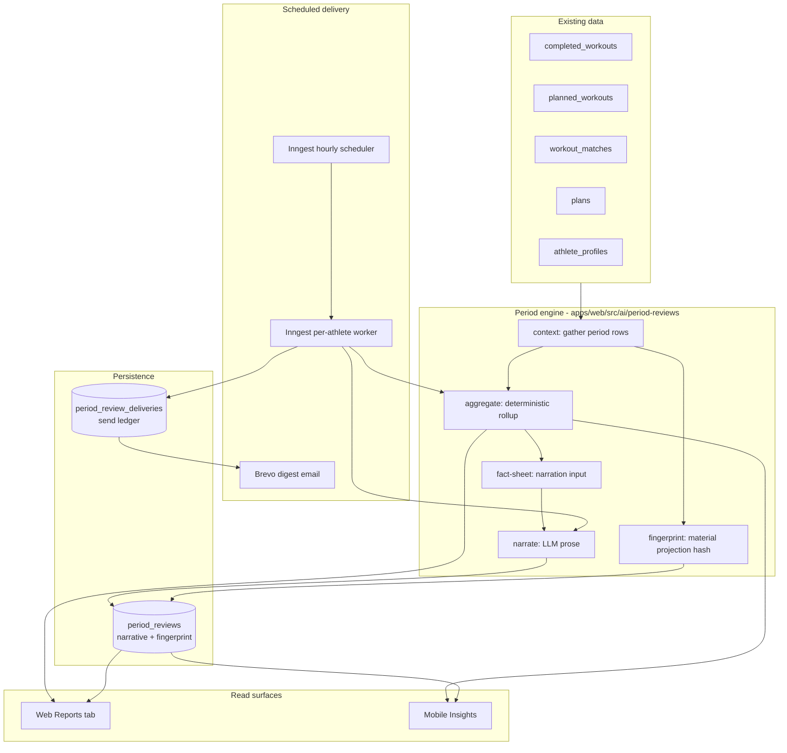
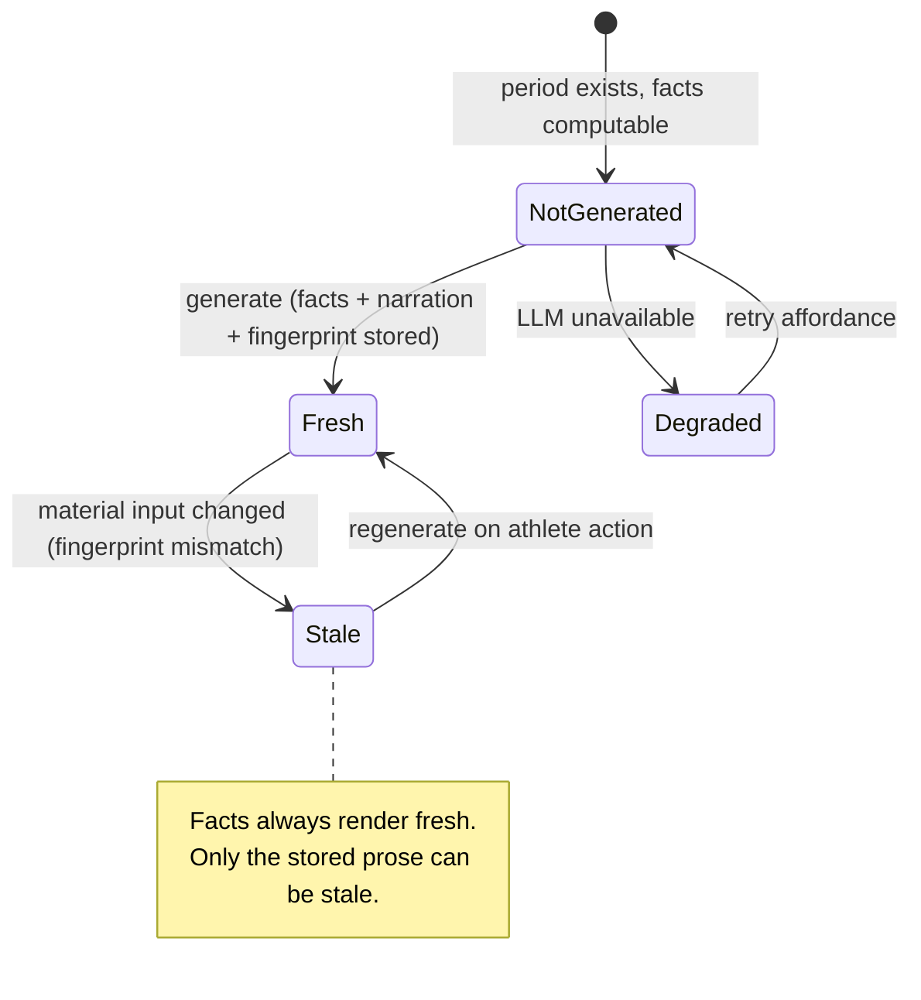
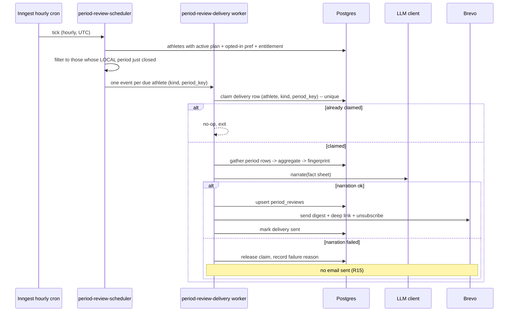

# Weekly & Monthly Reviews — Reports Tab and Email Delivery — Plan

## Goal Capsule

**Objective.** Give an athlete a periodic retrospective — *how did this week/month go against my plan and my trajectory* — readable in a Reports surface on web and mobile, and delivered to their inbox on a schedule they opted into.

**Product authority.** This plan (`product_contract_source: ce-plan-bootstrap`); scope confirmed with the user at the Phase 0.7 gate on 2026-08-19.

**Posture.** Extends the shipped per-workout report architecture (`docs/plans/2026-08-18-001-feat-workout-reports-plan.md`): arithmetic computes the facts, the LLM only narrates them, only the prose is persisted, and a content fingerprint governs staleness. This plan changes the *scope of the aggregate*, not the architecture.

**Open blockers.** None. Four forks resolved at the scoping gate: keep this repo's deterministic-facts-first posture (borrow WORKOUT-SITE's presentation vocabulary, not its AI-authored-sections approach); keep period reviews separate from the existing adaptive `weekly_reviews` proposals; email is opt-in and carries a digest plus a deep link; gate behind the existing `trend_reports` entitlement. Both surfaces (web Reports tab, mobile Insights tab) ship here.

---

## Problem Frame

The product answers "how did *that session* go" (`workout_reports`, migration `0028`) and "should I change my plan" (`weekly_reviews`, migration `0019` — an accept/reject proposal). It never answers "how did *this stretch of training* go".

That gap has two costs. First, the athlete has no periodic moment of reflection — the surface that most training products build their retention loop around. Second, the app is silent between sessions: there is no outbound touchpoint at all today except moderation emails.

The nearest existing thing, `weekly_reviews`, is week-scoped but is a **proposal** with `proposed_changes`, an accept/reject lifecycle, and an apply-RPC that mutates the plan. A retrospective has nothing to accept. The two share a cadence and nothing else — the same reasoning that produced KTD3 in the per-workout report plan (net-new table, not an extension) applies here verbatim.

A second gap is infrastructural: the app has a working transactional email client (`apps/web/src/email/brevo.ts`) used only for moderation, no notion of athlete email preferences, no unsubscribe path, and no configured public base URL to link back to. Scheduled outbound email needs all three.

**Reference code.** `Documents/WORKOUT-SITE` (a separate, earlier Next.js/Firestore build) carries directly relevant prior art: a period-comparison rollup and prompt (`src/lib/reports/templates/trend-report.ts`), a typed-section report renderer (`src/components/reports/ReportRenderer.tsx` plus `sections/`), and table-layout transactional email templates (`src/lib/email/wrapTemplate.ts`, `summaryTemplate.ts`). Its Firestore data layer, its LLM-authored-sections contract, and its ask-anything report hub are **not** borrowed — see KTD2 and Scope Boundaries.

---

## Product Contract

### Actors

- **A1 — Athlete.** Owns the training data, reads reviews on web and mobile, controls email delivery preferences, generates a review on demand.
- **A2 — Linked coach.** Can read a linked athlete's reviews at the data layer (RLS), consistent with `workout_reports`. No coach-facing UI and no coach email in this shipment.

### Requirements

- **R1.** An athlete can read a review for any completed weekly or monthly period in which they have training data.
- **R2.** A review's facts — volume, duration, load, plan compliance, sport split, and change versus the preceding period — are computed **deterministically** from the athlete's completed and planned workouts. They are never model output.
- **R3.** A review's narration is an LLM-written coach's note grounded in those computed facts, plus one forward-looking takeaway for the next period.
- **R4.** Period boundaries are resolved in the athlete's own timezone: weeks are ISO weeks (Monday–Sunday), months are calendar months.
- **R5.** A review with no completed workouts in the period is not an error state — it reports the absence and narrates it against the plan that was prescribed.
- **R6.** Generated narration is cached and reused. It is invalidated only by a **material** change to the period's inputs.
- **R7.** An invalidated review renders its stored narration marked stale, alongside freshly-computed facts, with a regenerate affordance. It never regenerates eagerly on read.
- **R8.** An athlete reaches their reviews from a Reports destination in the web navigation and from the Insights tab on mobile.
- **R9.** An athlete can opt in, per cadence (weekly and monthly independently), to receive their review by email.
- **R10.** Opted-in athletes receive the weekly review shortly after their local week closes, and the monthly review shortly after their local month closes.
- **R11.** A delivered email carries a readable digest of the period's headline facts and the narration, and links back to the full review. It is not a rendered copy of the whole report.
- **R12.** Every delivered email carries a working one-click unsubscribe that requires no sign-in.
- **R13.** An athlete is never sent the same period's review twice.
- **R14.** Reviews are a paid feature, gated on the existing `trend_reports` entitlement. Gating applies to both reading and delivery.
- **R15.** When the LLM is unavailable, rate-limited, or fails, the athlete still sees the computed facts. On the email path, a failed narration suppresses that send rather than mailing a half-built report.
- **R16.** A linked coach can read their athlete's reviews at the data layer (RLS), matching the `workout_reports` posture.

### Key Flows

- **F1 — On-demand read.** Athlete opens Reports → sees a list of their completed periods → opens one → facts render immediately → taps *Generate* → narration appears and is cached → subsequent opens read the cache.
- **F2 — Empty period.** Athlete opens a week in which they logged nothing → facts render as zeros against whatever was prescribed → narration reads the gap rather than erroring.
- **F3 — Staleness.** Strava enrichment for a workout inside the period lands after the review was narrated → fingerprint mismatch → next open shows the stored narration marked stale with a regenerate affordance.
- **F4 — Scheduled delivery.** Athlete's local week closes → scheduler selects them (opted in, entitled, has data) → worker computes facts, narrates, persists, and sends one email → the send is recorded so a later tick cannot repeat it.
- **F5 — Unsubscribe.** Athlete clicks unsubscribe in an email → their preference for that cadence is switched off without a sign-in → a confirmation page states what changed and how to re-enable it.
- **F6 — Degraded.** LLM rate-limited during on-demand generation → facts still render, narration surfaces a retry affordance, not an error page. Rate-limited during scheduled delivery → no email is sent for that athlete this tick; the run is retried on the job's own retry policy and then abandoned for that period.

### Acceptance Examples

- **AE1.** Athlete in `Europe/London` completed 5 of 6 prescribed sessions last week, 6h20m total against 7h prescribed, TSS 340 against 380. The weekly review reports 5/6 compliance, the duration and load deltas, the sport split, and the change versus the prior week.
- **AE2.** Athlete logged nothing for a week in which four sessions were prescribed. The review generates, reports 0/4, and the narration addresses the missed block without inventing a reason.
- **AE3.** A monthly review is generated. Two days later, Strava enrichment lands for a ride inside that month. The next open shows the stored narration marked stale over freshly-computed facts.
- **AE4.** A review is generated. A workout inside the period has a non-material field corrected (e.g. a `strava_activity_id` backfill). The fingerprint is unchanged, the cached narration is served, and no LLM call is made.
- **AE5.** An athlete in `America/Los_Angeles` opted into weekly email. The scheduler's hourly tick that corresponds to Monday ~07:00 local selects them; earlier and later ticks do not. Exactly one email is sent for that ISO week.
- **AE6.** The same scheduler tick runs twice (an Inngest retry). The second run sends nothing, because the period already has a recorded successful send for that athlete.
- **AE7.** An athlete without an active `trend_reports` entitlement opens Reports. They see the upgrade affordance, not a review, and the scheduler never selects them for delivery.
- **AE8.** An athlete clicks unsubscribe in a weekly email. Their weekly preference is switched off, their monthly preference is untouched, and no sign-in was required. A tampered or expired token yields a plain failure page, not a preference change.
- **AE9.** Groq returns 429 during on-demand generation. The route returns the computed facts with `narration: null` and a retryable status. No 5xx.
- **AE10.** Groq returns 429 during scheduled delivery. No email is sent, no partial review is persisted, and the failure is logged without PII.

### Scope Boundaries

**In scope.** A `period_reviews` entity; a deterministic period-rollup engine; on-demand generate/read routes; fingerprint-based cache invalidation; a web Reports destination (list + detail); mobile Insights period section + detail; per-cadence email preferences; a scheduled delivery job; a period digest email template; token-based unsubscribe; entitlement gating; coach read at the data layer.

#### Deferred to Follow-Up Work

- Coach-facing review UI. The data layer ships here; the UI needs no migration.
- Charts inside the review. The first shipment is stat rows, comparison rows, and a sport-split table. WORKOUT-SITE's `ChartSection` is the reference when charts are picked up.
- Digest emails at any cadence other than weekly and monthly (daily, per-block, pre-event).
- Push notifications as an alternative delivery channel.

#### Outside this product's identity

- Ad-hoc, athlete-composed report queries (WORKOUT-SITE's "ask anything" hub). This product's reviews are a fixed periodic retrospective, not a query surface.
- Reviews that propose plan changes. That is what `weekly_reviews` already is; conflating the two is the failure mode KTD1 exists to prevent.

---

## Assumptions

- **AS1.** Weekly delivery fires Monday morning local time (the week just closed), monthly delivery on the 1st of the month local time. The exact local hour is a constant in the schedule module, mirroring `WEEKLY_REVIEW_LOCAL_HOUR` in `apps/web/src/ai/adaptive/schedule.ts`.
- **AS2.** "Has training data" for scheduler selection means at least one non-deleted `completed_workouts` row in the period, or at least one `planned_workouts` row prescribed in it. An athlete with neither is skipped rather than mailed an empty report.
- **AS3.** Review reads are scoped to the authenticated athlete in the API layer, matching the known coach gap already documented in the per-workout report route. R16 is satisfied at the RLS layer only.

---

## Key Technical Decisions

### KTD1 — `period_reviews` is a net-new table, not an extension of `weekly_reviews`

`weekly_reviews` carries `proposed_changes`, a seven-value accept/reject/expire status lifecycle, a one-open-per-athlete partial unique index, and an apply-RPC that edits the plan. A retrospective has none of that. Reusing it would mean permanently-`no_changes` rows and every consumer learning which half of the columns to ignore — the exact reasoning that produced the same call for `workout_reports` in migration `0028`.

The two remain visible as separate things in the UI, per the scoping gate.

### KTD2 — Facts are arithmetic; only the narration is persisted and only it can go stale

Mirrors the per-workout report's KTD1/KTD2. A pure aggregation function turns the period's completed and planned rows into a `PeriodFactSheet`; the LLM is handed that fact sheet and writes prose about it. The fact sheet is recomputed on every read and never stored, so it has no staleness problem; only `period_reviews.narrative`/`takeaway` are cached.

**This is the fork the scoping gate resolved against WORKOUT-SITE.** `src/lib/reports/templates/*.ts` there has the model emit the report's *structure* — stat cards with their own trend arrows, chart data, table rows — as JSON. That makes every displayed number model output. This repo has an established opposite posture and a shipped implementation of it. What is borrowed from WORKOUT-SITE is the **section vocabulary for layout** (stat / comparison / table / highlight / text as renderable shapes) and the shape of its period-over-period rollup in `trend-report.ts`'s `buildContext` — not its contract for who authors the numbers.

### KTD3 — The period fingerprint is a roll-up of per-workout material fields, not a hash of the whole period

`apps/web/src/ai/reports/fingerprint.ts` already defines the material-field projection for one workout and canonicalizes before hashing. The period fingerprint hashes an ordered list of those same per-workout projections for every completed workout in the period, plus the prescribed set (planned workout ids, their structures and loads), plus the plan goal and event date.

Deliberately excluded, following the same file's precedent: CTL/ATL/TSB. They move whenever the athlete logs anything, and hashing them would mark every historical review stale forever.

Explicitly *not* "hash the period's rows and hope nothing extra leaks in" — the projection is built as a fresh literal so a non-material field is structurally incapable of perturbing the hash.

### KTD4 — Period boundaries resolve in the athlete's timezone at the read/render boundary

All timestamps are stored UTC (AGENTS.md). Weekly periods are ISO weeks (Monday–Sunday) and monthly periods are calendar months, both resolved through the athlete's `users.timezone`. The period key is a stable string — ISO week (`2026-W33`) and year-month (`2026-08`) — and it, not a timestamp range, is the identity of a review.

`apps/web/src/ai/adaptive/schedule.ts` already has `localPartsInTimezone` and `weeklyReviewWeekKey`; the period module extends that vocabulary rather than introducing a second timezone idiom. `docs/solutions/athlete-timezone-capture.md` is the reference for the failure mode this avoids.

### KTD5 — Email carries a digest plus a deep link, and requires a new public base-URL config

Resolved at the scoping gate. The email is the headline facts, the narration, and a link — not a rendered copy of the review. This keeps the template stable as the review's on-screen shape evolves, and keeps the email small.

**This surfaces a real dependency:** `apps/web/src/config.ts` has no public app base URL today (only `NEXT_PUBLIC_SUPABASE_URL`). Deep links and unsubscribe links both need one. It is added as a config key with the same posture as `BREVO_API_KEY` — warn-not-fatal when absent in non-production, required in production, since a link-less email is worse than no email.

### KTD6 — Delivery is scheduled on Inngest, never Vercel cron

`apps/web/app/api/cron/weekly-review-expiry/route.ts` documents the constraint concretely: the Vercel Hobby plan caps cron at 2 daily jobs and both slots are taken, and exceeding it fails config validation for the whole deployment. The existing `weekly-review-scheduler` shows the working pattern — an hourly Inngest cron that filters for per-athlete local time inside the function, then fans out one event per due athlete.

Period delivery follows that pattern exactly: an hourly scheduler that selects due athletes, and a per-athlete worker that does the compute-narrate-send. A `CRON_SECRET`-gated manual trigger route is provided for operational use, matching the expiry-sweep precedent, but is not registered in `vercel.json`.

### KTD7 — Email is opt-in per cadence, with signed-token unsubscribe

Resolved at the scoping gate: default off. Weekly and monthly are independent preferences so an athlete can take the monthly and skip the weekly.

Unsubscribe must work without a session (R12), so the link carries a signed token over `(user_id, cadence)` verified server-side. It is a capability token, not an authentication bypass: it can only switch a preference off. The route is a `GET` that renders a confirmation page; because mail clients pre-fetch links, the state change is confirmed by an explicit action on that page rather than performed by the bare `GET`.

An unsubscribe header is set on the send so mail clients can offer their native affordance.

### KTD8 — Gate on the existing `trend_reports` entitlement key

`packages/shared/src/entitlement.ts` already declares `trend_reports` with the comment "athlete trend / progress reports (paid)" and nothing consumes it. This feature is what it was reserved for. Gating uses the existing `requireEntitlement`/`hasActiveEntitlement` helpers in `apps/web/src/auth/entitlements.ts` on the read path, and the scheduler filters on the same check before enqueueing — enforced in the worker as the single source of truth, matching the `weekly-review-scheduler` comment's posture.

### KTD9 — Narration is prompted from the fact sheet only, never a workout list

`docs/plans/2026-06-08-*` and the narration module's own `NARRATION_MAX_TOKENS` comment record the operational constraint: Groq bills `max_completion_tokens` against the per-minute allowance *before* generating, so an oversized request is rejected outright and the prose never generates. The production Groq tier is tight (see `docs/solutions/` and the plan-generation history).

A month of training is 15–30 workouts. Handing the model that list would blow both the input budget and the point. The prompt receives the aggregated fact sheet — totals, compliance, per-sport rollup, prior-period comparison, and at most a small number of named standout sessions — which is roughly constant in size whether the period is a week or a month. Output budget is capped the same way `NARRATION_MAX_TOKENS` caps the per-workout note.

### KTD10 — Delivery idempotency lives in the database, not the job

R13 and AE6 require that a retried scheduler tick, an overlapping tick, or a manual trigger cannot double-send. The send is recorded against `(athlete_id, kind, period_key)` with a uniqueness constraint, and the worker claims that row before calling Brevo. Inngest's own dedup key is a second line of defense, not the mechanism — a dedup window is a timing guarantee, and R13 needs a durable one.

---

## High-Level Technical Design

### Component and data flow

### Staleness lifecycle of one review

### Scheduled delivery sequence

*The prose in this plan is authoritative where a diagram and the text disagree.*

---

## Implementation Units

### U1. `period_reviews` and delivery ledger migration

**Goal.** Persist a period review's narration and fingerprint, record email delivery for idempotency, and store per-cadence email preferences.

**Requirements.** R1, R6, R13, R16; supports AE4, AE6, AE8.

**Dependencies.** None.

**Files.**
- `supabase/migrations/0029_period_reviews.sql` (create)
- `supabase/migrations/0030_email_preferences.sql` (create)
- `apps/web/src/db/__tests__/period-reviews-rls.test.ts` (create)

**Approach.** Two migrations, one logical change each (AGENTS.md).

`0029` creates `period_reviews` keyed by `(athlete_id, kind, period_key)` with a unique index partial on `deleted_at IS NULL`, following `workout_reports_completed_workout_unique` in `0028`. Columns: the narration pair (`narrative`, `takeaway`, both nullable — a row can exist in a degraded state), `input_fingerprint NOT NULL`, `kind` with a `CHECK` matching the closed enum in shared, `period_key`, `period_start`/`period_end` as `DATE` for range queries, `generated_at`, `created_at`, `deleted_at`. RLS: athlete self-select plus the coach-additive select policy copied from `workout_reports_coach_select`. A listing index on `(athlete_id, kind, period_start DESC) WHERE deleted_at IS NULL`. The account-deletion cascade and the `completed_workouts` soft-delete trigger in `0028` are extended to reach this table.

Also in `0029`: `period_review_deliveries`, keyed uniquely on `(athlete_id, kind, period_key)` — no partial predicate, because a delivery record is a permanent ledger entry and is never soft-deleted. It carries a status (`claimed` / `sent` / `failed`), a non-PII failure reason slug, and timestamps. Service-role writes only, no client INSERT/UPDATE/DELETE policies, following the `entitlements` precedent.

`0030` adds the email preference columns. They belong on `users` alongside `timezone` rather than in a new table — there are exactly two booleans and no history requirement. Both default `false` (KTD7). RLS on `users` already permits self-select; a self-update policy scoped to these columns is added if one does not already exist.

Neither table joins `supabase_realtime`; `packages/shared/src/realtime-allowlist.ts` is untouched, which the existing CI drift test already asserts.

**Patterns to follow.** `supabase/migrations/0028_workout_reports.sql` for table shape, RLS pair, partial unique index, cascade and soft-delete-trigger extension. `docs/solutions/migration-conventions.md` and `docs/solutions/partial-unique-with-soft-delete.md`.

**Execution note.** Ship the RLS tests in this same PR — AGENTS.md makes that the default and this plan does not scope them to a separate unit.

**Test scenarios.**
- Athlete selects their own `period_reviews` row: visible.
- Athlete selects another athlete's row: zero rows.
- Linked coach selects a linked athlete's row: visible. Unlinked coach: zero rows.
- Coach whose link is soft-deleted: zero rows.
- Second insert with the same `(athlete_id, kind, period_key)` and `deleted_at IS NULL`: unique violation.
- Insert after the first row is soft-deleted: succeeds (partial index).
- Second insert into `period_review_deliveries` with the same key: unique violation regardless of status. *Covers AE6.*
- Non-service-role INSERT into `period_review_deliveries`: denied.
- Soft-deleting a `completed_workouts` row inside a period soft-deletes nothing in `period_reviews` (reviews are period-scoped, not workout-scoped) — assert the trigger's blast radius explicitly.
- Account-deletion cascade removes both tables' rows for that athlete.
- Preference columns default to `false` for a newly-created user. *Covers the opt-in half of AE7/AE8.*

---

### U2. Shared contracts for period reviews

**Goal.** Define the cross-app types and Zod schemas: period kind and key, the deterministic fact shapes, the narration schema, the API response, and the email preference shape.

**Requirements.** R2, R3, R4, R9; underpins every later unit.

**Dependencies.** U1 (the SQL `CHECK` vocabularies and the row shape this mirrors).

**Files.**
- `packages/shared/src/period-review.ts` (create)
- `packages/shared/src/index.ts` (modify — export barrel)
- `packages/shared/src/__tests__/period-review.test.ts` (create)

**Approach.** Hand-authored Zod, following the annotated style of `packages/shared/src/workout-report.ts`.

- `PeriodKindSchema` — closed enum (`weekly`, `monthly`), the second statement of the SQL `CHECK`, with the same "update both in one PR" note that `workout-report.ts` carries.
- `PeriodKeySchema` — a refined string, format-validated per kind (ISO week vs year-month). The key is the review's identity (KTD4), so a malformed key must be a validation failure, not a lookup miss.
- The fact shapes: a per-metric comparison carrying prescribed, actual, delta and a status, reusing the `DimensionStatus` vocabulary already exported from `workout-report.ts` rather than declaring a parallel one; a per-sport rollup; a compliance count; a prior-period comparison block that is explicitly *absent* (not zero-filled) when there is no prior period.
- Every aggregate number is `.finite()`, mirroring the reasoning in `workout-report.ts` — an empty period must not produce `NaN`/`Infinity` in a ratio, and pinning `.finite()` makes that a schema-enforced guarantee rather than an engine convention.
- `PeriodNarrationSchema` — length-capped note and takeaway. LLM output is untrusted string: cap it here and render it as plain text everywhere.
- `PeriodReviewResponseSchema` — the facts, the optional narration, and the staleness flags, mirroring `WorkoutReportResponse`'s shape so the two report surfaces have one mental model.
- `EmailPreferencesSchema` — the two booleans.

**Patterns to follow.** `packages/shared/src/workout-report.ts` (discriminated unions for degradable dimensions, `.strict()`, `.finite()`, comment density). `packages/shared/src/weekly-review.ts` for the SQL-mirroring convention.

**Test scenarios.**
- A valid weekly key (`2026-W33`) parses; `2026-W54`, `2026-W3` (unpadded), and `2026-08` under `weekly` all reject.
- A valid monthly key (`2026-08`) parses; `2026-13` and `2026-W33` under `monthly` reject.
- A comparison block with `NaN` or `Infinity` in any numeric field rejects.
- An absent prior-period block parses; a prior-period block with all-zero fields also parses and is distinguishable from absent.
- Narration exceeding the length cap rejects.
- An unknown `kind` value rejects rather than passing through.
- Response schema round-trips a fully-populated review and a facts-only (narration-null) review.

---

### U3. Period calendar and deterministic aggregation engine

**Goal.** Given an athlete's timezone and a period key, resolve the period's boundaries; given the period's completed and planned rows, produce the deterministic fact set.

**Requirements.** R2, R4, R5; AE1, AE2.

**Dependencies.** U2.

**Files.**
- `apps/web/src/ai/period-reviews/calendar.ts` (create)
- `apps/web/src/ai/period-reviews/aggregate.ts` (create)
- `apps/web/src/ai/period-reviews/__tests__/calendar.test.ts` (create)
- `apps/web/src/ai/period-reviews/__tests__/aggregate.test.ts` (create)

**Approach.** Two pure modules, no I/O, no `server-only` needed for the arithmetic.

`calendar.ts` converts between a period key and its `[start, end)` UTC instants for a given IANA timezone, enumerates the recent completed periods for a listing, and answers "which period just closed at this instant in this timezone". It extends the vocabulary in `apps/web/src/ai/adaptive/schedule.ts` (which already has `localPartsInTimezone` and `weeklyReviewWeekKey`) rather than starting a second timezone idiom.

`aggregate.ts` is the deterministic core. Inputs are the period's completed workouts, the period's planned workouts with their match state, the prior period's completed workouts, and the athlete's profile thresholds. Outputs are totals (sessions, duration, distance, load), compliance (completed-versus-prescribed, using `workout_matches` for the join), a per-sport rollup, and the prior-period comparison.

Load reuses `apps/web/src/training-load/` (`computeWorkoutTss`, the duration proxy) rather than re-deriving TSS — the confidence distinction (`power` vs `duration`) is surfaced in the fact set so the narration can hedge appropriately instead of asserting a proxy figure as measured.

Two degradation rules, both structural rather than left to caller discipline, following the KTD8 reasoning in `workout-report.ts`: a metric whose prescribed or actual side is missing degrades to unavailable **independently** rather than failing the period; and a period with no prior period yields an *absent* comparison block rather than a zero-filled one.

**Execution note.** This unit is the arithmetic the whole feature rests on. Write it test-first — the acceptance examples give concrete input/output pairs to start from.

**Test scenarios.**
- ISO week boundaries in `Europe/London` across the March DST transition: the week is 167 real hours and the boundary lands at local midnight, not UTC midnight.
- ISO week boundaries in `America/Los_Angeles` where the local week start is the prior UTC day.
- A calendar month in a southern-hemisphere DST timezone; a 28-day February; a 31-day month.
- Week `2026-W01` spanning a year boundary resolves to the correct ISO year.
- A workout timestamped 23:50 local on the period's last day is inside the period; 00:10 local the next day is outside.
- An unknown or malformed timezone string falls back to UTC without throwing.
- *Covers AE1.* 5 completed against 6 prescribed, with duration and load totals: compliance, duration delta, load delta, and sport split all match the stated figures.
- *Covers AE2.* Zero completed against 4 prescribed: totals are zero, compliance is 0/4, no division-by-zero appears in any ratio, and the result parses against the schema.
- Zero completed and zero prescribed: every ratio is finite, the result parses.
- A prior period with no data yields an absent comparison block, not zeros.
- A completed workout with power data and one with only duration produce loads with the correct confidence markers, and the period's aggregate confidence reflects the mix.
- A planned workout whose structure lacks a duration degrades only the duration dimension; compliance and load still compute.
- A soft-deleted completed workout inside the period is excluded from every total.
- A superseded completed workout is counted once, not twice.
- A workout matched to a planned workout outside the period is attributed by the completed workout's own date, not the plan's.

---

### U4. Period context gathering and fingerprint

**Goal.** Read exactly the rows a period review needs, scoped to the athlete, and compute the material-input fingerprint that governs cache validity.

**Requirements.** R6, R7; AE3, AE4.

**Dependencies.** U2, U3.

**Files.**
- `apps/web/src/ai/period-reviews/context.ts` (create)
- `apps/web/src/ai/period-reviews/fingerprint.ts` (create)
- `apps/web/src/ai/period-reviews/__tests__/context.test.ts` (create)
- `apps/web/src/ai/period-reviews/__tests__/fingerprint.test.ts` (create)

**Approach.** `context.ts` mirrors `apps/web/src/ai/reports/context.ts`: it takes a Supabase client, an athlete id, a kind and a period key, and filters **every** read explicitly on `athlete_id` so it is correct whether it is handed a user-scoped or an admin client. The scheduled worker will hand it an admin client, which makes that discipline load-bearing rather than decorative. A period with no rows at all is a valid context, not a not-found error (R5) — the not-found case is a *malformed period key*, which is a distinct typed error.

`fingerprint.ts` implements KTD3. It reuses the `canonicalize` helper already exported from `apps/web/src/ai/reports/fingerprint.ts` rather than reimplementing key-sorting, and builds a fresh literal projection so a non-material field cannot perturb the hash. Completed-workout projections are ordered deterministically (by workout id) before hashing so that row-return order from Postgres never affects the result. CTL/ATL/TSB are excluded, for the reason that file already documents.

**Patterns to follow.** `apps/web/src/ai/reports/context.ts` (per-query athlete filtering, typed not-found error, the `// service-role: explicit user filter required` comment convention from AGENTS.md); `apps/web/src/ai/reports/fingerprint.ts` (fresh-literal projection, canonicalize-then-hash).

**Test scenarios.**
- Two contexts equal on the material fields but differing in object key insertion order produce byte-identical fingerprints.
- The same context with workouts returned in a different row order produces the same fingerprint.
- Changing a workout's `duration_s` changes the fingerprint. *Covers AE3.*
- Changing a workout's `summary_stats` (enrichment arriving) changes the fingerprint. *Covers AE3.*
- Adding or removing a workout from the period changes the fingerprint.
- Changing a workout's `strava_activity_id` alone does **not** change the fingerprint. *Covers AE4.*
- Changing CTL/ATL/TSB does not change the fingerprint.
- Changing the plan goal or event date changes the fingerprint.
- Changing the prescribed set (a planned workout added, or its structure edited) changes the fingerprint.
- Context gathering excludes soft-deleted completed and planned workouts.
- Context gathering for an athlete id that owns nothing in the period returns an empty-but-valid context, not an error.
- A malformed period key raises the typed error.
- Every query in the module carries an explicit athlete filter — assert by exercising the gatherer with an admin client and a second athlete's data present.

---

### U5. Period fact sheet and narration

**Goal.** Turn the deterministic fact set into a compact narration prompt, call the LLM, and validate the returned prose.

**Requirements.** R3, R15; AE9, AE10; honors KTD9.

**Dependencies.** U3, U4.

**Files.**
- `apps/web/src/ai/period-reviews/fact-sheet.ts` (create)
- `apps/web/src/ai/period-reviews/narrate.ts` (create)
- `apps/web/src/ai/period-reviews/__tests__/fact-sheet.test.ts` (create)
- `apps/web/src/ai/period-reviews/__tests__/narrate.test.ts` (create)

**Approach.** `fact-sheet.ts` projects the aggregate into resolved, human-readable statements with units already applied — the model never sees a raw row (KTD9). Its size is bounded and roughly constant whether the period is a week or a month; standout sessions are capped at a small fixed count rather than passed through as a list.

`narrate.ts` mirrors `apps/web/src/ai/reports/narrate.ts`: it uses the shared `LlmClient` boundary, sets an explicit output token budget sized to the narration schema cap (never the plan-generation default — the module comment in the per-workout narrator records why an oversized budget makes the call fail outright), wraps athlete-authored free text (plan goal, event type) in `delimitAsData`, and does **not** retry. The caller owns the retry-versus-give-up decision, because only the caller knows whether a stale narrative is available to fall back to — and that decision differs between the on-demand route and the email worker.

Error propagation follows the same three-way split: `LlmRateLimited`/`LlmTransient` propagate for `isLlmBackOff` branching, and a schema-rejection error is its own non-back-off class.

The system prompt states that the facts are fixed and the model's job is to explain them — never to recompute, re-judge, or hedge a number it was given.

**Patterns to follow.** `apps/web/src/ai/reports/narrate.ts` end to end; `apps/web/src/ai/prompt-delimiters.ts` for the untrusted-text boundary. `Documents/WORKOUT-SITE/src/lib/reports/templates/trend-report.ts`'s `buildContext` is worth reading for *which comparisons an athlete finds interesting* — its prompt contract is not the model to follow (KTD2).

**Test scenarios.**
- The fact sheet for a month contains no per-workout list and stays under a bounded size — assert against a 30-workout fixture, since this is the constraint KTD9 exists to enforce.
- An athlete goal containing prompt-injection-shaped text is emitted inside the data delimiter, not as instruction.
- A rate-limit error from the client propagates uncaught and is identified as a back-off by `isLlmBackOff`. *Covers AE9, AE10.*
- Parseable JSON that fails the narration schema raises the module's own error, and `isLlmBackOff` reports false for it.
- Valid model output parses into the narration shape.
- An empty period produces a fact sheet the narrator accepts, with no zero-division artifacts in the prompt text. *Covers AE2.*
- Unavailable dimensions are rendered as explicitly unknown in the prompt, never as zero.

---

### U6. Review read and generate API

**Goal.** Serve a period review — facts always, cached narration when valid — and generate narration on demand.

**Requirements.** R1, R5, R6, R7, R14, R15; AE3, AE4, AE7, AE9.

**Dependencies.** U1, U2, U3, U4, U5.

**Files.**
- `apps/web/app/api/reviews/route.ts` (create — list completed periods)
- `apps/web/app/api/reviews/[kind]/[periodKey]/route.ts` (create — GET reads, POST generates)
- `apps/web/app/api/reviews/__tests__/route.test.ts` (create)
- `apps/web/app/api/reviews/[kind]/[periodKey]/__tests__/route.test.ts` (create)

**Approach.** Mirrors `apps/web/app/api/workouts/[id]/report/route.ts` closely, including its documented reasons: `resolveAuth` for the dual cookie/Bearer surface (mobile is a first-class caller here), the admin client with hand-rolled athlete filters because the SSR client does not forward Bearer tokens to PostgREST, and `maxDuration = 60` because the platform default kills the function long before the LLM client's own timeout can degrade gracefully.

GET assembles the context, computes facts and fingerprint, reads any stored row, and projects the stored narration against the fresh fingerprint into fresh / stale / absent. It never calls the LLM. POST does the same then narrates and upserts.

Entitlement (KTD8) is checked before any work on both verbs, returning the payment-required posture the existing entitlement helper establishes rather than a 404 — the athlete needs to know an upgrade unlocks this, which is different from the ownership case.

The list route enumerates completed periods from the athlete's data range using the calendar module, marking which already have a stored review, so the Reports surface can render a list without N round trips.

**Test scenarios.**
- GET with no stored row returns facts with null narration and never calls the LLM.
- GET with a stored row whose fingerprint matches returns it as fresh. *Covers AE4.*
- GET with a stored row whose fingerprint differs returns the stored prose marked stale, over freshly-computed facts. *Covers AE3.*
- POST generates, persists, and returns fresh; a second POST with an unchanged fingerprint does not issue a second LLM call.
- POST when the LLM rate-limits returns the facts with null narration and a retryable status, not a 5xx. *Covers AE9.*
- POST when the model returns schema-invalid output returns the same degraded shape without persisting a partial row.
- A request for another athlete's review returns not-found, with no branch that distinguishes "exists but not yours".
- An unauthenticated request is rejected on both verbs.
- A Bearer-authenticated (mobile) request succeeds and is scoped to the correct athlete — this is the case the SSR-client caveat in AGENTS.md exists for.
- A request without the `trend_reports` entitlement is refused on both verbs, and the refusal is distinguishable from not-found. *Covers AE7.*
- A malformed `kind` or `periodKey` in the path is rejected before any database work.
- A future period key is rejected — a period that has not closed has no review.
- An empty period returns a valid facts payload rather than not-found. *Covers AE2.*
- The list route returns periods in reverse-chronological order and marks stored-review presence correctly.

---

### U7. Web Reports destination

**Goal.** Add Reports to the athlete navigation, list past periods, and render one review.

**Requirements.** R1, R5, R7, R8, R14; AE1, AE2, AE3, AE7.

**Dependencies.** U6.

**Files.**
- `apps/web/src/components/app-nav.tsx` (modify — add the Reports nav item)
- `apps/web/app/(athlete)/athlete/reports/page.tsx` (create — list)
- `apps/web/app/(athlete)/athlete/reports/[kind]/[periodKey]/page.tsx` (create — detail)
- `apps/web/src/components/period-review/review-sections.tsx` (create — the section renderers)
- `apps/web/src/components/period-review/review-detail.tsx` (create — client shell: generate, regenerate, degraded states)
- `apps/web/src/components/__tests__/review-sections.test.tsx` (create)
- `apps/web/src/components/__tests__/review-detail.test.tsx` (create)

**Approach.** Server Components for the pages, one `"use client"` shell for the generate/regenerate interaction, following the repo's existing athlete-page split.

The list page shows weekly and monthly periods in reverse-chronological order with a headline stat per row. The detail page renders the facts server-side and hands the narration state to the client shell.

Presentation borrows WORKOUT-SITE's **section vocabulary** — a stat row, a prescribed-versus-actual comparison row, a sport-split table, a highlight callout, and prose — implemented as a small set of typed renderers in this repo's own styling idiom (inline `var(--color-*)` tokens, matching `app-nav.tsx` and the existing athlete pages). It does **not** import WORKOUT-SITE code: that codebase is Tailwind + shadcn + Firestore types, and its renderer is driven by model-authored section JSON, which KTD2 rejects. The reference value is the section taxonomy and the layout, not the code.

Charts are deferred (Scope Boundaries) — the first shipment is rows and tables, so no charting dependency is added.

Loading, error, and empty states are required on both pages. The unentitled state renders the upgrade affordance rather than an error.

**Patterns to follow.** `apps/web/app/(athlete)/athlete/workouts/[id]/page.tsx` for the server-page + client-shell split and the existing report presentation; `apps/web/src/components/app-nav.tsx` for the nav item shape and the active-route predicate. Reference only: `Documents/WORKOUT-SITE/src/components/reports/ReportRenderer.tsx` and `src/components/reports/sections/*`.

**Test scenarios.**
- The Reports nav item renders for athletes and not for coaches, and marks itself active on both the list and detail routes.
- The list renders weekly and monthly entries in reverse-chronological order.
- The list's empty state renders for an athlete with no completed periods.
- A review with no stored narration renders facts plus a generate affordance.
- A stale review renders the stored prose with the stale marker and a regenerate affordance, over fresh facts. *Covers AE3.*
- A degraded (rate-limited) generate attempt renders the facts and a retry affordance, never an error page. *Covers AE9.*
- An empty period renders zeros against the prescribed set without a division artifact in any displayed figure. *Covers AE2.*
- An unavailable dimension renders as unknown, not as zero or a dash that reads as zero.
- The unentitled state renders the upgrade affordance and no review content. *Covers AE7.*
- Narration text is rendered as plain text — a review whose stored prose contains markup renders it inert.
- Loading and error states render on both pages.

---

### U8. Email preferences and unsubscribe

**Goal.** Let an athlete turn each cadence on or off in settings, and turn one off from an email without signing in.

**Requirements.** R9, R12; AE8; implements KTD7.

**Dependencies.** U1, U2.

**Files.**
- `apps/web/src/email/unsubscribe-token.ts` (create — sign and verify)
- `apps/web/app/api/profile/email-preferences/route.ts` (create)
- `apps/web/app/unsubscribe/page.tsx` (create — confirmation page, outside the authed layouts)
- `apps/web/app/api/unsubscribe/route.ts` (create — the confirmed state change)
- `apps/web/app/(athlete)/athlete/settings/page.tsx` (modify — add the preferences card)
- `apps/web/src/components/email-preferences.tsx` (create — client toggle)
- `apps/web/src/email/__tests__/unsubscribe-token.test.ts` (create)
- `apps/web/app/api/unsubscribe/__tests__/route.test.ts` (create)
- `apps/web/app/api/profile/email-preferences/__tests__/route.test.ts` (create)

**Approach.** The token is an HMAC over `(user_id, cadence)` with a version marker and an expiry, signed with a secret from config. It is a capability to switch a preference **off** and nothing else — verification failure yields a plain failure page, never a partial action, and the token is never accepted as authentication for any other operation.

The unsubscribe page is a `GET` that only *renders*; the state change happens on an explicit confirm. This is deliberate: mail clients and link scanners pre-fetch `GET` links, and a bare-`GET` mutation would silently unsubscribe athletes who never clicked. The page lives outside the athlete route group so it does not inherit the auth redirect.

The authenticated preferences route follows the AGENTS.md caveat about Bearer callers: it uses the admin client with an explicit `id` filter rather than an RLS-scoped write, which would silently affect zero rows for a mobile caller. `apps/web/app/api/profile/timezone/route.ts` is the existing instance of exactly this shape.

The settings card follows the existing `SectionCard` composition in the settings page.

**Test scenarios.**
- A token round-trips: sign then verify yields the expected user and cadence.
- A token with a tampered payload, a tampered signature, a wrong secret, or an expired timestamp fails verification. *Covers AE8.*
- A token for the weekly cadence cannot be replayed to switch off the monthly cadence.
- The unsubscribe `GET` renders without mutating anything — assert the preference is unchanged after the render.
- The confirmed unsubscribe switches off exactly the named cadence and leaves the other untouched. *Covers AE8.*
- An already-unsubscribed athlete confirming again succeeds idempotently.
- The unsubscribe page renders without a session.
- An invalid token renders a plain failure page, not a stack trace or an error status page.
- The authenticated preferences route updates both cadences, rejects unauthenticated callers, and rejects a body naming another user's id.
- A Bearer-authenticated (mobile) preference update actually persists — the regression this route's admin-client shape exists to prevent.
- The settings toggle reflects persisted state on load and surfaces a failed save.

---

### U9. Period digest email

**Goal.** Render a period review as a transactional email and send it.

**Requirements.** R11, R12; implements KTD5.

**Dependencies.** U3, U5, U8.

**Files.**
- `apps/web/src/config.ts` (modify — add the public app base URL key)
- `apps/web/src/email/period-review-email.ts` (create)
- `apps/web/src/email/brevo.ts` (modify — allow the unsubscribe header on a send)
- `apps/web/src/email/__tests__/period-review-email.test.ts` (create)

**Approach.** A pure builder returns subject and HTML from the fact sheet, the narration, the deep link, and the unsubscribe link; a thin sender hands it to the existing `sendTransactionalEmail`. Keeping the builder pure is what makes the content assertable without a network fixture.

Layout follows the table-based, inline-styled idiom that survives real mail clients — the reason `Documents/WORKOUT-SITE/src/lib/email/wrapTemplate.ts` and `summaryTemplate.ts` are worth reading before writing this. Their content shape (a headline, per-sport stat rows with period-over-period comparison, a highlight, a call-to-action) maps directly onto this feature's fact set. Their code is not imported: different repo, different data shape, and this repo's existing email module (`moderation-emails.ts`) already sets the local idiom for escaping and structure.

**Every interpolated value is HTML-escaped**, using the `escapeHtml` helper `moderation-emails.ts` already establishes. This matters more here than there: the narration is LLM output and the plan goal is athlete-authored, so both are untrusted strings reaching an HTML body.

`brevo.ts` gains an optional unsubscribe header on the send params. It is an additive optional field — the existing moderation callers are untouched, and the client's never-throw contract is preserved.

The config key follows the `BREVO_API_KEY` posture: warn-not-fatal outside production, required in production. A digest email whose links go nowhere is worse than no digest.

**Test scenarios.**
- The subject names the period in the athlete's own terms and reflects the headline outcome.
- The body contains the headline totals, the compliance figure, the narration, and the takeaway.
- Narration containing HTML-significant characters is escaped in the output. *This is the injection case.*
- A plan goal containing markup is escaped.
- The deep link resolves against the configured base URL and points at the correct kind and period key.
- The unsubscribe link carries a token for the correct cadence.
- The unsubscribe header is present on the send.
- An empty period renders a coherent email rather than a table of dashes. *Covers AE2.*
- A review with unavailable dimensions omits them rather than showing zeros.
- With email unconfigured, the send returns the not-sent result and never throws — the existing client contract.
- A Brevo non-2xx response returns the reason slug and logs no recipient address or body.

---

### U10. Scheduled delivery

**Goal.** Select athletes whose local period just closed, generate their review, and send exactly one email.

**Requirements.** R10, R13, R14, R15; AE5, AE6, AE7, AE10; implements KTD6, KTD10.

**Dependencies.** U1, U3, U4, U5, U9.

**Files.**
- `apps/web/src/ai/period-reviews/schedule.ts` (create — due-period predicates)
- `apps/web/src/inngest/functions/period-review-scheduler.ts` (create)
- `apps/web/src/inngest/functions/period-review-delivery.ts` (create)
- `apps/web/src/inngest/functions/index.ts` (modify — register both)
- `apps/web/app/api/cron/period-review-delivery/route.ts` (create — `CRON_SECRET`-gated manual trigger)
- `apps/web/src/ai/period-reviews/__tests__/schedule.test.ts` (create)
- `apps/web/src/inngest/functions/__tests__/period-review-scheduler.test.ts` (create)
- `apps/web/src/inngest/functions/__tests__/period-review-delivery.test.ts` (create)

**Approach.** Two functions, mirroring `weekly-review-scheduler.ts` + `adaptive-run.ts`.

The scheduler is an hourly UTC cron that reads candidate athletes (opted in, with an active plan) and filters, per athlete, to those whose **local** period just closed at the configured hour. It fans out one event per due athlete carrying kind, period key, and a stable dedup key. It emits ids only — no PII in job payloads or logs.

The delivery worker enforces entitlement as the single source of truth (the scheduler's filter is an optimization, matching the comment the existing scheduler carries), claims the ledger row for `(athlete_id, kind, period_key)` before doing any work, then gathers, aggregates, narrates, upserts the review, sends, and marks the delivery sent. A failed narration releases the claim and records a non-PII reason, sending nothing (R15/AE10) — a review email without its narration is not the product.

The claim-before-work ordering is what makes overlapping ticks and Inngest retries safe (KTD10); the unique constraint from U1 is the mechanism, and the job's dedup key is defense in depth, not the guarantee.

The manual trigger route exists for operations and is deliberately **not** registered in `vercel.json`, matching `apps/web/app/api/cron/weekly-review-expiry/route.ts` and the Hobby-plan cron cap documented there.

**Patterns to follow.** `apps/web/src/inngest/functions/weekly-review-scheduler.ts` (hourly cron, local-time filter inside, id-only fan-out, entitlement enforced downstream); `apps/web/src/ai/adaptive/schedule.ts` (local-parts helpers); `apps/web/app/api/cron/weekly-review-expiry/route.ts` (secret-gated manual trigger, and the comment explaining why it is not in `vercel.json`); `docs/solutions/inngest-setup.md`.

**Test scenarios.**
- *Covers AE5.* An athlete in `America/Los_Angeles` is selected on the tick corresponding to Monday at the configured local hour, and on no other tick that day.
- An athlete in `Australia/Sydney` and one in `Europe/London` are selected on different UTC ticks for the same ISO week.
- Monthly selection fires on the 1st local, including for a month following a 28-day February and a 31-day month.
- A DST-transition week does not double-select or skip an athlete.
- An athlete who has not opted in is never selected; opting into monthly only is never selected for weekly.
- An athlete without the `trend_reports` entitlement is not selected, and if one reaches the worker anyway it exits without sending. *Covers AE7.*
- An athlete with no completed and no planned workouts in the period is skipped (AS2).
- *Covers AE6.* Running the worker twice for the same athlete, kind, and period key sends exactly one email.
- Two concurrent workers for the same key: one claims, the other no-ops — assert on the unique-violation path, not on timing.
- *Covers AE10.* A rate-limited narration sends no email, persists no partial review, and records a non-PII failure reason.
- A Brevo send failure marks the delivery failed rather than sent, so the ledger does not lie about what the athlete received.
- The scheduler with zero due athletes enqueues nothing and does not error.
- Job payloads and log lines contain no email address or narration text.
- The manual trigger route returns unauthorized without the secret.
- The registry test still passes with both functions registered.

---

### U11. Mobile period reviews

**Goal.** Surface weekly and monthly reviews in the mobile Insights tab and render one.

**Requirements.** R1, R7, R8, R14; AE2, AE3, AE7.

**Dependencies.** U6.

**Files.**
- `apps/mobile/src/reviews/usePeriodReviews.ts` (create — list + detail hooks)
- `apps/mobile/src/reviews/review-view.ts` (create — pure formatting/selection helpers)
- `apps/mobile/app/(tabs)/insights.tsx` (modify — add the period section above recent workouts)
- `apps/mobile/app/reviews/[kind]/[periodKey].tsx` (create — detail route)
- `apps/mobile/src/reviews/__tests__/usePeriodReviews.test.ts` (create)
- `apps/mobile/src/reviews/__tests__/review-view.test.ts` (create)

**Approach.** Follows the shipped `apps/mobile/src/reports/` module exactly: a hook owning fetch and phase state, and pure helpers holding the selection and formatting logic so they are testable without rendering.

The existing Insights tab already lists recent workouts with their verdicts. Period reviews become a section above it — the tab becomes "how have my week and month gone, and how were my recent sessions", which is the natural reading order. The recent-workouts list is not disturbed.

The list request is bounded the way `selectRecentWorkoutIds` bounds the workout fan-out: a fixed number of recent periods, and zero periods issues zero requests. Generation is an explicit tap, never automatic on scroll — the LLM budget constraint in KTD9 makes an accidental fan-out expensive.

The unentitled state renders the same upgrade affordance the app uses elsewhere rather than an error.

**Patterns to follow.** `apps/mobile/src/reports/useWorkoutReport.ts` and `report-view.ts` (hook/pure-helper split, bounded fan-out, phase modelling); `apps/mobile/app/workouts/[id].tsx` for the detail-route shape; `apps/mobile/src/design/tokens.ts` for styling.

**Test scenarios.**
- The hook issues zero requests when the athlete has no completed periods.
- The hook caps the number of period requests regardless of how many periods exist.
- Loading, error, empty, and populated phases each render their state.
- A stale review renders the stale marker and a regenerate affordance. *Covers AE3.*
- A degraded generate renders facts plus retry, not an error screen. *Covers AE9.*
- An empty period renders zeros coherently. *Covers AE2.*
- The unentitled state renders the upgrade affordance. *Covers AE7.*
- Tapping a period routes to the detail screen with the correct kind and period key.
- The recent-workouts list still renders and routes correctly with the new section present.
- Narration renders as plain text.
- The Bearer token is attached to review requests — the mobile auth path U6 must serve.

---

## Verification Contract

- `pnpm lint` and `pnpm typecheck` (`tsc --noEmit`) pass across `apps/web`, `apps/mobile`, and `packages/shared`.
- The full unit and integration suite passes, including the RLS positive/negative pairs from U1 and the realtime-publication drift test.
- Migrations `0029` and `0030` apply cleanly against a fresh local Supabase stack and are idempotent on re-apply of the migration set.
- Every acceptance example AE1–AE10 is covered by at least one named test.
- No new athlete-data table reaches the end of this plan without RLS coverage (AGENTS.md).
- Manual check on a local stack: generate a weekly and a monthly review, confirm caching (a second generate issues no LLM call), enrich a workout inside the period and confirm the stale marker, trigger the delivery route with the cron secret and confirm exactly one email in the Brevo sandbox, and click the unsubscribe link end to end.

## Definition of Done

An entitled athlete can open Reports on web and Insights on mobile, see their past weeks and months, open one and read deterministic facts with AI narration that caches and goes stale correctly; can opt into weekly and/or monthly email in settings; receives exactly one correctly-scoped digest per period at the right local time; and can unsubscribe from an email in one click without signing in. A linked coach can read the same reviews at the data layer. Nothing regresses in the per-workout report, the adaptive weekly proposal, or the existing moderation email path.

---

## Risks & Dependencies

- **LLM budget at scheduled fan-out.** The production Groq tier is tight (see `docs/solutions/` and the plan-generation history: an oversized request is rejected outright rather than truncated). A Monday-morning fan-out concentrates narration calls in a few UTC hours. Mitigations in this plan: the fact-sheet prompt is bounded and roughly constant in size regardless of period length (KTD9), the output budget is pinned to the schema cap, and a rate-limited athlete is skipped rather than retried aggressively. If the athlete base grows past what the tier absorbs in one hour, the scheduler's per-tick fan-out needs a concurrency limit — worth watching, not worth building yet.
- **New required production config.** The public base URL (KTD5) and the unsubscribe signing secret (KTD7) must be set in Vercel production before delivery is enabled, or emails ship with dead links. Both follow the warn-not-fatal-in-dev, required-in-prod posture. This is a deploy-time prerequisite, not a code dependency.
- **Timezone correctness is the highest-risk arithmetic here.** DST transitions, ISO weeks spanning year boundaries, and month lengths all affect both period boundaries and delivery timing. `docs/solutions/athlete-timezone-capture.md` records that this class of bug has already bitten this repo once. U3's test scenarios target it directly.
- **Email deliverability and reputation.** This is the product's first bulk outbound email. Opt-in default (KTD7), a working one-click unsubscribe, and the unsubscribe header are the mitigations in scope. Sender-domain authentication is an infrastructure task outside this plan.
- **Two `*_review*` entities in the codebase.** `weekly_reviews` (adaptive proposals) and `period_reviews` (retrospectives) will be adjacent in schema and vocabulary. The naming risk is real; the mitigation is that migration `0029` and `packages/shared/src/period-review.ts` both open with the distinction stated explicitly, following the precedent `0028` set.

---

## Sources & Research

- `docs/plans/2026-08-18-001-feat-workout-reports-plan.md` — the architecture this plan extends (deterministic verdict, LLM narration only, fingerprint staleness, on-demand generation).
- `supabase/migrations/0028_workout_reports.sql` — table shape, RLS pair, partial unique index, cascade and soft-delete trigger extension.
- `supabase/migrations/0019_weekly_reviews_and_workout_edits.sql` — the adjacent proposal entity this plan deliberately does not extend (KTD1).
- `apps/web/src/ai/reports/` — `context.ts`, `fingerprint.ts`, `fact-sheet.ts`, `narrate.ts`; the modules U4 and U5 mirror.
- `apps/web/src/inngest/functions/weekly-review-scheduler.ts` and `apps/web/app/api/cron/weekly-review-expiry/route.ts` — the hourly-Inngest-not-Vercel-cron pattern and the documented Hobby-plan constraint behind it (KTD6).
- `apps/web/src/email/brevo.ts` and `moderation-emails.ts` — the never-throw send contract and the local HTML-escaping idiom.
- `packages/shared/src/entitlement.ts` — the pre-declared, currently-unconsumed `trend_reports` key (KTD8).
- `AGENTS.md` — RLS posture, the Bearer/SSR-client caveat, migration conventions, background-job policy.
- `docs/solutions/athlete-timezone-capture.md`, `inngest-setup.md`, `migration-conventions.md`, `partial-unique-with-soft-delete.md`.
- `Documents/WORKOUT-SITE` (reference only, no code imported): `src/lib/reports/templates/trend-report.ts` (period-over-period rollup and the comparisons athletes find interesting), `src/components/reports/ReportRenderer.tsx` + `sections/` (section taxonomy for layout), `src/lib/email/wrapTemplate.ts` + `summaryTemplate.ts` (table-based transactional email layout that survives mail clients). Its Firestore data layer, LLM-authored-sections contract, and ask-anything hub are explicitly not adopted — see KTD2 and Scope Boundaries.
