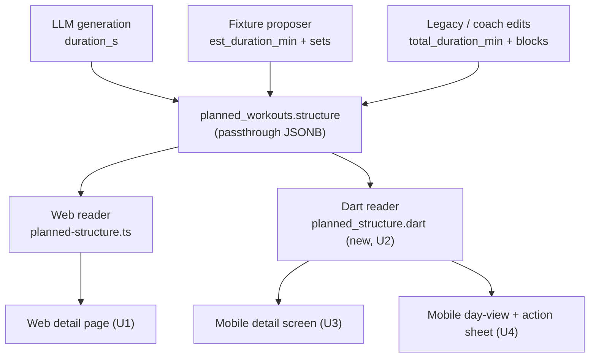

# Planned Workout Detail Rendering - Plan

## Goal Capsule

- **Objective:** implement R1-R7 below to the Definition of Done — both platforms show the AI's rationale, description, prescribed duration/load/intensity, and a best-effort step breakdown for a planned workout.
- **Authority:** this plan is authoritative for scope and sequencing; where a decision conflicts with `AGENTS.md` conventions (RLS, migration rules, testing conventions), the repo convention wins.
- **Stop conditions:** pause for a decision if a real `structure` payload is found whose shape breaks KTD5's allow-list assumptions in a way that would require expanding the allow-list beyond primitive scalar fields, or if RLS scoping for the new mobile fetch needs anything beyond the existing `athlete_id` filter pattern.
- **Execution profile:** `code`. Touches `apps/web` (TypeScript) and `daily-athlete/` (Dart/Flutter). No new migrations, no changes to generation/validation, no new API endpoints.
- **Tail ownership:** the implementer runs the Verification Contract below and closes each unit's Definition of Done; no separate handoff step.

---

## Product Contract

### Summary

Both platforms under-render what's already persisted for AI-generated planned workouts. Web shows only a raw `structure.description` string; mobile shows `rationale` as a bottom-sheet title with no dedicated detail view. This plan adds full detail rendering — rationale, description, duration, load, intensity, phase, and a best-effort step breakdown — to both, built on the existing (web-only) defensive JSONB readers rather than duplicating ad hoc key access.

### Problem Frame

`planned_workouts.structure` is a `.passthrough()` JSONB blob written by three different sources over time (the LLM generation prompt, a fixture proposer, coach hand-edits), so the same logical field is spelled differently across rows — duration alone has three known spellings. `apps/web/src/ai/planned-structure.ts` already solves this for the reports engine with defensive reader functions, but neither athlete-facing view uses them: web's detail page does a single unsafe `typeof` check on `structure.description` only, and mobile's `day_view.dart` reads `structure['duration_s']` directly with no fallback — reproducing, on mobile, the exact bug the web reader was written to fix. Athletes lose the "why" (rationale) and the "what" (duration/intensity/load) behind their AI-generated plan on both surfaces.

### Requirements

**Web**

- R1. The planned-workout detail page (`planned/[id]`) displays the workout's `rationale` text, when present.
- R2. The detail page displays prescribed duration, normalized across all three known `structure` spellings (`duration_s`, `est_duration_min`, `total_duration_min`).
- R3. The detail page displays prescribed load and a formatted intensity target (e.g. "72% FTP", "Zone 3", "4:30/km pace"), falling back to a plain "no target set" state when intensity is free-text or absent rather than being coerced.
- R4. When `structure` carries a legacy `blocks` or `sets` array, the detail page renders a best-effort step list from it (see R7 for the safety constraint on this).

**Mobile**

- R5. A dedicated planned-workout detail screen exists, reachable from the calendar, showing the same content as R1-R4.
- R6. The existing calendar day-view workout preview uses the same normalized duration/intensity reads as the new detail screen, replacing today's single-spelling raw read.

**Both platforms**

- R7. All AI-generated or free-text content (rationale, description, per-step labels) renders as plain text — never interpreted as HTML/markup — and any legacy `blocks`/`sets` entry is read through a fixed allow-list of primitive fields, never rendered as raw/arbitrary JSONB.

### Scope Boundaries

#### Deferred to Follow-Up Work

- The underlying write-side inconsistency (generation settling on one duration spelling) — a write-side fix, not a render-side one; still open per `planned-structure.ts`'s own comment.
- Extracting a single shared intensity-display formatter — both platforms currently have a private, differently-scoped formatter (`narrate.ts`'s is LLM-prompt-facing, `report_view.dart`'s is file-private); this plan adds two more small ones (one per platform, per KTD6) rather than refactoring the other two.
- Showing `edited_by_kind`/coach-vs-AI attribution on the new detail views.

Outside this plan (not touched): adaptive re-plan (`weekly_reviews`) proposal rendering, reports/period-review surfaces, and any change to LLM generation or validation.

---

## Planning Contract

### Key Technical Decisions

- **KTD1 — Web reuses, web extends.** Web renders through the existing `apps/web/src/ai/planned-structure.ts` readers unchanged. `getPlannedById` (`apps/web/src/db/workouts.ts`) currently selects `structure` but not `rationale` or `planned_load` — its select list is extended, not replaced.
- **KTD2 — Mobile gets a 1:1 Dart port, not a new API endpoint.** This repo's actual rule for a single-record fetch is "route through an API only when there's server-side business logic beyond returning/normalizing the row" — `workout_detail_provider.dart` reads `completed_workouts` directly with no server logic, while `use_workout_report.dart`/`reports_api.dart` goes through an API route because LLM generation, rate-limiting, and staleness rules live behind it. A planned-workout detail fetch has no such logic on either platform today: web's own `getPlannedById` is also a direct DB read from a Server Component, not an API route. So a direct-Supabase provider for mobile (U3) is the existing rule applied consistently, not an exception carved out for mobile — and a pure, independently unit-tested Dart port of `planned-structure.ts`'s exact semantics is the correspondingly right shape for the read-side normalization, since it's stateless and safely duplicable client-side.
- **KTD2a — A shared golden-fixture vector closes the port's drift risk.** An independent Dart test suite guards against the Dart port silently drifting from the TS original, but two hand-written suites can still assert different expected values for the same input without either failing. `packages/shared/test-fixtures/planned-structure-vectors.json` holds a table of `{structure_input, expected_duration_s, expected_load, expected_intensity_target}` rows; both `apps/web/src/ai/__tests__/planned-structure.test.ts` (existing) and the new `daily-athlete/test/models/planned_structure_test.dart` load and assert against the same rows, so a semantic disagreement between the two readers fails on both sides rather than passing silently on one.
- **KTD3 — Fix `day_view.dart` in place, not as a separate cleanup.** `_PlannedDetails` already reads `structure['duration_s']` directly and silently drops duration for the other two spellings. It renders the same JSONB this plan adds richer rendering for elsewhere, so it's switched onto the new shared Dart reader as part of this work rather than left inconsistent. This widget sits on the main calendar screen — the most heavily-trafficked surface this plan touches — so a regression here is higher-visibility than a bug in the new drill-down screen (U3).
- **KTD4 — New mobile screen is reached via the action sheet, not a changed tap gesture.** `WorkoutActionSheet` gains a "View details" entry that pushes to the new screen; the calendar chip's existing tap-to-open-sheet behavior is unchanged.
- **KTD5 — Legacy step arrays render through one shared, explicitly-named allow-list.** `blocks`/`sets` are no longer written by current generation (`GeneratedWorkoutStructureSchema` has neither), so only legacy rows carry them, in an unenumerated per-entry shape. Both platforms' extractors read the *same* three logical fields per entry — a label (from `label`/`name`/`description`, string only), a duration (via the KTD1/KTD2 duration reader), and an intensity (via the KTD1/KTD2 intensity reader, structured or free-text) — and skip any entry or field outside that list rather than rendering it. Naming the allow-list once here, not per-platform, is what keeps a legacy row's step list the same shape on both platforms.
- **KTD6 — Intensity formatting is written fresh per platform, verified against a shared display-string table.** The existing formatters (`narrate.ts`'s `formatIntensityTarget`, `report_view.dart`'s `_formatIntensityTargetLabel`) already disagree with each other in wording and units (LLM-prompt text vs. report comparison rows are different callers with different needs), so neither is reused as-is. This plan's two *new* formatters must not add a third, independent disagreement for the same displayed concept: both are tested against the same rows in `planned-structure-vectors.json` (extended with an `expected_display_string` column) asserting the identical output "N% FTP" / "Zone N" / "M:SS/km pace" for the same input, on both platforms — the pace format follows R3's worked example (`4:30/km pace`), not raw seconds.

### High-Level Technical Design

One JSONB blob, three writer shapes, two rendering platforms, one shared normalization contract per platform:

Both readers expose the same four operations (duration-seconds, load, intensity-target, and the KTD5 allow-listed step extractor) so a future third consumer has one contract per platform to call, not raw key access.

---

## System-Wide Impact

- **Blast radius is read/display-only.** Both new readers and both new views are read paths. A bug in either degrades to a wrong or missing duration/load/intensity/step on screen; it cannot corrupt `planned_workouts.structure` (no write path is touched), cannot affect the status-transition endpoint (`POST /api/workouts/[id]/status`, a separate file), and cannot reach the adaptive-replan engine, which reads `structure` server-side in TypeScript and never through the new Dart module.
- **No new staleness surface.** `planned_workouts.version` bumps on `structure`/`scheduled_date`/`sport`/`planned_load`/`deleted_at` changes to let the adaptive-replan engine detect drift between a pending proposal snapshot and current state (`docs/solutions/adaptive-plan-engine.md`) — an unrelated consumer. Neither the existing web page nor the new mobile provider caches the row; both are per-view fetches, so this plan introduces nothing for `version` to guard against.
- **Higher-visibility surface gets priority in verification.** `day_view.dart`'s `_PlannedDetails` (U4) renders on the main calendar screen, seen far more often than the new drill-down detail screen (U3); its manual verification should be treated as the higher-priority check of the two.
- **Cross-platform drift is the main systemic risk this plan introduces**, since it adds a second, independent implementation (Dart) of logic that has so far existed once (TypeScript). KTD2a and KTD6 close this with a shared fixture-vector table rather than leaving the two platforms to agree by convention alone.

---

## Implementation Units

### U1. Web: select and render full planned-workout detail

- **Goal:** the web detail page shows rationale, normalized duration/load/intensity, phase, and a best-effort step list, instead of only `structure.description`.
- **Requirements:** R1, R2, R3, R4, R7
- **Dependencies:** none
- **Files:**
  - `apps/web/src/db/workouts.ts` — extend `getPlannedById`'s select list to include `rationale` and `planned_load`.
  - `apps/web/src/components/planned/planned-workout-view.ts` (new) — pure view-model function building the display strings/flags from a row, using `planned-structure.ts`'s readers plus the new intensity formatter (KTD6) and the KTD5 step extractor. Colocated under `components/planned/` rather than under `src/ai/` — every existing file in `src/ai/` is either `server-only` or a generation/deterministic-engine module, not a page-facing view-model; `apps/web/src/components/period-review/review-view.ts` and `apps/web/src/adaptive/proposal-view.ts` are this repo's actual precedent for a "row → display shape" file, and both sit next to the components they feed.
  - `packages/shared/test-fixtures/planned-structure-vectors.json` (new, per KTD2a/KTD6) — the shared duration/load/intensity/display-string vector table.
  - `apps/web/app/(athlete)/athlete/planned/[id]/page.tsx` — render the view-model's output in place of the current inline `structure.description` check.
- **Approach:** keep the page itself thin (data fetch + render), with all formatting/normalization decisions in the new pure view-model file — this repo's Vitest setup has no jsdom, so the repo convention (confirmed in the reports module) is to test view-logic as exported functions, not rendered output.
- **Patterns to follow:** `apps/web/src/ai/reports/context.ts`'s use of the `planned-structure.ts` readers; `apps/web/src/components/period-review/review-view.ts` for the view-model file's location/naming convention; `apps/web/src/components/period-review/review-sections.tsx`'s `Prose` component, which documents plain-JSX-interpolation-only rendering for AI-authored text (never `dangerouslySetInnerHTML`).
- **Test scenarios:**
  - Every row in `planned-structure-vectors.json` produces the expected duration, load, and intensity-target read (KTD2a).
  - Every row's `expected_display_string` matches the view-model's formatted intensity output (KTD6).
  - Free-text intensity (fails `IntensityTargetSchema`) renders the "no target set" fallback, not a coerced value.
  - `rationale` null/absent renders no rationale section (not an empty box).
  - A legacy `blocks` array with a mix of allow-listed and unrecognized per-entry fields (per the KTD5 shared allow-list) renders only the allow-listed fields, dropping the rest.
  - A `structure.description` containing HTML-like text (e.g. `<script>`) renders as literal text, not executed markup.
- **Verification:** `pnpm --filter web test` and `pnpm --filter web typecheck` pass; manually opening `/athlete/planned/[id]` for a workout with each of the three duration spellings shows the correct duration in each case.

### U2. Mobile: shared defensive-read module

- **Goal:** one pure, unit-tested Dart module normalizes `structure` reads (duration, load, intensity, allow-listed steps) the same way the web reader does, for every mobile consumer to share.
- **Requirements:** R2, R3, R6, R7
- **Dependencies:** none
- **Files:**
  - `daily-athlete/lib/models/planned_structure.dart` (new) — duration-seconds, load, and intensity-target readers mirroring `planned-structure.ts`'s three functions, plus the KTD5 step extractor and the KTD6 intensity formatter.
  - `daily-athlete/test/models/planned_structure_test.dart` (new) — loads and asserts against `packages/shared/test-fixtures/planned-structure-vectors.json` (KTD2a), the same rows U1's web test asserts against.
- **Approach:** reuse the existing `IntensityTarget`/`IntensityTargetKind` classes already ported in `daily-athlete/lib/models/workout_report.dart` rather than redefining them. Duration and load readers mirror `readStructureDurationSeconds`/`readStructureLoad`'s exact fallback order; the intensity reader mirrors `readStructureIntensityTarget`'s null-on-free-text behavior. This module has no Supabase/Riverpod dependency — it's pure functions over a `Map<String, dynamic>`, so it needs no test mocking infrastructure.
- **Patterns to follow:** `apps/web/src/ai/planned-structure.ts` (semantics to mirror exactly); `daily-athlete/lib/features/activities/report_view.dart`'s `_formatIntensityTargetLabel` (display-string convention to follow for KTD6, per platform).
- **Test scenarios:**
  - Every row in `planned-structure-vectors.json` produces the expected duration, load, intensity-target, and display-string output (KTD2a/KTD6) — the same fixture U1 tests against.
  - Free-text intensity value parses to null rather than throwing or coercing.
  - A legacy `sets`/`blocks` entry with a non-primitive (nested map/list) field in an allow-listed key is skipped for that field rather than rendered raw.
- **Verification:** `flutter test daily-athlete/test/models/planned_structure_test.dart` passes; `flutter analyze` clean.

### U3. Mobile: planned-workout detail screen

- **Goal:** a full-screen detail view exists for a planned workout, showing the same content as the web page, reachable from the calendar.
- **Requirements:** R5, R7
- **Dependencies:** U2
- **Files:**
  - `daily-athlete/lib/features/calendar/planned_workout_detail_provider.dart` (new) — `FutureProvider.autoDispose.family` fetching one `planned_workouts` row directly from Supabase, scoped by `athlete_id`.
  - `daily-athlete/lib/features/calendar/planned_workout_detail_view.dart` (new) — pure function turning a fetched row into display strings/flags via U2's readers, mirroring U1's web view-model split.
  - `daily-athlete/lib/features/calendar/planned_workout_detail_screen.dart` (new) — `ConsumerWidget` rendering the view-model's output.
  - `daily-athlete/lib/router/router.dart` — add a nested route for the new screen under the calendar route.
  - `daily-athlete/test/features/calendar/planned_workout_detail_view_test.dart` (new).
- **Approach:** mirror `daily-athlete/lib/features/activities/workout_detail_provider.dart`'s fetch shape (direct `.from('planned_workouts').select(...).eq('id', ...).eq('athlete_id', ...).maybeSingle()`, selecting `rationale` and `planned_load` alongside the columns the calendar already selects) and `daily-athlete/lib/features/reports/report_detail_screen.dart`'s "stat grid + sections" shell for layout. All `structure` reads go through U2, not raw map access. The repo has no precedent for testing a `FutureProvider` against Supabase (no mocking package in `pubspec.yaml`, and the existing sibling `workout_detail_provider.dart` has no test of its own either) — rather than introducing new test-mocking infrastructure for one provider, the provider stays a thin pass-through (matching that existing precedent) and the view-model function carries the testable logic, same split as U1.
- **Patterns to follow:** `workout_detail_provider.dart` (provider shape, and its precedent of being manually- rather than unit-verified); `report_detail_screen.dart` (`ref.watch(provider(args)).when(loading:, error:, data:)` shell); U1's `planned-workout-view.ts` split (view-model separate from data fetch).
- **Test scenarios:**
  - The view-model function shows the same rationale/duration/load/intensity/step content U1's web view-model shows for an equivalent row (parity, not identical layout).
  - The view-model handles a row with `rationale`/`structure` fields absent without throwing.
  - AI-authored text with HTML-like characters renders as literal text (mirrors U1's XSS-shape test, Dart side).
  - Screen renders loading/error/data states from the provider's `AsyncValue` (a widget test using `ProviderScope` overrides, not a live Supabase call).
- **Verification:** `flutter test` for the new view-model/screen tests passes; manual run in the iOS simulator confirms navigating to a planned workout's detail screen shows rationale, duration, and intensity for a real row, and confirms the provider correctly returns nothing for a soft-deleted or another athlete's workout (no automated test for this path, matching `workout_detail_provider.dart`'s existing precedent).

### U4. Mobile: wire navigation and fix the day-view read

- **Goal:** the new detail screen is reachable from existing calendar UI, and the calendar's own workout preview stops silently dropping duration for two of the three known spellings.
- **Requirements:** R6 (KTD3, KTD4)
- **Dependencies:** U2, U3
- **Files:**
  - `daily-athlete/lib/features/calendar/workout_action_sheet.dart` — add a "View details" action that navigates to U3's screen.
  - `daily-athlete/lib/features/calendar/day_view.dart` — `_PlannedDetails` reads duration/load/intensity through U2's readers instead of the current raw `structure['duration_s']` cast.
  - `daily-athlete/test/features/calendar/day_view_test.dart` (new) — no test exists today for `day_view.dart` or `_PlannedDetails`, so the KTD3 swap has nothing to regress against without one.
- **Approach:** additive to `workout_action_sheet.dart` — its existing Complete/Skip/Reschedule actions are unchanged, only a new action is added. `_PlannedDetails`'s existing item-list rendering shape is unchanged, only its data source per item; because it renders on the main calendar screen (KTD3), it gets baseline coverage before the swap rather than relying on manual checks alone.
- **Test scenarios:**
  - `_PlannedDetails` renders its existing `description`/`distance_m` items unchanged (baseline, protects the parts KTD3 doesn't touch).
  - `_PlannedDetails` shows a duration line for a workout using `est_duration_min` or `total_duration_min` (previously silently dropped), in addition to the already-working `duration_s` case.
  - Tapping "View details" in the action sheet invokes navigation to the correct workout's route (a widget test asserting the navigation call, not a full router integration test — no router-test harness exists in this repo today, so full navigation is confirmed manually per Verification below).
- **Verification:** `flutter test` for the new/touched test files passes; manual check in the simulator that a workout previously showing no duration in the calendar (an `est_duration_min`-only row) now shows one, and that "View details" opens the correct workout.

---

## Verification Contract

| Command | Scope | Applies to |
|---|---|---|
| `pnpm --filter web typecheck` | TypeScript strict compile | U1 |
| `pnpm --filter web test` | Vitest (view-model unit tests) | U1 |
| `pnpm --filter web lint` | ESLint | U1 |
| `flutter analyze` (from `daily-athlete/`) | Dart static analysis | U2, U3, U4 |
| `flutter test` (from `daily-athlete/`) | Widget/unit tests | U2, U3, U4 |

No migration or RLS test is required — no schema changes, and both new reads scope by the existing `athlete_id`/RLS pattern already used by comparable single-record fetches.

---

## Definition of Done

- All four units' test scenarios pass under the Verification Contract commands above.
- Manually verified in a browser (web) and the iOS simulator (mobile) that a real planned workout shows rationale, duration, load, intensity, and (for a legacy row that has one) a step breakdown.
- A workout using each of the three duration spellings shows correct duration on both platforms, including the previously-broken `est_duration_min`/`total_duration_min` cases in `day_view.dart`.
- No dead-end code from an abandoned approach remains (e.g., no leftover raw `structure['duration_s']` access once U4 lands).
- `docs/solutions/adaptive-plan-engine.md` or a new solutions entry is updated only if this work surfaces a new non-obvious learning beyond what's already documented in `planned-structure.ts`'s comments — not required otherwise.
